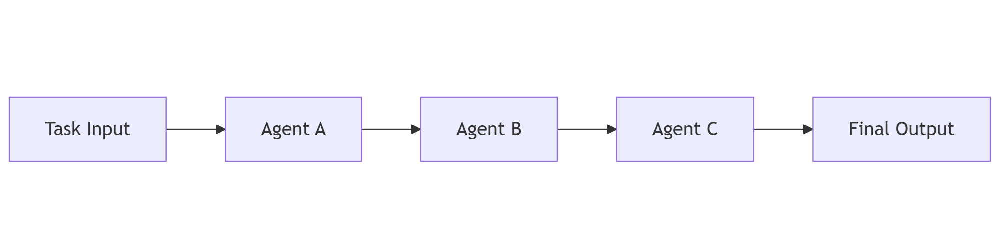
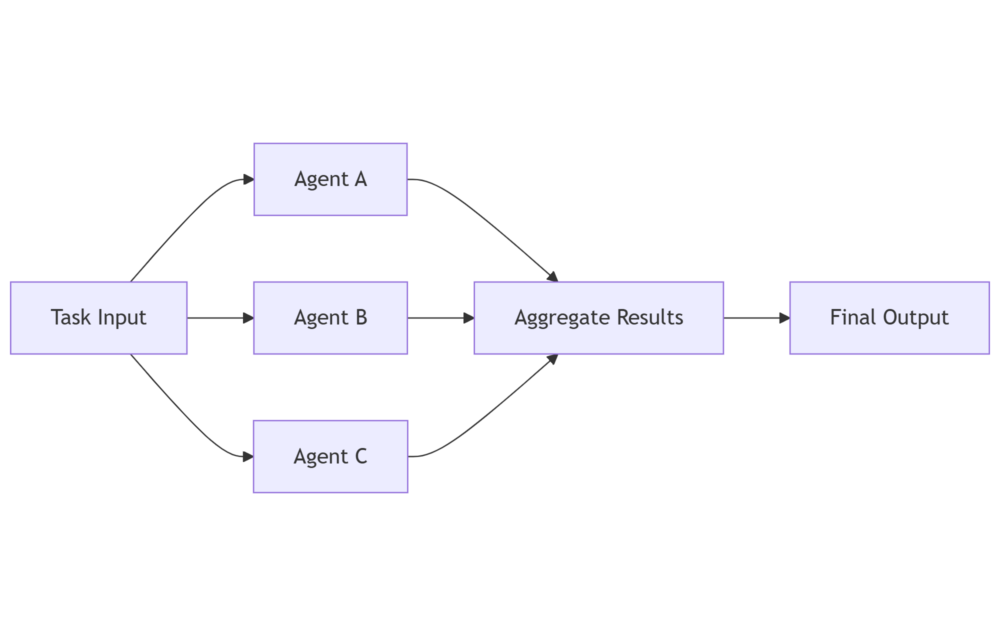
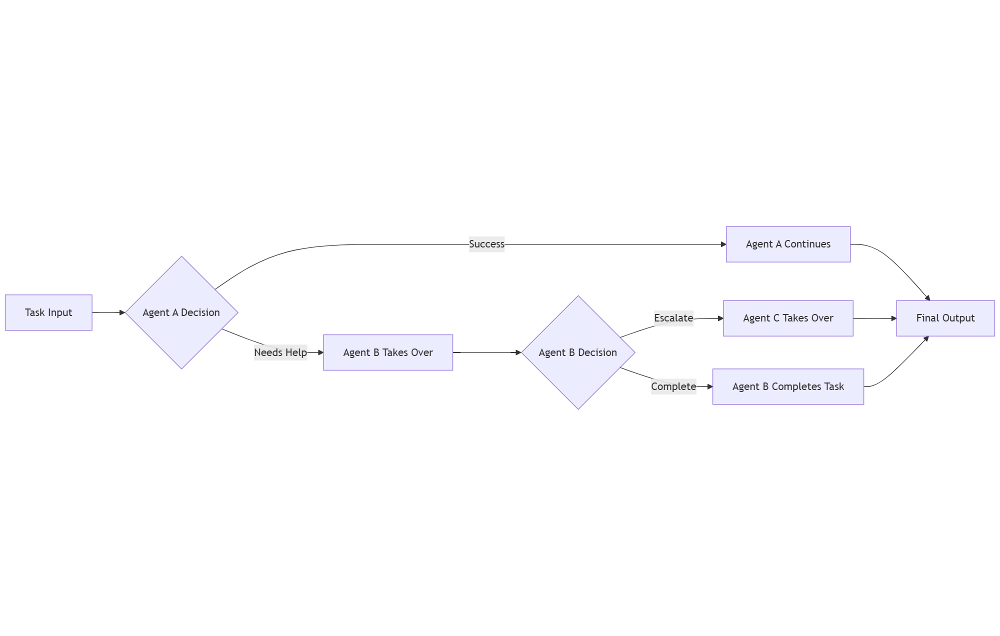
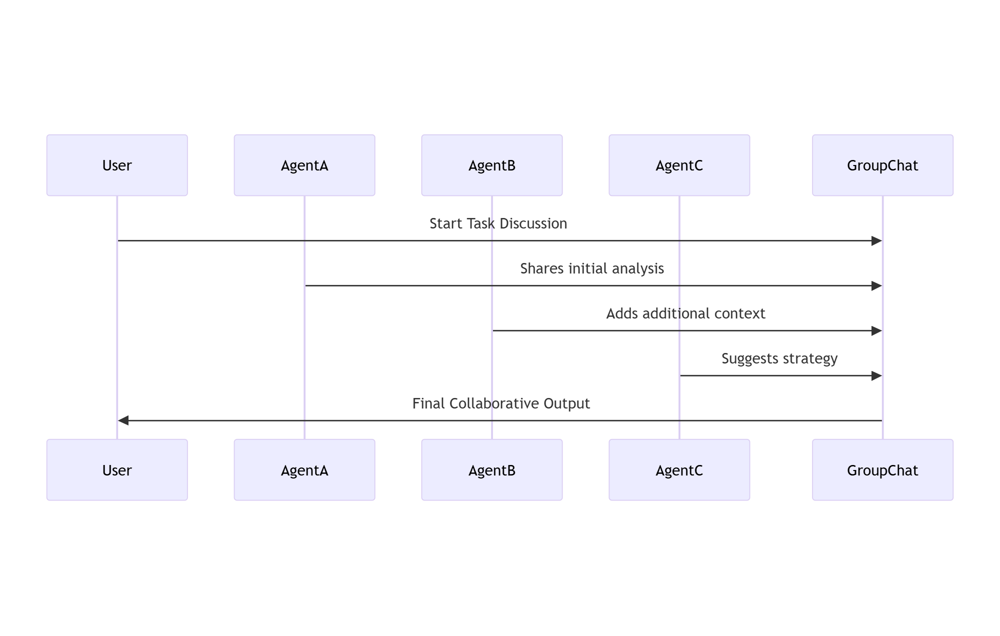

# Agents

This article introduces the core concepts behind agents, why they matter, and how they fit into workflows, setting you up to get started building agents in .NET.

## What are agents?

**Agents are systems that accomplish objectives.**

Agents become more capable when equipped with the following:

- **Reasoning and decision-making**: Powered by LLMs, search algorithms, or planning and decision-making systems.
- **Tool usage**: Access to Model Context Protocol (MCP) servers, code execution, and external APIs.
- **Context awareness**: Informed by chat history, threads, vector stores, enterprise data, or knowledge graphs.

These capabilities allow agents to operate more autonomously, adaptively, and intelligently.

## What are workflows?

As objectives grow in complexity, they need to be broken down into manageable steps. That’s where workflows come in.

**Workflows define the sequence of steps required to achieve an objective.**

Imagine you're launching a new feature on your business website. If it's a simple update, you might go from idea to production in a few hours. But for more complex initiatives, the process might include:

- Requirement gathering
- Design and architecture
- Implementation
- Testing
- Deployment

A few important observations:

- Each step may contain subtasks.
- Different specialists may own different phases.
- Progress isn’t always linear. Bugs found during testing may send you back to implementation.
- Success depends on planning, orchestration, and communication across stakeholders.

### Agents + Workflows = Agentic Workflows

Workflows don’t require agents, but agents can supercharge them.

When agents are equipped with reasoning, tools, and context, they can optimize workflows.

This is the foundation of multi-agent systems, where agents collaborate within workflows to achieve complex goals.

### Workflow orchestration

Agentic workflows can be orchestrated in a variety of ways. The following are a few of the most common.

#### Sequential

Agents process tasks one after another, passing results forward.

#### Concurrent

Agents work in parallel, each handling different aspects of the task.

#### Handoff

Responsibility shifts from one agent to another based on conditions or outcomes.

#### Group Chat

Agents collaborate in a shared conversation, exchanging insights in real-time.

## How can I get started building agents in .NET?

The building blocks in Microsoft.Extensions.AI as well as Microsoft.Extensions.VectorData provide you with the foundations for agents by providing modular components for AI models, tools, and data.

These components serve as the foundation for Microsoft Agent Framework.

See the [Microsoft Agent Framework documentation](/agent-framework/overview/agent-framework-overview) to learn more.
