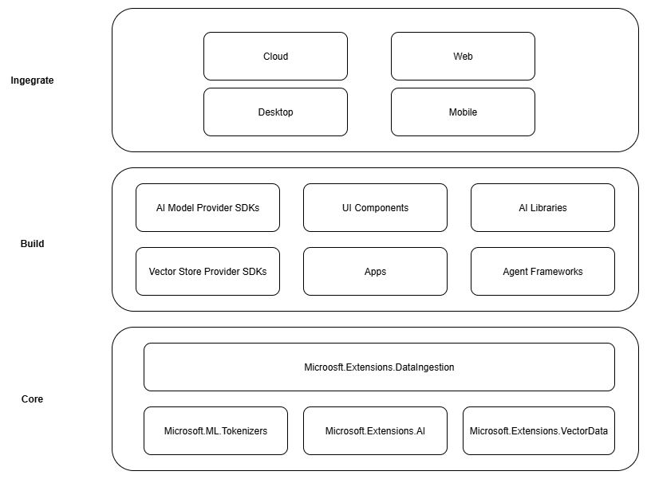

# Data ingestion

Data ingestion is the process of collecting, reading, and preparing data from different sources such as files, databases, APIs, or cloud services so it can be used in downstream applications. In practice, this process follows the Extract-Transform-Load (ETL) workflow:

- **Extract** data from its original source, whether that is a PDF, Word document, audio file, or web API.
- **Transform** the data by cleaning, chunking, enriching, or converting formats.
- **Load** the data into a destination like a database, vector store, or AI model for retrieval and analysis.

For AI and machine learning scenarios, especially Retrieval-Augmented Generation (RAG), data ingestion is not just about moving data. It is about making data usable for intelligent applications. This means representing documents in a way that preserves their structure and meaning, splitting them into manageable chunks, enriching them with metadata or embeddings, and storing them so they can be retrieved quickly and accurately.

## Why data ingestion matters for AI applications

Imagine you're building a RAG-powered chatbot to help employees find information across your company's vast collection of documents. These documents might include PDFs, Word files, PowerPoint presentations, and web pages scattered across different systems.

Your chatbot needs to understand and search through thousands of documents to provide accurate, contextual answers. But raw documents aren't suitable for AI systems. You need to transform them into a format that preserves meaning while making them searchable and retrievable.

This is where data ingestion becomes critical. You need to extract text from different file formats, break large documents into smaller chunks that fit within AI model limits, enrich the content with metadata, generate embeddings for semantic search, and store everything in a way that enables fast retrieval. Each step requires careful consideration of how to preserve the original meaning and context.

## The Microsoft.Extensions.DataIngestion library

The [📦 Microsoft.Extensions.DataIngestion package](https://www.nuget.org/packages/Microsoft.Extensions.DataIngestion) provides foundational .NET components for data ingestion. It enables developers to read, process, and prepare documents for AI and machine learning workflows, especially Retrieval-Augmented Generation (RAG) scenarios.

With these building blocks, you can create robust, flexible, and intelligent data ingestion pipelines tailored for your application needs:

- **Unified document representation:** Represent any file type (for example, PDF, Image, or Microsoft Word) in a consistent format that works well with large language models.
- **Flexible data ingestion:** Read documents from both cloud services and local sources using multiple built-in readers, making it easy to bring in data from wherever it lives.
- **Built-in AI enhancements:** Automatically enrich content with summaries, sentiment analysis, keyword extraction, and classification, preparing your data for intelligent workflows.
- **Customizable chunking strategies:** Split documents into chunks using token-based, section-based, or semantic-aware approaches, so you can optimize for your retrieval and analysis needs.
- **Production-ready storage:** Store processed chunks in popular vector databases and document stores, with support for embedding generation, making your pipelines ready for real-world scenarios.
- **End-to-end pipeline composition:** Chain together readers, processors, chunkers, and writers with the <xref:Microsoft.Extensions.DataIngestion.IngestionPipeline`1> API, reducing boilerplate and making it easy to build, customize, and extend complete workflows.
- **Performance and scalability:** Designed for scalable data processing, these components can handle large volumes of data efficiently, making them suitable for enterprise-grade applications.

All of these components are open and extensible by design. You can add custom logic and new connectors, and extend the system to support emerging AI scenarios. By standardizing how documents are represented, processed, and stored, .NET developers can build reliable, scalable, and maintainable data pipelines without "reinventing the wheel" for every project.

### Built on stable foundations



These data ingestion building blocks are built on top of proven and extensible components in the .NET ecosystem, ensuring reliability, interoperability, and seamless integration with existing AI workflows:

- **Microsoft.ML.Tokenizers:** Tokenizers provide the foundation for chunking documents based on tokens. This enables precise splitting of content, which is essential for preparing data for large language models and optimizing retrieval strategies.
- **Microsoft.Extensions.AI:** This set of libraries powers enrichment transformations using large language models. It enables features like summarization, sentiment analysis, keyword extraction, and embedding generation, making it easy to enhance your data with intelligent insights.
- **Microsoft.Extensions.VectorData:** This set of libraries offers a consistent interface for storing processed chunks in a wide variety of vector stores, including Qdrant, Azure SQL, CosmosDB, MongoDB, ElasticSearch, and many more. This ensures your data pipelines are ready for production and can scale across different storage backends.

In addition to familiar patterns and tools, these abstractions build on already extensible components. Plug-in capability and interoperability are paramount, so as the rest of the .NET AI ecosystem grows, the capabilities of the data ingestion components grow as well. This approach empowers developers to easily integrate new connectors, enrichments, and storage options, keeping their pipelines future-ready and adaptable to evolving AI scenarios.

## Data ingestion building blocks

The [Microsoft.Extensions.DataIngestion](https://www.nuget.org/packages/Microsoft.Extensions.DataIngestion) library is built around several key components that work together to create a complete data processing pipeline. This section explores each component and how they fit together.

### Documents and document readers

At the foundation of the library is the <xref:Microsoft.Extensions.DataIngestion.IngestionDocument> type, which provides a unified way to represent any file format without losing important information. `IngestionDocument` is Markdown-centric because large language models work best with Markdown formatting.

The <xref:Microsoft.Extensions.DataIngestion.IngestionDocumentReader> abstraction handles loading documents from various sources, whether local files or streams. A few readers are available:

- **[MarkItDown](https://www.nuget.org/packages/Microsoft.Extensions.DataIngestion.MarkItDown)**
- **[Markdig](https://www.nuget.org/packages/Microsoft.Extensions.DataIngestion.Markdig/)**

More readers (including **LlamaParse** and **Azure Document Intelligence**) will be added in the future.

This design means you can work with documents from different sources using the same consistent API, making your code more maintainable and flexible.

### Document processing

Document processors apply transformations at the document level to enhance and prepare content. The library provides the <xref:Microsoft.Extensions.DataIngestion.ImageAlternativeTextEnricher> class as a built-in processor that uses large language models to generate descriptive alternative text for images within documents.

### Chunks and Chunking Strategies

Once you have a document loaded, you typically need to break it down into smaller pieces called chunks. Chunks represent subsections of a document that can be efficiently processed, stored, and retrieved by AI systems. This chunking process is essential for retrieval-augmented generation scenarios where you need to find the most relevant pieces of information quickly.

The library provides several chunking strategies to fit different use cases:

- **Header-based chunking** to split on headers.
- **Section-based chunking** to split on sections (example: pages).
- **Semantic-aware chunking** to preserve complete thoughts.

These chunking strategies build on the Microsoft.ML.Tokenizers library to intelligently split text into appropriately sized pieces that work well with large language models. The right chunking strategy depends on your document types and how you plan to retrieve information.

```csharp
Tokenizer tokenizer = TiktokenTokenizer.CreateForModel("gpt-4");
IngestionChunkerOptions options = new(tokenizer)
{
    MaxTokensPerChunk = 2000,
    OverlapTokens = 0
};
IngestionChunker<string> chunker = new HeaderChunker(options);
```

### Chunk Processing and Enrichment

After documents are split into chunks, you can apply processors to enhance and enrich the content. Chunk processors work on individual pieces and can perform:

- **Content enrichment** including automatic summaries (`SummaryEnricher`), sentiment analysis (`SentimentEnricher`), and keyword extraction (`KeywordEnricher`).
- **Classification** for automated content categorization based on predefined categories (`ClassificationEnricher`).

These processors use [Microsoft.Extensions.AI.Abstractions](https://www.nuget.org/packages/Microsoft.Extensions.AI.Abstractions) to leverage large language models for intelligent content transformation, making your chunks more useful for downstream AI applications.

### Document Writer and Storage

The `IngestionChunkWriter<T>` stores processed chunks into a data store for later retrieval. Using Microsoft.Extensions.AI and [Microsoft.Extensions.VectorData.Abstractions](https://www.nuget.org/packages/Microsoft.Extensions.VectorData.Abstractions), the library provides the `VectorStoreWriter<T>` class that supports storing chunks in any vector store supported by Microsoft.Extensions.VectorData.

This includes popular options like [Qdrant](https://www.nuget.org/packages/Microsoft.SemanticKernel.Connectors.Qdrant), [SQL Server](https://www.nuget.org/packages/Microsoft.SemanticKernel.Connectors.SqlServer), [CosmosDB](https://www.nuget.org/packages/Microsoft.SemanticKernel.Connectors.CosmosNoSQL), [MongoDB](https://www.nuget.org/packages/Microsoft.SemanticKernel.Connectors.MongoDB), [ElasticSearch](https://www.nuget.org/packages/Elastic.SemanticKernel.Connectors.Elasticsearch), and many more. The writer can also automatically generate embeddings for your chunks using Microsoft.Extensions.AI, making them ready for semantic search and retrieval scenarios.

```csharp
OpenAIClient openAIClient = new(
    new ApiKeyCredential(Environment.GetEnvironmentVariable("GITHUB_TOKEN")!),
    new OpenAIClientOptions { Endpoint = new Uri("https://models.github.ai/inference") });

IEmbeddingGenerator<string, Embedding<float>> embeddingGenerator =
    openAIClient.GetEmbeddingClient("text-embedding-3-small").AsIEmbeddingGenerator();

using SqliteVectorStore vectorStore = new(
    "Data Source=vectors.db;Pooling=false",
    new()
    {
        EmbeddingGenerator = embeddingGenerator
    });

// The writer requires the embedding dimension count to be specified.
// For OpenAI's `text-embedding-3-small`, the dimension count is 1536.
using VectorStoreWriter<string> writer = new(vectorStore, dimensionCount: 1536);
```

### Document Processing Pipeline

The `IngestionPipeline<T>` API allows you to chain together the various data ingestion components into a complete workflow. You can combine:

- **Readers** to load documents from various sources.
- **Processors** to transform and enrich document content.
- **Chunkers** to break documents into manageable pieces.
- **Writers** to store the final results in your chosen data store.

This pipeline approach reduces boilerplate code and makes it easy to build, test, and maintain complex data ingestion workflows.

```csharp
using IngestionPipeline<string> pipeline = new(reader, chunker, writer, loggerFactory: loggerFactory)
{
    DocumentProcessors = { imageAlternativeTextEnricher },
    ChunkProcessors = { summaryEnricher }
};

await foreach (var result in pipeline.ProcessAsync(new DirectoryInfo("."), searchPattern: "*.md"))
{
    Console.WriteLine($"Completed processing '{result.DocumentId}'. Succeeded: '{result.Succeeded}'.");
}
```

A single document ingestion failure should not fail the whole pipeline, that is why the `IngestionPipeline.ProcessAsync` implements partial success by returning `IAsyncEnumerable<IngestionResult>`. The caller is responsible for handling any failures (for example, by re-trying failed documents or stopping on first error).
