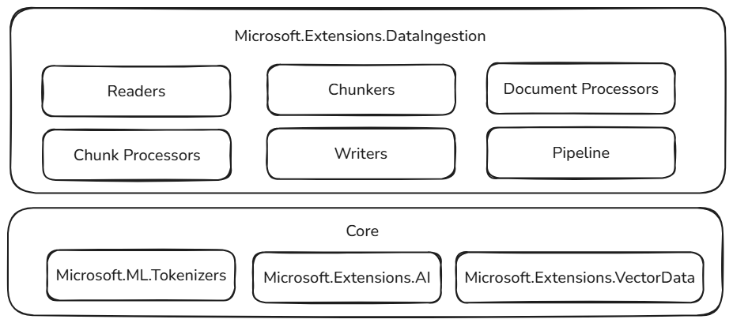

# The Microsoft.Extensions.DataIngestion library

The [📦 Microsoft.Extensions.DataIngestion package](https://www.nuget.org/packages/Microsoft.Extensions.DataIngestion) provides foundational .NET building blocks for data ingestion. It enables developers to read, process, and prepare documents for AI and machine learning workflows, especially Retrieval-Augmented Generation (RAG) scenarios.

With these building blocks, you can create robust, flexible, and intelligent data ingestion pipelines tailored for your application needs:

- **Unified document representation:** Represent any file type (for example, PDF, Image, or Microsoft Word) in a consistent format that works well with large language models.
- **Flexible data ingestion:** Read documents from both cloud services and local sources using multiple built-in readers, making it easy to bring in data from wherever it lives.
- **Built-in AI enhancements:** Automatically enrich content with summaries, sentiment analysis, keyword extraction, and classification, preparing your data for intelligent workflows.
- **Customizable chunking strategies:** Split documents into chunks using token-based, section-based, or semantic-aware approaches, so you can optimize for your retrieval and analysis needs.
- **Production-ready storage:** Store processed chunks in popular vector databases and document stores, with support for embedding generation, making your pipelines ready for real-world scenarios.
- **End-to-end pipeline composition:** Chain together readers, processors, chunkers, and writers with the <xref:Microsoft.Extensions.DataIngestion.IngestionPipeline`1> API, reducing boilerplate and making it easy to build, customize, and extend complete workflows.
- **Performance and scalability:** Designed for scalable data processing, these components can handle large volumes of data efficiently, making them suitable for enterprise-grade applications.

All of these components are open and extensible by design. You can add custom logic and new connectors, and extend the system to support emerging AI scenarios. By standardizing how documents are represented, processed, and stored, .NET developers can build reliable, scalable, and maintainable data pipelines without "reinventing the wheel" for every project.

## Built on stable foundations

These data ingestion building blocks are built on top of proven and extensible components in the .NET ecosystem, ensuring reliability, interoperability, and seamless integration with existing AI workflows:

- **Microsoft.ML.Tokenizers:** Tokenizers provide the foundation for chunking documents based on tokens. This enables precise splitting of content, which is essential for preparing data for large language models and optimizing retrieval strategies.
- **Microsoft.Extensions.AI:** This set of libraries powers enrichment transformations using large language models. It enables features like summarization, sentiment analysis, keyword extraction, and embedding generation, making it easy to enhance your data with intelligent insights.
- **Microsoft.Extensions.VectorData:** This set of libraries offers a consistent interface for storing processed chunks in a wide variety of vector stores, including Qdrant, Azure SQL, CosmosDB, MongoDB, ElasticSearch, and many more. This ensures your data pipelines are ready for production and can scale across different storage backends.

In addition to familiar patterns and tools, these abstractions build on already extensible components. Plug-in capability and interoperability are paramount, so as the rest of the .NET AI ecosystem grows, the capabilities of the data ingestion components grow as well. This approach empowers developers to easily integrate new providers, enrichments, and storage options, keeping their pipelines future-ready and adaptable to evolving AI scenarios.

## See also

- [Data ingestion](data-ingestion.md)
