# Create a minimal MCP server using C# and publish to NuGet

In this quickstart, you create a minimal Model Context Protocol (MCP) server using the [C# SDK for MCP](https://github.com/modelcontextprotocol/csharp-sdk), connect to it using GitHub Copilot, and publish it to NuGet (stdio transport only). MCP servers are services that expose capabilities to clients through the Model Context Protocol (MCP).

> [!NOTE]
> The `Microsoft.McpServer.ProjectTemplates` template package is currently in preview.

## Prerequisites

::: zone pivot="visualstudio"

- [.NET 10.0 SDK](https://dotnet.microsoft.com/download/dotnet)
- [GitHub Copilot](https://github.com/features/copilot)
- [NuGet.org account](https://www.nuget.org/users/account/LogOn)

::: zone-end

::: zone pivot="vscode"

- [.NET 10.0 SDK](https://dotnet.microsoft.com/download/dotnet)
- [Visual Studio Code](https://code.visualstudio.com/) (optional)
- [C# Dev Kit extension](https://marketplace.visualstudio.com/items?itemName=ms-dotnettools.csdevkit)
- [GitHub Copilot extension](https://marketplace.visualstudio.com/items?itemName=GitHub.copilot) for Visual Studio Code
- [NuGet.org account](https://www.nuget.org/users/account/LogOn)

::: zone-end

::: zone pivot="cli"

- [.NET 10.0 SDK](https://dotnet.microsoft.com/download/dotnet)
- [Visual Studio Code](https://code.visualstudio.com/) (optional)
- [Visual Studio](https://visualstudio.microsoft.com/) (optional)
- [GitHub Copilot](https://github.com/features/copilot) / [GitHub Copilot extension](https://marketplace.visualstudio.com/items?itemName=GitHub.copilot) for Visual Studio Code
- [NuGet.org account](https://www.nuget.org/users/account/LogOn)

::: zone-end

## Create the project

::: zone pivot="visualstudio"

1. In a terminal window, install the MCP Server template:

   ```dotnetcli
   dotnet new install Microsoft.McpServer.ProjectTemplates
   ```

    > [!NOTE]
    > .NET 10.0 SDK or a later version is required to install `Microsoft.McpServer.ProjectTemplates`.

1. Open Visual Studio, and select **Create a new project** in the start window (or select **File** > **New** > **Project/Solution** from inside Visual Studio).

    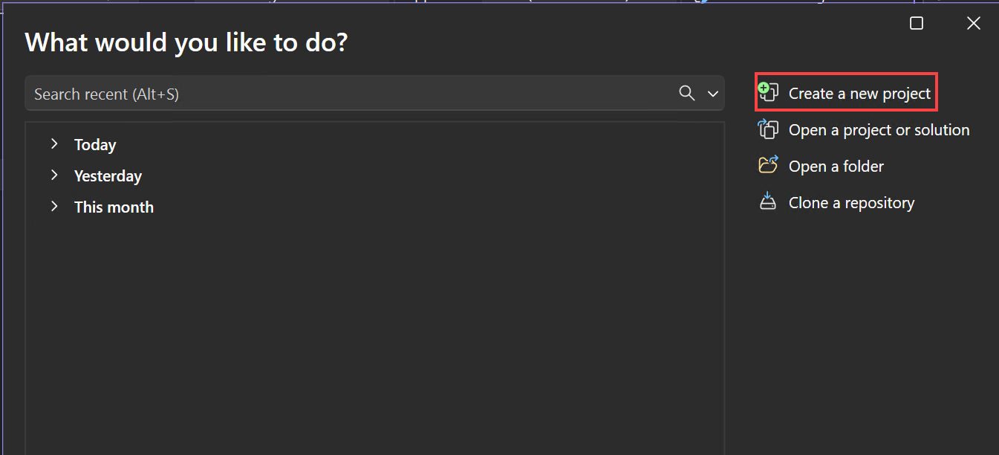

1. In the **Create a new project** window, select **C#** from the Language list and **AI** from the **All project types** list.  After you apply the language and project type filters, select the **MCP Server App** template, and then select **Next**.

    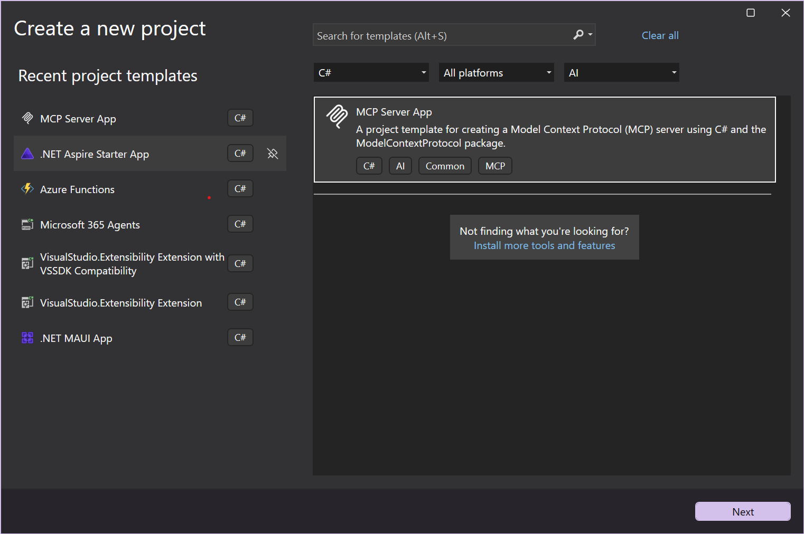

1. In the **Configure your new project** window, enter **MyMcpServer** in the **Project name** field.  Then, select **Next**.

    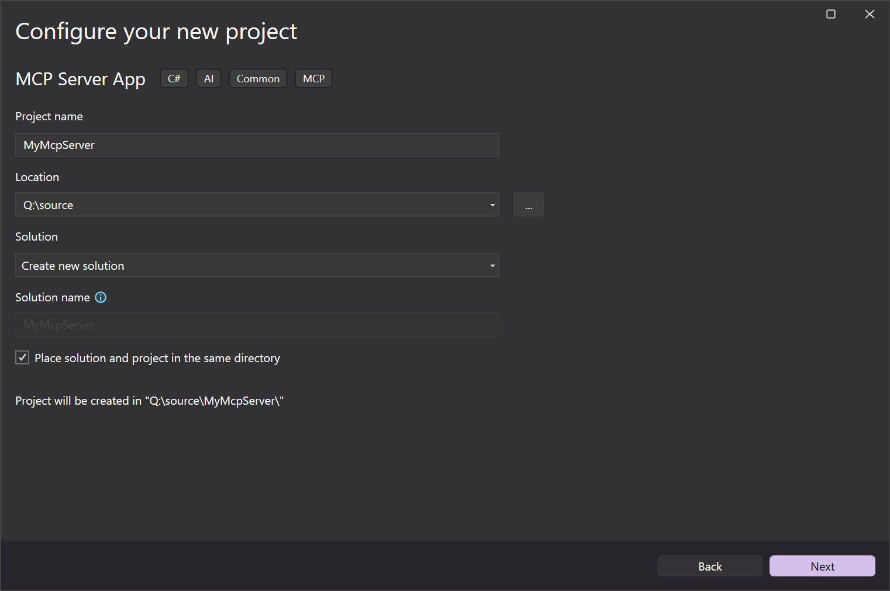

1. In the **Additional information** window, you can configure the following options:

    - **Framework**: Select the target .NET framework.
    - **MCP Server Transport Type**: Choose between creating a **local** (stdio) or a **remote** (http) MCP server.
    - **Enable native AOT (Ahead-Of-Time) publish**: Enable your MCP server to be self-contained and compiled to native code. For more information, see the [Native AOT deployment guide](../../core/deploying/native-aot/index.md).
    - **Enable self-contained publish**: Enable your MCP server to be published as a self-contained executable. For more information, see the [Self-contained deployment section of the .NET application publishing guide](../../core/deploying/index.md#self-contained-deployment).

    Choose your preferred options or keep the default ones, and then select **Create**.

    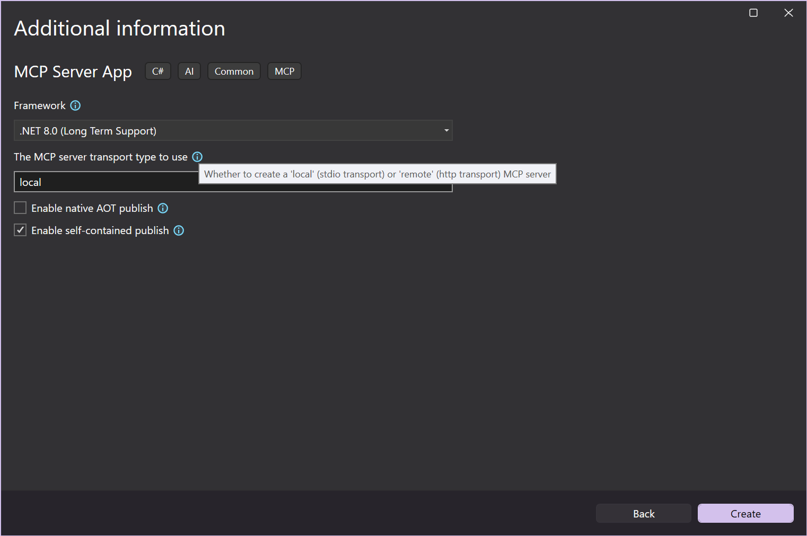

    Visual Studio opens your new project.

1. Update the `<PackageId>` in the `.csproj` file to be unique on NuGet.org, for example `<NuGet.org username>.SampleMcpServer`.

::: zone-end

::: zone pivot="vscode"

1. In a terminal window, install the MCP Server template:

   ```bash
   dotnet new install Microsoft.McpServer.ProjectTemplates
   ```

    > [!NOTE]
    > .NET 10.0 SDK or later is required to install `Microsoft.McpServer.ProjectTemplates`.

1. Open Visual Studio Code.

1. Go to the **Explorer** view and select **Create .NET Project**.  Alternatively, you can bring up the Command Palette using <kbd<Ctrl+Shift+P</kbd> (<kbd<Command+Shift+P</kbd> on MacOS) and then type ".NET" to find and select the **.NET: New Project** command.

    This action will bring up a dropdown list of .NET projects.

    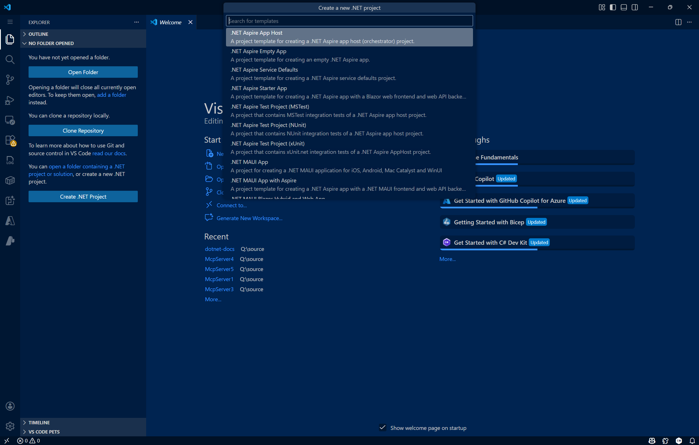

1. After selecting the command, use the Search bar in the Command Palette or scroll down to locate the **MCP Server App** template.

    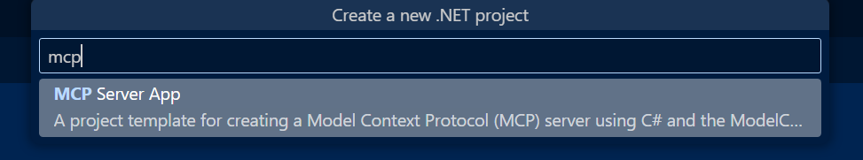

1. Select the location where you would like the new project to be created.

1. Give your new project a name, **MyMCPServer**. Press **Enter**.
    

1. Select your solution file format (`.sln` or `.slnx`).

1. Select **Template Options**.  Here, you can configure the following options:

    - **Framework**: Select the target .NET framework.
    - **MCP Server Transport Type**: Choose between creating a **local** (stdio) or a **remote** (http) MCP server.
    - **Enable native AOT (Ahead-Of-Time) publish**: Enable your MCP server to be self-contained and compiled to native code. For more information, see the [Native AOT deployment guide](../../core/deploying/native-aot/index.md).
    - **Enable self-contained publish**: Enable your MCP server to be published as a self-contained executable. For more information, see the [Self-contained deployment section of the .NET application publishing guide](../../core/deploying/index.md#self-contained-deployment).

    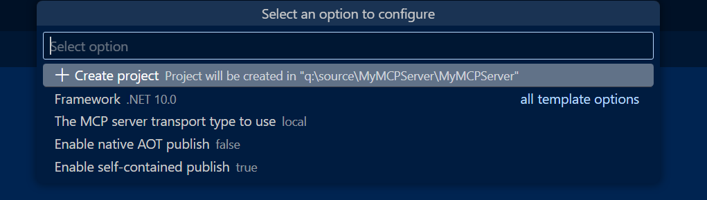

    Choose your preferred options or keep the default ones, and then select **Create Project**.

    VS Code opens your new project.

1. Update the `<PackageId>` in the `.csproj` file to be unique on NuGet.org, for example `<NuGet.org username>.SampleMcpServer`.

::: zone-end

::: zone pivot="cli"

1. Create a new MCP server app with the `dotnet new mcpserver` command:

   ```bash
   dotnet new mcpserver -n SampleMcpServer
   ```

   By default, this command creates a self-contained tool package targeting all of the most common platforms that .NET is supported on. To see more options, use `dotnet new mcpserver --help`.

   Using the `dotnet new mcpserver --help` command gives you several template options you can add when creating a new MCP server:

    - **Framework**: Select the target .NET framework.
    - **MCP Server Transport Type**: Choose between creating a **local** (stdio) or a **remote** (http) MCP server.
    - **Enable native AOT (Ahead-Of-Time) publish**: Enable your MCP server to be self-contained and compiled to native code. For more information, see the [Native AOT deployment guide](../../core/deploying/native-aot/index.md).
    - **Enable self-contained publish**: Enable your MCP server to be published as a self-contained executable. For more information, see the [Self-contained deployment section of the .NET application publishing guide](../../core/deploying/index.md#self-contained-deployment).

    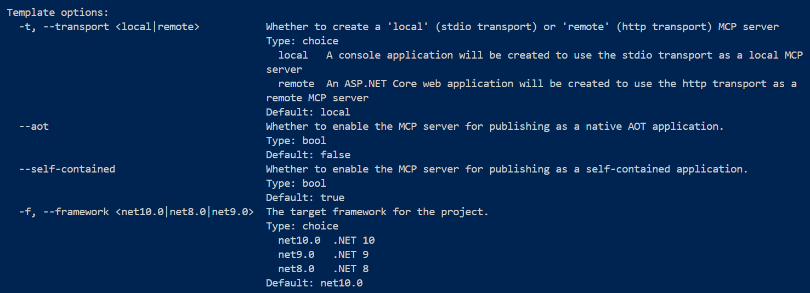

1. Navigate to the `SampleMcpServer` directory:

   ```bash
   cd SampleMcpServer
   ```

1. Build the project:

   ```bash
   dotnet build
   ```

1. Update the `<PackageId>` in the `.csproj` file to be unique on NuGet.org, for example `<NuGet.org username>.SampleMcpServer`.

::: zone-end

## Tour the MCP Server Project

Creating your MCP server project via the template gives you the following major files:

* `Program.cs`: A file defining the application as an MCP server and registering MCP services such as transport type and MCP tools.  
  * Choosing the (default) **stdio** transport option in when creating the project, this file will be configured to define the MCP Server as a local one (i.e. `.withStdioServerTransport()`).
  * Choosing the **http** transport option will configure this file to include remote transport-specific definitions (i.e. `.withHttpServerTransport()`, `MapMcp()`).
* `RandomNumberTools.cs`: A class defining an example MCP server tool that returns a random number between user-specified min/max values.
* **[HTTP Transport Only]** `[MCPServerName].http`: A file defining the default host address for an HTTP MCP server and JSON-RPC communication.

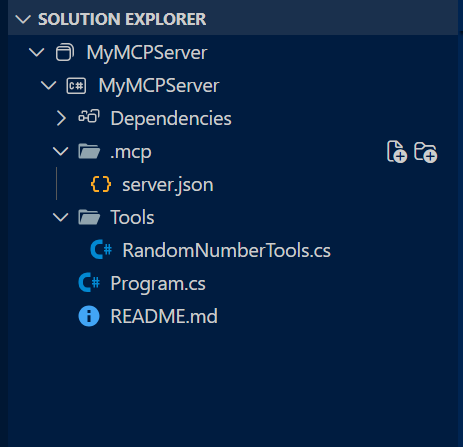

::: zone pivot="cli,vscode"

* `server.json`: A file defining how and where your MCP server is published.

:::zone-end

## Configure the MCP server

::: zone pivot="visualstudio"

Configure GitHub Copilot for Visual Studio to use your custom MCP server.

1. In Visual Studio, select the GitHub Copilot icon in the top right corner and select **Open Chat Window**.

1. In the GitHub Copilot Chat window, click the **Select Tools** wrench icon followed by the plus icon in the top right corner.

    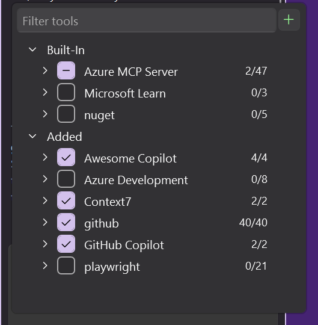

1. In the **Add Custom MCP Server** dialog window, enter the following info:

    * **Destination**: Choose the scope of where your MCP server is configured:
        * **Solution** - The MCP server is available only across the active solution.
        * **Global** - The MCP server is available across all solutions.
    * **Server ID**: The unique name / identifier for your MCP server.
    * **Type**: The transport type of your MCP server (stdio or HTTP).
    * **Command (Stdio transport only)**: The command to run your stdio MCP server (that is, `dotnet run --project [relative path to .csproj file]`)
    * **URL (HTTP transport only)**: The address of your HTTP MCP server
    * **Environment Variables (optional)**

    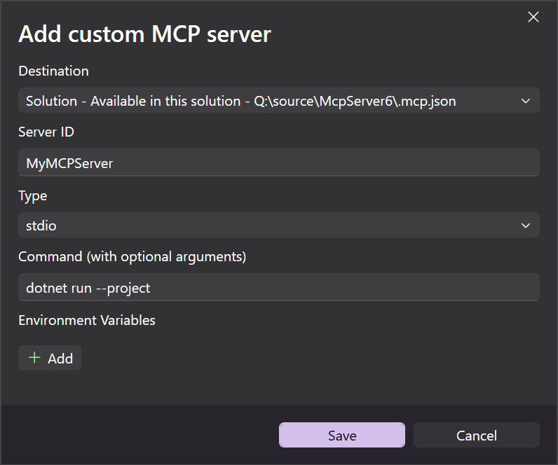

1. Select **Save**.  An `mcp.json` file will be added to the specified destination.

**Stdio Transport `mcp.json`**

Add the  relative path to your `.csproj` file under the "args" field.

   ```json
   {
     "inputs": [],
     "servers": {
       "MyMcpServer": {
         "type": "stdio",
         "command": "dotnet",
         "args": [
           "run",
           "--project",
           "<relative-path-to-project-file>"
         ]
       }
     }
   }
   ```

**HTTP Transport `mcp.json`**

   ```json
   {
    "inputs": [],
     "servers": {
       "MyMCPServer": {
         "url": "http://localhost:6278",
         "type": "http",
         "headers": {}
       }
     }
   }
   ```

::: zone-end

::: zone pivot="vscode,cli"

Configure GitHub Copilot for Visual Studio Code to use your custom MCP server, either via the VS Code Command Palette or manually.

### Command Palette configuration

1. Open the Command Palette using <kbd>CTRL+SHIFT+P</kbd> (<kbd>Command+Shift+P</kbd> on macOS). Search "mcp" to locate the `MCP: Add Server` command.

1. Select the type of MCP server to add (typically the transport type you selected at project creation).

    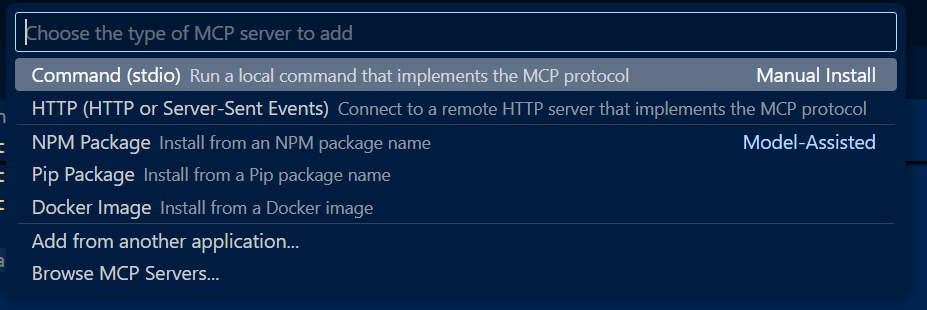

1. If adding a **stdio** MCP server, enter a command and optional arguments.  For this example, use `dotnet run --project`.

    If adding an **HTTP** MCP server, enter the localhost or web address.

1. Enter a unique server ID (example: "MyMCPServer").

1. Select a configuration target:

    * **Global**: Make the MCP server available across all workspaces.  The generated `mcp.json` file will appear under your global user configuration.

    * **Workspace**: Make the MCP server available only from within the current workspace.  The generated `mcp.json` file will appear under the `.vscode` folder within your workspace.

    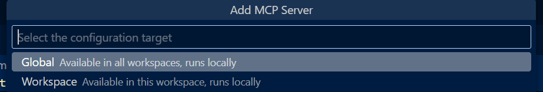

1. After you complete the previous steps, an `.mcp.json` file will be created in the location specified by the configuration target.

**Stdio Transport `mcp.json`**

Add the relative path to your `.csproj` file under the "args" field.

   ```json
   {
     "servers": {
       "MyMcpServer": {
         "type": "stdio",
         "command": "dotnet",
         "args": [
           "run",
           "--project",
           "<relative-path-to-project-file>"
         ]
       }
     }
   }
   ```

**HTTP Transport `mcp.json`**

   ```json
   {
     "servers": {
       "MyMCPServer": {
         "url": "http://localhost:6278",
         "type": "http"
       }
     },
     "inputs": []
   }
   ```

### Manual configuration

1. Create a `.vscode` folder at the root of your project.
1. Add an `mcp.json` file in the `.vscode` folder with the following content:

   ```json
   {
     "servers": {
       "SampleMcpServer": {
         "type": "stdio",
         "command": "dotnet",
         "args": [
           "run",
           "--project",
           "<relative-path-to-project-file>"
         ]
       }
     }
   }
   ```

    > [!NOTE]
    > VS Code executes MCP servers from the workspace root. The `<relative-path-to-project-file>` placeholder should point to your .NET project file. For example, the value for this **SampleMcpServer** app would be `SampleMcpServer.csproj`.

1. Save the file.

::: zone-end

## Test the MCP server

The MCP server template includes a tool called `get_random_number` you can use for testing and as a starting point for development.

1. Open GitHub Copilot in Visual Studio or VS Code and switch to **Agent** mode.

1. Select the **Select tools** icon to verify your **SampleMcpServer** is available with the sample tool listed.

    :::image type="content" source="../media/mcp/available-tools-nuget.png" alt-text="A screenshot showing the available MCP tools.":::

1. Enter a prompt to run the **get_random_number** tool:

    ```console
    Give me a random number between 1 and 100.
    ```

1. GitHub Copilot requests permission to run the **get_random_number** tool for your prompt. Select **Continue** or use the arrow to select a more specific behavior:

    - **Current session** always runs the operation in the current GitHub Copilot Agent Mode session.
    - **Current solution (VS) / workspace (VS Code)** always runs the command for the current Visual Studio solution or VS Code workspace.
    - **Always allow** sets the operation to always run for any GitHub Copilot Agent Mode session.

1. Verify that the server responds with a random number:

    ```output
    Your random number is 42.
    ```

## Add inputs and configuration options

In this example, you enhance the MCP server to use a configuration value set in an environment variable. This could be configuration needed for the functioning of your MCP server, such as an API key, an endpoint to connect to, or a local directory path.

1. Add another tool method after the `GetRandomNumber` method in `Tools/RandomNumberTools.cs`. Update the tool code to use an environment variable.

   :::code language="csharp" source="snippets/mcp-server/Tools/RandomNumberTools.cs" range="19-36":::

1. Update the `.vscode/mcp.json` to set the `WEATHER_CHOICES` environment variable for testing.

   ```json
   {
      "servers": {
        "SampleMcpServer": {
          "type": "stdio",
          "command": "dotnet",
          "args": [
            "run",
            "--project",
            "<relative-path-to-project-file>"
          ],
          "env": {
             "WEATHER_CHOICES": "sunny,humid,freezing"
          }
        }
      }
    }
    ```

1. Try another prompt with Copilot in VS Code, such as:

    ```console
    What is the weather in Redmond, Washington?
    ```

    VS Code should return a random weather description.

1. Update the `.mcp/server.json` to declare your environment variable input. The `server.json` file schema is defined by the [MCP Registry project](https://github.com/modelcontextprotocol/registry/blob/main/docs/reference/server-json/generic-server-json.md) and is used by NuGet.org to generate VS Code MCP configuration.

   - Use the `environmentVariables` property to declare environment variables used by your app that will be set by the client using the MCP server (for example, VS Code).

   - Use the `packageArguments` property to define CLI arguments that will be passed to your app. For more examples, see the [MCP Registry project](https://github.com/modelcontextprotocol/registry/blob/main/docs/reference/server-json/generic-server-json.md#examples).

   :::code language="json" source="snippets/mcp-server/.mcp/server.json":::

   The only information used by NuGet.org in the `server.json` is the first `packages` array item with the `registryType` value matching `nuget`. The other top-level properties aside from the `packages` property are currently unused and are intended for the upcoming central MCP Registry. You can leave the placeholder values until the MCP Registry is live and ready to accept MCP server entries.

You can [test your MCP server again](#test-the-mcp-server) before moving forward.

## Pack and publish to NuGet

1. Pack the project:

    ```bash
    dotnet pack -c Release
    ```

    This command produces one tool package and several platform-specific packages based on the `<RuntimeIdentifiers>` list in `SampleMcpServer.csproj`.

1. Publish the packages to NuGet:

    ```bash
    dotnet nuget push bin/Release/*.nupkg --api-key <your-api-key> --source https://api.nuget.org/v3/index.json
    ```

    Be sure to publish all `.nupkg` files to ensure every supported platform can run the MCP server.

    If you want to test the publishing flow before publishing to NuGet.org, you can register an account on the NuGet Gallery integration environment: [https://int.nugettest.org](https://int.nugettest.org). The `push` command would be modified to:

    ```bash
    dotnet nuget push bin/Release/*.nupkg --api-key <your-api-key> --source https://apiint.nugettest.org/v3/index.json
    ```

For more information, see [Publish a package](/nuget/nuget-org/publish-a-package).

## Discover MCP servers on NuGet.org

1. Search for your MCP server package on [NuGet.org](https://www.nuget.org/packages?packagetype=mcpserver) (or [int.nugettest.org](https://int.nugettest.org/packages?packagetype=mcpserver) if you published to the integration environment) and select it from the list.

   :::image type="content" source="../media/mcp/nuget-mcp-search.png" alt-text="A screenshot showing a search for MCP servers on NuGet.org.":::

1. View the package details and copy the JSON from the "MCP Server" tab.

   :::image type="content" source="../media/mcp/nuget-mcp-display.png" alt-text="A screenshot showing a specific MCP server displayed on NuGet.org.":::

1. In your `mcp.json` file in the `.vscode` folder, add the copied JSON, which looks like this:

   ```json
   {
     "inputs": [
       {
         "type": "promptString",
         "id": "weather_choices",
         "description": "Comma separated list of weather descriptions to randomly select.",
         "password": false
       }
     ],
     "servers": {
       "Contoso.SampleMcpServer": {
         "type": "stdio",
         "command": "dnx",
         "args": ["Contoso.SampleMcpServer@0.0.1-beta", "--yes"],
         "env": {
           "WEATHER_CHOICES": "${input:weather_choices}"
         }
       }
     }
   }
   ```

   If you published to the NuGet Gallery integration environment, you need to add `"--add-source", "https://apiint.nugettest.org/v3/index.json"` at the end of the `"args"` array.

1. Save the file.

1. In GitHub Copilot, select the **Select tools** icon to verify your **SampleMcpServer** is available with the tools listed.

1. Enter a prompt to run the new **get_city_weather** tool:

    ```console
    What is the weather in Redmond?
    ```

1. If you added inputs to your MCP server (for example, `WEATHER_CHOICES`), you will be prompted to provide values.

1. Verify that the server responds with the random weather:

    ```output
    The weather in Redmond is balmy.
    ```

## Common issues

### The command "dnx" needed to run SampleMcpServer was not found

If VS Code shows this error when starting the MCP server, you need to install a compatible version of the .NET SDK.

:::image type="content" source="../media/mcp/missing-dnx.png" alt-text="A screenshot showing the missing dnx command in VS Code.":::

The `dnx` command is shipped as part of the .NET SDK, starting with version 10. [Install the .NET 10 SDK](https://dotnet.microsoft.com/download/dotnet) to resolve this issue.

### GitHub Copilot doesn't use your tool (an answer is provided without invoking your tool)

Generally speaking, an AI agent like GitHub Copilot is informed that it has some tools available by the client application, such as VS Code. Some tools, such as the sample random number tool, might not be leveraged by the AI agent because it has similar functionality built in.

If your tool is not being used, check the following:

1. Verify that your tool appears in the list of tools that VS Code has enabled. See the screenshot in [Test the MCP server](#test-the-mcp-server) for how to check this.
1. Explicitly reference the name of the tool in your prompt. In VS Code, you can reference your tool by name. For example, `Using #get_random_weather, what is the weather in Redmond?`.
1. Verify your MCP server is able to start. You can check this by clicking the "Start" button visible above your MCP server configuration in the VS Code user or workspace settings.

:::image type="content" source="../media/mcp/started-mcp-server.png" alt-text="A screenshot showing an MCP server in VS Code configuration that is started.":::

## Related content

- [Get started with .NET AI and the Model Context Protocol](../get-started-mcp.md)
- [Model Context Protocol .NET samples](https://github.com/microsoft/mcp-dotnet-samples)
- [Build a minimal MCP client](build-mcp-client.md)
- [Publish a package](/nuget/nuget-org/publish-a-package)
- [Find and evaluate NuGet packages for your project](/nuget/consume-packages/finding-and-choosing-packages)
- [What's new in .NET 10](../../core/whats-new/dotnet-10/overview.md)
