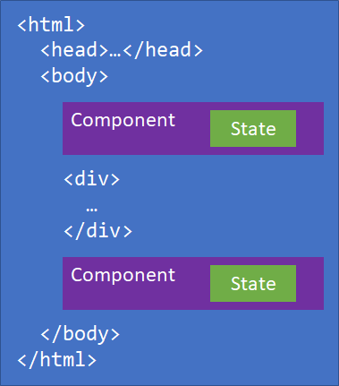
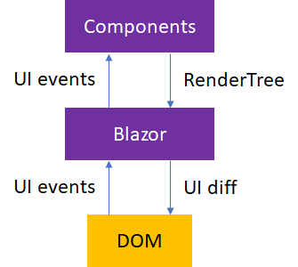

# Architecture comparison of ASP.NET Web Forms and Blazor

While ASP.NET Web Forms and Blazor have many similar concepts, there are differences in how they work. This chapter examines the inner workings and architectures of ASP.NET Web Forms and Blazor.

## ASP.NET Web Forms

The ASP.NET Web Forms framework is based on a page-centric architecture. Each HTTP request for a location in the app is a separate page with which ASP.NET responds. As pages are requested, the contents of the browser are replaced with the results of the page requested.

Pages consist of the following components:

- HTML markup
- C# or Visual Basic code
- A code-behind class containing logic and event-handling capabilities
- Controls

Controls are reusable units of web UI that can be programmatically placed and interacted with on a page. Pages are composed of files that end with *.aspx* containing markup, controls, and some code. The code-behind classes are in files with the same base name and an *.aspx.cs* or *.aspx.vb* extension, depending on the programming language used. Interestingly, the web server interprets contents of the *.aspx* files and compiles them whenever they change. This recompilation occurs even if the web server is already running.

Controls can be built with markup and delivered as user controls. A user control derives from the `UserControl` class and has a similar structure to the Page. Markup for user controls is stored in an *.ascx* file. An accompanying code-behind class resides in an *.ascx.cs* or *.ascx.vb* file. Controls can also be built completely with code, by inheriting from either the `WebControl` or `CompositeControl` base class.

Pages also have an extensive event lifecycle. Each page raises events for the initialization, load, prerender, and unload events that occur as the ASP.NET runtime executes the page's code for each request.

Controls on a Page typically post-back to the same page that presented the control, and carry along with them a payload from a hidden form field called `ViewState`. The `ViewState` field contains information about the state of the controls at the time they were rendered and presented on the page, allowing the ASP.NET runtime to compare and identify changes in the content submitted to the server.

## Blazor

Blazor is a client-side web UI framework similar in nature to JavaScript front-end frameworks like Angular or React. Blazor handles user interactions and renders the necessary UI updates. Blazor *isn't* based on a request-reply model. User interactions are handled as events that aren't in the context of any particular HTTP request.

Blazor apps consist of one or more root components that are rendered on an HTML page.

How the user specifies where components should render and how the components are then wired up for user interactions is [hosting model](hosting-models.md) specific.

Blazor [components](components.md) are .NET classes that represent a reusable piece of UI. Each component maintains its own state and specifies its own rendering logic, which can include rendering other components. Components specify event handlers for specific user interactions to update the component's state.

After a component handles an event, Blazor renders the component and keeps track of what changed in the rendered output. Components don't render directly to the Document Object Model (DOM). They instead render to an in-memory representation of the DOM called a `RenderTree` so that Blazor can track the changes. Blazor compares the newly rendered output with the previous output to calculate a UI diff that it then applies efficiently to the DOM.

Components can also manually indicate that they should be rendered if their state changes outside of a normal UI event. Blazor uses a `SynchronizationContext` to enforce a single logical thread of execution. A component's lifecycle methods and any event callbacks that are raised by Blazor are executed on this `SynchronizationContext`.

>[!div class="step-by-step"]
>[Previous](introduction.md)
>[Next](hosting-models.md)
