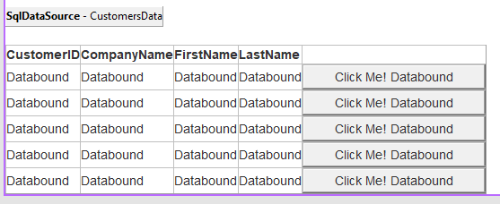

# Work with data

[!INCLUDE [book-preview](../../../includes/book-preview.md)]

Data access is the backbone of a web forms application.  It's almost a part of the name of the framework.  If you're building forms for the web, what happens to that data?  With web forms, there were several data access techniques you could use to interact with a database:

- Data Sources
- ADO.NET
- Entity Framework

Data Sources were controls that you could place on a web form and configure like other controls. Visual Studio gave you a friendly set of dialogs to configure the controls and bind it to your web forms.  Developers who enjoy a 'low code' or 'no code' approach preferred this technique when web forms were first released.



ADO.NET is the low-level approach to interacting with a database. Your apps could create a connection to the database with Commands, Recordsets, and Datasets for interacting. The results could then be bound to fields on screen without much code. The drawback of this approach was that each set of ADO.NET objects (`Connection`, `Command`, and `Recordset`) was bound to libraries provided by a database vendor. Use of these components made the code rigid and difficult to migrate to a different database.

## Entity Framework

Entity Framework (EF) is the open source object-relational mapping framework maintained by the .NET Foundation.  Initially released with .NET Framework, EF allows for generating code for the database connections, storage schemas, and interactions.  With this abstraction, you can focus on your application's business rules and allow the database to be managed by a trusted database administrator.  With .NET Core, we now use an updated version of Entity Framework called `Entity Framework Core`.  Entity Framework Core helps generate and maintain the interactions between your code and the database with a series of commands that are available for you using the `dotnet ef` command-line tool.  Let's take a look at a few simple samples to get you working with a database.

### .NET Code First

A quick way to get started building your database interactions is to start with the class objects you want to work with. Entity Framework provides a tool to help generate the appropriate database code for your classes.  This approach is called 'Code First' development.  Consider the following Product class for a sample storefront application that we want to store in a relational database like Microsoft SQL Server.

```csharp
public class Product
{
    public int Id { get; set; }

    [Required]
    public string Name { get; set; }

    [MaxLength(4000)]
    public string Description { get; set; }

    [Range(0, 99999,99)]
    [DataType(DataType.Currency)]
    public decimal Price { get; set; }
}

Product has a primary key and three additional fields that would be created in our database:  

- Entity Framework will identify the `Id` property as a primary key by convention.
- `Name` will be stored in a column configured for text storage. The `[Required]` attribute decorating this property will add a `not null` constraint to help enforce this declared behavior of the property.
- `Description` will be stored in a column configured for text storage, and have a maximum length configured of 4000 characters as dictated by the `MaxLength` attribute.  The database schema will be configured with a column named `MaxLength` using datatype `varchar(4000)`.
- The `Price` property will be stored in currency.  The `Range` attribute will generate appropriate constraints to prevent data storage outside of the minimum and maximum values declared

We need to add this Product class to a database context class that defines the connection and translation operations with our database.

```csharp
public class MyDbContext : DbContext
{
    public DbSet<Product> Products { get; set; }
}

The `MyDbContext` class provides the one property that defines the access and translation for the `Product` class.  Your application configures this class for interaction with the database using the following entries in the `Startup` class's `ConfigureServices` method:

```csharp
services.AddDbContext<MyDbContext>(options =>
    options.UseSqlServer("MY DATABASE CONNECTION STRING"));

The above code will connect to a SQL Server database with the specified connection string.  You can place the connection string in your *appsettings.json* file, environment variables, or other configuration storage locations and replace this embedded string appropriately.

You can then generate the database table appropriate for this class using the following commands:

```dotnetcli
dotnet ef migrations add 'Create Product table'
dotnet ef database update
```

The first command defines the changes you're making to the database schema as a new 'Migration' called 'Create Product table'.  A 'Migration' defines how to apply and remove your new database changes.

Once applied, you have a simple `Product` table in your database and some new classes added to the project that help manage the database schema.  You can find these generated classes, by default, in a new folder called `Migrations`.  When you make changes to the `Product` class or add more related classes you would like interacting with your database, you need to run the command-line commands again with a new name of the migration.  This command will generate another set of migration classes to update your database schema.

### Data First

For existing databases, you can generate the classes for Entity Framework Core.  The .NET command-line tools to scaffold the classes are similar to these two commands at the command line:

```dotnetcli
dotnet ef dbcontext scaffold "CONNECTION STRING" Microsoft.EntityFrameworkCore.SqlServer -c MyDbContext -t Product -t Customer
```

This command will connect to the database using the specified connection string and the `Microsoft.EntityFrameworkCore.SqlServer` provider.  Once connected, it will create a class called `MyDbContext` with supporting classes for the `Product` and `Customer` tables that were specified with the `-t` switches. There are many configuration options for this command to generate the class hierarchy appropriate for your database. You can find a complete reference in the [documentation for this command](https://docs.microsoft.com/ef/core/miscellaneous/cli/dotnet#dotnet-ef-dbcontext-scaffold).

More information about [EF Core](/ef/core/) can be found on the Microsoft Docs site.

## Interacting with web services

When ASP.NET was first released, SOAP services were the preferred way for web servers and clients to exchange data.  Much has changed since that time, and the preferred interactions with services have shifted to direct HTTP client interactions.  With ASP.NET Core and Blazor, you can register the configuration of your `HttpClient` in the Startup class's `ConfigureServices` method use that configuration wherever you need to interact with the HTTP endpoint.  Consider the following configuration code:

```csharp

services.AddHttpClient("github", c =>
{
    c.BaseAddress = new Uri("http://api.github.com/");
    // Github API versioning
    c.DefaultRequestHeaders.Add("Accept", "application/vnd.github.v3+json");
    // Github requires a user-agent
    c.DefaultRequestHeaders.Add("User-Agent", "BlazorWebForms-Sample");
});

```

Whenever you need to access data from GitHub, create a client with a name of `github`. The client is configured with the base address, and the request headers are set appropriately. Inject the `IHttpClientFactory` into your Blazor components with the `@inject` directive or an `[Inject]` attribute on a property. Create your named client and interact with services using the following syntax:

```cshtml

@inject IHttpClientFactory factory

...

@code {
    protected override async Task OnInitializedAsync()
    {
        var client = factory.CreateClient("github");
        var response = await client.GetAsync("repos/dotnet/docs/issues");
        response.EnsureStatusCode();
        var content = async test.Content.ReadAsStringAsync();
    }
}
```

This method returns the string describing the collection of issues in the *dotnet/docs* GitHub repository. It returns content in JSON format and is deserialized into appropriate GitHub issue objects. There are many ways that you can configure the `HttpClientFactory` to deliver preconfigured `HttpClient` objects. Try configuring multiple `HttpClient` instances with different names and endpoints for the various web services you work with. This approach will make your interactions with those services easier to work with on each page. For more details, read [the documentation for the IHttpClientFactory](/aspnet/core/fundamentals/http-requests).

>[!div class="step-by-step"]
>[Previous](forms-validation.md)
>[Next](middleware.md)
