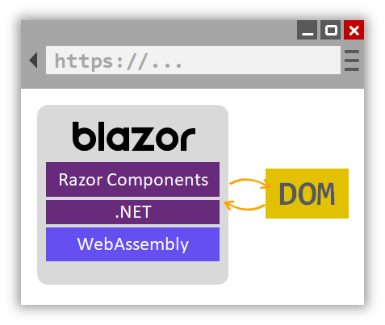
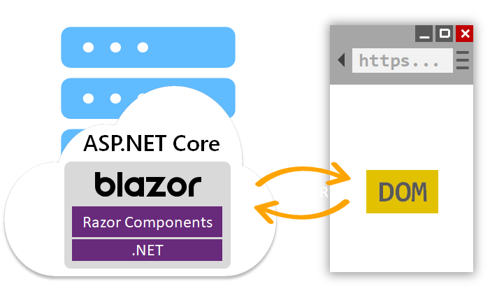

# Blazor app hosting models

Blazor apps can be hosted in one of the following ways:

- Client-side in the browser on WebAssembly.
- Server-side in an ASP.NET Core app.

## Blazor WebAssembly apps

Blazor WebAssembly apps execute directly in the browser on a WebAssembly-based .NET runtime. Blazor WebAssembly apps function in a similar way to front-end JavaScript frameworks like Angular or React. However, instead of writing JavaScript you write C#. The .NET runtime is downloaded with the app along with the app assembly and any required dependencies. No browser plugins or extensions are required.

The downloaded assemblies are normal .NET assemblies, like you would use in any other .NET app. Because the runtime supports .NET Standard, you can use existing .NET Standard libraries with your Blazor WebAssembly app. However, these assemblies will still execute in the browser security sandbox. Some functionality may throw a <xref:System.PlatformNotSupportedException>, like trying to access the file system or opening arbitrary network connections.

When the app loads, the .NET runtime is started and pointed at the app assembly. The app startup logic runs, and the root components are rendered. Blazor calculates the UI updates based on the rendered output from the components. The DOM updates are then applied.

Blazor WebAssembly apps run purely client-side. Such apps can be deployed to static site hosting solutions like GitHub Pages or Azure Static Website Hosting. .NET isn't required on the server at all. Deep linking to parts of the app typically requires a routing solution on the server. The routing solution redirects requests to the root of the app. For example, this redirection can be handled using URL rewrite rules in IIS.

To get all the benefits of Blazor and full-stack .NET web development, host your Blazor WebAssembly app with ASP.NET Core. By using .NET on both the client and server, you can easily share code and build your app using one consistent set of languages, frameworks, and tools. Blazor provides convenient templates for setting up a solution that contains both a Blazor WebAssembly app and an ASP.NET Core host project. When the solution is built, the built static files from the Blazor app are hosted by the ASP.NET Core app with fallback routing already setup.

## Blazor Server apps

Recall from the [Blazor architecture](architecture-comparison.md#blazor) discussion that Blazor components render their output to an intermediate abstraction called a `RenderTree`. The Blazor framework then compares what was rendered with what was previously rendered. The differences are applied to the DOM. Blazor components are decoupled from how their rendered output is applied. Consequently, the components themselves don't have to run in the same process as the process updating the UI. In fact, they don't even have to run on the same machine.

In Blazor Server apps, the components run on the server instead of client-side in the browser. UI events that occur in the browser are sent to the server over a real-time connection. The events are dispatched to the correct component instances. The components render, and the calculated UI diff is serialized and sent to the browser where it's applied to the DOM.

The Blazor Server hosting model may sound familiar if you've used ASP.NET AJAX and the <xref:System.Web.UI.UpdatePanel> control. The `UpdatePanel` control handles applying partial page updates in response to trigger events on the page. When triggered, the `UpdatePanel` requests a partial update and then applies it without needing to refresh the page. The state of the UI is managed using `ViewState`. Blazor Server apps are slightly different in that the app requires an active connection with the client. Additionally, all UI state is maintained on the server. Aside from those differences, the two models are conceptually similar.

## How to choose the right Blazor hosting model

As described in the [Blazor hosting model docs](/aspnet/core/blazor/hosting-models), the different Blazor hosting models have different tradeoffs.

The Blazor WebAssembly hosting model has the following benefits:

- There's no .NET server-side dependency. The app is fully functioning after downloaded to the client.
- Client resources and capabilities are fully leveraged.
- Work is offloaded from the server to the client.
- An ASP.NET Core web server isn't required to host the app. Serverless deployment scenarios are possible (for example, serving the app from a CDN).

The downsides of the Blazor WebAssembly hosting model are:

- Browser capabilities restrict the app.
- Capable client hardware and software (for example, WebAssembly support) is required.
- Download size is larger, and apps take longer to load.
- .NET runtime and tooling support is less mature. For example, there are limitations in [.NET Standard](../../standard/net-standard.md) support and debugging.

Conversely, the Blazor Server hosting model offers the following benefits:

- Download size is much smaller than a client-side app, and the app loads much faster.
- The app takes full advantage of server capabilities, including use of any .NET compatible APIs.
- .NET on the server is used to run the app, so existing .NET tooling, such as debugging, works as expected.
- Thin clients are supported. For example, server-side apps work with browsers that don't support WebAssembly and on resource-constrained devices.
- The app's .NET/C# code base, including the app's component code, isn't served to clients.

The downsides to the Blazor Server hosting model are:

- Higher UI latency. Every user interaction involves a network hop.
- There's no offline support. If the client connection fails, the app stops working.
- Scalability is challenging for apps with many users. The server must manage multiple client connections and handle client state.
- An ASP.NET Core server is required to serve the app. Serverless deployment scenarios aren't possible. For example, you can't serve the app from a CDN.

The preceding list of trade-offs may be intimidating, but your hosting model can be changed later. Regardless of the Blazor hosting model selected, the component model is *the same*. In principle, the same components can be used with either hosting model. Your app code doesn't change; however, it's a good practice to introduce abstractions so that your components stay hosting model-agnostic. The abstractions allow your app to more easily adopt a different hosting model.

## Deploy your app

ASP.NET Web Forms apps are typically hosted on IIS on a Windows Server machine or cluster. Blazor apps can also:

- Be hosted on IIS, either as static files or as an ASP.NET Core app.
- Leverage ASP.NET Core's flexibility to be hosted on various platforms and server infrastructures. For example, you can host a Blazor App using [Nginx](/aspnet/core/host-and-deploy/linux-nginx) or [Apache](/aspnet/core/host-and-deploy/linux-apache) on Linux. For more information about how to publish and deploy Blazor apps, see the Blazor [Hosting and deployment](/aspnet/core/host-and-deploy/blazor/) documentation.

In the next section, we'll look at how the projects for Blazor WebAssembly and Blazor Server apps are set up.

>[!div class="step-by-step"]
>[Previous](architecture-comparison.md)
>[Next](project-structure.md)
