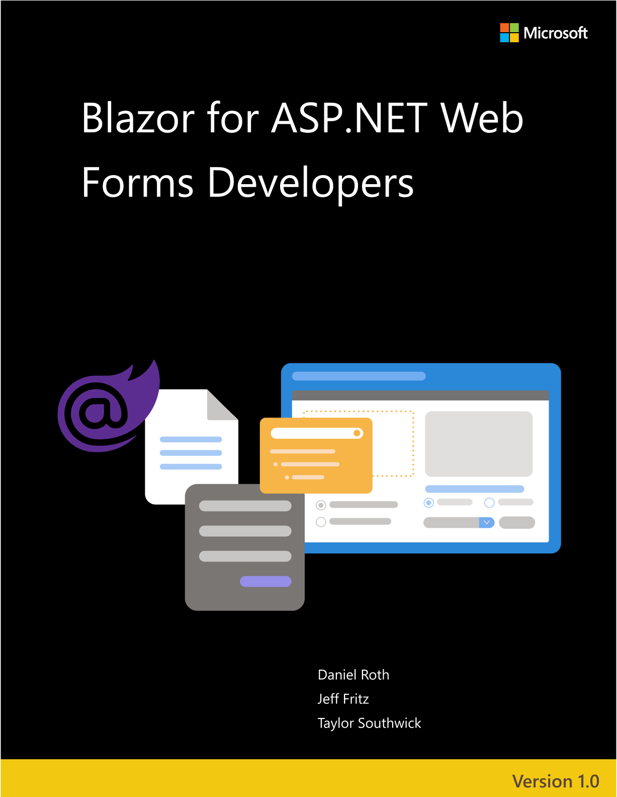

# Blazor for ASP.NET Web Forms Developers

> DOWNLOAD available at: <https://aka.ms/blazor-ebook>

**EDITION v6.0** - Updated to .NET 6

Refer to [changelog](https://aka.ms/blazor-ebook-changelog) for the book updates and community contributions.

PUBLISHED BY

Microsoft Developer Division, .NET, and Visual Studio product teams

A division of Microsoft Corporation

One Microsoft Way

Redmond, Washington 98052-6399

Copyright &copy; 2021 by Microsoft Corporation

All rights reserved. No part of the contents of this book may be reproduced or transmitted in any form or by any means without the written permission of the publisher.

This book is provided "as-is" and expresses the author's views and opinions. The views, opinions, and information expressed in this book, including URL and other Internet website references, may change without notice.

Some examples depicted herein are provided for illustration only and are fictitious. No real association or connection is intended or should be inferred.

Microsoft and the trademarks listed at <https://www.microsoft.com> on the "Trademarks" webpage are trademarks of the Microsoft group of companies.

Mac and macOS are trademarks of Apple Inc.

All other marks and logos are property of their respective owners.

Authors:

> **[Daniel Roth](https://github.com/danroth27)**, Principal Program Manager, Microsoft Corp.

> **[Jeff Fritz](https://github.com/csharpfritz)**, Senior Program Manager, Microsoft Corp.

> **[Taylor Southwick](https://github.com/twsouthwick)**, Senior Software Engineer, Microsoft Corp.

> **[Scott Addie](https://github.com/scottaddie)**, Senior Content Developer, Microsoft Corp.

> **[Steve "@ardalis" Smith](https://github.com/ardalis)**, Software Architect and Trainer, NimblePros.com

## Introduction

.NET has long supported web app development through ASP.NET, a comprehensive set of frameworks and tools for building any kind of web app. ASP.NET has its own lineage of web frameworks and technologies starting all the way back with classic Active Server Pages (ASP). Frameworks like ASP.NET Web Forms, ASP.NET MVC, ASP.NET Web Pages, and more recently ASP.NET Core, provide a productive and powerful way to build *server-rendered* web apps, where UI content is dynamically generated on the server in response to HTTP requests. Each ASP.NET framework caters to a different audience and app building philosophy. ASP.NET Web Forms shipped with the original release of the .NET Framework and enabled web development using many of the patterns familiar to desktop developers, like reusable UI controls with simple event handling. However, none of the ASP.NET offerings provide a way to run code that executed in the user's browser. To do that requires writing JavaScript and using any of the many JavaScript frameworks and tools that have phased in and out of popularity over the years: jQuery, Knockout, Angular, React, and so on.

[Blazor](https://blazor.net) is a new web framework that changes what is possible when building web apps with .NET. Blazor is a client-side web UI framework based on C# instead of JavaScript. With Blazor you can write your client-side logic and UI components in C#, compile them into normal .NET assemblies, and then run them directly in the browser using a new open web standard called WebAssembly. Or alternatively, Blazor can run your .NET UI components on the server and handle all UI interactions fluidly over a real-time connection with the browser. When paired with .NET running on the server, Blazor enables full-stack web development with .NET. While Blazor shares many commonalities with ASP.NET Web Forms, like having a reusable component model and a simple way to handle user events, it also builds on the foundations of .NET to provide a modern and high-performance web development experience.

This book introduces ASP.NET Web Forms developers to Blazor in a way that is familiar and convenient. It introduces Blazor concepts in parallel with analogous concepts in ASP.NET Web Forms while also explaining new concepts that may be less familiar. It covers a broad range of topics and concerns including component authoring, routing, layout, configuration, and security. And while the content of this book is primarily for enabling new development, it also covers guidelines and strategies for migrating existing ASP.NET Web Forms to Blazor for when you want to modernize an existing app.

## Who should use the book

This book is for ASP.NET Web Forms developers looking for an introduction to Blazor that relates to their existing knowledge and skills. This book can help with quickly getting started on a new Blazor-based project or to help chart a roadmap for modernizing an existing ASP.NET Web Forms application.

## How to use the book

The first part of this book covers what Blazor is and compares it to web app development with ASP.NET Web Forms. The book then covers a variety of Blazor topics, chapter by chapter, and relates each Blazor concept to the corresponding concept in ASP.NET Web Forms, or explains fully any completely new concepts. The book also refers regularly to a complete sample app implemented in both ASP.NET Web Forms and Blazor to demonstrate Blazor features and to provide a case study for migrating from ASP.NET Web Forms to Blazor. You can find both implementations of the sample app (ASP.NET Web Forms and Blazor versions) on [GitHub](https://github.com/dotnet-architecture/eshoponblazor).

## What this book doesn't cover

This book is an introduction to Blazor, not a comprehensive migration guide. While it does include guidance on how to approach migrating a project from ASP.NET Web Forms to Blazor, it does not attempt to cover every nuance and detail. For more general guidance on migrating from ASP.NET to ASP.NET Core, refer to the [migration guidance](/aspnet/core/migration/proper-to-2x/) in the ASP.NET Core documentation.

### Additional resources

You can find the official Blazor home page and documentation at <https://blazor.net>.

## Send your feedback

This book and related samples are constantly evolving, so your feedback is welcomed! If you have comments about how this book can be improved, use the feedback section at the bottom of any page built on [GitHub issues](https://github.com/dotnet/docs/issues).

>[!div class="step-by-step"]
>[Next](introduction.md)
