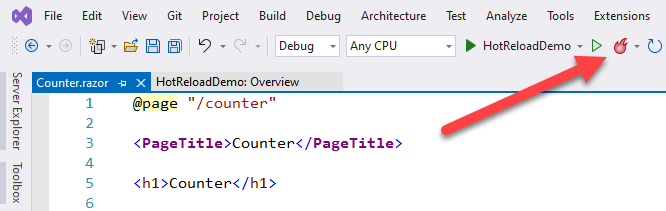

# Project structure for Blazor apps

Despite their significant project structure differences, ASP.NET Web Forms and Blazor share many similar concepts. Here, we'll look at the structure of a Blazor project and compare it to an ASP.NET Web Forms project.

To create your first Blazor app, follow the instructions in the [Blazor getting started steps](/aspnet/core/blazor/get-started). You can follow the instructions to create either a Blazor Server app or a Blazor WebAssembly app hosted in ASP.NET Core. Except for the hosting model-specific logic, most of the code in both projects is the same.

## Project file

Blazor Server apps are .NET projects. The project file for the Blazor Server app is about as simple as it can get:

```xml
<Project Sdk="Microsoft.NET.Sdk.Web">

  <PropertyGroup>
    <TargetFramework>net6.0</TargetFramework>
  </PropertyGroup>

</Project>
```

The project file for a Blazor WebAssembly app looks slightly more involved (exact version numbers may vary):

```xml
<Project Sdk="Microsoft.NET.Sdk.BlazorWebAssembly">

  <PropertyGroup>
    <TargetFramework>net6.0</TargetFramework>
    <ImplicitUsings>enable</ImplicitUsings>
  </PropertyGroup>

  <ItemGroup>
    <PackageReference Include="Microsoft.AspNetCore.Diagnostics.EntityFrameworkCore" Version="6.0.0" />
    <PackageReference Include="Microsoft.AspNetCore.Identity.EntityFrameworkCore" Version="6.0.0" />
    <PackageReference Include="Microsoft.AspNetCore.Identity.UI" Version="6.0.0" />
    <PackageReference Include="Microsoft.EntityFrameworkCore.SqlServer" Version="6.0.0" />
    <PackageReference Include="Microsoft.EntityFrameworkCore.Tools" Version="6.0.0" />
  </ItemGroup>

</Project>
```

Blazor WebAssembly project targets `Microsoft.NET.Sdk.BlazorWebAssembly` instead of `Microsoft.NET.Sdk.Web` sdk because they run in the browser on a WebAssembly-based .NET runtime. You can't install .NET into a web browser like you can on a server or developer machine. Consequently, the project references the Blazor framework using individual package references.

By comparison, a default ASP.NET Web Forms project includes almost 300 lines of XML in its *.csproj* file, most of which is explicitly listing the various code and content files in the project. Since the release of .NET 5, both Blazor Server and Blazor WebAssembly apps can easily share one unified runtime.

Although they're supported, individual assembly references are less common in .NET projects. Most project dependencies are handled as NuGet package references. You only need to reference top-level package dependencies in .NET projects. Transitive dependencies are included automatically. Instead of using the *packages.config* file commonly found in ASP.NET Web Forms projects to reference packages, package references are added to the project file using the `<PackageReference>` element.

```xml
<ItemGroup>
  <PackageReference Include="Newtonsoft.Json" Version="13.0.1" />
</ItemGroup>
```

## Entry point

The Blazor Server app's entry point is defined in the *Program.cs* file, as you would see in a Console app. When the app executes, it creates and runs a web host instance using defaults specific to web apps. The web host manages the Blazor Server app's lifecycle and sets up host-level services. Examples of such services are configuration, logging, dependency injection, and the HTTP server. This code is mostly boilerplate and is often left unchanged.

```csharp
using BlazorApp3.Areas.Identity;
using BlazorApp3.Data;
using Microsoft.AspNetCore.Components.Authorization;
using Microsoft.AspNetCore.Identity;
using Microsoft.EntityFrameworkCore;

var builder = WebApplication.CreateBuilder(args);

// Add services to the container.
var connectionString = builder.Configuration.GetConnectionString("DefaultConnection");
builder.Services.AddDbContext<ApplicationDbContext>(options =>
    options.UseSqlServer(connectionString));
builder.Services.AddDatabaseDeveloperPageExceptionFilter();
builder.Services.AddDefaultIdentity<IdentityUser>(options => options.SignIn.RequireConfirmedAccount = true)
    .AddEntityFrameworkStores<ApplicationDbContext>();
builder.Services.AddRazorPages();
builder.Services.AddServerSideBlazor();
builder.Services.AddScoped<AuthenticationStateProvider, RevalidatingIdentityAuthenticationStateProvider<IdentityUser>>();
builder.Services.AddSingleton<WeatherForecastService>();

var app = builder.Build();

// Configure the HTTP request pipeline.
if (app.Environment.IsDevelopment())
{
    app.UseMigrationsEndPoint();
}
else
{
    app.UseExceptionHandler("/Error");
    // The default HSTS value is 30 days. You may want to change this for production scenarios, see https://aka.ms/aspnetcore-hsts.
    app.UseHsts();
}

app.UseHttpsRedirection();

app.UseStaticFiles();

app.UseRouting();

app.UseAuthentication();
app.UseAuthorization();

app.MapControllers();
app.MapBlazorHub();
app.MapFallbackToPage("/_Host");

app.Run();
```

Blazor WebAssembly apps also define an entry point in *Program.cs*. The code looks slightly different. The code is similar in that it's setting up the app host to provide the same host-level services to the app. The WebAssembly app host doesn't, however, set up an HTTP server because it executes directly in the browser.

Blazor apps don't use a *Global.asax* file to define the startup logic for the app. Instead, this logic is contained in *Program.cs* or in a related `Startup` class that is referenced from *Program.cs*. Either way, this code is used to configure the app and any app-specific services.

In a Blazor Server app, the *Program.cs* file shown is used to set up the endpoint for the real-time connection used by Blazor between the client browsers and the server.

In a Blazor WebAssembly app, the *Program.cs* file defines the root components for the app and where they should be rendered:

```csharp
using BlazorApp1;
using Microsoft.AspNetCore.Components.Web;
using Microsoft.AspNetCore.Components.WebAssembly.Hosting;

var builder = WebAssemblyHostBuilder.CreateDefault(args);
builder.RootComponents.Add<App>("#app");
builder.RootComponents.Add<HeadOutlet>("head::after");

builder.Services.AddScoped(sp => new HttpClient { BaseAddress = new Uri(builder.HostEnvironment.BaseAddress) });

await builder.Build().RunAsync();
```

## Static files

Unlike ASP.NET Web Forms projects, not all files in a Blazor project can be requested as static files. Only the files in the *wwwroot* folder are web-addressable. This folder is referred to as the app's "web root". Anything outside of the app's web root *isn't* web-addressable. This setup provides an additional level of security that prevents accidental exposure of project files over the web.

## Configuration

Configuration in ASP.NET Web Forms apps is typically handled using one or more *web.config* files. Blazor apps don't typically have *web.config* files. If they do, the file is only used to configure IIS-specific settings when hosted on IIS. Instead, Blazor Server apps use the ASP.NET Core configuration abstractions (Blazor WebAssembly apps don't currently support the same configuration abstractions, but that may be a feature added in the future). For example, the default Blazor Server app stores some settings in *appsettings.json*.

```json
{
  "Logging": {
    "LogLevel": {
      "Default": "Information",
      "Microsoft": "Warning",
      "Microsoft.Hosting.Lifetime": "Information"
    }
  },
  "AllowedHosts": "*"
}
```

We'll learn more about configuration in ASP.NET Core projects in the [Configuration](./config.md) section.

## Razor components

Most files in Blazor projects are *.razor* files. Razor is a templating language based on HTML and C# that is used to dynamically generate web UI. The *.razor* files define components that make up the UI of the app. For the most part, the components are identical for both the Blazor Server and Blazor WebAssembly apps. Components in Blazor are analogous to user controls in ASP.NET Web Forms.

Each Razor component file is compiled into a .NET class when the project is built. The generated class captures the component's state, rendering logic, lifecycle methods, event handlers, and other logic. We'll look at authoring components in the [Building reusable UI components with Blazor](./components.md) section.

The *_Imports.razor* files aren't Razor component files. Instead, they define a set of Razor directives to import into other *.razor* files within the same folder and in its subfolders. For example, a *_Imports.razor* file is a conventional way to add `using` directives for commonly used namespaces:

```razor
@using System.Net.Http
@using Microsoft.AspNetCore.Authorization
@using Microsoft.AspNetCore.Components.Authorization
@using Microsoft.AspNetCore.Components.Forms
@using Microsoft.AspNetCore.Components.Routing
@using Microsoft.AspNetCore.Components.Web
@using Microsoft.JSInterop
@using BlazorApp1
@using BlazorApp1.Shared
```

## Pages

Where are the pages in the Blazor apps? Blazor doesn't define a separate file extension for addressable pages, like the *.aspx* files in ASP.NET Web Forms apps. Instead, pages are defined by assigning routes to components. A route is typically assigned using the `@page` Razor directive. For example, the `Counter` component authored in the *Pages/Counter.razor* file defines the following route:

```razor
@page "/counter"
```

Routing in Blazor is handled client-side, not on the server. As the user navigates in the browser, Blazor intercepts the navigation and then renders the component with the matching route.

The component routes aren't currently inferred by the component's file location like they are with *.aspx* pages or ASP.NET Core Razor Pages. This feature may be added in the future. Each route must be specified explicitly on the component. Storing routable components in a *Pages* folder has no special meaning and is purely a convention.

We'll look in greater detail at routing in Blazor in the [Pages, routing, and layouts](./pages-routing-layouts.md) section.

## Layout

In ASP.NET Web Forms apps, a common page layout is handled using master pages (*Site.Master*). In Blazor apps, the page layout is handled using layout components (*Shared/MainLayout.razor*). Layout components will be discussed in more detail in [Page, routing, and layouts](./pages-routing-layouts.md) section.

## Bootstrap Blazor

To bootstrap Blazor, the app must:

- Specify where on the page the root component (*App.Razor*) should be rendered.
- Add the corresponding Blazor framework script.

In the Blazor Server app, the root component's host page is defined in the *_Host.cshtml* file. This file defines a Razor Page, not a component. Razor Pages use Razor syntax to define a server-addressable page, very much like an *.aspx* page.

```razor
@page "/"
@namespace BlazorApp3.Pages
@addTagHelper *, Microsoft.AspNetCore.Mvc.TagHelpers
@{
    Layout = "_Layout";
}

<component type="typeof(App)" render-mode="ServerPrerendered" />
```

The `render-mode` attribute is used to define where a root-level component should be rendered. The `RenderMode` option indicates the manner in which the component should be rendered. The following table outlines the supported `RenderMode` options.

|Option                        |Description       |
|------------------------------|------------------|
|`RenderMode.Server`           |Rendered interactively once a connection with the browser is established|
|`RenderMode.ServerPrerendered`|First prerendered and then rendered interactively|
|`RenderMode.Static`           |Rendered as static content|

The *_Layout.cshtml* file includes the default HTML for the app and its components.

```razor
@using Microsoft.AspNetCore.Components.Web
@namespace BlazorApp3.Pages
@addTagHelper *, Microsoft.AspNetCore.Mvc.TagHelpers

<!DOCTYPE html>
<html lang="en">
<head>
    <meta charset="utf-8" />
    <meta name="viewport" content="width=device-width, initial-scale=1.0" />
    <base href="~/" />
    <link rel="stylesheet" href="css/bootstrap/bootstrap.min.css" />
    <link href="css/site.css" rel="stylesheet" />
    <link href="BlazorApp3.styles.css" rel="stylesheet" />
    <component type="typeof(HeadOutlet)" render-mode="ServerPrerendered" />
</head>
<body>
    @RenderBody()

    <div id="blazor-error-ui">
        <environment include="Staging,Production">
            An error has occurred. This application may no longer respond until reloaded.
        </environment>
        <environment include="Development">
            An unhandled exception has occurred. See browser dev tools for details.
        </environment>
        <a href="" class="reload">Reload</a>
        <a class="dismiss">🗙</a>
    </div>

    <script src="_framework/blazor.server.js"></script>
</body>
</html>

```

The script reference to *_framework/blazor.server.js* establishes the real-time connection with the server and then deals with all user interactions and UI updates.

In the Blazor WebAssembly app, the host page is a simple static HTML file under *wwwroot/index.html*. The `<div>` element with id named `app` is used to indicate where the root component should be rendered.

```html
<!DOCTYPE html>
<html lang="en">

<head>
    <meta charset="utf-8" />
    <meta name="viewport" content="width=device-width, initial-scale=1.0, maximum-scale=1.0, user-scalable=no" />
    <title>BlazorApp1</title>
    <base href="/" />
    <link href="css/bootstrap/bootstrap.min.css" rel="stylesheet" />
    <link href="css/app.css" rel="stylesheet" />
    <link href="BlazorApp1.styles.css" rel="stylesheet" />
</head>

<body>
    <div id="app">Loading...</div>

    <div id="blazor-error-ui">
        An unhandled error has occurred.
        <a href="" class="reload">Reload</a>
        <a class="dismiss">🗙</a>
    </div>
    <script src="_framework/blazor.webassembly.js"></script>
</body>

</html>
```

The root component to render is specified in the app's *Program.cs* file with the flexibility to register services through dependency injection. For more information, see [ASP.NET Core Blazor dependency injection](/aspnet/core/blazor/fundamentals/dependency-injection?pivots=webassembly).

```csharp
var builder = WebAssemblyHostBuilder.CreateDefault(args);
builder.RootComponents.Add<App>("#app");
builder.RootComponents.Add<HeadOutlet>("head::after");
```

## Build output

When a Blazor project is built, all Razor component and code files are compiled into a single assembly. Unlike ASP.NET Web Forms projects, Blazor doesn't support runtime compilation of the UI logic.

## Run the app with Hot Reload

To run the Blazor Server app, press <kbd>F5</kbd> in Visual Studio to run with the debugger attached, or <kbd>Ctrl</kbd> + <kbd>F5</kbd> to run without the debugger attached.

To run the Blazor WebAssembly app, choose one of the following approaches:

- Run the client project directly using the development server.
- Run the server project when hosting the app with ASP.NET Core.

Blazor WebAssembly apps can be debugged in both browser and Visual Studio. See [Debug ASP.NET Core Blazor WebAssembly](/aspnet/core/blazor/debug) for details.

Both Blazor Server and Blazor WebAssembly apps support Hot Reload in Visual Studio. Hot Reload is a feature that automatically updates changes made to a Blazor app live, in the browser. You can toggle whether Hot Reload is enabled from its icon in the toolbar:



Selecting the caret beside the icon reveals additional options. You can toggle Hot Reload on or off, restart the application, and toggle whether Hot Reload should occur whenever a file is saved.


You can also access additional configuration options. The configuration dialog lets you specify whether Hot Reload should be enabled when debugging (along with Edit and Continue), when starting without debugging, or when a file is saved.


The "developer inner loop" has been greatly streamlined with Hot Reload. Using Hot Reload, a Blazor developer would typically need to restart and rerun the app after every change, navigating to the appropriate part of the app as required. With Hot Reload, changes can be made to the running app without the need to restart in most cases. Hot Reload even retains the state of pages, so there's no need to have to re-enter form values or otherwise get the app back where you need it.

Both Blazor Server and Blazor WebAssembly apps support Hot Reload in Visual Studio. Hot Reload is a feature that automatically updates changes made to a Blazor app live, in the browser. You can toggle whether Hot Reload is enabled from its icon in the toolbar:


Selecting the caret beside the icon reveals additional options. You can toggle Hot Reload on or off, restart the application, and toggle whether Hot Reload should occur whenever a file is saved.


You can also access additional configuration options. The configuration dialog lets you specify whether Hot Reload should be enabled when debugging (along with Edit and Continue), when starting without debugging, or when a file is saved.


The "developer inner loop" has been greatly streamlined with Hot Reload. Using Hot Reload, a Blazor developer would typically need to restart and rerun the app after every change, navigating to the appropriate part of the app as required. With Hot Reload, changes can be made to the running app without the need to restart in most cases. Hot Reload even retains the state of pages, so there's no need to have to re-enter form values or otherwise get the app back where you need it.

>[!div class="step-by-step"]
>[Previous](hosting-models.md)
>[Next](app-startup.md)
