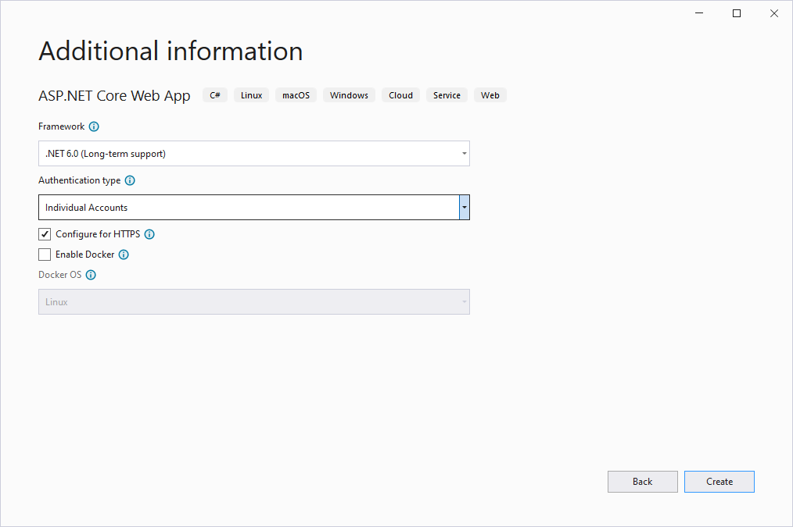

# Security: Authentication and Authorization in ASP.NET Web Forms and Blazor

Migrating from an ASP.NET Web Forms application to Blazor will almost certainly require updating how authentication and authorization is performed, assuming the application had authentication configured. This chapter will cover how to migrate from the ASP.NET Web Forms universal provider model (for membership, roles, and user profiles) and how to work with ASP.NET Core Identity from Blazor apps. While this chapter will cover the high level steps and considerations, the detailed steps and scripts may be found in the referenced documentation.

## ASP.NET universal providers

Since ASP.NET 2.0, the ASP.NET Web Forms platform has supported a provider model for a variety of features, including membership. The universal membership provider, along with the optional role provider, is very commonly deployed with ASP.NET Web Forms applications. It offers a robust and secure way to manage authentication and authorization that continues to work well today. The most recent offering of these universal providers is available as a NuGet package, [Microsoft.AspNet.Providers](https://www.nuget.org/packages/Microsoft.AspNet.Providers).

The Universal Providers work with a SQL database schema that includes tables like `aspnet_Applications`, `aspnet_Membership`, `aspnet_Roles`, and `aspnet_Users`. When configured by running the [aspnet_regsql.exe command](https://docs.microsoft.com/previous-versions/ms229862(v=vs.140)), the providers install tables and stored procedures that provide all of the necessary queries and commands necessary to work with the underlying data. The database schema and these stored procedures are not compatible with newer ASP.NET Identity and ASP.NET Core Identity systems, so existing data must be migrated into the new system. Figure 1 shows an example table schema configured for universal providers.


The universal provider handle users, membership, roles, and profiles. Users are assigned globally unique identifiers and very basic information (userId, userName) was stored in the `aspnet_Users` table. Authentication information, such as password, password format, password salt, lockout counters and details, etc. are stored in the `aspnet_Membership` table. Roles consist simply of names and unique identifiers, which are assigned to users via the `aspnet_UsersInRoles` association table, providing a many-to-many relationship.

If your existing system is using roles in addition to membership, you will need to migrate the user accounts, the associated passwords, the roles, and the role membership into ASP.NET Core Identity. You will also most likely need to update your code where you're currently performing role checks using if statements to instead leverage declarative filters, attributes, and/or tag helpers. We will review migration considerations in greater detail at the end of this chapter.

### Authorization configuration in Web Forms

To configure authorized access to certain pages in an ASP.NET Web Forms application, typically you specify that certain pages or folders are inaccessible to anonymous users. This is done in the web.config file:

```xml
<?xml version="1.0"?>
<configuration>
    <system.web>
      <authentication mode="Forms">
        <forms defaultUrl="~/home.aspx" loginUrl="~/login.aspx" 
          slidingExpiration="true" timeout="2880"></forms>
      </authentication>
      
      <authorization>
        <deny users="?" />
      </authorization>
    </system.web>
</configuration>
```

The `authentication` configuration section sets up forms authentication for the application. The `authorization` section is used to disallow anonymous users for the entire application. However, you can provide more granular authorization rules on a per-location basis as well as apply role based authorization checks.

```xml
<location path="login.aspx">
  <system.web>
    <authorization>
      <allow users="*" />
    </authorization>
  </system.web>
</location>
```

The above configuration, when combined with the first one, would allow anonymous users to access the login page, overriding the site-wide restriction on non-authenticated users.

```xml
<location path="/admin">
  <system.web>
    <authorization>
      <allow roles="Administrators" />
      <deny users="*" />
    </authorization>
  </system.web>
</location>
```

The above configuration, when combined with the others, restricts access to the `/admin` folder and all resources within it to members of the "Administrators" role. This could also be applied by placing a separate `web.config` file within the `/admin` folder root.

### Authorization code in Web Forms

In addition to configuring access using `web.config`, you can also programmatically configure access and behavior in your Web Forms application. For instance, you can restrict the ability to perform certain operations or view certain data based on the user's role.

This code can be used both in codebehind logic as well as in the page itself:

```html
<% if(HttpContext.Current.User.IsInRole("Administrators")) { %>
  <a href="/admin">Go To Admin</a>
<% } %>
```

In addition to checking user role membership, you can also determine if they are authenticated (though often this is better done using the location-based configuration covered above). Below is an example of this approach.

```csharp
protected void Page_Load(object sender, EventArgs e)
{
    if (!User.Identity.IsAuthenticated)
    {
        FormsAuthentication.RedirectToLoginPage();
    }
    if (!Roles.IsUserInRole(User.Identity.Name, "Administrators"))
    {
        MessageLabel.Text = "Only administrators can view this.";
        SecretPanel.Visible = false;
    }
}
```

In the code above, role-based access control (RBAC) is used to determine whether certain elements of the page, such as a `SecretPanel`, are visible based on the current user's role.

Typically, ASP.NET Web Forms applications configure security within the `web.config` file and then add additional checks where needed in `.aspx` pages and their related `.aspx.cs` codebehind files. Most applications leverage the universal membership provider, frequently with the additional role provider.

## ASP.NET Core Identity

Although still tasked with authentication and authorization, ASP.NET Core Identity uses a different set of abstractions and assumptions when compared to the universal providers. For example, the new Identity model supports third party authentication, allowing users to authenticate using a social media account or other trusted authentication provider. ASP.NET Core Identity supports UI for commonly needed pages like login, logout, and register. It leverages EF Core for its data access, and uses EF Core migrations to generate the necessary schema required to supports its data model. This [introduction to Identity on ASP.NET Core](https://docs.microsoft.com/aspnet/core/security/authentication/identity) provides a good overview of what is included with ASP.NET Core Identity and how to get started working with it. If you haven't already set up ASP.NET Core Identity in your application and its database, it will help you get started.

Migrating from ASP.NET Web Forms and universal providers to ASP.NET Core Identity requires several steps:

1. Create ASP.NET Core Identity database schema in destination database
2. Migrate data from universal provider schema to ASP.NET Core Identity schema
3. Migrate configuration from web.config to middleware and services, typically in `Startup.cs`
4. Update individual pages using controls and conditionals to use tag helpers and new identity APIs.

Each of these steps is described in detail in the following sections.

### Creating the ASP.NET Core Identity schema

There are several ways to create the necessary table structure used for ASP.NET Core Identity. The simplest is to create a new ASP.NET Core Web application. Choose Web Application and then change Authentication to use Individual User Accounts.



From the command line, you can do the same thing by running `dotnet new webapp -au Individual`. Once the app has been created, run it and register on the site. You should trigger a page like the one shown below:


Click on the "Apply Migrations" button and the necessary database tables should be created for you. In addition, the migration files should appear in your project, as shown:


You can run the migration yourself, without running the web application, using this command line tool:

```powershell
dotnet ef database update
```

If you would rather run a script to apply the new schema to an existing database, you can script these migrations from the command line. Run this command to generate the script:

```powershell
dotnet ef migrations script -o auth.sql
```

This will produce a SQL script in the output file `auth.sql` which can then be run against whatever database you like. If you have any trouble running `dotnet ef` commands, [make sure you have the EF Core tools installed on your system](https://docs.microsoft.com/ef/core/miscellaneous/cli/dotnet).

In the event you have additional columns on your source tables, you will need to identify the best location for these columns in the new schema. Generally, columns found on the `aspnet_Membership` table should be mapped to the `AspNetUsers` table. Columns on `aspnet_Roles` should be mapped to `AspNetRoles`. Any additional columns on the `aspnet_UsersInRoles` table would be added to the `AspNetUserRoles` table.

It's also worth considering putting any additional columns on separate tables, so that future migrations won't need to take into account such customizations of the default identity schema.

### Migrating data from universal providers to ASP.NET Core Identity

Once you have the destination table schema in place, the next step is to migrate your user and role records to the new schema. A complete list of the schema differences, including which columns map to which new columns, can be found [here](https://docs.microsoft.com/aspnet/core/migration/proper-to-2x/membership-to-core-identity).

To migrate your users from membership to the new identity tables, you should [follow the steps described in the documentation](https://docs.microsoft.com/aspnet/core/migration/proper-to-2x/membership-to-core-identity). After following these steps and the script provided, your users will need to change their password the next time they log in.

It is possible to migrate user passwords but the process is much more involved. It's quite likely that many users' passwords from the prior system have previously been exposed along with their email address in hacks of other systems where the user used the same credentials. Requiring users to update their passwords as part of the migration process, and encouraging them to use new, unique passwords, is likely to enhance the overall security of the application.

### Migrating auth settings from web.config to Startup.cs

As noted above, ASP.NET membership and role providers are configured in the application's web.config file. Since ASP.NET Core apps are not tied to IIS and use a separate system for configuration, these settings must be configured elsewhere. For the most part, ASP.NET Core Identity is configured in the `Startup.cs` file. Open the web project that was created earlier (to generate the identity table schema) and review its `Startup.cs` file.

The default ConfigureServices method adds support for EF Core and Identity:

```csharp
// This method gets called by the runtime. Use this method to add services to the container.
public void ConfigureServices(IServiceCollection services)
{
    services.AddDbContext<ApplicationDbContext>(options =>
        options.UseSqlServer(
            Configuration.GetConnectionString("DefaultConnection")));

    services.AddDefaultIdentity<IdentityUser>(options => options.SignIn.RequireConfirmedAccount = true)
        .AddEntityFrameworkStores<ApplicationDbContext>();

    services.AddRazorPages();
}
```

The `AddDefaultIdentity` extension method is used to configure Identity to use the default `ApplicationDbContext` and the framework's `IdentityUser` type. If you're using a custom `IdentityUser`, be sure to specify its type here. If these extension methods aren't working in your application, check that you have the appropriate using statements and that you have the necessary NuGet package references. For example, your project should have some version of the `Microsoft.AspNetCore.Identity.EntityFrameworkCore` and `Microsoft.AspNetCore.Identity.UI` packages referenced.

Also in `Startup.cs` you should see the necessary middleware configured for the site. Specifically, `UseAuthentication` and `UseAuthorization` should be set up, and in the proper location.

```csharp

// This method gets called by the runtime. Use this method to configure the HTTP request pipeline.
public void Configure(IApplicationBuilder app, IWebHostEnvironment env)
{
    if (env.IsDevelopment())
    {
        app.UseDeveloperExceptionPage();
        app.UseDatabaseErrorPage();
    }
    else
    {
        app.UseExceptionHandler("/Error");
        // The default HSTS value is 30 days. You may want to change this for production scenarios, see https://aka.ms/aspnetcore-hsts.
        app.UseHsts();
    }

    app.UseHttpsRedirection();
    app.UseStaticFiles();

    app.UseRouting();

    app.UseAuthentication();
    app.UseAuthorization();

    app.UseEndpoints(endpoints =>
    {
        endpoints.MapRazorPages();
    });
}
```

ASP.NET Identity does not configure anonymous or role-based access to locations from `Startup.cs`. You will need to migrate any location-specific authorization configuration data to filters in ASP.NET Core. Make note of which folders and pages will require such updates. You will make these changes in the next section.

### Updating individual pages to use ASP.NET Core Identity abstractions


## References

- [Introduction to Identity on ASP.NET Core](https://docs.microsoft.com/aspnet/core/security/authentication/identity)
- [Migrate from ASP.NET Membership authentication to ASP.NET Core 2.0 Identity](https://docs.microsoft.com/aspnet/core/migration/proper-to-2x/membership-to-core-identity)
- [Migrate Authentication and Identity to ASP.NET Core](https://docs.microsoft.com/aspnet/core/migration/identity)

Notes:
- Review universal providers for ASP.NET users / roles
- Introduce ASP.NET Core Identity
  - Compare to existing users/roles
  - Explain Policies
- Authorize attribute and access control
- Migration strategy

>[!div class="step-by-step"]
>[Previous](config.md)
>[Next](migration.md)
