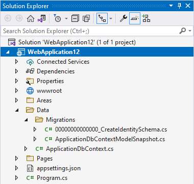

# Security: Authentication and Authorization in ASP.NET Web Forms and Blazor

Migrating from an ASP.NET Web Forms application to Blazor will almost certainly require updating how authentication and authorization are performed, assuming the application had authentication configured. This chapter will cover how to migrate from the ASP.NET Web Forms universal provider model (for membership, roles, and user profiles) and how to work with ASP.NET Core Identity from Blazor apps. While this chapter will cover the high-level steps and considerations, the detailed steps and scripts may be found in the referenced documentation.

## ASP.NET universal providers

Since ASP.NET 2.0, the ASP.NET Web Forms platform has supported a provider model for a variety of features, including membership. The universal membership provider, along with the optional role provider, is commonly deployed with ASP.NET Web Forms applications. It offers a robust and secure way to manage authentication and authorization that continues to work well today. The most recent offering of these universal providers is available as a NuGet package, [Microsoft.AspNet.Providers](https://www.nuget.org/packages/Microsoft.AspNet.Providers).

The Universal Providers work with a SQL database schema that includes tables like `aspnet_Applications`, `aspnet_Membership`, `aspnet_Roles`, and `aspnet_Users`. When configured by running the [aspnet_regsql.exe command](/previous-versions/ms229862(v=vs.140)), the providers install tables and stored procedures that provide all of the necessary queries and commands to work with the underlying data. The database schema and these stored procedures are not compatible with newer ASP.NET Identity and ASP.NET Core Identity systems, so existing data must be migrated into the new system. Figure 1 shows an example table schema configured for universal providers.


The universal provider handles users, membership, roles, and profiles. Users are assigned globally unique identifiers and basic information like userId, userName etc. are stored in the `aspnet_Users` table. Authentication information, such as password, password format, password salt, lockout counters and details, etc. are stored in the `aspnet_Membership` table. Roles consist simply of names and unique identifiers, which are assigned to users via the `aspnet_UsersInRoles` association table, providing a many-to-many relationship.

If your existing system is using roles in addition to membership, you will need to migrate the user accounts, the associated passwords, the roles, and the role membership into ASP.NET Core Identity. You will also most likely need to update your code where you're currently performing role checks using if statements to instead leverage declarative filters, attributes, and/or tag helpers. We will review migration considerations in greater detail at the end of this chapter.

### Authorization configuration in Web Forms

To configure authorized access to certain pages in an ASP.NET Web Forms application, typically you specify that certain pages or folders are inaccessible to anonymous users. This configuration is done in the web.config file:

```xml
<?xml version="1.0"?>
<configuration>
    <system.web>
      <authentication mode="Forms">
        <forms defaultUrl="~/home.aspx" loginUrl="~/login.aspx"
          slidingExpiration="true" timeout="2880"></forms>
      </authentication>

      <authorization>
        <deny users="?" />
      </authorization>
    </system.web>
</configuration>
```

The `authentication` configuration section sets up the forms authentication for the application. The `authorization` section is used to disallow anonymous users for the entire application. However, you can provide more granular authorization rules on a per-location basis as well as apply role-based authorization checks.

```xml
<location path="login.aspx">
  <system.web>
    <authorization>
      <allow users="*" />
    </authorization>
  </system.web>
</location>
```

The above configuration, when combined with the first one, would allow anonymous users to access the login page, overriding the site-wide restriction on non-authenticated users.

```xml
<location path="/admin">
  <system.web>
    <authorization>
      <allow roles="Administrators" />
      <deny users="*" />
    </authorization>
  </system.web>
</location>
```

The above configuration, when combined with the others, restricts access to the `/admin` folder and all resources within it to members of the "Administrators" role. This restriction could also be applied by placing a separate `web.config` file within the `/admin` folder root.

### Authorization code in Web Forms

In addition to configuring access using `web.config`, you can also programmatically configure access and behavior in your Web Forms application. For instance, you can restrict the ability to perform certain operations or view certain data based on the user's role.

This code can be used both in code-behind logic as well as in the page itself:

```html
<% if (HttpContext.Current.User.IsInRole("Administrators")) { %>
  <a href="/admin">Go To Admin</a>
<% } %>
```

In addition to checking user role membership, you can also determine if they are authenticated (though often this is better done using the location-based configuration covered above). Below is an example of this approach.

```csharp
protected void Page_Load(object sender, EventArgs e)
{
    if (!User.Identity.IsAuthenticated)
    {
        FormsAuthentication.RedirectToLoginPage();
    }
    if (!Roles.IsUserInRole(User.Identity.Name, "Administrators"))
    {
        MessageLabel.Text = "Only administrators can view this.";
        SecretPanel.Visible = false;
    }
}
```

In the code above, role-based access control (RBAC) is used to determine whether certain elements of the page, such as a `SecretPanel`, are visible based on the current user's role.

Typically, ASP.NET Web Forms applications configure security within the `web.config` file and then add additional checks where needed in `.aspx` pages and their related `.aspx.cs` code-behind files. Most applications leverage the universal membership provider, frequently with the additional role provider.

## ASP.NET Core Identity

Although still tasked with authentication and authorization, ASP.NET Core Identity uses a different set of abstractions and assumptions when compared to the universal providers. For example, the new Identity model supports third party authentication, allowing users to authenticate using a social media account or other trusted authentication provider. ASP.NET Core Identity supports UI for commonly needed pages like login, logout, and register. It leverages EF Core for its data access, and uses EF Core migrations to generate the necessary schema required to support its data model. This [introduction to Identity on ASP.NET Core](/aspnet/core/security/authentication/identity) provides a good overview of what is included with ASP.NET Core Identity and how to get started working with it. If you haven't already set up ASP.NET Core Identity in your application and its database, it will help you get started.

### Roles, claims, and policies

Both the universal providers and ASP.NET Core Identity support the concept of roles. You can create roles for users and assign users to roles. Users can belong to any number of roles, and you can verify role membership as part of your authorization implementation.

In addition to roles, ASP.NET Core identity supports the concepts of claims and policies. While a role should specifically correspond to a set of resources a user in that role should be able to access, a claim is simply part of a user's identity. A claim is a name value pair that represents what the subject is, not what the subject can do.

It is possible to directly inspect a user's claims and determine based on these values whether a user should be given access to a resource. However, such checks are often repetitive and scattered throughout the system. A better approach is to define a *policy*.

An authorization policy consists of one or more requirements. Policies are registered as part of the authorization service configuration in the `ConfigureServices` method of `Startup.cs`. For example, the following code snippet configures a policy called "CanadiansOnly", which has the requirement that the user has the Country claim with the value of "Canada".

```csharp
services.AddAuthorization(options =>
{
    options.AddPolicy("CanadiansOnly", policy => policy.RequireClaim(ClaimTypes.Country, "Canada"));
});
```

You can [learn more about how to create custom policies in the documentation](/aspnet/core/security/authorization/policies).

Whether you're using policies or roles, you can specify that a particular page in your Blazor application requires that role or policy with the `[Authorize]` attribute, applied with the `@attribute` directive.

Requiring a role:

```csharp
@attribute [Authorize(Roles ="administrators")]
```

Requiring a policy be satisfied:

```csharp
@attribute [Authorize(Policy ="CanadiansOnly")]
```

If you need access to a user's authentication state, roles, or claims in your code, there are two primary ways to achieve this functionality. The first is to receive the authentication state as a cascading parameter. The second is to access the state using an injected `AuthenticationStateProvider`. The details of each of these approaches are described in the [Blazor Security documentation](/aspnet/core/blazor/security/).

The following code shows how to receive the `AuthenticationState` as a cascading parameter:

```csharp
[CascadingParameter]
private Task<AuthenticationState> authenticationStateTask { get; set; }
```

With this parameter in place, you can get the user using this code:

```csharp
var authState = await authenticationStateTask;
var user = authState.User;
```

The following code shows how to inject the `AuthenticationStateProvider`:

```csharp
@using Microsoft.AspNetCore.Components.Authorization
@inject AuthenticationStateProvider AuthenticationStateProvider
```

With the provider in place, you can gain access to the user with the following code:

```csharp
AuthenticationState authState = await AuthenticationStateProvider.GetAuthenticationStateAsync();
ClaimsPrincipal user = authState.User;

if (user.Identity.IsAuthenticated)
{
  // work with user.Claims and/or user.Roles
}
```

**Note:** The `AuthorizeView` component, covered later in this chapter, provides a declarative way to control what a user sees on a page or component.

To work with users and claims (in Blazor Server applications) you may also need to inject a `UserManager<T>` (use `IdentityUser` for default) which you can use to enumerate and modify claims for a user. First inject the type and assign it to a property:

```csharp
@inject UserManager<IdentityUser> MyUserManager
```

Then use it to work with the user's claims. The following sample shows how to add and persist a claim on a user:

```csharp
private async Task AddCountryClaim()
{
    var authState = await AuthenticationStateProvider.GetAuthenticationStateAsync();
    var user = authState.User;
    var identityUser = await MyUserManager.FindByNameAsync(user.Identity.Name);

    if (!user.HasClaim(c => c.Type == ClaimTypes.Country))
    {
        // stores the claim in the cookie
        ClaimsIdentity id = new ClaimsIdentity();
        id.AddClaim(new Claim(ClaimTypes.Country, "Canada"));
        user.AddIdentity(id);

        // save the claim in the database
        await MyUserManager.AddClaimAsync(identityUser, new Claim(ClaimTypes.Country, "Canada"));
    }
}
```

If you need to work with roles, follow the same approach. You may need to inject a `RoleManager<T>` (use `IdentityRole` for default type) to list and manage the roles themselves.

**Note:** In Blazor WebAssembly projects, you will need to provide server APIs to perform these operations (instead of using `UserManager<T>` or `RoleManager<T>` directly). A Blazor WebAssembly client application would manage claims and/or roles by securely calling API endpoints exposed for this purpose.

### Migration guide

Migrating from ASP.NET Web Forms and universal providers to ASP.NET Core Identity requires several steps:

1. Create ASP.NET Core Identity database schema in the destination database
2. Migrate data from universal provider schema to ASP.NET Core Identity schema
3. Migrate configuration from the `web.config` to middleware and services, typically in *Program.cs* (or a `Startup` class)
4. Update individual pages using controls and conditionals to use tag helpers and new identity APIs.

Each of these steps is described in detail in the following sections.

### Creating the ASP.NET Core Identity schema

There are several ways to create the necessary table structure used for ASP.NET Core Identity. The simplest is to create a new ASP.NET Core Web application. Choose Web Application and then change Authentication type to use Individual Accounts.


From the command line, you can do the same thing by running `dotnet new webapp -au Individual`. Once the app has been created, run it and register on the site. You should trigger a page like the one shown below:


Click on the "Apply Migrations" button and the necessary database tables should be created for you. In addition, the migration files should appear in your project, as shown:



You can run the migration yourself, without running the web application, using this command-line tool:

```powershell
dotnet ef database update
```

If you would rather run a script to apply the new schema to an existing database, you can script these migrations from the command-line. Run this command to generate the script:

```powershell
dotnet ef migrations script -o auth.sql
```

The above command will produce a SQL script in the output file `auth.sql`, which can then be run against whatever database you like. If you have any trouble running `dotnet ef` commands, [make sure you have the EF Core tools installed on your system](/ef/core/miscellaneous/cli/dotnet).

In the event you have additional columns on your source tables, you will need to identify the best location for these columns in the new schema. Generally, columns found on the `aspnet_Membership` table should be mapped to the `AspNetUsers` table. Columns on `aspnet_Roles` should be mapped to `AspNetRoles`. Any additional columns on the `aspnet_UsersInRoles` table would be added to the `AspNetUserRoles` table.

It's also worth considering putting any additional columns on separate tables. So that future migrations won't need to take into account such customizations of the default identity schema.

### Migrating data from universal providers to ASP.NET Core Identity

Once you have the destination table schema in place, the next step is to migrate your user and role records to the new schema. A complete list of the schema differences, including which columns map to which new columns, can be found [here](/aspnet/core/migration/proper-to-2x/membership-to-core-identity).

To migrate your users from membership to the new identity tables, you should [follow the steps described in the documentation](/aspnet/core/migration/proper-to-2x/membership-to-core-identity). After following these steps and the script provided, your users will need to change their password the next time they log in.

It is possible to migrate user passwords but the process is much more involved. Requiring users to update their passwords as part of the migration process, and encouraging them to use new, unique passwords, is likely to enhance the overall security of the application.

### Migrating security settings from web.config to app startup

As noted above, ASP.NET membership and role providers are configured in the application's `web.config` file. Since ASP.NET Core apps are not tied to IIS and use a separate system for configuration, these settings must be configured elsewhere. For the most part, ASP.NET Core Identity is configured in the *Program.cs* file. Open the web project that was created earlier (to generate the identity table schema) and review its *Program.cs* (or *Startup.cs*) file.

This code adds support for EF Core and Identity:

```csharp
// Add services to the container.
var connectionString = builder.Configuration.GetConnectionString("DefaultConnection");
builder.Services.AddDbContext<ApplicationDbContext>(options =>
    options.UseSqlServer(connectionString));
builder.Services.AddDatabaseDeveloperPageExceptionFilter();
builder.Services.AddDefaultIdentity<IdentityUser>(options =>
    options.SignIn.RequireConfirmedAccount = true)
    .AddEntityFrameworkStores<ApplicationDbContext>();
```

The `AddDefaultIdentity` extension method is used to configure Identity to use the default `ApplicationDbContext` and the framework's `IdentityUser` type. If you're using a custom `IdentityUser`, be sure to specify its type here. If these extension methods aren't working in your application, check that you have the appropriate using statements and that you have the necessary NuGet package references. For example, your project should have some version of the `Microsoft.AspNetCore.Identity.EntityFrameworkCore` and `Microsoft.AspNetCore.Identity.UI` packages referenced.

Also in *Program.cs* you should see the necessary middleware configured for the site. Specifically, `UseAuthentication` and `UseAuthorization` should be set up, and in the proper location.

```csharp
// Configure the HTTP request pipeline.
if (app.Environment.IsDevelopment())
{
    app.UseMigrationsEndPoint();
}
else
{
    app.UseExceptionHandler("/Error");
    // The default HSTS value is 30 days. You may want to change this for production scenarios, see https://aka.ms/aspnetcore-hsts.
    app.UseHsts();
}

app.UseHttpsRedirection();

app.UseStaticFiles();

app.UseRouting();

app.UseAuthentication();
app.UseAuthorization();

//app.MapControllers();
app.MapBlazorHub();
app.MapFallbackToPage("/_Host");
```

ASP.NET Identity does not configure anonymous or role-based access to locations from *Program.cs*. You will need to migrate any location-specific authorization configuration data to filters in ASP.NET Core. Make note of which folders and pages will require such updates. You will make these changes in the next section.

### Updating individual pages to use ASP.NET Core Identity abstractions

In your ASP.NET Web Forms application, if you had `web.config` settings to deny access to certain pages or folders to anonymous users, you would migrate these changes by adding the `[Authorize]` attribute to such pages:

```razor
@attribute [Authorize]
```

If you further had denied access except to those users belonging to a certain role, you would likewise migrate this behavior by adding an attribute specifying a role:

```razor
@attribute [Authorize(Roles ="administrators")]
```

The `[Authorize]` attribute only works on `@page` components that are reached via the Blazor Router. The attribute does not work with child components, which should instead use `AuthorizeView`.

If you have logic within page markup for determining whether to display some code to a certain user, you can replace this with the `AuthorizeView` component. The [AuthorizeView component](/aspnet/core/blazor/security#authorizeview-component) selectively displays UI depending on whether the user is authorized to see it. It also exposes a `context` variable that can be used to access user information.

```razor
<AuthorizeView>
    <Authorized>
        <h1>Hello, @context.User.Identity.Name!</h1>
        <p>You can only see this content if you are authenticated.</p>
    </Authorized>
    <NotAuthorized>
        <h1>Authentication Failure!</h1>
        <p>You are not signed in.</p>
    </NotAuthorized>
</AuthorizeView>
```

You can access the authentication state within procedural logic by accessing the user from a `Task<AuthenticationState` configured with the `[CascadingParameter]` attribute. This configuration will get you access to the user, which can let you determine if they are authenticated and if they belong to a particular role. If you need to evaluate a policy procedurally, you can inject an instance of the `IAuthorizationService` and calls the `AuthorizeAsync` method on it. The following sample code demonstrates how to get user information and allow an authorized user to perform a task restricted by the `content-editor` policy.

```razor
@using Microsoft.AspNetCore.Authorization
@inject IAuthorizationService AuthorizationService

<button @onclick="@DoSomething">Do something important</button>

@code {
    [CascadingParameter]
    private Task<AuthenticationState> authenticationStateTask { get; set; }

    private async Task DoSomething()
    {
        var user = (await authenticationStateTask).User;

        if (user.Identity.IsAuthenticated)
        {
            // Perform an action only available to authenticated (signed-in) users.
        }

        if (user.IsInRole("admin"))
        {
            // Perform an action only available to users in the 'admin' role.
        }

        if ((await AuthorizationService.AuthorizeAsync(user, "content-editor"))
            .Succeeded)
        {
            // Perform an action only available to users satisfying the
            // 'content-editor' policy.
        }
    }
}
```

The `AuthenticationState` first need to be set up as a cascading value before it can be bound to a cascading parameter like this. That's typically done using the `CascadingAuthenticationState` component. This configuration is typically done in `App.razor`:

```razor
<CascadingAuthenticationState>
    <Router AppAssembly="@typeof(Program).Assembly">
        <Found Context="routeData">
            <AuthorizeRouteView RouteData="@routeData"
                DefaultLayout="@typeof(MainLayout)" />
        </Found>
        <NotFound>
            <LayoutView Layout="@typeof(MainLayout)">
                <p>Sorry, there's nothing at this address.</p>
            </LayoutView>
        </NotFound>
    </Router>
</CascadingAuthenticationState>
```

## Summary

Blazor uses the same security model as ASP.NET Core, which is ASP.NET Core Identity. Migrating from universal providers to ASP.NET Core Identity is relatively straightforward, assuming not too much customization was applied to the original data schema. Once the data has been migrated, working with authentication and authorization in Blazor apps is well documented, with configurable as well as programmatic support for most security requirements.

## References

- [Introduction to Identity on ASP.NET Core](/aspnet/core/security/authentication/identity)
- [Migrate from ASP.NET Membership authentication to ASP.NET Core 2.0 Identity](/aspnet/core/migration/proper-to-2x/membership-to-core-identity)
- [Migrate Authentication and Identity to ASP.NET Core](/aspnet/core/migration/identity)
- [ASP.NET Core Blazor authentication and authorization](/aspnet/core/blazor/security/)

>[!div class="step-by-step"]
>[Previous](config.md)
>[Next](migration.md)
