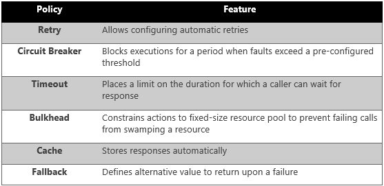
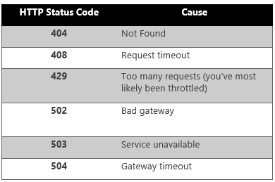
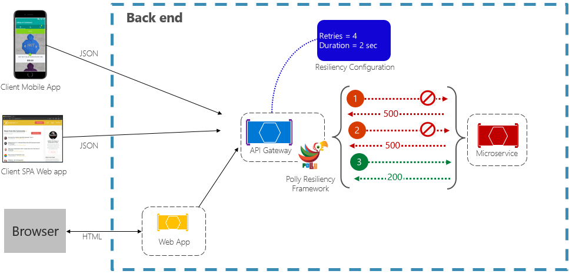
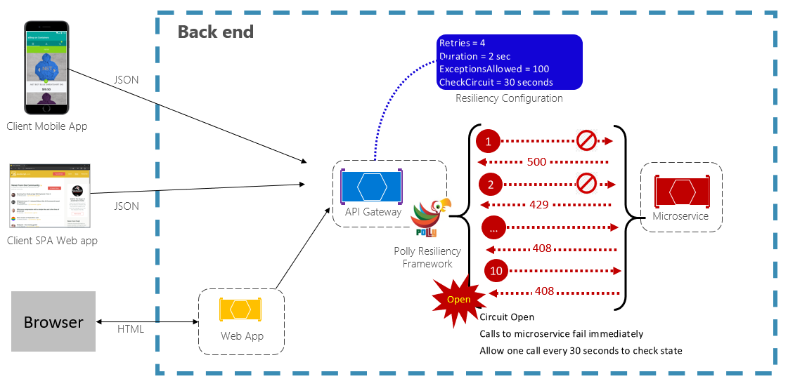

# Application resiliency patterns

[!INCLUDE [book-preview](../../../includes/book-preview.md)]

The first line of defense is software-enabled application resiliency. 

While you could invest considerable time writing your own resiliency framework, such products already exist. For example, [Polly](http://www.thepollyproject.org/) is a comprehensive .NET resilience and transient-fault-handling library that allows developers to express resiliency policies in a fluent and thread-safe manner. Polly targets applications built with either the full .NET Framework or .NET Core. Figure 6-2 shows the resiliency policies (that is, functionality) available from the Polly Library. These policies can be applied individually or combined together.

**Figure 6-2**. Polly resiliency framework features

Note how in the previous figure the resiliency policies apply to request messages, whether coming from an external client or another backend service. The goal is to compensate the request for a service that might be momentarily unavailable. These short interruptions typically manifest themselves with the HTTP status codes shown in Figure 6-3.

**Figure 6-3**. HTTP status codes to retry

Question: Would you retry an HTTP Status Code of 403 - Forbidden? No. Here, the system is functioning properly, but informing the caller that they aren't authorized to perform the requested operation. Care must be taken to retry only those operations caused by failures.

As recommended in Chapter 1, Microsoft developers constructing cloud-native applications should be targeting .NET Core. Version 2.1 introduced the [HTTPClientFactory](https://www.stevejgordon.co.uk/introduction-to-httpclientfactory-aspnetcore) library for creating HTTP Client instances for interacting with URL-based resources. Superseding the original HTTPClient class, the factory class supports many enhanced features, one of which is [tight integration](../../standard/microservices-architecture/implement-resilient-applications/implement-http-call-retries-exponential-backoff-polly.md) with the Polly resiliency library. With it, you can easily define resiliency policies in the application Startup class to handle partial failures and connectivity issues.

Next, let's expand on retry and circuit breaker patterns.

### Retry pattern

In a distributed cloud-native environment, calls to services and cloud resources can fail because of transient (short-lived) failures, which typically correct themselves after a brief period of time. Implementing a retry strategy helps a cloud-native service handle these scenarios.

The [Retry pattern](https://docs.microsoft.com/azure/architecture/patterns/retry) enables a service to retry a failed request operation a (configurable) number of times with an exponentially increasing wait time. Figure 6-4 shows a retry in action.

**Figure 6-4**. Retry pattern in action

In the previous figure, a retry pattern has been implemented for a request operation. It's configured to allow up to four retries before failing with a backoff interval (wait time) starting at two seconds, which exponentially doubles for each subsequent attempt.

- The first invocation fails and returns an HTTP status code of 500. The application waits for two seconds and reties the call.
- The second invocation also fails and returns an HTTP status code of 500. The application now doubles the backoff interval to four seconds and retries the call.
- Finally, the third call succeeds.
- In this scenario, the retry operation would have attempted up to four retries while doubling the backoff duration before failing the call.

It's important to increase the backoff period before retrying the call to allow the service time to self-correct. It's a best practice to implement an exponentially increasing backoff (doubling the period on each retry) to allow adequate correction time.

## Circuit breaker pattern

While the retry pattern can help salvage a request entangled in a partial failure, there are situations where failures can be caused by unanticipated events that will require longer periods of time to resolve. These faults can range in severity from a partial loss of connectivity to the complete failure of a service. In these situations, it's pointless for an application to continually retry an operation that is unlikely to succeed.

To make things worse, executing continual retry operations on a non-responsive service can move you into a self-imposed denial of service scenario where you flood your service with continual calls exhausting resources such as memory, threads and database connections, causing failure in unrelated parts of the system that use the same resources.

In these situations, it would be preferable for the operation to fail immediately and only attempt to invoke the service if it's likely to succeed.

The [Circuit Breaker pattern](https://docs.microsoft.com/azure/architecture/patterns/circuit-breaker) can prevent an application from repeatedly trying to execute an operation that's likely to fail. It also monitors the application with a periodic trial call to determine whether the fault has resolved. Figure 6-5 shows the Circuit Breaker pattern in action.

Figure 6-5. Circuit breaker pattern in action

In the previous figure, a Circuit Breaker pattern has been added to the original retry pattern. Note how after 10 failed requests, the circuit breakers opens and no longer allows calls to the service. The CheckCircuit value, set at 30 seconds, specifies how often the library allows one request to proceed to the service. If that call succeeds, the circuit closes and the service is once again available to traffic.

Keep in mind that the intent of the Circuit Breaker pattern is *different* than that of the Retry pattern. The Retry pattern enables an application to retry an operation in the expectation that it will succeed. The Circuit Breaker pattern prevents an application from doing an operation that is likely to fail. Often, an application will *combine* these two patterns by using the Retry pattern to invoke an operation through a circuit breaker. However, the retry logic should be sensitive to any exceptions returned by the circuit breaker and abandon retry attempts if the circuit breaker indicates that a fault isn't transient.

Application resiliency is a must for handling problematic requested operations. But, it's only half of the story. Next, we cover resiliency features available in the Azure cloud.

>[!div class="step-by-step"]
>[Previous](resiliency.md)
>[Next](infrastructure-resiliency-azure.md)
