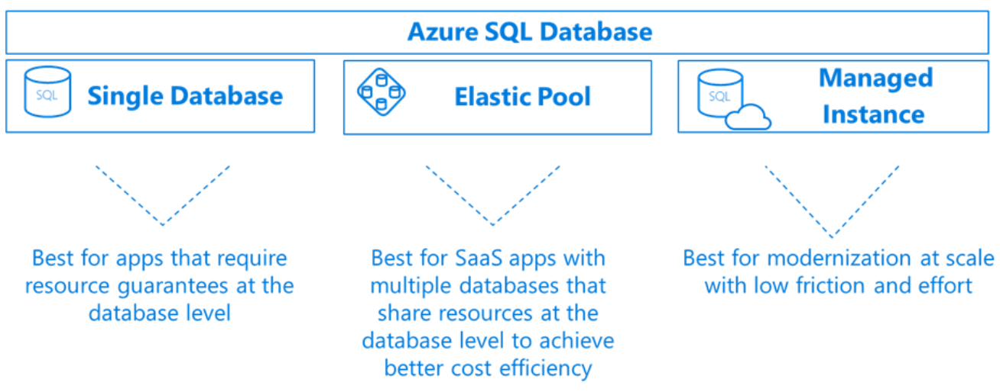
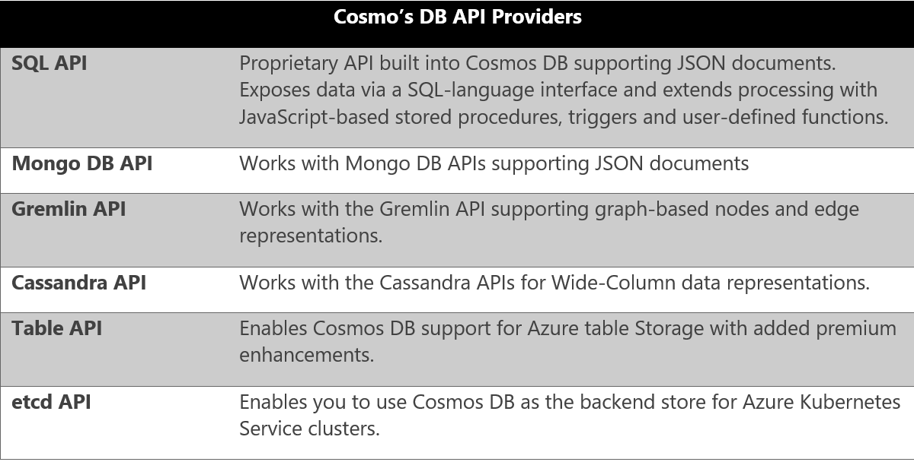
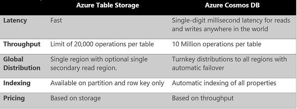
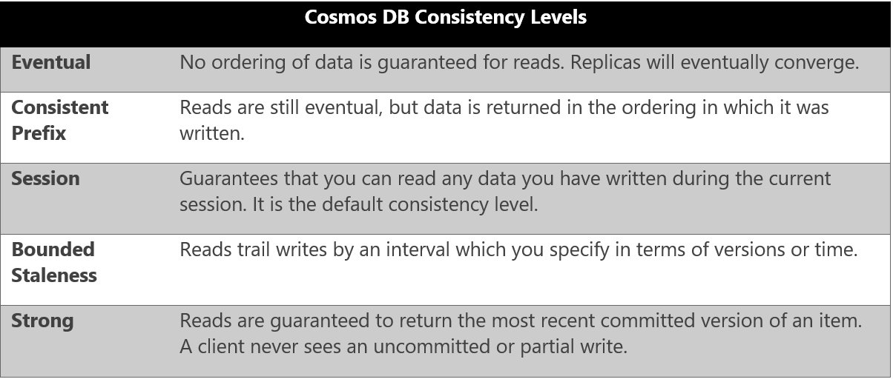
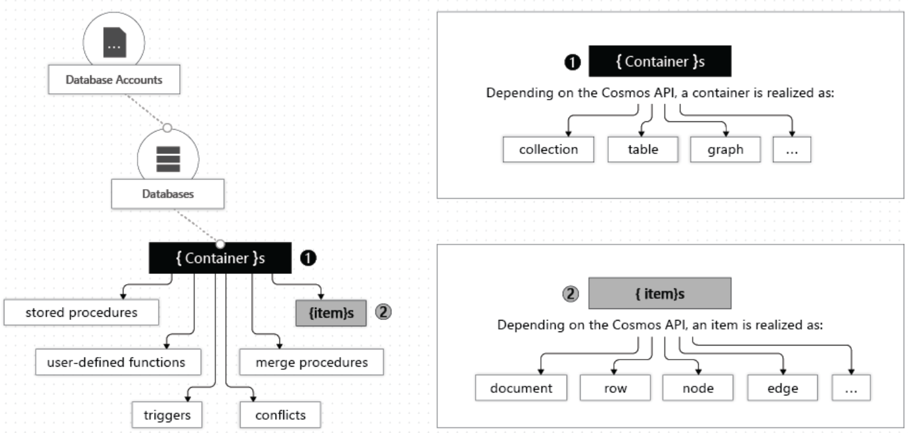
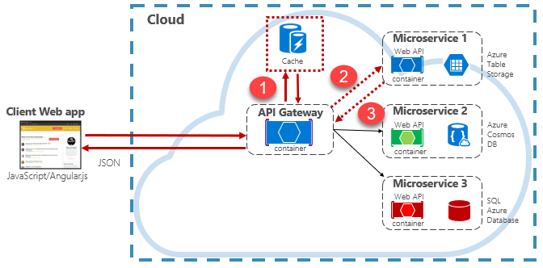

# Data storage in Azure

As we've seen throughout this book, the cloud is changing the way applications are designed, deployed and managed. When moving to the cloud, a critical question is how do you move your data? Fortunately, the Azure cloud offers many options.

You could simply provision an Azure virtual machine and install your database of choice.  This is known as [Infrastructure as a Service (IaaS)](https://www.techopedia.com/definition/141/infrastructure-as-a-service-iaas). This approach simplifies moving an on-premises database to the cloud, as-is, but shifts the burden of managing the virtual machine and the database to you.  

Instead, a fully-managed [Database as a Service (DBaaS)](https://www.stratoscale.com/blog/dbaas/what-is-database-as-a-service/) is a better option. You get many built-in features while the hosting, maintenance, and licensing is managed by Microsoft. Azure features a variety of fully-managed data storage options, each with specific benefits. They all support just-in-time capacity and a pay-as-you-go model.

We'll next look at DBaaS options available in Azure. You will see how Microsoft continues is commitment to keeping Azure an “open platform,” offering managed support for numerous open-source relational and NoSQL databases and making key contributions to the various open-source foundations as an active member.

## Azure SQL Database

[Azure SQL Database](https://docs.microsoft.com/azure/sql-database/) is a feature-rich, general-purpose relational database-as-a-service (DBaaS) based on the Microsoft SQL Server Database Engine. It's fully managed by Microsoft and is a high-performance, reliable, and secure cloud database. The service shares many of the features found in the on-premises version of SQL Server. 

You can provision a SQL Database server and database in minutes. When demand for your application grows from a handful of customers to millions, Azure SQL Database scales on-the-fly with minimal downtime. You can dynamically add or remove resources, including CPU power, memory, IO throughput, and storage allocated to your databases.

Figure 5-12 shows the deployment options for Azure SQL Database.

**Figure 5-12**. Azure SQL deployment options

Note the alternatives in the previous figure when deploying a SQL Database:

- A [Single database](https://docs.microsoft.com/azure/sql-database/sql-database-single-database) with its own set of resources managed by a [SQL Database server](https://docs.microsoft.com/azure/sql-database/sql-database-servers). A single database is similar to a [contained database](https://docs.microsoft.com/sql/relational-databases/databases/contained-databases) in an on-premises SQL Server deployment.

- An [Elastic pool](https://docs.microsoft.com/azure/sql-database/sql-database-elastic-pool) in which a collection of SQL Databases share a single SQL Database server at a set price. Single databases can be moved in and out of an elastic pool as needed to optimize the price performance for a group of databases.

- A [Managed Instance](https://docs.microsoft.com/azure/sql-database/sql-database-managed-instance) in which is a collection of system and user databases provide near-100% compatibility with an on-premises SQL Server. This option supports larger databases, up to 35 TB and is placed inside of an [Azure Virtual Network](https://docs.microsoft.com/azure/virtual-network/virtual-networks-overview) for better isolation.

Azure SQL Database is a fully managed [Platform as a Service (PaaS) Database Engine](https://docs.microsoft.com/azure/sql-database/sql-database-paas) which handles  upgrading, patching, backups, and monitoring without user involvement. It always runs the latest stable version of the SQL Server Database Engine and patched OS and guarantees 99.99% availability. One feature, [active geo-replication](https://docs.microsoft.com/azure/sql-database/sql-database-active-geo-replication), lets you create readable secondary databases in the same or a different Azure data center. Upon failure, a failover to a secondary database can be initiated. At that point, the other secondaries automatically link to the new primary. Up to four secondary replicas are supported in either the same or in different regions, and these secondaries can also be used for read-only access queries.

Azure SQL Database includes [built-in monitoring and intelligent tuning](https://docs.microsoft.com/azure/sql-database/sql-database-monitoring-tuning-index) features that can help you maximize performance and reduce operational costs. For example, the [Automatic Tuning](https://docs.microsoft.com/azure/sql-database/sql-database-automatic-tuning) feature provides continuous performance tuning based on AI and machine learning. The service learns from your running workloads and can apply tuning recommendations. The longer an Azure SQL Database runs with automatic tuning enabled, the better it performs.

[Azure SQL Database serverless](https://docs.microsoft.com/azure/sql-database/sql-database-serverless) (available for preview at time of the writing of this book) is a compute tier for single databases that automatically scales based on workload demand, and bills for the amount of compute used per second. The serverless compute tier also automatically pauses databases during inactive periods so that only storage charges are billed. It automatically resumes when activity returns.

Finally, there is the new [Azure SQL Database Hyperscale](https://azure.microsoft.com/services/sql-database/) pricing tier. It is powered by a highly scalable storage architecture and enables your database to grow as needed, eliminating the need to pre-provision storage resources. You can scale compute and storage resources independently, providing the flexibility to optimize performance for each workload. Azure SQL Database Hyperscale is optimized for [OLTP](https://en.wikipedia.org/wiki/Online_transaction_processing) processing and high throughput analytic workloads with storage up to 100TB.  With read-intensive workloads, Hyperscale provides rapid scale-out by provisioning additional read replicas as needed for offloading read workloads. 

In addition to the traditional Microsoft SQL Server stack, Azure also features managed versions of several popular open-source databases.

## Azure Database for MySQL

[MySQL](https://en.wikipedia.org/wiki/MySQL) is an [open-source](https://en.wikipedia.org/wiki/Open-source_software) [relational database](https://en.wikipedia.org/wiki/Relational_database_management_system). It is a component in the [LAMP software stack](https://en.wikipedia.org/wiki/LAMP_(software_bundle)) and used by many large organizations, including Facebook, Twitter and You Tube. The community edition is available for free and the enterprise edition requires a license purchase. Originally created in 1995, the product was purchased by Sun Microsystems in 2008, which was acquired by Oracle in 2010.

[Azure Database for MySQL](https://azure.microsoft.com/services/mysql/) is a fully-managed, enterprise-ready relational database service based on the open-source MySQL Server engine. Implementing the MySQL Community edition, it includes the following Platform as a Service (PaaS) capabilities at no additional cost:

- Built-in [high availability](https://docs.microsoft.com/azure/mysql/concepts-high-availability).

- Predictable performance, using inclusive [pay-as-you-go pricing](https://docs.microsoft.com/azure/mysql/concepts-pricing-tiers). 

- [Scale](https://docs.microsoft.com/azure/mysql/concepts-high-availability) as needed within seconds.

- Secured to protect sensitive data at-rest and in-motion.

- [Automatic backups](https://docs.microsoft.com/azure/mysql/concepts-backup) and [point-in-time-restore](https://docs.microsoft.com/azure/mysql/concepts-backup) for up to 35 days.

- Enterprise-grade security and compliance.

These built-in PaaS features are important for organizaitons who have hundreds of “tactical" (non-strategic) databases in their data centers, but do not have the resources to perform patching, backup, security, and performance monitoring. 

Additionally, the [Azure Data Migration Service](https://azure.microsoft.com/services/database-migration/) can migrate data from multiple database sources to Azure Data platforms with minimal downtime. The service generates assessment reports and provide recommendations to guide you through the changes required to performing a migration, both small or large.

The managed [Azure MySQL server](https://docs.microsoft.com/azure/mysql/concepts-servers) is the central administrative point for the service. It is the same MySQL server engine used for on-premises deployments. With it, you can create a single database per server to consume all resources or create multiple databases per server to share resources. Your team can continue to develop applications with the open-source tools and platform of your choice without having to learn new skills or manage virtual machines and infrastructure.

## Azure Database for MariaDB

[MariaDB](https://mariadb.com/) Server is another popular open-source database server. It was created as a fork of MySQL by the original developers of MySQL at the time that Oracle purchased Sun Microsystems who owned MySQL. The intent was to ensure that MariaDB remained open-source.

Since MariaDB is a [fork of MySQL](https://blog.panoply.io/a-comparative-vmariadb-vs-mysql), the data and table definitions are compatible, and the client protocols, structures, and APIs, are close-knit. MySQL data connectors will work MariaDB without modification.

MariaDB has a strong following and is used by many large enterprises. While Oracle continues to maintain, enhance and support MySQL, MariaDB is managed by the MariaDB Foundation allowing public contributions to the product and documentation.

[Azure Database for MariaDB](https://azure.microsoft.com/services/mariadb/) is a fully-managed database as a service in the Azure cloud. It is based on the [MariaDB community edition](https://mariadb.org/download/) server engine. It can handle mission-critical workloads with predictable performance and dynamic scalability. Similar to the other Azure Database platforms, it includes many Platform-as-a-Service capabilities at no additional cost:

- Built-in [high availability](https://docs.microsoft.com/azure/mariadb/concepts-high-availability).

- Predictable performance, using inclusive [pay-as-you-go pricing](https://docs.microsoft.com/azure/mariadb/concepts-pricing-tiers). 
 
- [Scaling](https://docs.microsoft.com/azure/mariadb/concepts-high-availability) as needed within seconds.

- Secured protection of sensitive data at rest and in-motion.

- [Automatic backups](https://docs.microsoft.com/azure/mariadb/concepts-backup) and [point-in-time-restore](https://docs.microsoft.com/azure/mariadb/concepts-backup) for up to 35 days.

- Enterprise-grade security and compliance.

## Azure Database for PostgreSQL 

[PostgreSQL](https://www.postgresql.org/) is another popular, open-source relational database with over 30 years of active development. It is a general purpose and object-relational database management system. Its licensing is considered to be “liberal” and the product is free to use, modify, and distribute in any form. Many large enterprises including Apple, Red Hat, and Fujitsu have built products using PostgreSQL.

[Azure Database for PostgreSQL](https://azure.microsoft.com/services/postgresql/) is a fully-managed relational database service, based on the open-source Postgres database engine. It can handle mission-critical workloads with predictable performance, security, high availability, and dynamic scalability. It supports several open source frameworks and languages—including C++, Java, Python, Node, C\#, and PHP. It enables [migration](https://datamigration.microsoft.com/scenario/postgresql-to-azurepostgresql?step=1) of PostgreSQL databases through a command line interface or the [Azure Data Migration Service](https://azure.microsoft.com/services/database-migration/).

The service includes [built-in intelligence](https://docs.microsoft.com/azure/postgresql/concepts-monitoring) that studies your unique database patterns and provides customized recommendations and insights to help you maximize the performance of your PostgreSQL database. [Advanced Threat Protection](https://docs.microsoft.com/azure/postgresql/concepts-data-access-and-security-threat-protection) monitors your database around the clock and detects potential malicious activities, alerting you upon detection so you can intervene right away.

Azure Database for PostgreSQL is available as two deployment options: Single Server and Hyperscale (Citus), available for preview at time of the writing of this book

- The [Single Server](https://docs.microsoft.com/azure/postgresql/concepts-servers) deployment option is a central administrative point for multiple databases. It is the same PostgreSQL server engine available for on-premises deployments. With it, you can create a single database per server to consume all resources or create multiple databases to share the resources. The pricing is structured per-server based upon cores and storage.

- The [Hyperscale (Citus) option](https://azure.microsoft.com/blog/get-high-performance-scaling-for-your-azure-database-workloads-with-hyperscale/) is powered by [Citus Data](https://www.citusdata.com/) technology. It enables high-performance scaling by horizontally scaling a single database across hundreds of nodes to deliver blazingly fast performance and scale. This option allows the engine to fit more data in memory, parallelize queries across hundreds of nodes, and index data faster. The Hyperscale feature is compatible with the latest innovations, versions, and tools for PostgreSQL, so you can leverage your existing PostgreSQL expertise.

## Cosmos DB

Azure Cosmos DB is a fully-managed, globally distributed NoSQL database service that's designed to provide low latency, elastic scalability, managed data consistency, and high availability. In short, if your application needs guaranteed fast response time anywhere in the world, if it's required to be always online and needs unlimited and elastic scalability of throughput and storage, Cosmos DB is a great choice. Figure 5-13 shows a high-level overview of Cosmos DB.

**Figure 5-13**: Overview of Cosmos DB

Note in the Figure 5-13 how Cosmos DB is a robust and highly-versatile database service with many built-in cloud-native capabilities. In this section, we’ll take a closer look at them.

### Global Support

You can globally distribute Cosmos databases across all Azure regions across the world, placing data close to your users, improving response time, and reducing latency. You can add or remove a database from a region without pausing or redeploying your application. In the background, Cosmos DB transparently replicates the data to all of the configured regions.

Cosmos DB supports [active/active](https://kemptechnologies.com/white-papers/unfog-confusion-active-passive-activeactive-load-balancing/) clustering at the global level, enabling you to configure any or all your database regions to support both writes and reads.

The [Multi-Master](https://docs.microsoft.com/azure/cosmos-db/how-to-multi-master) protocol feature in Cosmos DB enables the following functionality:

- Unlimited elastic write and read scalability.

- 99.999% read and write availability all around the world.

- Guaranteed reads and writes served in less than 10 milliseconds at the 99th percentile.

Internally, Cosmos DB handles data replication between regions with consistency level guarantees and financially backed service level agreements.

With the Cosmos DB [Multi-Homing APIs](https://docs.microsoft.com/azure/cosmos-db/distribute-data-globally), your application can automatically become aware of the nearest Azure region and send requests to it. The nearest region is identified by Cosmos DB without any configuration changes. Should a region become unavailable, Cosmos DB supports automatic failover, and the Multi-Homing feature will automatically route your request to the next nearest available region.

### Multi-Model Support

Cosmos DB is a *multi-model data platform* enabling you to interact with your data using a number of supported NoSQL models, including documents, key-value pairs, wide-column, and graph representations. Internally, data is stored in a simple [struct](https://docs.microsoft.com/dotnet/csharp/programming-guide/classes-and-structs/using-structs) format made up of primitive data types, including strings, bools, and numbers. For each request, the database engine translates data into the model representation you have selected. You can choose from a proprietary Cosmos DB SQL-based API or any of the [compatibility APIs](https://www.wikiwand.com/en/Cosmos_DB) shown in Figure 5-14.

**Figure 5-14**: Cosmos DB providers

Note in Figure 5-14 how Cosmos DB supports [Table Storage](https://azure.microsoft.com/services/storage/tables/). Both Cosmos DB and [Azure Table Storage](https://docs.microsoft.com/azure/cosmos-db/table-storage-overview) share the same underlying table model and expose many of the same table operations. However, the [Cosmos DB Table API](https://docs.microsoft.com/azure/cosmos-db/table-introduction) provides many premium enhancements not available in the Azure Storage API. These features are contrasted in Figure 5-15.

**Figure 5-15**: Azure Table API

Applications written for Azure Table storage can migrate to Azure Cosmos DB by using the Table API with no code changes.

In [Brownfield}(https://en.wikipedia.org/wiki/Brownfield_(software_development) application scenarios, development teams can migrate existing Mongo, Gremlin, or Cassandra databases into Cosmos DB with minimal changes to the existing data or application code. For [Greenfield](https://en.wikipedia.org/wiki/Greenfield_project) scenarios, development teams can choose the data model that best meets their requirements and preferences, including fully-supported open-source options for the MongoDB, Cassandra, and Gremlin platforms.

### Consistency Models

Earlier in the *Relational vs. NoSQL* section, we discussed the subject of *data consistency*, which is a term that refers to the integrity of your data. Distributed databases that rely on replication for high availability, low latency, or both, must make a fundamental tradeoff between read consistency, availability, and latency.

Most distributed databases allow developers to choose between two consistency models: [strong consistency](https://en.wikipedia.org/wiki/Strong_consistency) and [eventual consistency](https://en.wikipedia.org/wiki/Eventual_consistency). *Strong consistency* is the gold standard of data programmability. It guarantees that a query result will always return the most current data, even if it the system must incur latency waiting for an update to replicate across all database copies. On the other hand, a system configured for *eventual consistency* will return data immediately, even if that data is not the most current copy. This option enables higher availability, greater scale, and increased performance.

Azure Cosmos DB offers a spectrum of [five well-defined consistency models](https://docs.microsoft.com/azure/cosmos-db/consistency-levels) shown in Figure 5-16. These options enable you to make precise choices and granular tradeoffs with respect to availability and performance based on the needs of your application. These models are well-defined, intuitive, and backed by the service level agreements (SLAs). 

**Figure 5-16**: Cosmos DB Consistency Levels

### Partitioning

Azure Cosmos DB uses automatic [partitioning](https://docs.microsoft.com/azure/cosmos-db/partitioning-overview) to scale the database to meet the performance needs of your application. 

You manage data in Cosmos DB data by creating [databases, containers and items](https://docs.microsoft.com/azure/cosmos-db/databases-containers-items), shown in Figure 5-17.

**Figure 5-17**: Hierarchy of Cosmos DB entities

Note in Figure 5-17 how you start by creating a Cosmos DB database inside of an Azure account. That database becomes the unit of management for a set of containers. A container is a schema-agnostic grouping of items that can be expressed as a collection, table or graph, based on your selected API provider (discussed in the prior section). Items are the data that you add to the container and are represented as documents, rows, nodes, or edges. By default, all items that you add to a container are automatically indexed without requiring explicit index or schema management.

To partition the container, items are divided into distinct subsets called [logical partitions](https://docs.microsoft.com/azure/cosmos-db/partition-data). Logical partitions are created based on the value of a partition key that is associated with each item in a container. Figure 5-18 shows how all items in a logical partition have the same partition key value.

**Figure 5-18**: Cosmos DB partitioning mechanics

Note in Figure 5-18 how each item includes a partition key of either ‘city’ or ‘airport’. This partition key determines the item’s logical partition. Each city code is assigned to a logical partition in the container on the left-side and those with an airport code to the container on the right. Combining the partition key value with an item's ID value creates the item's index, which uniquely identifies the item.

Internally, Cosmos DB automatically manages the placement of [logical partitions](https://docs.microsoft.com/azure/cosmos-db/partition-data) on [physical partitions](https://docs.microsoft.com/azure/cosmos-db/partition-data) to efficiently satisfy the scalability and performance needs of the container. As the throughput and storage requirements of an application increase, Azure Cosmos DB moves logical partitions to redistribute the load across a greater number of servers. These redistribution operations are managed by Cosmos DB and are performed without any interruption or downtime.

## Azure Redis Cache

The benefits of caching to improve performance and scalability are well understood. 

For a cloud native application, a common location to add caching is inside the API Gateway. The gateway serves as a front-end for all incoming requests. By adding caching, you can increase performance and responsiveness by returning cached data and avoiding round-trips to a local database or downstream service. Figure 5-19 shows a caching architecture for a cloud-native application.

**Figure 5-19**: Caching in a cloud native app

A common caching pattern is the [cache-aside pattern](https://docs.microsoft.com/azure/architecture/patterns/cache-aside). For an incoming request, you first query the cache for the response, shown in step #1 in Figure 5-19. If found, the data is returned immediately. If the data does not exist in the cache (known as a [cache miss](https://www.techopedia.com/definition/6308/cache-miss)), it is retrieved from the local database or downstream service (step #2), written to the cache for future requests (step #3), and returned to the caller. Care must be taken to periodically evict cached data so that the system remains consistent and accurate.

Additionally, note in Figure 5-19 how the cache is not implemented locally within the boundaries of the service, but instead is consumed as a cloud-based backing service, as discussed in Chapter 1.

[Azure Redis Cache](https://azure.microsoft.com/services/cache/) is a data caching and messaging broker service. It provides high throughput and low-latency access to data for applications. It is fully-managed by Microsoft, hosted within Azure, and accessible to any application within or outside of Azure.

Internally, Azure Cache for Redis is backed by the open-source [Redis server](https://redis.io/) and natively supports data structures such as [strings](http://redis.io/topics/data-types#strings), [hashes](http://redis.io/topics/data-types#hashes), [lists](http://redis.io/topics/data-types#sets), [sets](http://redis.io/topics/data-types#sets), and [sorted sets](http://redis.io/topics/data-types#sorted-sets). If your application uses Redis, it’ll work as-is with Azure Cache for Redis.

Azure Cache for Redis can also be used as an in-memory data cache, a distributed non-relational database, and a message broker. It is available in 3 different pricing tiers. The Premium tier features many enterprise-level features such as clustering, data persistence, geo-replication, and Virtual-network security and isolation.

## Summary

With the introduction behind, we now dive into a much more detailed look at cloud native.

### References

- [RDBMSs vs. NoSQL Databases: Overview](https://maxivak.com/rdbms-vs-nosql-databases/)

- [Why isn't RDBMS Partition Tolerant in CAP Theorem and why is it Available?](https://stackoverflow.com/questions/36404765/why-isnt-rdbms-partition-tolerant-in-cap-theorem-and-why-is-it-available)

- 

>[!div class="step-by-step"]
>[Previous](data-patterns.md)
>[Next](resiliency.md) <!-- Next Chapter -->
