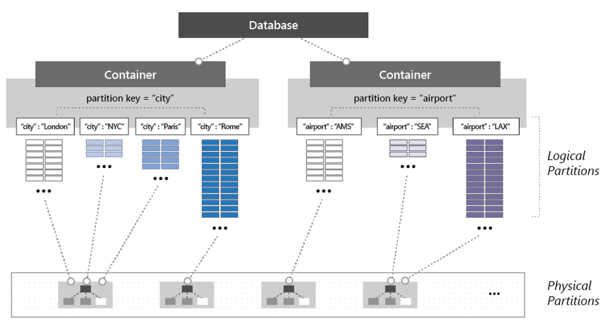

# Data storage in Azure

As we've seen in this book, the cloud has changed the way applications are designed, deployed, and managed. But, when moving to the cloud, how do you store and manage data? Fortunately, the Azure cloud offers many options.

You could easily provision an Azure virtual machine and install your database of choice. But, you'd forgo many cloud features and would be responsible for managing that virtual machine and database.
    
Instead, a fully managed [Database as a Service (DBaaS)](https://www.stratoscale.com/blog/dbaas/what-is-database-as-a-service/) is often a better option. You get many built-in cloud features while the hosting, maintenance, and licensing are managed by the vendor, Microsoft. Azure features different kinds of managed data storage options, each with specific benefits. They all support just-in-time capacity and a pay-as-you-go model.

We'll next look at relational DBaaS options available in Azure. You'll see that Microsoft's flagship SQL Server database is available along with several open-source options. Then, we'll talk about the ever-popular NoSQL data in Azure.

## Azure SQL Database

[Azure SQL Database](https://docs.microsoft.com/azure/sql-database/) is a feature-rich, general-purpose relational database-as-a-service (DBaaS) based on the Microsoft SQL Server Database Engine. It's fully managed by Microsoft and is a high-performance, reliable, and secure cloud database. The service shares many of the features found in the on-premises version of SQL Server. 

You can provision a SQL Database server and database in minutes. When demand grows from a handful of customers to millions, Azure SQL Database scales on-the-fly with minimal downtime. You can dynamically change resources such as CPU, memory, IO throughput, or storage consumed by your databases.

Figure 5-12 shows the deployment options for Azure SQL Database.

**Figure 5-12**. Azure SQL deployment options

In the previous figure, we see three ways to deploy Azure SQL Database:

- A [Single Database](https://docs.microsoft.com/azure/sql-database/sql-database-single-database) represents a fully managed, isolated database with its own set of resources, managed by a [SQL Database server](https://docs.microsoft.com/azure/sql-database/sql-database-servers). A single database is similar to a [contained database](https://docs.microsoft.com/sql/relational-databases/databases/contained-databases) in an on-premises SQL Server deployment.

- An [Elastic pool](https://docs.microsoft.com/azure/sql-database/sql-database-elastic-pool) is a collection of SQL Databases that *share* a set of resources, such as CPU and memory - at a set price. Single databases can be moved in and out of an elastic pool as needed to optimize the price performance of the  group.

- A [Managed Instance](https://docs.microsoft.com/azure/sql-database/sql-database-managed-instance) is a fully managed instance of the Microsoft SQL Server Database Engine and can contain a set of databases. This option provides near-100% compatibility with an on-premises SQL Server. This option supports larger databases, up to 35 TB and is placed in an [Azure Virtual Network](https://docs.microsoft.com/azure/virtual-network/virtual-networks-overview) for better isolation.

Azure SQL Database Server is a fully managed Platform as a Service (PaaS) Database Engine. The service manages tasks such as upgrades, patching, backups, and monitoring without user involvement. It runs the latest stable version of the SQL Server Database Engine and patched OS and guarantees 99.99% availability. 

The [active geo-replication](https://docs.microsoft.com/azure/sql-database/sql-database-active-geo-replication) feature lets you create readable secondary databases in the same or a different Azure data center. A failover to a secondary database can be started if a failure should take place. At that point, the other secondaries automatically link to the new primary. Up to four secondary replicas are supported in either the same or in different regions, and these secondaries can also be used for read-only access queries.

Azure SQL Database includes [built-in monitoring and intelligent tuning](https://docs.microsoft.com/azure/sql-database/sql-database-monitoring-tuning-index). These features can help you maximize performance and reduce operational costs. The [Automatic Tuning](https://docs.microsoft.com/azure/sql-database/sql-database-automatic-tuning) feature provides continuous performance adjustments based on AI and machine learning. The service learns from your running workloads and can apply tuning recommendations. The longer an Azure SQL Database runs with automatic tuning enabled, the better it performs.

[Azure SQL Database serverless](https://docs.microsoft.com/azure/sql-database/sql-database-serverless) (available for preview at time of the writing of this book) is a compute tier for single databases that automatically scales based on workload demand, and bills for the amount of compute used per second. The serverless compute tier also automatically pauses databases during inactive periods so that only storage charges are billed. It automatically resumes when activity returns. 

Finally, there's the new [Azure SQL Database Hyperscale](https://azure.microsoft.com/services/sql-database/) pricing tier. It's powered by a highly scalable storage architecture and enables your database to grow as needed, eliminating the need to pre-provision storage resources. You can scale compute and storage resources independently, providing the flexibility to optimize performance for each workload. Azure SQL Database Hyperscale is optimized for [OLTP](https://en.wikipedia.org/wiki/Online_transaction_processing) processing and high throughput analytic workloads with storage up to 100 TB.  With read-intensive workloads, Hyperscale provides rapid scale-out by provisioning additional read replicas as needed for offloading read workloads. 

Beyond the traditional Microsoft SQL Server stack, Azure also features managed versions of several popular open-source databases.

## Open-source databases in Azure

Open source relational databases have become a popular choice for cloud native applications. Many enterprises favor them over commercial products, especially for cost savings and to avoid "vendor lock-in." 

Microsoft continues its commitment to keeping Azure an “open platform” by offering several popular open-source databases.
  
Developers can easily self-host any open-source database on an Azure VM. While providing full control, this approach puts you on the hook for the management, monitoring, and maintenance of the database and VM.

Instead, Azure offers managed DBaaS options for several open-source relational databases. They're built upon the same proven fabric and infrastructure of Azure SQL Db and provide many key Platforms as a Service (PaaS) capabilities at no additional cost:

- Built-in [high availability](https://docs.microsoft.com/azure/mysql/concepts-high-availability).

- Predictable performance, using inclusive [pay-as-you-go pricing](https://docs.microsoft.com/azure/mysql/concepts-pricing-tiers). 

- [Vertical Scale](https://docs.microsoft.com/azure/mysql/concepts-high-availability) as needed within seconds.

- Monitoring and alerting to quickly assess the impact of scaling.

- [Automatic backups](https://docs.microsoft.com/azure/mysql/concepts-backup) and [point-in-time-restore](https://docs.microsoft.com/azure/mysql/concepts-backup) for up to 35 days.

- Enterprise-grade security to protect sensitive data at-rest and in-motion.

These built-in features are especially important to organizations who have large numbers of databases and limited resources for administering them. 

You can provision an open-source database server in one of three different pricing tiers: Basic, General Purpose, and Memory Optimized. The tiers are differentiated by the amount of processing cores, memory, and underlying storage technology. All resources are provisioned at the database server level. A server can have one to many databases.

| Pricing tier | Target workloads  |
| :-------- | :-------- |
| Basic | Workloads that require light compute and I/O performance. Examples include servers used for development or testing or small-scale infrequently used applications. |
| General Purpose | Most business workloads that require balanced compute and memory with scalable I/O throughput. Examples include servers for hosting web and mobile apps and other enterprise applications. |
| Memory Optimized | High-performance database workloads that require in-memory performance for faster transaction processing and higher concurrency. Examples include servers for processing real-time data and high-performance transactional or analytical apps. |

### Azure Database for MySQL

[MySQL](https://en.wikipedia.org/wiki/MySQL) is an open-source relational database and a pillar for applications built on the [LAMP software stack](https://en.wikipedia.org/wiki/LAMP_(software_bundle)). It's used by many large organizations, including Facebook, Twitter, and You Tube. The community edition is available for free, while the enterprise edition requires a license purchase. Originally created in 1995, the product was purchased by Sun Microsystems in 2008. Oracle acquired Sun and MySQL in 2010.

[Azure Database for MySQL](https://azure.microsoft.com/services/mysql/) is a managed relational database service based on the open-source MySQL Server engine. It uses the MySQL Community edition. The [Azure MySQL server](https://docs.microsoft.com/azure/mysql/concepts-servers) is the central administrative point for the service. It's the same MySQL server engine used for on-premises deployments. The engine can create a single database per server or multiple databases per server that share resources. You can continue to manage data using the same open-source tools without having to learn new skills or manage virtual machines.

### Azure Database for MariaDB

[MariaDB](https://mariadb.com/) Server is another popular open-source database server. It was created as a *fork* of MySQL when Oracle purchased Sun Microsystems, who owned MySQL. The intent was to ensure that MariaDB remained open-source.

As MariaDB is a [fork of MySQL](https://blog.panoply.io/a-comparative-vmariadb-vs-mysql), the data and table definitions are compatible, and the client protocols, structures, and APIs, are close-knit. MySQL data connectors will work MariaDB without modification.

MariaDB has a strong community and is used by many large enterprises. While Oracle continues to maintain, enhance, and support MySQL, the MariaDB foundation manages MariaDB, allowing public contributions to the product and documentation.

[Azure Database for MariaDB](https://azure.microsoft.com/services/mariadb/) is a fully managed relational database as a service in the Azure cloud. The service is based on the [MariaDB community edition](https://mariadb.org/download/) server engine. It can handle mission-critical workloads with predictable performance and dynamic scalability.

### Azure Database for PostgreSQL 

[PostgreSQL](https://www.postgresql.org/) is a third open-source relational database with over 30 years of active development. It's a general purpose and object-relational database management system. The product has “liberal” licensing and is free to use, modify, and distribute in any form. Many large enterprises including Apple, Red Hat, and Fujitsu have built products using PostgreSQL.

[Azure Database for PostgreSQL](https://azure.microsoft.com/services/postgresql/) is a fully managed relational database service, based on the open-source Postgres database engine. The service can manage mission-critical workloads with predictable performance, security, high availability, and dynamic scalability. The service supports many development platforms, including C++, Java, Python, Node, C\#, and PHP. It enables [migration](https://datamigration.microsoft.com/scenario/postgresql-to-azurepostgresql?step=1) of PostgreSQL databases through a command-line interface or the [Azure Data Migration Service](https://azure.microsoft.com/services/database-migration/).

The service includes [built-in intelligence](https://docs.microsoft.com/azure/postgresql/concepts-monitoring) features that study your unique database patterns. It then provides customized recommendations and insights to help you maximize the performance of your PostgreSQL database. [Advanced Threat Protection](https://docs.microsoft.com/azure/postgresql/concepts-data-access-and-security-threat-protection) monitors your database around the clock, detects potential malicious activities, and alerts you upon detection so you can intervene right away.

Azure Database for PostgreSQL is available as two deployment options: Single Server and Hyperscale (Citus), available for preview at time of the writing of this book:

- The [Single Server](https://docs.microsoft.com/azure/postgresql/concepts-servers) deployment option is a central administrative point for multiple databases. It's the same PostgreSQL server engine available for on-premises deployments. With it, you can create a single database per server to consume all resources or create multiple databases to share resources. The pricing is structured per-server based upon cores and storage.

- The [Hyperscale (Citus) option](https://azure.microsoft.com/blog/get-high-performance-scaling-for-your-azure-database-workloads-with-hyperscale/) is powered by [Citus Data](https://www.citusdata.com/) technology. It enables high performance by horizontally scaling a single database across hundreds of nodes to deliver blazingly fast performance and scale. This option allows the engine to fit more data in memory, parallelize queries across hundreds of nodes, and index data faster. The Hyperscale feature is compatible with the latest innovations, versions, and tools for PostgreSQL enabling you to leverage your existing PostgreSQL expertise.

### Data migration to Azure

One of the more time consuming tasks is migrating data from one data platform to another. The [Azure Data Migration Service](https://azure.microsoft.com/services/database-migration/) can help expedite such efforts. It can migrate data from several external database sources into Azure Data platforms with minimal downtime. Target platforms include the following services:

- Azure Sql Database
- Azure Database for MySQL
- Azure Database for MariaDB
- Azure Database for PostgreSQL
- CosmosDB
  
The service provides recommendations to guide you through the changes required to execute a migration, both small or large.

## Cosmos DB

Azure Cosmos DB is a fully managed, globally distributed NoSQL database service. It's designed to provide low latency, elastic scalability, managed data consistency, and high availability. If your application requires fast response time anywhere in the world, high availability, and elastic scalability for throughput and storage, Cosmos DB is a great choice. Figure 5-13 shows a high-level overview of Cosmos DB.

**Figure 5-13**: Overview of Cosmos DB

Figure 5-13 highlights many of the built-in cloud-native capabilities available in Cosmos DB. In this section, we’ll take a closer look at them.

### Global Support

You can globally distribute Cosmos databases across regions around the world, placing data close to your users, improving response time, and reducing latency. You can add or remove a database from a region without pausing or redeploying your application. In the background, Cosmos DB transparently replicates the data to all of the configured regions.

Cosmos DB supports [active/active](https://kemptechnologies.com/white-papers/unfog-confusion-active-passive-activeactive-load-balancing/) clustering at the global level, enabling you to configure any or all your database regions to support both writes and reads.

The [Multi-Master](https://docs.microsoft.com/azure/cosmos-db/how-to-multi-master) protocol feature in Cosmos DB enables the following functionality:

- Unlimited elastic write and read scalability.

- 99.999% read and write availability all around the world.

- Guaranteed reads and writes served in less than 10 milliseconds at the 99th percentile.

Internally, Cosmos DB handles data replication between regions with consistency level guarantees and financially backed service level agreements.

With the Cosmos DB [Multi-Homing APIs](https://docs.microsoft.com/azure/cosmos-db/distribute-data-globally), your application can automatically become aware of the nearest Azure region and send requests to it. The nearest region is identified by Cosmos DB without any configuration changes. Should a region become unavailable, the Multi-Homing feature will automatically route requests to the next nearest available region.

### Multi-Model Support

Cosmos DB is a *multi-model data platform* that enables you to interact with data using different kinds of NoSQL models. These include documents, key-value pairs, wide-column, and graph representations. Internally, data is stored in a simple [struct](https://docs.microsoft.com/dotnet/csharp/programming-guide/classes-and-structs/using-structs) format made up of primitive data types, including strings, booleans, and numbers. For each request, the database engine translates data into the model representation you've selected. You can choose from a proprietary Cosmos DB SQL-based API or any of the [compatibility APIs](https://www.wikiwand.com/en/Cosmos_DB) shown in Figure 5-14.

**Figure 5-14**: Cosmos DB providers

Note in Figure 5-14 how Cosmos DB supports [Table Storage](https://azure.microsoft.com/services/storage/tables/). Both Cosmos DB and [Azure Table Storage](https://docs.microsoft.com/azure/cosmos-db/table-storage-overview) share the same underlying table model and expose many of the same table operations. However, the [Cosmos DB Table API](https://docs.microsoft.com/azure/cosmos-db/table-introduction) provides many premium enhancements not available in the Azure Storage API. These features are contrasted in Figure 5-15.

**Figure 5-15**: Azure Table API

Applications written for Azure Table storage can migrate to Azure Cosmos DB by using the Table API. No code changes are required.

Development teams can migrate existing Mongo, Gremlin, or Cassandra databases into Cosmos DB with minimal changes to data or code. For new apps, development teams can choose among open-source options for MongoDB, Cassandra, or Gremlin, or the built-in SQL API model.

### Consistency Models

Earlier in the *Relational vs. NoSQL* section, we discussed the subject of *data consistency*. Data consistency refers to the integrity of your data. Distributed databases that rely on replication for high availability, low latency, or both, must make a fundamental tradeoff between read consistency, availability, and latency.

Most distributed databases allow developers to choose between two consistency models: [strong consistency](https://en.wikipedia.org/wiki/Strong_consistency) and [eventual consistency](https://en.wikipedia.org/wiki/Eventual_consistency). *Strong consistency* is the gold standard of data programmability. It guarantees that a query will always return the most current data - even if the system must incur latency waiting for an update to replicate across all database copies. Whereas a system configured for *eventual consistency* will return data immediately, even if that data isn't the most current copy. This option enables higher availability, greater scale, and increased performance.

Azure Cosmos DB offers a spectrum of [five well-defined consistency models](https://docs.microsoft.com/azure/cosmos-db/consistency-levels) shown in Figure 5-16. These options enable you to make precise choices and granular tradeoffs with respect to availability and performance for your application. These models are well-defined, intuitive, and backed by the service level agreements (SLAs). 

**Figure 5-16**: Cosmos DB Consistency Levels

### Partitioning

Azure Cosmos DB uses automatic [partitioning](https://docs.microsoft.com/azure/cosmos-db/partitioning-overview) to scale the database to meet the performance needs of your application. 

You manage data in Cosmos DB data by creating [databases, containers, and items](https://docs.microsoft.com/azure/cosmos-db/databases-containers-items), shown in Figure 5-17.

**Figure 5-17**: Hierarchy of Cosmos DB entities

In your Azure account, you start by creating a database inside a Cosmos DB database account. That database becomes the unit of management for a set of containers. A container is a schema-agnostic grouping of items expressed as a collection, table, or graph. The items are the data that you add to the container. They're represented as documents, rows, nodes, or edges. All items added to a container are automatically indexed without requiring explicit index or schema management.

To partition the container, items are divided into distinct subsets called [logical partitions](https://docs.microsoft.com/azure/cosmos-db/partition-data). Logical partitions are populated based on the value of a partition key that is associated with each item in a container. Figure 5-18 shows two containers each with a logical partition based on a partition key value.

**Figure 5-18**: Cosmos DB partitioning mechanics

In Figure 5-18, each item includes a partition key of either ‘city’ or ‘airport’. The key determines the item’s logical partition. Items with a city code are assigned to the container on the left, and items with an airport code, to the container on the right. Combining the partition key value with the ID value creates an item's index, which uniquely identifies the item.

Internally, Cosmos DB automatically manages the placement of [logical partitions](https://docs.microsoft.com/azure/cosmos-db/partition-data) on [physical partitions](https://docs.microsoft.com/azure/cosmos-db/partition-data) to satisfy the scalability and performance needs of the container. As application throughput and storage requirements  increase, Azure Cosmos DB redistributes logical partitions across a greater number of servers. Redistribution operations are managed by Cosmos DB and invoked without interruption or downtime.

## Azure Redis Cache

The benefits of caching to improve performance and scalability are well understood. 

For a cloud native application, a common location to add caching is inside the API Gateway. The gateway serves as a front end for all incoming requests. By adding caching, you can increase performance and responsiveness by returning cached data and avoiding round-trips to downstream services. Figure 5-19 shows a caching architecture for a cloud-native application.

**Figure 5-19**: Caching in a cloud native app

A common caching pattern is the [cache-aside pattern](https://docs.microsoft.com/azure/architecture/patterns/cache-aside). For an incoming request, you first query the cache for the response, shown in step #1 in Figure 5-19. If found, the data is returned immediately. If the data doesn't exist in the cache (known as a [cache miss](https://www.techopedia.com/definition/6308/cache-miss)), it's retrieved from the downstream service (step #2), written to the cache for future requests (step #3), and returned to the caller. Care must be taken to periodically evict stale cached data so that the system remains consistent and accurate.

Note in the previous figure that the cache isn't implemented locally within the boundaries of the service, but consumed as a cloud-based backing service, as discussed in Chapter 1.

[Azure Redis Cache](https://azure.microsoft.com/services/cache/) is a data caching and messaging broker service. It provides high throughput and low-latency access to data for applications. Azure hosts and fully manages the service. The service is accessible to any application within or outside of Azure.

Internally, Azure Cache for Redis is backed by the open-source [Redis server](https://redis.io/) and natively supports data structures such as:

- [strings](http://redis.io/topics/data-types#strings)
- [hashes](http://redis.io/topics/data-types#hashes)
- [lists](http://redis.io/topics/data-types#sets
- [sets](http://redis.io/topics/data-types#sets)
- [sorted sets](http://redis.io/topics/data-types#sorted-sets)

If your application uses the open-source Redis offering, it will work as-is with Azure Cache for Redis.

Azure Cache for Redis can also be used as an in-memory data cache, a distributed non-relational database, and a message broker. It's available in three different pricing tiers. The Premium tier features enterprise features such as clustering, data persistence, geo-replication, and Virtual-network security and isolation.

## Summary

In this module, we took a detailed look at data in cloud native systems. We contrasted data storage in monolithic applications with that of cloud-native systems. We looked data patterns implemented in cloud-native systems, including cross-service queries and transactions. We looked at the CQRS pattern and contrasted SQL vs. NoSQL data stores. Finally, we looked at data storage options available in Azure both Microsoft-centric and open source.

### References

- [Command and Query Responsibility Segregation (CQRS) pattern](https://docs.microsoft.com/en-us/azure/architecture/patterns/cqrs)

- [RDBMSs vs. NoSQL Databases: Overview](https://maxivak.com/rdbms-vs-nosql-databases/)

- [Why isn't RDBMS Partition Tolerant in CAP Theorem and why is it Available?](https://stackoverflow.com/questions/36404765/why-isnt-rdbms-partition-tolerant-in-cap-theorem-and-why-is-it-available)

- [Materialized View](https://docs.microsoft.com/en-us/azure/architecture/patterns/materialized-view)

- [All you really need to know about open source databases](https://www.ibm.com/blogs/systems/all-you-really-need-to-know-about-open-source-databases/)

- [Compensating Transaction pattern](https://docs.microsoft.com/en-us/azure/architecture/patterns/compensating-transaction)

- [Saga Pattern](https://microservices.io/patterns/data/saga.html)

- [Saga Patterns | How to implement business transactions using microservices](https://blog.couchbase.com/saga-pattern-implement-business-transactions-using-microservices-part/)

- [Compensating Transaction pattern](https://docs.microsoft.com/en-us/azure/architecture/patterns/compensating-transaction)

>[!div class="step-by-step"]
>[Previous](cloud-native-data-patterns.md)
>[Next](resiliency.md) <!-- Next Chapter -->
