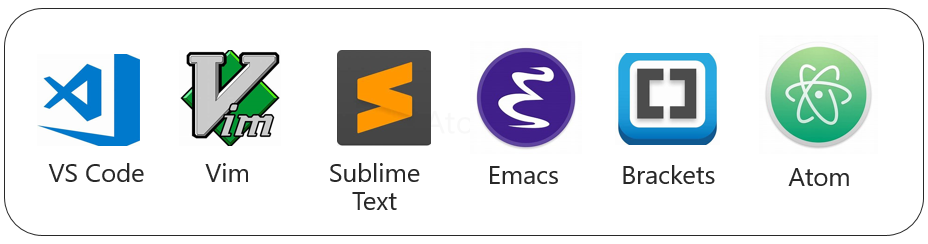
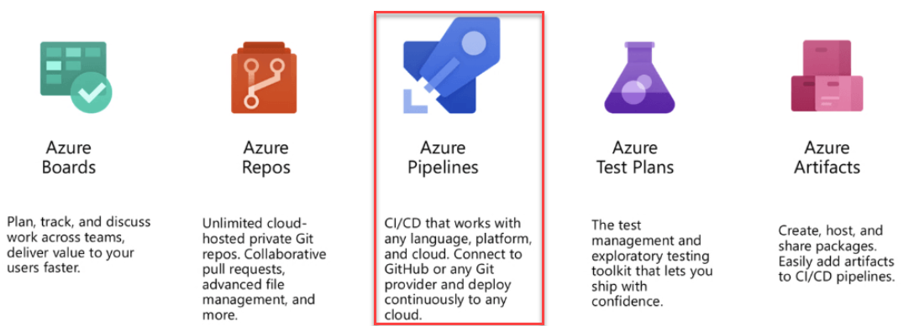

# The Azure Cloud-Native Development Stack

The Azure cloud offers a tightly integrated, but full and open stack for constructing and managing cloud-native workloads.

Working to embrace a wider range of developers, Microsoft is [making tremendous investments in open source](https://www.zdnet.com/article/why-microsoft-is-turning-into-an-open-source-company/) and cross-platform development tools.

## Choosing an OS

For years, Microsoft and Linux vendors fought for control of the enterprise *server* market. Sides were formed, battle lines drawn. It sometimes resembled more of a religious battle. Linux symbolizing freedom, and Microsoft with a well understood, comprehensive platform.

### The operating system becomes transparent

With the growth of modern development platforms and container orchestrators, the operating system has become more transparent.

Nowadays, modern development platforms natively support cross-platform portability. Developers write an application in a preferred language, deploy it to the operating system of choice, and the platform runtime engine automatically handles the environment-specific dependencies. Later, that same application package can be redeployed to a different operating system and ran just the same with the appropriate runtime engine and configuration changes.

The explosive growth of containers further obscures the underlying operating system. Containers allow applications to run independently of the operating system. "If you take a look at the way that containers have evolved, it's basically an evolution of the OS model we've had to this point," says Microsoft Azure CTO [Mark Russinovich](https://www.google.com/search?q=If+you+take+a+look+at+the+way+that+containers+have+evolved%2C+it%E2%80%99s+basically+an+evolution+of+the+OS+model+we%E2%80%99ve+had+to+this+point&rlz=1C1GCEU_enFR819US820&oq=If+you+take+a+look+at+the+way+that+containers+have+evolved%2C+it%E2%80%99s+basically+an+evolution+of+the+OS+model+we%E2%80%99ve+had+to+this+point&aqs=chrome..69i57.915j0j9&sourceid=chrome&ie=UTF-8). While the operating system still exists, its role has diminished. Instead, the container orchestrator has become the *de-facto operating system* of choice.

### Linux on Azure - Linux on Windows

The Azure cloud openly embraces both Windows and Linux workloads. It's Linux, not Windows Server, that has become the most popular operating system in Azure. Many critical Azure services run on Linux. Consider, for example, Redis Cache, Sql Server on Linux, or the NoSql offerings. Azure features different kinds of Linux VMs supporting at least eight Linux distributions.

[Windows Server 2019](https://cloudblogs.microsoft.com/windowsserver/2018/03/20/introducing-windows-server-2019-now-available-in-preview/) now features a subsystem for Linux that enables Windows and Linux environments to run simultaneously. 

A new Windows feature, [Linux Containers on Windows](https://blogs.msdn.microsoft.com/premier_developer/2018/04/20/running-docker-windows-and-linux-containers-simultaneously/) ([LCOW](https://blogs.msdn.microsoft.com/premier_developer/2018/04/20/running-docker-windows-and-linux-containers-simultaneously/)) makes it possible to run Linux *and* Windows containers simultaneously - all from a single Docker engine. LCOW not only simplifies day-to-day management, but also reduces infrastructure costs as there's no longer the need for dedicated hosts for each operating system.

As cloud-native architecture and container orchestrators evolve, expect to see less and less importance placed on the choice of the operating system.

## .NET Core Platform

The Microsoft's .NET development platform originated in 2002 and is among the most loved technologies, according to a [Stack Overflow survey](http://dontcodetired.com/blog/post/Stack-Overflow-Developer-Survey-2018-Overview-for-NET-Developers).

Fast-forward to 2019 and the [Microsoft .NET Core platform](https://dotnet.microsoft.com/learn/dotnet/what-is-dotnet). A modernized rewrite of .NET. Free and open source, it can be used to build services, mobile apps, and IoT apps. It's maintained by Microsoft and the .NET community on GitHub. Cross-platform applications built with .NET Core that run on Windows, macOS, and most flavors of Linux.

.NET Core supports multiple programming languages, editors, and libraries. It fully supports the C# programming language, which is a popular and mature language that is frequently updated and continually modernized.

.NET core is highly performant and has scored well in comparison to Node.js and other completing platforms. This [TechEmpower](https://www.techempower.com/benchmarks/#section=data-r17&hw=ph&test=plaintext) benchmark highlights performance tests.

.NET Core plays especially well with microservice-based applications. It has many built-in features and open-source integration that simplify microservice development. All that said, the .NET Core stack with C\# is an excellent choice for building cloud-native applications in the Azure cloud.

## Tooling: IDE vs. Editor

When building cloud-native applications with .NET Core, you have several development tools from which to choose.

### Visual Studio

At the top of the list is [Visual Studio](https://visualstudio.microsoft.com/). A full-featured IDE [Integrated Development Environment](https://learn.g2crowd.com/ide) for Windows, It includes compilers, debuggers, source control, and profiling tooling. It's a complete solution used primarily for .NET development.

Visual Studio features built-in support of Docker container-based development and a rich set of web development tooling. It provides everything you need to develop, manage, and deploy complex microservice applications. In the latest version of Visual Studio, you can develop cross-platform applications without leaving the IDE.

Rated as one of the [world's leading IDEs](https://www.g2crowd.com/categories/integrated-development-environment-ide), Visual Studio is available in a free fully functional [Community Edition](https://visualstudio.microsoft.com/vs/community/). 

### Visual Studio Code

More recently, Microsoft has released [Visual Studio Code](https://code.visualstudio.com/docs/editor/whyvscode). A free, lightweight, and cross-platform editor, it can be used to view, edit, run, and debug source code for applications. 

It supports macOS, Linux, and Windows.

One of its key attractions is a fast-growing collection of pluggable extensions. Available from the [Extension Marketplace](https://marketplace.visualstudio.com/), these plug-ins customize your editing experience. They add programming languages, debuggers, and tools to support a wide variety of development workflows.

Both Visual Studio and Visual Studio Code have tight integration with the Azure platform. Both include productivity tooling to help you discover and interact with cloud services that can power your cloud-native applications.

### Other Open Source Editors

Developers can use other open-source development tools to build .NET Core cloud-native applications. Figure 1-12 presents many of them.

**Figure 1-12**. Cross-platform editors for .NET Core

## Source control in GitHub

*Factor \#1* from the [Twelve-Factor Application](https://12factor.net/) guidelines, detailed above, calls for *storing your code in a repository tracked by revision control*. Such a repository provides many services. It tracks changes to software development projects. Developers collaborate on a shared codebase. Larger tasks are separated into development branches, merging changes when complete. Developers view the history of changes and revert to a previous version, if necessary.

Fortunately, development teams have many available options when selecting a repository.

One of them is [GitHub](https://github.com/). Founded in 2009, GitHub is a popular web-based repository for hosting projects, documentation, and code. Apple, Amazon, Google, and many other large tech companies use GitHub. It uses the [Git](https://en.wikipedia.org/wiki/Git) distributed version control system as its foundation. GitHub adds its own features, including defect tracking, feature and pull requests, task management, and wikis for each code base.

With over 28 million users, GitHub is the largest host of source code in the world. 

In October of 2018, Microsoft purchased GitHub. Microsoft has pledged to keep GitHub as an [open platform](https://techcrunch.com/2018/06/04/microsoft-promises-to-keep-github-independent-and-open/) that any developer can plug into and extend. It continues to operate as an independent company.

GitHub offers plans for enterprise, team, professional, and free accounts. 

## CI/CD in Azure DevOps

*Factor \#5* from the [Twelve-Factor Application](https://12factor.net/) guidelines calls for *strict separation of the build, release, and run stages*. Modern, automated CI/CD pipelines help fulfill this principle. They help ensure consistent and quality code that's readily available to users.

[Continuous Integration/Continuous Delivery](https://www.infoworld.com/article/3271126/what-is-cicd-continuous-integration-and-continuous-delivery-explained.html) (CI/CD) is a set of operating principles that enable application development teams to deliver code changes frequently and reliably. Applying these practices, organizations have radically evolved how they ship software. Many have moved from quarterly releases to immediate on-demand updates.

### Continuous Integration

[Continuous Integration (CI)](https://martinfowler.com/articles/continuousIntegration.html) establishes an automated *pipeline* approach to building, testing, and packaging applications. Committing your source code invokes the pipeline and triggers a series of steps that validate your release. Figure 1-13 shows the process.

  

**Figure 1-13**. Steps in the CI Pipeline

The pipeline approach enables you to insert additional steps and checks to map the process to the deployment requirements of your organization.

The goal is to catch problems early in the development cycle when they're less expensive to fix. The longer the duration between integrations, the more expensive problems become to resolve. The CI process outputs project artifact items that are used by the CD pipeline to drive automatic deployments. With consistency in the integration process, teams can commit code changes more frequently, leading to better collaboration and software quality.

### Continuous Deployment

[Continuous Delivery(CD)](https://martinfowler.com/bliki/ContinuousDelivery.html) is closely related to CI. CD picks up the package built by the CI process and deploys it to a specified environment, such as QA or production. Figure 1-14 shows the CD process.

It can invoke additional steps such as integration and performance tests.

**Figure 1-14**. Steps in the CD Pipeline

The goal of CI/CD is an automated, predictable deployment that can be triggered on demand.

### Azure Pipelines

The Azure cloud includes a new CI/CD service entitled [Azure Pipelines](https://azure.microsoft.com/services/devops/pipelines/), which is part of the [Azure DevOps](https://azure.microsoft.com/services/devops/) offering shown in Figure 1-15.

**Figure 1-15**. Azure Pipelines in DevOps

Azure DevOps supports most Git providers and generates deployment pipelines for Linux, macOS, and Windows. It includes support for Java, .NET, JavaScript, Python, PHP, Go, XCode, and C++.

An organization creates an account (called an Organization) in the [Azure DevOps](https://azure.microsoft.com/services/devops/pipelines/) service and stores its source code in a version control system. If your project is stored in a public repository, such as GitHub, Azure Pipelines is free to use. For private projects, there's a charge.

Azure Pipelines combines CI/CD to consistently test, build, and deploy your code to any target.

## Summary

In this chapter, we flew over cloud-native computing. We provided a definition along with the key characteristics of a cloud-native application. We looked the types of applications that might justify this investment and effort. Lastly, we looked cloud-native development stack available in the Azure Cloud <https://deloitte.wsj.com/cio/2018/08/27/3-reasons-to-go-cloud-native/>.

When considering cloud native, it important to build a [cloud-native](https://deloitte.wsj.com/cio/2016/12/12/making-the-leap-to-a-cloud-native-world/) mindset.

### References

- [Lift and Shift with Containers Book](https://aka.ms/liftandshiftwithcontainersebook)

>[!div class="step-by-step"]
>[Previous](candidate-apps.md)
>[Next](scale-dotnet-applications.md) <!-- Next Chapter -->
