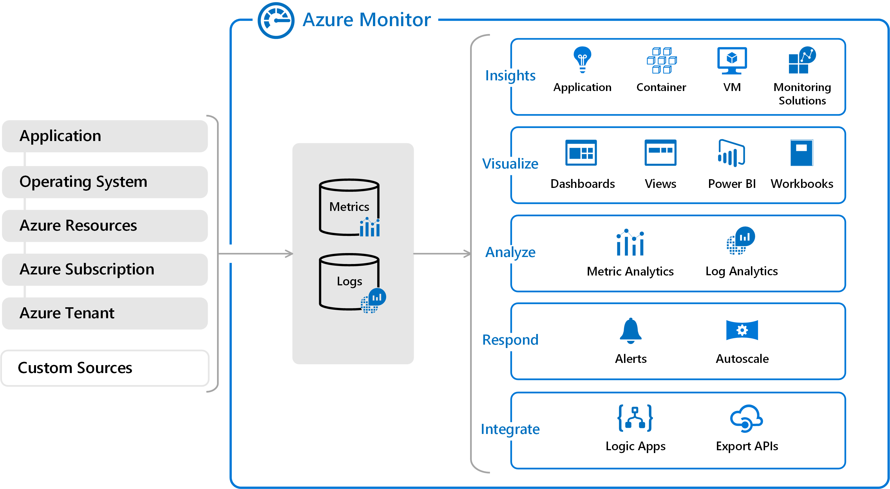
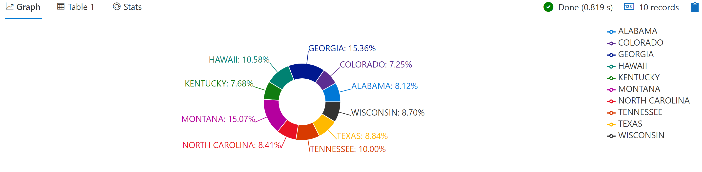
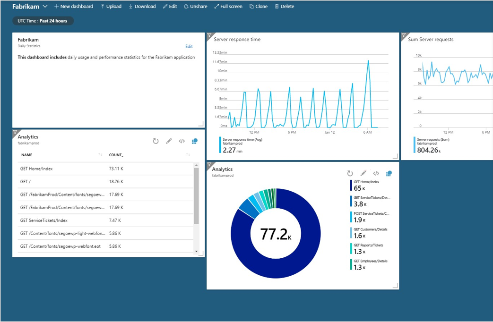
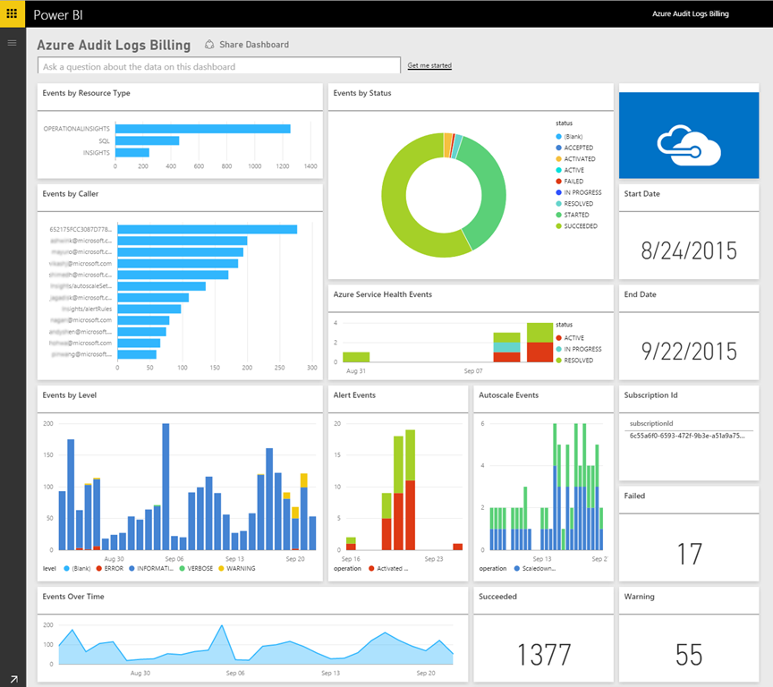

# Azure Monitor

[!INCLUDE [download-alert](includes/download-alert.md)]

No other cloud provider has as mature of a cloud application monitoring solution than that found in Azure. Azure Monitor is an umbrella name for a collection of tools designed to provide visibility into the state of your system. It helps you understand how your cloud-native services are performing and proactively identifies issues affecting them. Figure 7-12 presents a high level of view of Azure Monitor.


**Figure 7-12**. High-level view of Azure Monitor.

## Gathering logs and metrics

The first step in any monitoring solution is to gather as much data as possible. The more data gathered, the deeper the insights. Instrumenting systems has traditionally been difficult. Simple Network Management Protocol (SNMP) was the gold standard protocol for collecting machine level information, but it required a great deal of knowledge and configuration. Fortunately, much of this hard work has been eliminated as the most common metrics are gathered automatically by Azure Monitor.

Application level metrics and events aren't possible to instrument automatically because they're specific to the application being deployed. In order to gather these metrics, there are [SDKs and APIs available](/azure/azure-monitor/app/api-custom-events-metrics) to directly report such information, such as when a customer signs up or completes an order. Exceptions can also be captured and reported back into Azure Monitor via Application Insights. The SDKs support most every language found in Cloud Native Applications including Go, Python, JavaScript, and the .NET languages.

The ultimate goal of gathering information about the state of your application is to ensure that your end users have a good experience. What better way to tell if users are experiencing issues than doing [outside-in web tests](/azure/azure-monitor/app/monitor-web-app-availability)? These tests can be as simple as pinging your website from locations around the world or as involved as having agents log into the site and simulate user actions.

## Reporting data

Once the data is gathered, it can be manipulated, summarized, and plotted into charts, which allow users to instantly see when there are problems. These charts can be gathered into dashboards or into Workbooks, a multi-page report designed to tell a story about some aspect of the system.

No modern application would be complete without some artificial intelligence or machine learning. To this end, data [can be passed](https://www.youtube.com/watch?v=Cuza-I1g9tw) to the various machine learning tools in Azure to allow you to extract trends and information that would otherwise be hidden.

Application Insights provides a powerful (SQL-like) query language called *Kusto* that can query records, summarize them, and even plot charts. For example, the following query will locate all records for the month of November 2007, group them by state, and plot the top 10 as a pie chart.

```kusto
StormEvents
| where StartTime >= datetime(2007-11-01) and StartTime < datetime(2007-12-01)
| summarize count() by State
| top 10 by count_
| render piechart
```

Figure 7-13 shows the results of this Application Insights Query.


**Figure 7-13**. Application Insights query results.

There is a [playground for experimenting with Kusto](https://dataexplorer.azure.com/clusters/help/databases/Samples) queries. Reading [sample queries](/azure/kusto/query/samples) can also be instructive.

## Dashboards

There are several different dashboard technologies that may be used to surface the information from Azure Monitor. Perhaps the simplest is to just run queries in Application Insights and [plot the data into a chart](/azure/azure-monitor/learn/tutorial-app-dashboards).


**Figure 7-14**. An example of Application Insights charts embedded in the main Azure Dashboard.

These charts can then be embedded in the Azure portal proper through use of the dashboard feature. For users with more exacting requirements, such as being able to drill down into several tiers of data, Azure Monitor data is available to [Power BI](https://powerbi.microsoft.com/). Power BI is an industry-leading, enterprise class, business intelligence tool that can aggregate data from many different data sources.



**Figure 7-15**. An example Power BI dashboard.

## Alerts

Sometimes, having data dashboards is insufficient. If nobody is awake to watch the dashboards, then it can still be many hours before a problem is addressed, or even detected. To this end, Azure Monitor also provides a top notch [alerting solution](/azure/azure-monitor/platform/alerts-overview). Alerts can be triggered by a wide range of conditions including:

- Metric values
- Log search queries
- Activity Log events
- Health of the underlying Azure platform
- Tests for web site availability

When triggered, the alerts can perform a wide variety of tasks. On the simple side, the alerts may just send an e-mail notification to a mailing list or a text message to an individual. More involved alerts might trigger a workflow in a tool such as PagerDuty, which is aware of who is on call for a particular application. Alerts can trigger actions in [Microsoft Flow](https://flow.microsoft.com/) unlocking near limitless possibilities for workflows.

As common causes of alerts are identified, the alerts can be enhanced with details about the common causes of the alerts and the steps to take to resolve them. Highly mature cloud-native application deployments may opt to kick off self-healing tasks, which perform actions such as removing failing nodes from a scale set or triggering an autoscaling activity. Eventually it may no longer be necessary to wake up on-call personnel at 2AM to resolve a live-site issue as the system will be able to adjust itself to compensate or at least limp along until somebody arrives at work the next morning.

Azure Monitor automatically leverages machine learning to understand the normal operating parameters of deployed applications. This approach enables it to detect services that are operating outside of their normal parameters. For instance, the typical weekday traffic on the site might be 10,000 requests per minute. And then, on a given week, suddenly the number of requests hits a highly unusual 20,000 requests per minute. [Smart Detection](/azure/azure-monitor/app/proactive-diagnostics) will notice this deviation from the norm and trigger an alert. At the same time, the trend analysis is smart enough to avoid firing false positives when the traffic load is expected.

## References

- [Azure Monitor](/azure/azure-monitor/overview)

>[!div class="step-by-step"]
>[Previous](monitoring-azure-kubernetes.md)
>[Next](identity.md)
