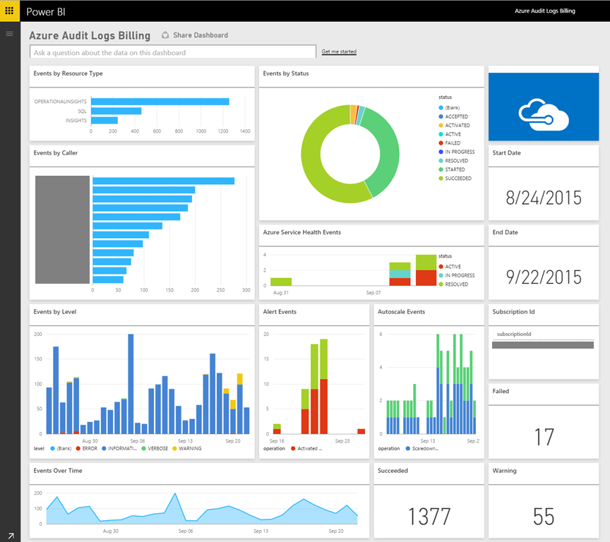

# Azure Monitor 

No other cloud provider has as mature of a cloud application monitoring solution as that found in Azure. Azure Monitor is an umbrella name for a collection of tools designed to provide visibility into the state of your system, insights into any problems and optimization of your application. 


## Gathering Logs and Metrics 

The first step in any monitoring solution is to gather as much data as possible. The more data that can be gathered the deeper the insights which can be obtained. Instrumenting systems has traditionally been quite difficult. SNMP(Simple Network Management Protocol) was the gold standard protocol for collecting machine level information but it required a great deal of knowledge and twiddling. Fortunately, much of this hard work has been eliminated as the most common metrics are gathered automatically by Azure Monitor. 

Application level metrics and events are not possible to instrument automatically because they are local to the application being deployed. In order to gather these metrics there are [SDKs and APIs available](https://docs.microsoft.com/azure/azure-monitor/app/api-custom-events-metrics) to directly report such information as when a customer signs up or completes an order. Exceptions can also be captured and reported back up into Azure Monitor via Application Insights. The SDKs support most every language found in Cloud Native Applications including Go, Python, JavaScript and the .NET languages. 

The ultimate goal of gathering information about the state of your application is to ensure that your end users have a good experience. What better way to tell if users are experiencing issues than performing [outside-in web tests](https://docs.microsoft.com/azure/azure-monitor/app/monitor-web-app-availability)? These tests can be as simple as pinging your website from locations around the world or as involved as having agents log into the site and perform actions.

## Reporting data

Once the data is gathered it can be manipulated, summarized and plotted into charts which allow users to instantly see when there are problems. These charts can be gathered into dashboards or into Workbooks, a multi-page report designed to tell a story about some aspect of the system.

Of course, no modern application would be complete without a little bit of Artificial Intelligence or Machine Learning. To this end data [can be passed](https://www.youtube.com/watch?v=Cuza-I1g9tw) to the various Machine Learning tools in Azure to allow you to extract trends and information which would otherwise be hidden. 

Application Insights provides a powerful query language called Kusto which can be used to find records, summarize them and even plot charts. For instance this query will locate all the records between 2007-11-01 and 2007-12-01, group them by state, take the top 10 and plot them as a pie chart.

```
StormEvents 
| where StartTime >= datetime(2007-11-01) and StartTime < datetime(2007-12-01)
| summarize count() by State
| top 10 by count_
| render piechart 
```


There is a [playground for experimenting with Kusto](https://dataexplorer.azure.com/clusters/help/databases/Samples) queries which is a fantastic place to spend an hour or two. Reading [sample queries](https://docs.microsoft.com/azure/kusto/query/samples) can also be instructive.

## Dashboards

There are several different dashboarding technologies which may be used to surface the information from Azure Monitor. Perhaps the simplest is to just run queries in Application Insights and [plot the data into a chart](https://docs.microsoft.com/azure/azure-monitor/learn/tutorial-app-dashboards). 


These charts can then be embedded in the Azure portal proper through use of the dashboard feature. For users with more exacting requirements such as being able to drill down into several tiers of data Azure Monitor data is available to [PowerBI](https://powerbi.microsoft.com/en-us/). PowerBI is an industry-leading, enterprise class, business intelligence tool which can aggregate data from many different data sources.



## Alerts

Sometimes simply dashboarding data is insufficient. If nobody is awake to watch the dashboards then it can still be many hours before a problem is addressed, or even detected. To this end Azure Monitor also provides a top notch [alerting solution](https://docs.microsoft.com/azure/azure-monitor/platform/alerts-overview). Alerts can be triggered by a wide range of conditions including:

* Metric values
* Log search queries
* Activity Log events
* Health of the underlying Azure platform
* Tests for web site availability

When triggered the alerts can perform a wide variety of tasks. On the simple side the alerts may just send an e-mail notification to a mailing list or a text message to an individual. More involved alerts might trigger a workflow in a tool such as PagerDuty which is aware of who is on call for a particular application. Alerts can trigger actions in [Microsoft Flow](https://flow.microsoft.com/en-us/) unlocking near limitless possibilities for workflows.

As common causes of alerts are identified the alerts can be enhanced with details about the common causes of the alerts as well as the steps to take to resolve them. Highly mature Cloud Native Application deployments may opt to kick off self-healing tasks which perform actions such as removing failing nodes from a scale set or triggering an auto-scaling activity. Eventually it may no longer be necessary to wake up on-call personnel at 2am to resolve a live-site issue as the system will be able to adjust itself to compensate or at least limp along until somebody arrives at work the next morning. 

Azure Monitor automatically leverages Machine Learning to understand the normal operating parameters of deployed applications. This enables it to detect services which are operating outside of their normal parameters. For instance the typical weekday traffic on the site might be 10 000 requests per minute. All of a sudden this week the number of requests hits a highly unusual 20 000 requests per minute. [Smart Detection](https://docs.microsoft.com/azure/azure-monitor/app/proactive-diagnostics) will notice this deviation from the norm and trigger an alert. At the same time the trend analysis is smart enough to avoid firing false positives when the traffic load is expected.  

>[!div class="step-by-step"]
>[Previous](logging.md)
>[Next](../index.md)
