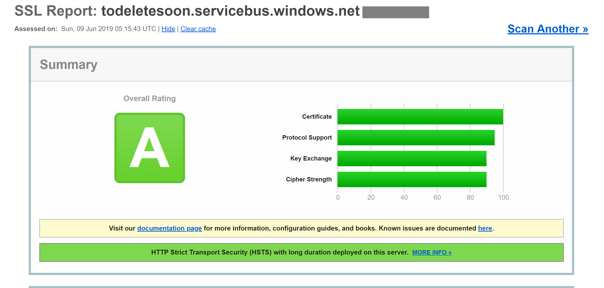

# Azure security for cloud-native apps

[!INCLUDE [book-preview](../../../includes/book-preview.md)]

Cloud-native applications can be both easier and more difficult to secure than traditional applications. On the downside, you need to secure more smaller applications and dedicate more energy to build out the security infrastructure. The heterogeneous nature of programming languages and styles in most service deployments also means you need to pay more attention to security bulletins from many different providers.

On the flip side, smaller services, each with their own data store, limit the scope of an attack. If an attacker compromises one system, it's probably more difficult for the attacker to make the jump to another system than it is in a monolithic application. Process boundaries are strong boundaries. Also, if a database backup leaks, then the damage is more limited, as that database contains only a subset of data and is unlikely to contain personal data.

## Threat modeling

No matter if the advantages outweigh the disadvantages of cloud-native applications, the same holistic security mindset must be followed. Security and secure thinking must be part of every step of the development and operations story. When planning an application ask questions like:

- What would be the impact of this data being lost?
- How can we limit the damage from bad data being injected into this service?
- Who should have access to this data?
- Are there auditing policies in place around the development and release process?

All these questions are part of a process called [threat modeling](https://docs.microsoft.com/azure/security/azure-security-threat-modeling-tool). This process tries to answer the question of what threats there are to the system, how likely the threats are, and the potential damage from them.

Once the list of threats has been established, you need to decide whether they're worth mitigating. Sometimes a threat is so unlikely and expensive to plan for that it isn't worth spending energy on it. For instance, some state level actor could inject changes into the design of a process that is used by millions of devices. Now, instead of running a certain piece of code in [Ring 3](https://en.wikipedia.org/wiki/Protection_ring), that code is run in Ring 0. This allows an exploit that can bypass the hypervisor and run the attack code on the bare metal machines, allowing attacks on all the virtual machines that are running on that hardware.

The altered processors are difficult to detect without a microscope and advanced knowledge of the on silicon design of that processor. This scenario is unlikely to happen and expensive to mitigate, so probably no threat model would recommend building exploit protection for it.

More likely threats, such as broken access controls permitting `Id` incrementing attacks (replacing `Id=2` with `Id=3` in the URL) or SQL injection, are more attractive to build protections against. The mitigations for these threats are quite reasonable to build and prevent embarrassing security holes that smear the company's reputation.

## Principle of least privilege

One of the founding ideas in computer security is the Principle of Least Privilege (POLP). It's actually a foundational idea in most any form of security be it digital or physical. In short, the principle is that any user or process should have the smallest number of rights possible to execute its task.

As an example, think of the tellers at a bank: accessing the safe is an uncommon activity. So, the average teller can't open the safe themselves. To gain access, they need to escalate their request through a bank manager, who performs additional security checks.

In a computer system, a fantastic example is the rights of a user connecting to a database. In many cases, there's a single user account used to both build the database structure and run the application. Except in extreme cases, the account running the application doesn't need the ability to update schema information. There should be several accounts that provide different levels of privilege. The application should only use the permission level that grants read and write access to the data in the tables. This kind of protection would eliminate attacks that aimed to drop database tables or introduce malicious triggers.

Almost every part of building a cloud-native application can benefit from remembering the principle of least privilege. You can find it at play when setting up firewalls, network security groups, roles, and scopes in Role-based access control (RBAC).

## Penetration testing

As applications become more complicated the number of attack vectors increases at an alarming rate. Threat modeling is flawed in that it tends to be executed by the same people building the system. In the same way that many developers have trouble envisioning user interactions and then build unusable user interfaces, most developers have difficulty seeing every attack vector. It's also possible that the developers building the system aren't well versed in attack methodologies and miss something crucial.

Penetration testing or "pen testing" involves bringing in external actors to attempt to attack the system. These attackers may be an external consulting company or other developers with good security knowledge from another part of the business. They're given carte blanche to attempt to subvert the system. Frequently, they'll find extensive security holes that need to be patched. Sometimes the attack vector will be something totally unexpected like exploiting a phishing attack against the CEO.

Azure itself is constantly undergoing attacks from a [team of hackers inside Microsoft](https://azure.microsoft.com/resources/videos/red-vs-blue-internal-security-penetration-testing-of-microsoft-azure/). Over the years, they've been the first to find dozens of potentially catastrophic attack vectors, closing them before they can be exploited externally. The more tempting a target, the more likely that eternal actors will attempt to exploit it and there are a few targets in the world more tempting than Azure.

## Monitoring

Should an attacker attempt to penetrate an application, there should be some warning of it. Frequently, attacks can be spotted by examining the logs from services. Attacks leave telltale signs that can be spotted before they succeed. For instance, an attacker attempting to guess a password will make many requests to a login system. Monitoring around the login system can detect weird patterns that are out of line with the typical access pattern. This monitoring can be turned into an alert that can, in turn, alert an operations person to activate some sort of countermeasure. A highly mature monitoring system might even take action based on these deviations proactively adding rules to block requests or throttle responses.

## Securing the build

One place where security is often overlooked is around the build process. Not only should the build run security checks, such as scanning for insecure code or checked-in credentials, but the build itself should be secure. If the build server is compromised, then it provides a fantastic vector for introducing arbitrary code into the product.

Imagine that an attacker is looking to steal the passwords of people signing into a web application. They could introduce a build step that modifies the checked-out code to mirror any login request to another server. The next time code goes through the build, it's silently updated. The source code vulnerability scanning won't catch this as it runs before the build. Equally, nobody will catch it in a code review because the build steps live on the build server. The exploited code will go to production where it can harvest passwords. Probably there's no audit log of the build process changes, or at least nobody monitoring the audit.

This is a perfect example of a seemingly low value target that can be used to break into the system. Once an attacker breaches the perimeter of the system, they can start working on finding ways to elevate their permissions to the point that they can cause real harm anywhere they like.

## Building secure code

The .NET Framework is already a quite secure framework. It avoids some of the pitfalls of unmanaged code, such as walking off the ends of arrays. Work is actively done to fix security holes as they're discovered. There's even a [bug bounty program](https://www.microsoft.com/msrc/bounty) that pays researchers to find issues in the framework and report them instead of exploiting them.

There are many ways to make .NET code more secure. Following guidelines such as the [Secure coding guidelines for .NET](https://docs.microsoft.com/dotnet/standard/security/secure-coding-guidelines) article is a reasonable step to take to ensure that the code is secure from the ground up. The [OWASP top 10](https://www.owasp.org/index.php/Category:OWASP_Top_Ten_2017_Project) is another invaluable guide to build secure code.

The build process is a good place to put scanning tools to detect problems in source code before they make it into production. Most every project has dependencies on some other packages. A tool that can scan for outdated packages will catch problems in a nightly build. Even when building Docker images, it's useful to check and make sure that the base image doesn't have known vulnerabilities. Another thing to check is that nobody has accidentally checked in credentials.

## Built-in security

Azure is designed to balance usability and security for the majority of users. Different users are going to have different security requirements, so they need to fine-tune their approach to cloud security. Microsoft publishes a great deal of security information in the [Trust Center](https://azure.microsoft.com/support/trust-center/). This resource should be the first stop for those professionals interested in understanding how the built-in attack mitigation technologies work.

Within the Azure portal, the [Azure Advisor](https://azure.microsoft.com/services/advisor/) is a system that is constantly scanning an environment and making recommendations. Some of these recommendations are designed to save users money, but others are designed to identify potentially insecure configurations, such as having a storage container open to the world and not protected by a Virtual Network.

## Azure network infrastructure

In an on-premises deployment environment, a great deal of energy is dedicated to setting up networking. Setting up routers, switches, and the such is complicated work. Networks allow certain resources to talk to other resources and prevent access in some cases. A frequent network rule is to restrict access to the production environment from the development environment on the off chance that a half-developed piece of code runs awry and deletes a swath of data.

Out of the box, most PaaS Azure resources have only the most basic and permissive networking setup. For instance, anybody on the Internet can access an app service. New SQL Server instances typically come restricted, so that external parties can't access them, but the IP address ranges used by Azure itself are permitted through. So, while the SQL server is protected from external threats, an attacker only needs to set up an Azure bridgehead from where they can launch attacks against all SQL instances on Azure.

Fortunately, most Azure resources can be placed into an Azure Virtual Network that allows finer grained access control. Similar to the way that on-premises networks establish private networks that are protected from the wider world, virtual networks are islands of private IP addresses that are located within the Azure network.


**Figure 10-1**. A virtual network in Azure.

In the same way that on-premises networks have a firewall governing access to the network, you can establish a similar firewall at the boundary of the virtual network. By default, all the resources on a virtual network can still talk to the Internet. It's only incoming connections that require some form of explicit firewall exception.

With the network established, internal resources like storage accounts can be set up to only allow for access by resources that are also on the Virtual Network. This firewall provides an extra level of security, should the keys for that storage account be leaked, attackers wouldn't be able to connect to it to exploit the leaked keys. This is another example of the principle of least privilege.

The nodes in an Azure Kubernetes cluster can participate in a virtual network just like other resources that are more native to Azure. This functionality is called [Azure Container Networking Interface](https://github.com/Azure/azure-container-networking/blob/master/docs/cni.md). In effect, it allocates a subnet within the virtual network on which virtual machines and container images are allocated.

Continuing down the path of illustrating the principle of least privilege, not every resource within a Virtual Network needs to talk to every other resource. For instance, in an application that provides a web API over a storage account and a SQL database, it's unlikely that the database and the storage account need to talk to one another. Any data sharing between them would go through the web application. So, a [network security group (NSG)](https://docs.microsoft.com/azure/virtual-network/security-overview) could be used to deny traffic between the two services.

A policy of denying communication between resources can be annoying to implement, especially coming from a background of using Azure without traffic restrictions. On some other clouds, the concept of network security groups is much more prevalent. For instance, the default policy on AWS is that resources can't communicate among themselves until enabled by rules in an NSG. While slower to develop this, more restrictive environment provides a more secure default. Making use of proper DevOps practices, especially using [Azure Resource Manager or Terraform](infrastructure-as-code.md) to manage permissions can make controlling the rules easier.

Virtual Networks can also be useful when setting up communication between on-premises and cloud resources. A virtual private network can be used to seamlessly attach the two networks together. This allows running a virtual network without any sort of gateway for scenarios where all the users are on-site. There are a number of technologies that can be used to establish this network. The simplest is to use a [site-to-site VPN](https://docs.microsoft.com/azure/vpn-gateway/vpn-gateway-about-vpngateways?toc=%2fazure%2fvirtual-network%2ftoc.json#s2smulti) that can be established between many routers and Azure. Traffic is encrypted and tunneled over the Internet at the same cost per byte as any other traffic. For scenarios where more bandwidth or more security is desirable, Azure offers a service called [Express Route](https://docs.microsoft.com/azure/vpn-gateway/vpn-gateway-about-vpngateways?toc=%2fazure%2fvirtual-network%2ftoc.json#ExpressRoute) that uses a private circuit between an on-premises network and Azure. It's more costly and difficult to establish but also more secure.

## Role-based access control for restricting access to Azure resources

RBAC is a system that provides an identity to applications running in Azure. Applications can access resources using this identity instead of or in addition to using keys or passwords.

## Security Principals

The first component in RBAC is a security principal. A security principal can be a user, group, service principal, or managed identity.


**Figure 10-2**. Different types of security principals.

- User - Any user who has an account in Azure Active Directory is a user.
- Group - A collection of users from Azure Active Directory. As a member of a group, a user takes on the roles of that group in addition to their own.
- Service principal - A security identity under which services or applications run.
- Managed identity - An Azure Active Directory identity managed by Azure. Managed identities are typically used when developing cloud applications that manage the credentials for authenticating to Azure services.

The security principal can be applied to most any resource. This means that it's possible to assign a security principal to a container running within Azure Kubernetes, allowing it to access secrets stored in Key Vault. An Azure Function could take on a permission allowing it to talk to an Active Directory instance to validate a JWT for a calling user. Once services are enabled with a service principal, their permissions can be managed granularly using roles and scopes.

## Roles

A security principal can take on many roles or, using a more sartorial analogy, wear many hats. Each role defines a series of permissions such as "Read messages from Azure Service Bus endpoint". The effective permission set of a security principal is the combination of all the permissions assigned to all the roles that security principal has. Azure has a large number of built-in roles and users can define their own roles.


**Figure 10-3**. RBAC role definitions.

Built into Azure are also a number of high-level roles such as Owner, Contributor, Reader, and User Account Administrator. With the Owner role, a security principal can access all resources and assign permissions to others. A contributor has the same level of access to all resources but they can't assign permissions. A Reader can only view existing Azure resources and a User Account Administrator can manage access to Azure resources.

More granular built-in roles such as [DNS Zone Contributor](https://docs.microsoft.com/azure/role-based-access-control/built-in-roles#dns-zone-contributor) have rights limited to a single service. Security principals can take on any number of roles.

## Scopes

Roles can be applied to a restricted set of resources within Azure. For instance, applying scope to the previous example of reading from a Service Bus queue, you can narrow the permission to a single queue: "Read messages from Azure Service Bus endpoint `blah.servicebus.windows.net/queue1`"

The scope can be as narrow as a single resource or it can be applied to an entire resource group, subscription, or even management group.

When testing if a security principal has a certain permission, the combination of role and scope are taken into account. This combination provides a powerful authorization mechanism.

## Deny

Previously, only "allow" rules were permitted for RBAC. This behavior made some scopes complicated to build. For instance, allowing a security principal access to all storage accounts except one required granting explicit permission to a potentially endless list of storage accounts. Every time a new storage account was created, it would have to be added to this list of accounts. This added management overhead that certainly wasn't desirable.

Deny rules take precedence over allow rules. Now representing the same "allow all but one" scope could be represented as two rules "allow all" and "deny this one specific one". Deny rules not only ease management but allow for resources that are extra secure by denying access to everybody.

## Checking access

As you can imagine, having a large number of roles and scopes can make figuring out the effective permission of a service principal quite difficult. Piling deny rules on top of that, only serves to increase the complexity. Fortunately, there's a permissions calculator that can show the effective permissions for any service principal. It's typically found under the IAM tab in the portal, as shown in Figure 10-3.


**Figure 10-4**. Permission calculator for an app service.

## Securing secrets

Passwords and certificates are a common attack vector for attackers. Password-cracking hardware can do a  brute-force attack and try to guess billions of passwords per second. So it's important that the passwords that are used to access resources are strong, with a large variety of characters. These passwords are exactly the kind of passwords that are near impossible to remember. Fortunately, the passwords in Azure don't actually need to be known by any human.

Many security [experts suggest](https://www.troyhunt.com/password-managers-dont-have-to-be-perfect-they-just-have-to-be-better-than-not-having-one/) that using a password manager to keep your own passwords is the best approach. While it centralizes your passwords in one location, it also allows using highly complex passwords and ensuring they're unique for each account. The same system exists within Azure: a central store for secrets.

## Azure Key Vault

Azure Key Vault provides a centralized location to store passwords for things such as databases, API keys, and certificates. Once a secret is entered into the Vault, it's never shown again and the commands to extract and view it are purposefully complicated. The information in the safe is protected using either software encryption or FIPS 140-2 Level 2 validated Hardware Security Modules.

Access to the key vault is provided through RBACs, meaning that not just any user can access the information in the vault. Say a web application wishes to access the database connection string stored in Azure Key Vault. To gain access, applications need to run using a service principal. Under this assumed role, they can read the secrets from the safe. There are a number of different security settings that can further limit the access that an application has to the vault, so that it can't update secrets but only read them.

Access to the key vault can be monitored to ensure that only the expected applications are accessing the vault. The logs can be integrated back into Azure Monitor, unlocking the ability to set up alerts when unexpected conditions are encountered.

## Kubernetes

Within Kubernetes, there's a similar service for maintaining small pieces of secret information. Kubernetes Secrets can be set via the typical `kubectl` executable.

Creating a secret is as simple as finding the base64 version of the values to be stored:

```console
echo -n 'admin' | base64
YWRtaW4=
echo -n '1f2d1e2e67df' | base64
MWYyZDFlMmU2N2Rm
```

Then adding it to a secrets file named `secret.yml` for example that looks similar to the following example:

```yml
apiVersion: v1
kind: Secret
metadata:
  name: mysecret
type: Opaque
data:
  username: YWRtaW4=
  password: MWYyZDFlMmU2N2Rm
```

Finally, this file can be loaded into Kubernetes by running the following command:

```console
kubectl apply -f ./secret.yaml
```

These secrets can then be mounted into volumes or exposed to container processes through environment variables. The [Twelve-factor app](https://12factor.net/) approach to building applications suggests using the lowest common denominator to transmit settings to an application. Environment variables are the lowest common denominator, because they're supported no matter the operating system or application.

An alternative to use the built-in Kubernetes secrets is to access the secrets in Azure Key Vault from within Kubernetes. The simplest way to do this is to assign an RBAC role to the container looking to load secrets. The application can then use the Azure Key Vault APIs to access the secrets. However, this approach requires modifications to the code and doesn't follow the pattern of using environment variables. Instead, it's possible to inject values into a container through the use of the [Azure Key Vault Injector](https://mrdevops.io/introducing-azure-key-vault-to-kubernetes-931f82364354). This approach is actually more secure than using the Kubernetes secrets directly, as they can be accessed by users on the cluster.

## Encryption in transit and at rest

Keeping data safe is important whether it's on disk or transiting between various different services. The most effective way to keep data from leaking is to encrypt it into a format that can't be easily read by others. Azure supports a wide range of encryption options.

### In transit

There are several ways to encrypt traffic on the network in Azure. The access to Azure services is typically done over connections that use Transport Layer Security (TLS). For instance, all the connections to the Azure APIs require TLS connections. Equally, connections to endpoints in Azure storage can be restricted to work only over TLS encrypted connections.

TLS is a complicated protocol and simply knowing that the connection is using TLS isn't sufficient to ensure security. For instance, TLS 1.0 is chronically insecure, and TLS 1.1 isn't much better. Even within the versions of TLS, there are various settings that can make the connections easier to decrypt. The best course of action is to check and see if the server connection is using up-to-date and well configured protocols.

This check can be done by an external service such as SSL labs' SSL Server Test. A test run against a typical Azure endpoint, in this case a service bus endpoint, yields a near perfect score of A.

Even services like Azure SQL databases use TLS encryption to keep data hidden. The interesting part about encrypting the data in transit using TLS is that it isn't possible, even for Microsoft, to listen in on the connection between computers running TLS. This should provide comfort for companies concerned that their data may be at risk from Microsoft proper or even a state actor with more resources than the standard attacker.


**Figure 10-5**. SSL labs report showing a score of A for a Service Bus endpoint.

While this level of encryption isn't going to be sufficient for all time, it should inspire confidence that Azure TLS connections are quite secure. Azure will continue to evolve its security standards as encryption improves. It's nice to know that there's somebody watching the security standards and updating Azure as they improve.

### At rest

In any application, there are a number of places where data rests on disk. The application code itself is loaded from some storage mechanism. Most applications also use some kind of database such as SQL Server, Cosmos DB, or even the amazingly price-efficient Table Storage. These databases all use heavily encrypted storage to ensure that nobody other than the applications with proper permissions can read your data. Even the system operators can't read data that has been encrypted. So customers can remain confident their secret information remains secret.

### Storage

The underpinning of much of Azure is the Azure Storage engine. Virtual machine disks are mounted on top of Azure Storage. Azure Kubernetes Services run on virtual machines that, themselves, are hosted on Azure Storage. Even serverless technologies, such as Azure Functions Apps and Azure Container Instances, run out of disk that is part of Azure Storage.

If Azure Storage is well encrypted, then it provides for a foundation for most everything else to also be encrypted. Azure Storage [is encrypted](https://docs.microsoft.com/azure/storage/common/storage-service-encryption) with [FIPS 140-2](https://en.wikipedia.org/wiki/FIPS_140) compliant [256-bit AES](https://en.wikipedia.org/wiki/Advanced_Encryption_Standard). This is a well-regarded encryption technology having been the subject of extensive academic scrutiny over the last 20 or so years. At present, there's no known practical attack that would allow someone without knowledge of the key to read data encrypted by AES.

By default, the keys used for encrypting Azure Storage are managed by Microsoft. There are extensive protections in place to ensure to prevent malicious access to these keys. However, users with particular encryption requirements can also [provide their own storage keys](https://docs.microsoft.com/azure/storage/common/storage-encryption-keys-powershell) that are managed in Azure Key Vault. These keys can be revoked at any time, which would effectively render the contents of the Storage account using them inaccessible.

Virtual machines use encrypted storage, but it's possible to provide another layer of encryption by using technologies like BitLocker on Windows or DM-Crypt on Linux. These technologies mean that even if the disk image was leaked off of storage, it would remain near impossible to read it.

### Azure SQL

Databases hosted on Azure SQL use a technology called [Transparent Data Encryption (TDE)](/sql/relational-databases/security/encryption/transparent-data-encryption) to ensure data remains encrypted. It's enabled by default on all newly created SQL databases, but must be enabled manually for legacy databases. TDE executes real-time encryption and decryption of not just the database, but also the backups and transaction logs.

The encryption parameters are stored in the `master` database and, on startup, are read into memory for the remaining operations. This means that the `master` database must remain unencrypted. The actual key is managed by Microsoft. However, users with exacting security requirements may provide their own key in Key Vault in much the same way as is done for Azure Storage. The Key Vault provides for such services as key rotation and revocation.

The "Transparent" part of TDS comes from the fact that there aren't client changes needed to use an encrypted database. While this approach provides for good security, leaking the database password is enough for users to be able to decrypt the data. There's another approach that encrypts individual columns or tables in a database. [Always Encrypted](https://docs.microsoft.com/azure/sql-database/sql-database-always-encrypted-azure-key-vault) ensures that at no point the encrypted data appears in plain text inside the database.

Setting up this tier of encryption requires running through a wizard in SQL Server Management Studio to select the sort of encryption and where in Key Vault to store the associated keys.


**Figure 10-6**. Selecting columns in a table to be encrypted using Always Encrypted.

Client applications that read information from these encrypted columns need to make special allowances to read encrypted data. Connection strings need to be updated with `Column Encryption Setting=Enabled` and client credentials must be retrieved from the Key Vault. The SQL Server client must then be primed with the column encryption keys. Once that is done, the remaining actions use the standard interfaces to SQL Client. That is, tools like Dapper and Entity Framework, which are built on top of SQL Client, will continue to work without changes. Always Encrypted may not yet be available for every SQL Server driver on every language.

The combination of TDE and Always Encrypted, both of which can be used with client-specific keys, ensures that even the most exacting encryption requirements are supported.

### Cosmos DB

Cosmos DB is the newest database provided by Microsoft in Azure. It has been built from the ground up with security and cryptography in mind. AES-256bit encryption is standard for all Cosmos DB databases and can't be disabled. Coupled with the TLS 1.2 requirement for communication, the entire storage solution is encrypted.


**Figure 10-7**. The flow of data encryption within Cosmos DB.

While Cosmos DB doesn't provide for supplying customer encryption keys, there has been significant work done by the team to ensure it remains PCI-DSS compliant without that. Cosmos DB also doesn't support any sort of single column encryption similar to Azure SQL's Always Encrypted yet.

## Keeping secure

Azure has all the tools necessary to release a highly secure product. However, a chain is only as strong as its weakest link. If the applications deployed on top of Azure aren't developed with a proper security mindset and good security audits, then they become the weak link in the chain. There are many great static analysis tools, encryption libraries, and security practices that can be used to ensure that the software installed on Azure is as secure as Azure itself. Examples include [static analysis tools](https://www.whitesourcesoftware.com/), [encryption libraries](https://www.libressl.org/), and [security practices](https://azure.microsoft.com/resources/videos/red-vs-blue-internal-security-penetration-testing-of-microsoft-azure/).

>[!div class="step-by-step"]
>[Previous](security.md)
>[Next](devops.md)
