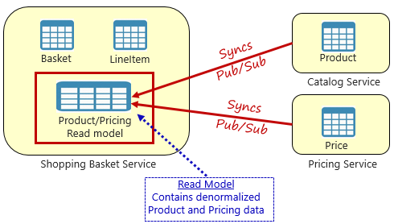
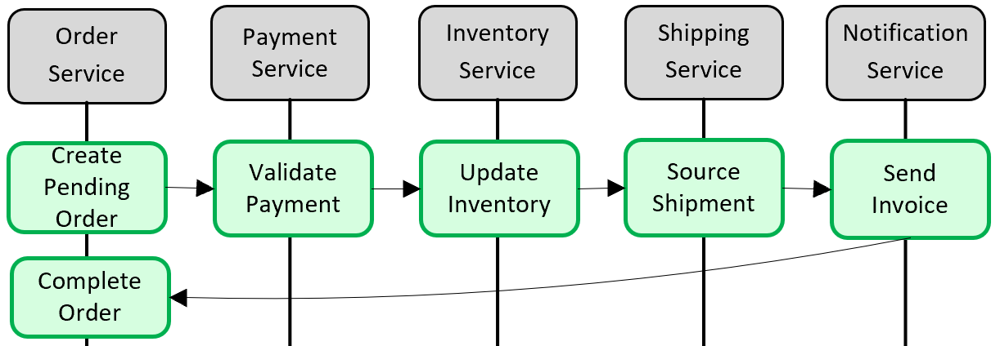
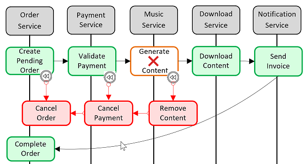
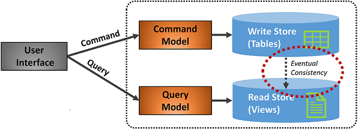

# Cloud-native data patterns

As discussed in chapter 1, a key pillar of a cloud-native system is a microservice-based architecture. Microservices favor small, independent data stores scoped to each service. While isolating data can increase agility, performance, and scalability, it also presents many challenges. In this section, we discuss these challenges and present patterns and best practices to help overcome them.  

## Cross-service queries

While microservices are independent and focus on specific functional capabilities, like inventory, shipping, or ordering, they often require integration with other microservices to execute user operations. Typically what is needed from other services is data. In these scenarios, how does a microservice *query* data that is owned by another microservice?

Figure 5-4 shows the scenario.

**Figure 5-4**. Querying across microservices

In the preceding figure, we see a shopping basket microservice that adds an item to a user's shopping basket. While the data store for this microservice contains basket and lineItem data, it doesn't contain product or pricing data. Instead, those data items are found in the catalog and pricing microservices. This presents a problem. How can the shopping basket microservice add a product to the user's shopping basket when it doesn't have product nor pricing data in its database? 

One option discussed in Chapter 4 is a direct HTTP call from the shopping basket to the catalog and pricing microservices. However, we said direct HTTP calls couple microservices together, reducing their autonomy and diminishing their architectural benefits. We could also send asynchronous messages back and forth across microservices, but that could block an operation that needs a data response to complete.

As you can see, querying data across microservices is complex. A common approach to this problem that removes cross-service dependencies is the [Materialized View Pattern](https://docs.microsoft.com/azure/architecture/patterns/materialized-view), shown in Figure 5-5.

**Figure5-5**. Materialized View Pattern

With this pattern, you place a local data table (known as a *read model*) in the shopping basket service. This table contains a denormalized copy of the data needed from the product and pricing microservices. Copying the data into the shopping basket microservice eliminates the need for expensive cross-service calls. With the data local to the service, you improve service response time and reliability. Additionally, you make the system more resilient by separating data across multiple services. If one service should become unavailable, it will not directly impact other services. Other services can continue operating with data from their own store. 

The catch with this approach is you now have duplicate data in your system. In cloud-native systems, duplicate data isn't considered an [anti-pattern](https://en.wikipedia.org/wiki/Anti-pattern) and is a widely accepted practice. However, one and only one system can be the owner of a dataset.  You'll need to synchronize the read models when the system of record is updated. This is typically done by implementing asynchronous messaging with a publish/subscribe pattern.

## Transactional support

While querying data across microservices is difficult, implementing a transaction across several microservices is even more complex. The inherent challenge of maintaining data consistency for independent data sources in different microservices can't be understated. The lack of distributed transactions in cloud-native applications means that you must manage cross-service transactions programmatically. You move from a world of *immediate consistency* to that of *eventual consistency*. 

Figure 5-6 shows the problem.

**Figure 5-6**. Implementing a transaction across microservices

In the preceding figure, five independent microservices participate in a distributed transaction that creates an order. Each microservice maintains its own data store and implements a local transaction for its store. The local transaction for each individual microservice must succeed, or all must abort and roll back the operation. While built-in transactional support is available inside each of the microservices, there's no support for a distributed transaction across all five services.

Since transactional support is essential to keep the data consistent in each of the microservices, you must construct a distributed transaction *programmatically*.

A popular pattern for adding transactional support is the [Saga pattern](https://blog.couchbase.com/saga-pattern-implement-business-transactions-using-microservices-part/). It's implemented by grouping local transactions together and sequentially invoking each one. If any of the local transactions fail, the Saga aborts the operation and invokes a set of [compensating transactions](https://docs.microsoft.com/azure/architecture/patterns/compensating-transaction) to undo the changes made by the preceding local transactions and restore data consistency. Figure 5-7 shows a failed transaction with the Saga pattern.

**Figure 5-7**. Rolling back a transaction

In the above figure, the *GenerateContent* operation has failed in the music microservice. The Saga invokes compensating transactions (in red) to remove the content, cancel the payment and the order, and return the data for each microservice back to a consistent state.

Saga patterns are typically choreographed as a series of related events, or orchestrated as a set of related commands.

## CQRS pattern

Cloud-native applications often support high-volume data requirements. In these secanairos, traditional data storage techniques can cause performance bottlenecks. CQRS, or [Command and Query Responsibility Segregation](https://docs.microsoft.com/azure/architecture/patterns/cqrs), is an architectural pattern that can help maximize performance, scalability, and security. The pattern separate operations that read data from operations that write data. 

For normal scenarios, you implement a single model (entity and data repository object) that performs *both* read and write data operations.

However, a high volume data scenario might benefit from separate models and data tables for reads and writes. To improve performance, the read operation might query against a highly denormalized representation of the data to avoid expensive repetitive table joins. The *write* operation, known as a *command*, might update against a fully normalized representation of the data. You would then need to implement a mechanism to keep both representations in sync. Typically, whenever the write table is modified, it publishes an event that replicates the data modification to the read table.

Figure 5-8 shows an implementation of the CQRS pattern.

**Figure 5-8**. CQRS implementation

Note in the previous figure how separate command and query models are implemented. Each data write operation is saved to the write store and then propagated to the read store. Pay close attention to how the data propagation process operates on the principle of [eventual consistency](http://www.cloudcomputingpatterns.org/eventual_consistency/). The read model eventually synchronizes with the write model, but there may be some lag in the process.

By implementing separation, reads and writes scale independently. Read operations use a schema optimized for queries, while the writes use a schema optimized for updates. Read queries go against denormalized data, while complex business logic can be applied to the write model. As well, you might impose tighter security on write operations than those concerning reads.

Implementing CQRS can improve application performance for cloud-native services. However, it does result in a more complex design. Apply this principle sparingly to those sections of your application that will most benefit from it.

## Relational vs NoSQL

The impact of [NoSQL](https://www.geeksforgeeks.org/introduction-to-nosql/) technologies for distributed cloud-native systems can't be overstated. The proliferation of new data technologies in this space has disrupted solutions that once exclusively relied on relational databases.

Relational databases have been a prevalent technology for decades. They're mature, proven, and widely implemented. Competing database products, tooling, and expertise abound. Relational databases provide a store of related data tables. These tables have a fixed schema, use SQL (Structured Query Language) to manage data, and support [ACID](https://www.geeksforgeeks.org/acid-properties-in-dbms/) guarantees. 

No-SQL databases refer to high-performance, non-relational data stores. They excel in their ease-of-use, scalability, resilience, and availability characteristics. Instead of joining tables of normalized data, NoSQL stores self-describing (schemaless) data typically in JSON documents. No-SQL databases typically don't provide [ACID](https://www.geeksforgeeks.org/acid-properties-in-dbms/) guarantees beyond the scope of a single database partition.

As a way to understand the differences between these types of databases, consider the [CAP theorem](https://towardsdatascience.com/cap-theorem-and-distributed-database-management-systems-5c2be977950e), a set of principles applied to distributed systems that store state. Figure 5-9 shows the three properties of the CAP theorem.

**Figure 5-9**. The CAP theorem

The theorem states that distributed data systems will offer a trade-off between consistency, availability, and partition tolerance. And, that any database can only guarantee *two* of the three properties:

- *Consistency.* Every node in the cluster will respond with the most recent data, even if the system must block the request until all replicas are updated. If you query a "consistent system" for an item that is updating, you will wait for that response until all replicas successfully update. However, you'll receive the most current data.

- *Availability.* Every node will return a response in a reasonable amount of time, even if that response isn't the most recent data. If you query an "available system" for an item that is updating, you'll get a timely response, even if the update hasn't replicated. 

- *Partition Tolerance.* Guarantees that the system will continue operating if a replica node fails or loses connectivity with other replica nodes. 

Generally speaking, relational databases typically provide consistency and availability, but not partition tolerance. Partitioning a relational database across multiple nodes, such as with sharding, is difficult and can impact performance.

NoSQL databases typically support high availability and partition tolerance, implemented as horizontal scalability. As the CAP theorem specifies, you can only have two of the three properties, and with partition tolerance, you lose the consistency property. 

If replicas were to lose connectivity in a "highly consistent" database cluster, you wouldn't be able to write to the database. The system would reject the write operation as it cannot replicate the change to all of the underlying replicas. Whereas a "highly available" database cluster would allow the write operation and update each replica as it becomes available.

> Care must be taken with these descriptions as some databases support configurations that can *"toggle"* these principles. For example, MySQL can be configured as either consistent and available or available and partition tolerant. 

NoSQL databases are distributed and scale out across commodity servers. This approach provides great availability, both within and across geographical regions at a reduced cost. You partition and replicate data across these machines, or nodes, providing redundancy and fault tolerance. The downside is consistency. A change to data on one NoSQL node can take some time to propagate to other nodes. Typically, a NoSQL database node will provide an immediate response to a query - even if the data that is presented is stale and hasn't updated yet.

This kind of result is known as [eventual consistency](http://www.cloudcomputingpatterns.org/eventual_consistency/), a characteristic of distributed data systems where ACID transactions aren't supported. It's a brief delay between the update of a data item and time that it takes to propagate that update to each of the replica nodes. Under normal conditions, the lag is typically short, but can increase when problems arise. For example, what if you were to update a product item in a NoSQL database in the United States, but query that same data item from a replica node in Europe? You would receive the earlier product information, until the European node has updated the product change. By immediately returning a query result and not waiting for all replica nodes to update, you gain enormous scale and volume, but with the possibility of presenting older data.

The are four basic types of NoSQL databases: 

- *Document Store* (mongodb, couchdb, couchbase) - Store data and corresponding metadata non-relationally in denormalized JSON-based documents inside the database.

- *Key/Value Store* (redis, riak, memcached) - Store data in simple key-value pairs. System operations are performed against a unique access key that maps to a value of user data.

- *Wide-Column Store* (hbase, Cassandra) - Store related data in a columnar format as a set of nested-key/value pairs within a single column with data typically retrieved as a single unit without having to join multiple tables together.

- *Graph stores* (neo4j, titan) - Store data as a graphical representation within a node along with edges that specify the relationship between the nodes.

Based upon specific data needs, a cloud-native-based microservice can either implement a relational, or a NoSQL datastore or both.

|  Consider a NoSQL datastore when: | Consider a relational database when: | 
| :-------- | :-------- |
| You have high volume workloads that require large scale | Your workload volume is consistent and requires medium to large scale |
| Your workloads do not require ACID guarantees |  ACID guarantees are required |
| Your data is dynamic and frequently changes | Your data is predictable and highly structured |
| Data can be expressed without relationships | Data is best expressed relationally |  
| You need fast writes and write saftey is not critical | Write safety is a requirement |  
| Data retrieval is simple and tends to be flat | You work with complex queries and reports|
| Your data requires a wide geographic distribution | Your users are more centralized | 
| Your application will be deployed to commodity hardware, such as with public clouds | Your application will be deployed to large, high-end hardware | 
|||

Next, we look at how data storage requirements for cloud-natve systems can be implemented in the Azure cloud.

>[!div class="step-by-step"]
>[Previous](distributed-data.md)
>[Next](azure-data-storage.md)
