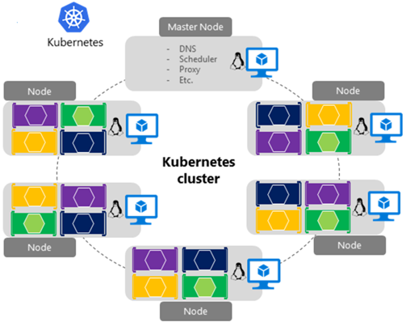

# Cloud-native communication patterns

When constructing a cloud native system, communication across services is a significant design decision. For example, how does a front-end client application communicate with a microservices backend? And how do backend microservices communicate with each other? What are the principles, patterns, and best practices to consider when implementing communication in cloud-native applications?

## Communication considerations

In a traditional monolithic application, functionality is implemented in a single code base. The code executes in the same executable space (process) within the operating system. This approach can have performance advantages as everything runs together in shared memory, but results in tightly coupled code that becomes difficult to maintain, evolve, and scale.

Cloud-native systems implement a microservice-based architecture with many small, independent services. Each service executes in a separate process and is typically deployed in a container that runs inside a *cluster*. 

A cluster represents a pool of virtual machines that are federated together to form a highly available environment. They're managed with an orchestration tool, which is responsible for deploying and managing the containerized microservices. Figure 4-1 shows a Kubernetes cluster deployed in the Azure cloud with the fully managed [Azure Kubernetes Services](https://docs.microsoft.com/azure/aks/intro-kubernetes).

**Figure 4-1**. A Kubernetes cluster in Azure

Inside the cluster, microservices communicate among each other with APIs and messaging technologies.

While they provide many benefits, microservices are no free lunch. Local in process method calls between components are now replaced with network calls. Each service must communicate over a network protocol, which adds complexity to your system. 

- Network congestion, latency, and transient faults are a constant concern.

- Resiliency (that is, retrying failed requests) is essential.

- Some calls must be [idempotent](https://www.restapitutorial.com/lessons/idempotency.html).

- Each service must authenticate and authorize calls.

- Each message must be serialized and then deserialized - which can be expensive.

- Message encryption/decryption become considerations.

The book [.NET Microservices: Architecture for Containerized .NET Applications](https://docs.microsoft.com/dotnet/standard/microservices-architecture/) provides an in-depth coverage of communication patterns for microservice applications. In this chapter, we provide a high-level overview of these patterns along with implementation options available in the Azure cloud.

In this chapter, we'll first address communication between front-end applications and back-end microservices and then to microservice-to-microservice communication.

>[!div class="step-by-step"]
>[Previous](centralized-configuration.md)
>[Next](front-end-communication.md)
