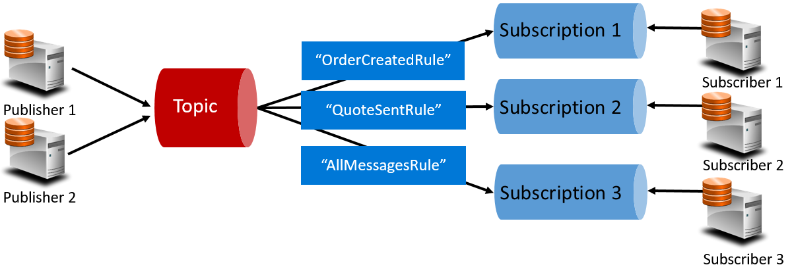

# Cross-service communication

Moving from the front-end client, we now address communication across the backend core microservices, or microservice-to-microservice communication.

When constructing a cloud native application, you'll want to be sensitive to how backend services communicate with each other. Ideally, the less cross-service communication, the better. However, avoidance isn't always possible as backend services often rely on one another to complete an operation.

There are several widely accepted approaches to implementing cross-service communication. The type of *communication interaction* will often determine the best approach.

Consider the following interaction types:

- *Query* – when a calling service requires a response from a called service, such as, "Hey, give me the number of customer orders for a given date range."

- *Command* – when the calling service needs another service to execute an action but doesn't require a response, such as, "Hey, just ship this order."

- *Event* – when one service (the publisher) raises an event of a state change or notification that an action has occurred. Other services, called subscribers, who are interested, can react to the event appropriately. The publisher and the subscribers aren't aware of each other.

Microservice systems typically use a combination of these interaction types when executing operations that require cross-service interaction. Let's take a close look at each and how you might implement them.

## Queries

Often, one microservice might need to *query* another, requiring an immediate response to complete an operation. For example, a shopping basket microservice may need product information and a price to add an item to its basket. There are a number of approaches for implementing query operations.

### Request/Response Messaging

One option for implementing this scenario is direct HTTP calls from the calling microservice to those it needs to query, shown in Figure 4-9.

**Figure 4-9**. Direct HTTP communication

While direct HTTP calls between microservices are relatively simple to implement, care should be taken to minimize this practice. Because what were once self-contained, independent services, able to evolve independently and deploy frequently, now become coupled to each other. As coupling among microservices increase, their architectural benefits diminish.

While performing a request that executes infrequently and makes a single synchronous HTTP network call might be acceptable, high-volume calls that invoke multiple services can increase latency and negatively impact the performance, scalability, and availability of your system. Even worse, a long series of direct HTTP communication can lead to deep, complex chains of synchronous microservices calls, shown in Figure 4-10:

**Figure 4-10**. Chaining HTTP queries

While somewhat exaggerated, you can certainly imagine the risk in the design shown in the previous image. What happens if Step \#3 fails? Or Step \#8 fails? How do you recover? What if Step \#6 is slow because the underlying service is busy? How do you continue? Even if all works correctly, think of the latency this call would incur, which is the sum of the latency of each step.

The high degree of coupling shown in the previous image suggests that the services weren't modeled as optimally as they could be. It would behoove the team to invest time rationalizing the design with which the services were decomposed.

### Materialized View pattern

One option for reducing such coupling is implementing the [Materialized View pattern](https://docs.microsoft.com/azure/architecture/patterns/materialized-view), where a microservice stores a local, denormalized copy of the data it needs that's owned by other services. Instead of the Shopping Basket calling the Product Catalog and Pricing microservices, it has its own local copy of that data. This pattern removes unnecessary coupling while improving response time and reliability. We explore this pattern and other data concerns in Chapter 5.

### Service Aggregator Pattern

Another option for such a workflow orchestration might be an [Aggregator Service](https://devblogs.microsoft.com/cesardelatorre/designing-and-implementing-api-gateways-with-ocelot-in-a-microservices-and-container-based-architecture/), shown in purple in Figure 4-11.

**Figure 4-11**. Aggregator service

The Aggregator service isolates an operation that makes calls to multiple backend services, centralizing its logic into an orchestration. Here, the purple Checkout Aggregator Microservice orchestrates the workflow for the Checkout operation, which includes calls to multiple services in a sequenced order.

### Request/Reply Pattern

Another approach to decouple synchronous HTTP messages is to implement a [Request-Reply Pattern](https://www.enterpriseintegrationpatterns.com/patterns/messaging/RequestReply.html) using queuing functionality from a message broker. Communication using a queue is always a one-way channel, with a producer sending the message and consumer receiving it. With this pattern, both a request queue and response queue are implemented, shown in Figure 4-12.

**Figure 4-12**. Request-reply pattern

Here, the message producer creates a query-based message that contains a unique correlation ID and places it into a request queue. The consuming service dequeues the messages, processes it and places the response into the response queue with the same correlation ID. The producer service dequeues the message, matches it with the correlation ID and continues processing. We cover queues in detail in the next section.

## Commands

Sometimes, a microservice may require another microservice to perform an action. For example, the Ordering microservice may need the Shipping microservice to create a shipment for an approved order. Often called a *command message*, the microservice invoking the action, called a Producer, makes a command to another service, the Consumer, by sending it a message, shown in Figure 4-13.

**Figure 4-13**. Command interaction with a queue

Often, the Producer doesn't require a response and can *fire-and-forget* the message. If a reply is needed, the Consumer sends a separate message back to Producer on another channel. A command message is best sent asynchronously with the preferred infrastructure being a lightweight message broker that supports a message queue. In the previous diagram, note how a queue separates and decouples both services.

A message queue is an intermediary construct through which a producer and consumer pass a message. Queues implement an asynchronous, point-to-point messaging pattern in that the Producer knows where a command needs to be sent and routes appropriately. The queue guarantees that a message is processed by exactly one of the consumer instances that are reading from the channel. In this scenario, either the producer or consumer service can scale out without affecting the other. As well, technologies can be disparate on each side, meaning that we might have a Java Producer and Golang Consumer. 

The Azure cloud supports two types of queues: Azure Storage Queues and Azure Service Bus Queues.

### Queue messaging in the Azure cloud

### Azure Storage Queues

Azure storage queues offer a simple queueing infrastructure that is fast, affordable, and backed by Azure storage accounts.

A service of the Azure storage infrastructure, storage queues feature a REST-based queuing mechanism with reliable and persistent messaging between services. They provide a minimal feature set but are inexpensive and enable the storage of millions of messages, with capacity ranging up to 500 TB. A single message can be up to 64 KB in size.

You can access messages from anywhere in the world via authenticated calls using HTTP or HTTPS. Storage queues can scale out to large numbers of concurrent clients to handle traffic spikes.

That said, there are limitations with the service:

- Message order isn't guaranteed.

- A message can only persist for seven days before it's automatically removed.

- Support for state management, duplicate detection, or transactions isn't available.

Figure 4-14 shows the hierarchy of an Azure Storage Queue.

**Figure 4-14**. Storage queue hierarchy

Note in Figure 4-14 how storage queues are exposed as a service that sits on top of an Azure Storage account, which is where the messages are stored.

To make it easier for development teams, Microsoft provides a large variety of client and server-side libraries for Storage queue processing, reaching across every major platform, including .NET, Java, JavaScript, Ruby, Python, and many more.

Again, Storage queues are economical: you only pay for the actual storage of the messages. There are no fixed hourly charges as found with other cloud-based services.

Storage queues are a great solution when a queue size will exceed 80 GB, or a simple feature set is acceptable.

### Azure Service Bus Queues

For more complex messaging requirements, consider Azure Service Bus queues.

Sitting atop a robust message infrastructure, [Azure Service Bus](https://docs.microsoft.com/azure/service-bus-messaging/service-bus-messaging-overview) supports a *brokered messaging model*. Messages are reliably stored in a broker (the queue) until received by the consumer. The queue guarantees First-In/First-Out (FIFO) message delivery, respecting the order in which messages were added to the queue.

The size of a message can be much larger, up to 256 KB, and is persisted in the queue for an unlimited period of time. Service Bus supports not only HTTP-based calls, but also provides full support for the [AMPQ protocol](https://docs.microsoft.com/azure/service-bus-messaging/service-bus-amqp-overview), which is an open-standard across vendors that supports a binary protocol and higher degrees of reliability.

Service Bus provides a rich set of features, including full [transaction support](https://docs.microsoft.com/azure/service-bus-messaging/service-bus-transactions) when sending or receiving multiple messages and a [duplicate detection feature](https://docs.microsoft.com/azure/service-bus-messaging/duplicate-detection) with which the queue automatically discards a message that has already been sent. If a producer is in doubt, it can resend the same message and Service Bus guarantees that only one copy will be processed. It also guarantees "at most once delivery" per message without the need for you to build additional infrastructure components.

Another enterprise feature is sessions and partitioning. [Sessions](https://codingcanvas.com/azure-service-bus-sessions/) provide a way to group related messages together so they can be processed together. This feature might be helpful in a workflow scenario where a group of related messages are processed in their entirety with the operation completed at the end. To take advantage, sessions must be explicitly enabled for the queue and each related messaged must contain the same session ID.

However, there are some important caveats: Service Bus queues size is limited to 80 GB, which is much smaller than what's available from store queues. Additionally, Service Bus queues are more expensive with a base cost and charge per operation.

Figure 4-15 outlines the high-level architecture of a Service Bus queue.

**Figure 4-15**. Service Bus queue

Note the point-to-point relationship in the Figure 4-15 above where two identical providers are enqueuing messages into a single Server Bus queue and how each message is consumed by one (and only one) of the three identical consumers on the right. Next, we discuss how to implement messaging where different consumers may all be interested the same message.

## Events

As discussed, asynchronous messaging is an effective way to decouple senders and consumers and avoid blocking while waiting for a response. However, a dedicated message queue for each consumer wouldn't scale well when you may have many different consumers interested in the same message. A better approach for these scenarios is a [Publish/Subscribe](https://docs.microsoft.com/azure/architecture/patterns/publisher-subscriber) pattern, which enables you to implement [event-based communication](https://docs.microsoft.com/dotnet/standard/microservices-architecture/multi-container-microservice-net-applications/integration-event-based-microservice-communications).

Eventing is a two-step process. To start, a microservice can raise an event and publish it to a message broker, making it available to other services. Then, any other microservice can ask to be notified whenever the event is raised by subscribing to the event in the message broker. As a best practice, development teams should encapsulate the message broker plumbing inside a custom *EventBus* component that can expose the messaging operations. Figure 4-16 shows Microservice \#1 publishing an event to an *EventBus*, with Microservices \#2 and \#3 subscribing to and receiving the event.

**Figure 4-16**. Event-Driven messaging

In the previous scenario, Microservices \#2 and \#3 independently receive and operate on an event with no knowledge of each other, nor of Microservice \#1. They simply wait for a registered event to be published to the event bus and then act upon it.

Typically, with eventing, we move from queuing technology to *topics*. A [topic](https://docs.microsoft.com/azure/service-bus-messaging/service-bus-dotnet-how-to-use-topics-subscriptions) is similar to a queue but supports a one-to-many messaging pattern where multiple subscribers can choose to receive a message that is sent by a publisher. Figure 4-17 shows a topic architecture.

**Figure 4-17**. Topic architecture

In Figure 4-17, note how publishers send messages to the topic. But messages aren't received directly from the topic. Instead, the topic is responsible for forwarding messages to the subscriptions for each registered subscriber. Each subscriber then can receive messages from its corresponding subscription. Think of each subscription as a standalone queue. An important component here is the *Rule (dark blue boxes)*. The rule acts as a filter determining messages that are forwarded to a specific subscription, enabling a subscription to listen only for messages that are important to it. In the previous figure, if an "OrderCreated" event is published, the topic would send it to Subscription \#1 and Subscription \#3, but not to Subscription \#2 as the message isn't a "QuoteSent".

The Azure cloud supports two types of topic mechanisms: Azure Service Bus Topics and Azure EventGrid.

### Topic messaging in the Azure cloud

### Azure Service Bus Topics

Sitting on top of the same robust brokered message model of Azure Service Bus queues are [Azure Service Bus Topics](https://docs.microsoft.com/azure/service-bus-messaging/service-bus-dotnet-how-to-use-topics-subscriptions). A topic can receive messages from multiple independent publishers and can send messages to up to 2,000 subscribers. As well, subscriptions can be dynamically added or removed at runtime without stopping the system or recreating the topic.

Many of the advanced features from Azure Service Bus that we saw for queues are also available for topics, including [Duplicate Detection](https://docs.microsoft.com/azure/service-bus-messaging/duplicate-detection), [Transaction support](https://docs.microsoft.com/azure/service-bus-messaging/service-bus-transactions), and [Partitioning](https://docs.microsoft.com/azure/service-bus-messaging/service-bus-partitioning). [Scheduled Message Delivery](https://docs.microsoft.com/azure/service-bus-messaging/message-sequencing) is a feature where a message is tagged with a specific time for processing and won't appear in the topic before then. Finally, [Message Deferral](https://docs.microsoft.com/azure/service-bus-messaging/message-deferral) is an option where you can defer retrieval of a message to a later time. Typically used in workflow processing scenarios where operations are processed in a particular order, you can postpone processing of received messages until prior work has been completed.

A conventional Service Bus topic (or queue) is handled by a single message broker and stored in a single messaging store. However, [Service Bus Partitioning](https://docs.microsoft.com/azure/service-bus-messaging/service-bus-partitioning) enables topics and queues to be partitioned across multiple message  brokers and message stores. Partitioning means that the overall throughput of a partitioned entity is no longer limited by the performance of a single message broker or messaging store. In addition, a temporary outage of a messaging store doesn't render a partitioned queue or topic unavailable. Partitioned queues and topics can contain all advanced Service Bus features, such as support for transactions and sessions.

### Azure Event Grid

While Azure Service Bus is a battle-tested messaging broker, supporting both traditional queues and topics with a full set of enterprise features, Azure Event Grid is the new kid on the block.

At first glance, Event Grid may look like just another topic-based messaging system. However, it's different in many ways. Focused on event-driven workloads, it enables real-time event processing, deep Azure integration, and an open-platform - all on serverless infrastructure. It's designed for contemporary cloud native and serverless applications

As a centralized *eventing backplane*, or pipe, Event Grid lets you react to events originating inside Azure resources as well as those events from your own services and applications.

Event notifications are published to an Event Grid Topic, which, in turn, routes each event to a Subscription. Subscribers map to subscriptions and consume the events. Similar to Service Bus, Event Grid supports a *filtered subscriber model* wherein a Subscription can set rules as to what events it wishes to receive. Event Grid provides fast throughput with a guarantee of 10 million events per second enabling near real-time delivery - far more than what Azure Service Bus can generate.

One of the sweet spots for Event Grid is its deep integration into the fabric of Azure infrastructure. An Azure resource, such as Cosmos DB, can directly publish built-in events to other interested Azure resources without the need for custom code. Event Grid can publish events from Azure resources at the Subscription, Resource Group, or Service levels allowing developers to gain fine-grained control over the lifecycle of cloud resources. However, Event Grid isn't limited to Azure. It's an open platform that can consume custom HTTP events published from applications or third-party services and route events to external subscribers.

When publishing and subscribing to native events from Azure resources, no coding is required. With simple configuration, you can integrate events from one Azure resource to another leveraging built-in Topics and Subscriptions as plumbing. Figure 4-18 shows the anatomy of Event Grid.

**Figure 4-18**. Event Grid anatomy

A major difference between EventGrid and Service Bus is the underlying *message exchange pattern*.

Service Bus implements an older style *pull model* in which the downstream subscriber actively polls the topic subscription for new messages. On the upside, this approach gives the subscriber full control of the pace at which it processes messages as it controls when and how many messages it wants to process at any given time. Unread messages remain in the subscription until processed. A significant shortcoming of this approach is the latency between the time the event is generated and the polling operation that pulls that message to the subscriber for processing. Also, the overhead of constant polling for the next event needlessly consumes resources and money.

EventGrid, however, is different. It implements a *push model* in which events are sent to the EventHandlers as received, giving you near real-time event delivery. It also reduces cost as code is triggered only when it's needed to consume an event – not continually as with polling. That said, an event handler must be able to handle the incoming load and provide throttling mechanisms to protect itself from becoming overwhelmed. Many Azure services that consume these events, such as Azure Functions, Logic Apps, and so on, support automatic autoscaling capabilities that can handle the required processing capacity.  Most interestingly, Event Grid is a fully managed serverless cloud service. It dynamically scales based on your traffic and charges you only for your actual usage, not pre-purchased capacity. The first 100,000 operations per month are free – operations being defined as event ingress (incoming event notifications), subscription delivery attempts, management calls, and filtering by subject. With 99.99% availability, EventGrid guarantees the delivery of an event within a 24-hour period, with built-in retry functionality for unsuccessful delivery. Undelivered messages can be moved to a "dead-letter" queue for resolution.  Unlike Azure Service Bus, Event Grid is tuned for fast performance and doesn't support features like ordered messaging, transactions, and sessions.

### Streaming messages in the Azure cloud

### Azure Event Hubs

While Azure Service Bus and Event Grid provide great support for applications that expose single, discrete events (that is, a new document has been inserted into the underlying Cosmos DB), what is the best way to process a *stream of related events*? [Event streams](https://msdn.microsoft.com/magazine/dn904671.aspx?f=255&MSPPError=-2147217396) are more complex as they're typically time-ordered, interrelated and must be processed as a group.

Azure Event Hub is a data streaming platform and event ingestion service that collects, transforms, and stores events. Fine-tuned to capture streaming data, such as continuous event notifications emitted from a telemetry context, it's highly scalable and can store and [process millions of events per second](https://docs.microsoft.com/azure/event-hubs/event-hubs-about). It typically plays the role of the front door for an event pipeline, decoupling the ingest of the event stream from the consumption of those events, shown in Figure 4-19.

**Figure 4-19**. Azure Event Hub

Event Hub supports low latency and configurable time retention. Differing from queues and topics, Event Hubs keep event data after it's been read by a consumer. This feature enables other data analytic services, both internal and external, to replay the data for further analysis. Events stored in event hub are only deleted upon expiration of the retention period, which is one day by default, but configurable.

Event Hub support a number of protocols for publishing events including HTTPS, AMQP, and even Kafka 1.0, which enables existing [Kafka applications to communicate with Event Hub](https://docs.microsoft.com/azure/event-hubs/event-hubs-for-kafka-ecosystem-overview) using the Kafka protocol, providing an alternative to provisioning and managing large Kafka clusters.

Event Hubs implement message streaming through a [partitioned consumer model](https://docs.microsoft.com/azure/event-hubs/event-hubs-features) in which each consumer only reads a specific subset, or partition, of the message stream. This pattern enables tremendous horizontal scale for event processing and provides other stream-focused features that are unavailable in queues and topics. A partition is an ordered sequence of events that is held in an event hub. As newer events arrive, they're added to the end of this sequence. Figure 4-20 shows partitioning in an Event Hub.

**Figure 4-20**. Event Hub partitioning

Instead of reading from the same resource, each consumer group reads across a subset, or partition, of the message stream. 

For applications that must stream numbers of events, Azure Event Hub can be a robust and affordable solution.

## Summary

## Additional resources

    https://aka.ms/liftandshiftwithcontainersebook

>[!div class="step-by-step"]
>[Previous](front-end-communication.md)
>[Next](resilient-communications.md) <!-- Next Chapter -->
