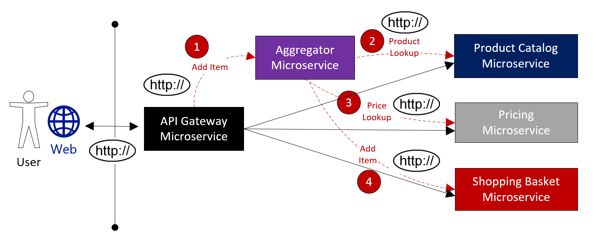

# Cloud-native data patterns

[!INCLUDE [book-preview](../../../includes/book-preview.md)]

While decentralized data can lead to improved performance, scalability, and cost savings, it also presents many challenges. Querying for data across microservices is complex. A transaction that spans microservices must be managed programmatically as distributed transactions aren't supported in cloud-native applications. You  move from a world of *immediate consistency* to *eventual consistency*.

We discuss these challenges now.

## Cross-service queries

How does an application query data that is spread across many independent microservices?

Figure 5-4 shows this scenario.

**Figure 5-4**. Querying across microservices

Note how in the previous figure we see a shopping basket microservice that adds an item to a user's shopping cart. While the shopping basket's data store contains a basket and lineItem table, it doesn't contain product or pricing data as those items are found in the product and price microservices. To add an item, the shopping basket microservice needs product data and pricing data. What are options to obtain the product and pricing data?

Figure 5-5 shows the shopping basket microservice making a direct HTTP call to both the product catalog and pricing microservices.

**Figure 5-5**. Direct HTTP communication

While feasible to implement, in chapter 4 we discussed how direct HTTP calls across microservices couple the system and aren't considered a good practice.

We could implement an aggregator microservice shown in Figure 5-6.

**Figure 5-6.** Aggregator microservice

While this approach encapsulates the business operation workflow in an individual microservice, it adds complexity and still results in direct HTTP calls.

A common approach for executing cross-service queries uses the [Materialized View Pattern](https://docs.microsoft.com/azure/architecture/patterns/materialized-view), shown in Figure 5-7.

**Figure5-7**. Materialized View Pattern

With this pattern, you directly place a local table (known as a *read model*) in the shopping basket service that contains a denormalized copy of the data that is needed from the product and pricing microservices. Placing that data inside the shopping basket microservice eliminates the need for invoking expensive cross-service calls. With the data local to the service, you improve response time and reliability.

The catch with this approach is you now have duplicate data in your system. In cloud-native systems, duplicate data isn't considered an [anti-pattern](https://en.wikipedia.org/wiki/Anti-pattern) and is commonly implemented in cloud-native systems. However, one and only one system can be the owner of any dataset, and you'll need to implement a synchronization mechanism for the system of record to update all of the associated read models, whenever a change to its underlying data occurs.

## Transactional support

While queries across microservices are challenging, implementing a transaction across microservices can be complex. The inherent challenge of maintaining data consistency across data sources that reside in different microservices can't be understated. Figure 5-8 shows the problem.

**Figure 5-8**. Implementing a transaction across microservices

Note how in the previous figure five independent microservices all participate in a distributed *Create Order* transaction. However, the transaction for each of the five individual microservices must succeed, or all must abort and roll back the operation. While built-in transactional support is available inside each of the microservices, there's no support for a distributed transaction across all five services.

Since transactional support is essential for this operation to keep the data consistent in each of the microservices, you have to programmatically construct a distributed transaction.

A popular pattern for programmatically adding transactional support is the [Saga pattern](https://blog.couchbase.com/saga-pattern-implement-business-transactions-using-microservices-part/). It's implemented by grouping local transactions together and sequentially invoking each one. If a local transaction fails, the Saga aborts the operation and invokes a set of [compensating transactions](https://docs.microsoft.com/azure/architecture/patterns/compensating-transaction) to undo the changes made by the preceding local transactions. Figure 5-9 shows a failed transaction with the Saga pattern.

**Figure 5-9**. Rolling back a transaction

Note how in the previous figure the *GenerateContent* operation has failed in the music microservice. The Saga invokes compensating transactions (in red) to remove the content, cancel the payment, and cancel the order, returning the data for each microservice back to a consistent state.

Saga patterns are typically choreographed as a series of related events or orchestrated as a set of related commands.

## CQRS pattern

CQRS, or [Command and Query Responsibility Segregation](https://docs.microsoft.com/azure/architecture/patterns/cqrs), is an architectural pattern that separate operations that read data from those that write data. This pattern can help maximize performance, scalability, and security.

In normal data access scenarios, you implement a single model (entity and repository object) that perform *both* read and write data operations.

However, a more advanced data access scenario might benefit from separate models and data tables for reads and writes. To improve performance, the read operation, known as a *query*, might query against a highly denormalized representation of the data to avoid expensive repetitive table joins. Whereas the *write* operation, known as a *command*, might update against a fully normalized representation of the data. You would then need to implement a mechanism to keep both representations in sync. Typically, whenever the write table is modified, it raises an event that replicates the data modification to the read table.

Figure 5-10 shows an implementation of the CQRS pattern.

**Figure 5-10**. CQRS implementation

Note how in the previous figure separate command and query models are implemented. Moreover, each data write operation is saved to the write store and then propagated to the read store. Pay close attention to how the propagation process operates on the principle of [eventual consistency](https://www.cloudcomputingpatterns.org/eventual_consistency/), whereas the read model eventually synchronizes with the write model, but there may be some lag in the process.

By implementing separation, you have the ability to scale reads and writes separately. As well, you might impose tighter security on write operations than those concerning reads.

Typically, CQRS patterns are applied to limited sections of your system based upon specific needs.

## Relational vs NoSQL

The impact of [NoSQL](https://www.geeksforgeeks.org/introduction-to-nosql/) technologies can't be overstated, especially for distributed cloud-native systems. The proliferation of new data technologies in this space has disrupted solutions that once exclusively relied on relational databases.

On the one side, relational databases have been a prevalent technology for decades. They're mature, proven, and widely implemented. Competing database products, expertise and tooling abounds. Relational databases provide a store of related data tables. These tables have a fixed schema, use SQL (Structured Query Language) to manage data and have [ACID](https://www.geeksforgeeks.org/acid-properties-in-dbms/) (also known as Atomicity, Consistency, Isolation, and Durability) guarantees.

No-SQL databases, on the other side, refer to high-performance, non-relational data stores. They excel in their ease-of-use, scalability, resilience, and availability characteristics. Instead of joining tables of normalized data, NoSQL stores self-describing (schemaless) data typically in JSON documents. They don't offer [ACID](https://www.geeksforgeeks.org/acid-properties-in-dbms/) guarantees.

A way to understand the differences between these types of databases can be found in the [CAP theorem](https://towardsdatascience.com/cap-theorem-and-distributed-database-management-systems-5c2be977950e), a set of principles that can be applied to distributed systems that store state. Figure 5-11 shows the three properties of the CAP theorem.

**Figure 5-11**. The CAP theorem

The theorem states that any distributed data system will offer a trade-off between consistency, availability, and partition tolerance, and that any database can only guarantee two of the three properties:

- *Consistency*: every node in the cluster will respond with the most recent data, even if it requires blocking a request until all replicas are correctly updated.

- *Availability*: every node will return a response in a reasonable amount of time, even if that response isn't the most recent data.

- *Partition Tolerance*: guarantees that the system will continue operating if a node fails or loses connectivity with another.

Relational databases exhibit consistency and availability, but not partition tolerance. Partitioning a relational database, such as sharding, is difficult and can impact performance.

On the other hand, NoSQL databases typically exhibit partition tolerance, known as horizontal scalability, and high availability. As the CAP theorem specifies, you can only have two of the three principles, and you lose the  consistency property.

NoSQL databases are distributed and commonly scaled out across commodity servers. Doing so can provide great availability, both within and across geographical regions at a reduced cost. Data can be partitioned and replicated across these machines, or nodes, providing redundancy and fault tolerance. The downside is consistency. A change to data on one NoSQL node can take some time to propagate to other nodes. Typically, a NoSQL database node will provide an immediate response to a query, even if the data that it is presenting is stale and has not been updated yet.

This is known [eventual consistency](https://www.cloudcomputingpatterns.org/eventual_consistency/), a characteristic of distributed data systems where ACID transactions aren't supported. It's a brief delay between the update of a data item and time that it takes to propagate that update to each of the replica nodes. If you update a product item in a NoSQL database in the United States, but at same time query that same data item from a replica node in Europe, you might retrieve the earlier product information - until the European node has been updated with product change. The trade-off is that by giving up [strong consistency](https://en.wikipedia.org/wiki/Strong_consistency),  waiting for all replica nodes to update before returning a query result, you can support enormous scale and traffic volume, but with the possibility of presenting older data.

NoSQL databases can be categorized by the following four models:

- *Document Store* (MongoDB, CouchDB, Couchbase): data (and corresponding metadata) is stored non-relationally in denormalized JSON-based documents inside the database.

- *Key/Value Store* (Redis, Riak, memcached): data is stored in simple key-value pairs with system operations performed against a unique access key that is mapped to a value of user data.

- *Wide-Column Store* (HBase, Cassandra): related Data is stored in a columnar format as a set of nested-key/value pairs within a single column with data typically retrieved as a single unit without having to join multiple tables together.

- *Graph stores* (neo4j, titan): data is stored as a graphical representation within a node along with edges that specify the relationship between the nodes.

NoSQL databases can be optimized to deal with large-scale data, especially when the data is relatively simple. Consider a NoSQL database when:

- Your workload requires a large scale and high concurrency.
- You have large numbers of users.
- Your data can be expressed simply without relationships.
- You need to geographically distribute your data.
- You don't need ACID guarantees.
- Will be deployed to commodity hardware.

Then, consider a relational database when:

- Your workloads require medium to large scale.
- Concurrency isn't a major concern.
- ACID guarantees are needed.
- Data is best expressed relationally.
- Your application will be deployed to large, high-end hardware.

Next, we look at data storage in the Azure cloud.

>[!div class="step-by-step"]
>[Previous](distributed-data.md)
>[Next](azure-data-storage.md)
