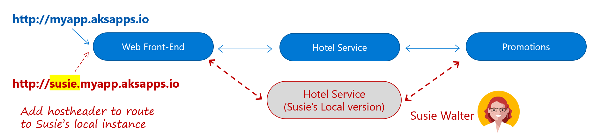

# Defining Cloud Native

Stop what you’re doing, and ping 10 of your colleagues. Ask them to define the term “Cloud Native.” Good chance you’ll get about 8 different answers. What’s even more interesting is that 6 months from now, as technology and cloud native technologies evolve, so will their definition.

Cloud native is about thinking differently on how we construct and evolve critical business systems.

Consider the [definition](https://github.com/cncf/foundation/blob/master/charter.md) from the Cloud Native Computing Foundation:

- Cloud native technologies empower organizations to build and run scalable applications in modern, dynamic environments such as public, private, and hybrid clouds. Containers, service meshes, microservices, immutable infrastructure, and declarative APIs exemplify this approach.

- These techniques enable loosely coupled systems that are resilient, manageable, and observable. Combined with robust automation, they allow engineers to make high-impact changes frequently and predictably with minimal toil.

Applications and their underlying systems have become increasingly complex with users demanding more and more. The new expectation is up-to-the-minute functionality, instant scalability and absolutely no downtime. Performance problems, long-standing errors and the inability to move fast are no longer acceptable to your business and customers.

Among many things, cloud native is about *speed* and *agility*. Business critical systems are evolving from an enabler of business capability to a weapon of strategic transformation, accelerating business velocity and growth. Now, it’s imperative to get ideas to market immediately. In Figure 1-1, shown below, consider three pioneers who have implemented these techniques and ponder the speed, agility and scalability they have achieved.

**Figure 1-1**. Companies embracing cloud native agility

As you can see, eBay, Netflix and Uber expose systems that consist of hundreds of self-contained isolated microservices. Impressively, they can rapidly respond to market conditions by instantaneously updating specific functionality without having to fully deploy the entire system.

At its core, this agility derives from the architecture and infrastructure upon which the system is constructed, which include the following six capabilities, as shown below in Figure 1-2.

**Figure 1-2**. Capabilities of cloud native apps

As each of these capabilities are key to a cloud native system, let’s take some time to visit each.

## Thinking in terms of the cloud…

Cloud native systems are *all about the cloud*: Born, developed and deployed in the cloud – specifically designed to thrive in a cloud environment. Development teams design these systems from the ground-up in a highly-dynamic, virtualized environment. They are built to exploit the platform and infrastructure capabilities of the cloud delivery model: Elasticity, resilience, redundancy, orchestration and on-demand features. 

The focus moves to “*how”* the application is created and deployed, not so much “*where*.” Cloud native apps make extensive use of PaaS (Platform as a Service) infrastructure and managed services. 

Figure 1-3, shown below depicts the range of the full-featured compute services available in Azure. As you move from the top of the hierarchy to the bottom, your focus shifts away infrastructure plumbing to business functionality. Cloud native systems typically reside at the lower levels of the stack leveraging containers, PaaS and Serverless environments.

**Figure 1-3**. Azure compute stack

Cloud native systems typically view the underlying infrastructure as “*disposable*” - provisioned in minutes and resized, scaled, moved or destroyed whenever necessary – all done through automation.

Consider the agreement of *Cattle vs. Pets.* In a traditional data center, servers are treated as *Pets*. They are typically a physical machine, given a meaningful name and cared for. You scale by adding more resources to the same machine (scaling up). If one becomes sick, it is nursed back to health. When one becomes unavailable, everyone notices.

On the other hand, the *Cattle* service model is quite different. Provisioned as a virtual machine or container, each virtual instance is identical and assigned an identifier such as Service-01, Service-02, etc. When one has a problem, you automatically replace it with another, i.e., Service-03. When scaling, you “scale out” by creating more of them. When one become unavailable, nobody notices.

The cattle model moves toward *immutable infrastructure* in which servers are not repaired or modified. If a server fails or requires updating it is destroyed and a new one provisioned – all done via automation.

Cloud native systems assume the infrastructure is dynamic, i.e., the Cattle model, and continue to run as the infrastructure moves, resizes and upgrades. They are able to scale up, down, in or out and move across servers regardless of the machines upon which they are running.

As stated earlier, many companies view the cloud and associated cloud native systems as a competitive advantage – move fast, pivot quickly, expand immediately and fail fast - while reducing operational and hardware costs.

The Azure cloud platform provides a highly elastic infrastructure with a rich set of services, including automatic scaling, self-healing and monitoring capabilities.

## Thinking in terms of microservices…

Much has been written about microservices, an increasingly popular architectural style for building modern services. An excellent and comprehensive guide is [.NET Microservices: Architecture for Containerized .NET Applications](https://docs.microsoft.com/dotnet/standard/microservices-architecture/), free from Microsoft.

Cloud native systems embrace microservices. Moving beyond the popular monolithic design, in which an entire application executes in a single-tiered environment, a microservices architecture is an approach to building a system as a distributed set of small, independent services – that interact through a shared fabric.

- Each microservice runs in its own process and communicates with others using standard communication protocols such as HTTP/HTTPS, WebSockets, or [AMQP](https://en.wikipedia.org/wiki/Advanced_Message_Queuing_Protocol)

- Each microservice implements a specific business capability within a larger domain context boundary

- Each service is developed autonomously and can be deployed independently

- Each service is self-contained: Owns its related domain data model and logic, enabling it to embrace the data storage technology (SQL, NoSQL) and programming platform of choice

### Why microservices?

Why a microservices architecture? In short, it provides agility. You construct a system of consisting of independently deployable services each of which having a granular and autonomous lifecycle. Each can evolve independently and deploy frequently - whenever required. You don’t wait for a quarterly release of the entire system. Releasing individual services enables agile changes and rapid iteration. You change small areas of a large complex application with less risk of disrupting the entire system.

An additional benefit is that a microservice can scale in and out independently. Instead of scaling the entire application as a single unit, you scale out specific microservices that require more processing power or network bandwidth at some specific moment. Such fine-grained scalability provides control and equates to cost savings because you need less hardware.

Figure 1-4, shown below, contrasts a monolithic and microservices approach.

**Figure 1-4.** Monolithic deployment versus microservices

Cloud native systems are built as a set of independent microservices and microservices significantly increase agility and the overall maintainability of applications.

## Thinking in terms of containers…

The use of microservices go hand-in-hand with containerization, as approach to software deployment in which a service, its dependencies, configuration ([typically, a key-value pair file](https://docs.docker.com/compose/compose-file/)) and runtime are packaged together as a single unit, called an [image](https://docs.docker.com/glossary/?term=image). Images are stored in a container registry, which can reside on your laptop, your data center or the public cloud. When needed, you can instantly transform the image into a running instance (i.e., container) and deploy it on any computer (development laptop, QA, Staging, Production, etc.) that has the Docker software engine.

### Benefits of containers

Containers provide portability and guarantee consistency across environments. By encapsulating everything into a single package, you *isolate* the application and its dependencies from the underlying environment. If the container runs on a development laptop, it will run in test and in production as well. In this manner, containerized workloads dramatically reduce the expense (and risk) of pre-configuring an environment and troubleshooting environment-specific issues.

Each [container](https://docs.docker.com/glossary/?term=container) runs on top of a container host (typically, [Docker](https://opensource.com/resources/what-docker)) that in turn runs on top of an OS (either Linux or Windows). As containers share a single operating system instance, they have a significantly smaller footprint than virtual machine (VM) images. This increases the number of services that can run on a given VM, helping reduce overall cost.

Each microservice typically runs in its own container, as shown below in Figure 1-5. In this example, we are running a Docker host on a single virtual machine, with four microservices running upon it.

**Figure 1-5**. Multiple containers running on a container host

Even though each container shares the OS on the underlying VM, each is isolated from one another. Both Linux and Windows container provide a high-degree of process isolation across running containers. However, Windows containers offer an even higher degree of isolation using its [Hype-V Container](https://docs.microsoft.com/virtualization/windowscontainers/manage-containers/hyperv-container) offering.

Another direct benefit of containers is scalability. You can rapidly scale-out with additional containers for short-term tasks and quickly scale-in when no longer needed. From an application point of view, running an image (creating a container) is like instantiating a process such as a service or web app. For availability, however, when running multiple container instances of the same image, you typically strive for running each container on a different host VM inside of a cluster. This way, if one VM were to be unavailable, you could route requests to another VM that was operational. We’ll cover availability later in this book.

### They’re not just for deployment

Many organizations already deploy their releases inside of containers. When code is complete, developers package it and its environment into an image which is stored and *pushed* into next environment. But what about integrating containers into the *overall development process*?

Some development teams are exploring writing and running code locally (on their development machines) all inside Docker containers. Each service is defined with a dockerfile specifying the base OS along and configuration steps. They can then “pull” images to fulfill various service dependencies without having to manage the entire set of source code on their machines. Building a docker compose deployment manifest, they define how each service inter-operates. As they complete their local development, they “push” their application code plus the Docker configuration files to the code repository of their choice (i.e. Git repos) for others to consume.

Looking forward, the Azure cloud platform is previewing a service entitled [Azure Dev Spaces](https://docs.microsoft.com/azure/dev-spaces/), shown below, in Figure 1-6.

**Figure 1-6**. Azure Dev Spaces

Here Developer Susie Walker and her team share a development instance of their entire system in an [Azure Kubernetes Service](https://azure.microsoft.com/services/kubernetes-service/) cluster (shown above in blue). Leveraging Azure Dev Spaces, Susie creates a personal space on her development machine with a local copy of her Hotel Service. With that, she can work locally with the hotel service and seamlessly run against the entire system residing on the cluster without having to mock or replicate dependencies. Until Susie deploys the Hotel Service to the cluster, other team members will run against the older version in the cluster. We discuss this upcoming product, Azure Dev Spaces, in the container chapter.

Containers offer immense benefits in terms of packaging, deploying and managing cloud native applications.

## Thinking in terms of cloud-hosted backing services…

Beyond cloud compute infrastructure, cloud native systems depend upon many different ancillary resources to operate: Data stores, message brokers, monitoring and identity services - to name just a few.

A backing service is any external resource on which an application relies for functionality. While they can be local or cloud-based, cloud native apps by definition always favor cloud-based services.

Figure 1-7, shown below, depicts common backing services found in cloud native systems.

**Figure 1-7**. Cloud native backing services

Your operations team could accept the responsibility for owning these ancillary services. It wouldn’t be hard to provision a VM and install, say, an instance of the open source RabbitMQ message broker. While certainly feasible, does that make sense - especially from a business perspective?

Chances are you’re not in the message broker, database or identity server business. So, then, why incur the cost and complexity of owning these items when someone else can do it better and for less? No matter how skilled you may be, it is unlikely that you will be able to match the reliability and performance, say, of the fully-managed [Azure SQL Database](https://azure.microsoft.com/services/sql-database/) service in Azure. That Microsoft team that owns it lives and breathes databases, 24/7 - that’s their business. While you, on the other hand, sell consumer items, medical devices, etc. Do what you're good at and let others help you with the rest. Focus your effort on building outstanding customer functionality, not becoming experts in 3rd party/open-source backing services.

All that said, cloud native systems are best built leveraging managed backing services from a cloud provider. Cloud providers manage these resources at scale and bear the responsibility for security, scalability and maintenance. You can also count on comprehensive monitoring, configurable redundancy and availability – built into the service. They are battle-tested, performant and ready to go!

As they are built on top of existing cloud technologies, these services are infinitely more agile and flexible than traditional offerings. The inherent benefits of scalability and resiliency make them an attractive proposition for developers. And like everything in the cloud, they are constantly tuned and optimized for speed, security and performance.

Not only do cloud-hosted backing services reduce cost, complexity and risk, but these services are fully-supported by the cloud provider. If you have an issue, open a support ticket and the provider fixes it. It makes little sense for you distract your focus scouring the web for a blog post that mentions error code that you’re seeing from your open-source service.

Figure 1-8, show below, depicts many of the managed services available on the Azure platform.

**Figure 1-8**. Managed services in Azure

You may understandably have a concern with vendor lock-in. However, you must weigh this concern against that of bearing the full responsibility for hosting your own backing services. A smart approach might be to wrap proven cloud-managed services inside of an abstraction shim, using a strategy pattern and externalized configuration, giving you the ability to register and unregister the backing service dynamically without a full redeployment of the system.

Throughout this book, we will explore many of cloud-managed backing services by mapping the eShop for Containers reference architecture application.

## Thinking in terms of modern system design…

How would you design a cloud native app? What would your architecture look like? To what principles, patterns and (so-called) best practices would you adhere? We’ve talked about several key design patterns prevalent in cloud native systems, including cloud infrastructure, microservices, containers and cloud-managed backing services. But, what about the application design process itself?

We’ll start with a widely accepted foundation for service design and then highlight some topics of critical importance.

### The 12-Factor Foundation

A widely-accepted methodology often cited for constructing cloud native systems is the [Twelve-Factor Application](https://12factor.net/) Design Principles. Presented as a manifesto, it describes rules, guidelines and best practices for building applications that are decoupled from their underlying platform, embrace continuous deployment and leverage managed backing services. Although created in 2011, many practitioners consider these principles (or, some proximity to them) to be a solid foundation for building modern cloud native apps.

In Figure 1-9, shown below, we fly you over the 12-Factor methodology at 5,000 feet – low enough to appreciate the principles, but high enough as to not get caught in the weeds.

**Figure 1-9.** The 12-Factor app

### Critical Design Considerations

Beyond the guidance provided in the 12-factor manifesto, there are several critical design principles you must consider.

*Communication*

How will front-end client applications communicate with your backed-end core services? Will you allow direct communication? Or, might you abstract the backend services with a façade which provides more flexibility, control and security?

Moreover, how will backend core services communicate with each other? Will you allow direct HTTP calls which lead to coupling and can decrease performance and agility? Or, might you consider decoupled message using message brokers with queues and topics?

*Resiliency*

As a microservices architectural approach move you from in-process to network communication, what exactly will you do when Service B is not responding to a call from Service A? Or, how will you handle a scenario when a service is temporary down but calls from other services trying to reach it back-up and degrade overall network performance?

*Distributed Data*

By design, each microservice owns and encapsulates its own data, exposing operations via its public interface. In that model, how do you query data across multiple services? Even more importantly, how would affect a transaction across multiple services?

*Identity*

How will your service identify who is accessing it and what permissions they should have?

We introduce these critical considerations topics here in detail throughout the chapters in this book.

## Thinking in terms of automation

“Cloud native thinking” goes beyond microservices, containers and modern system design. DevOps engagement is crucial. Large distributed systems require rapid provisioning, decentralized deployment and close adherence to widely-accepted DevOps processes. A mandatory requirement for cloud native is *automation* – automation of the underlying infrastructure, the code and the environment.

Fortunately, the Azure platform, along with wide variety of tooling from Microsoft, is rich with automation as we will describe throughout this book.

### Automating Infrastructure

Cloud native apps play well to the practice of [Infrastructure as Code (IaC)](https://docs.microsoft.com/azure/devops/learn/what-is-infrastructure-as-code).

With IaC, you use tooling, such as [Azure Resource Manager](https://azure.microsoft.com/documentation/articles/resource-group-overview/) or [Terraform](https://www.terraform.io/), to declaratively specify the exact infrastructure that you desire. The script itself is flexible as it parameterizes the resource names,  locations, capacities and secrets. That script becomes an artifact of your project and is versioned and checked into source control. At any time, you can run the IaC script to provision your desired infrastructure. Moving forward, you can modify and rerun the script to update your environment. As the script is parameterized, you can run the same script across your different system environments (i.e., Dev, Test, Staging, Production) providing an identical blueprint of resources.

We cover infrastructure automation in detail in the Cloud Native DevOps chapter of this book.

### Automating Code

Cloud native systems typically consist of numerous stand-alone, independent microservices, that can interact with each other when needed. Being self-contained, each of these services has its own independent life cycle. It would certainly be an antipattern to attempt to *manually manage* each of these services - expensive, inefficient, and error prone.

Instead, each service is best managed with its own continuous integration/continuous delivery (CI/CD) pipeline, which together can work in tandem to deploy and manage a cloud-native application.

Please hold on to your thoughts here as we cover DevOps and CI/CD later in this chapter and in a dedicated chapter of this book.

### Automating the Environment

A third critical aspect of automation is that of the environment in which the cloud native system runs.

To take full advantage of the underlying cloud infrastructure and it’s built features and services, we need a way to monitor and invoke the special features.

*Cloud-based Monitoring*

Blah

*Cloud-based Scaling*

Blah

*Cloud-based Resiliency*

Blah

*Self-Healing*

Blah

### Orchestration

If you have a handful of microservices, your DevOps might be able to manually manage the workload. They would need to pay close attention to the performance and traffic patterns, so they could manually scale accordingly. If, on the other hand, you have 10, 100 or even 1,000 services, all bets are off.

When you’re operating at scale, [container orchestration](https://blog.newrelic.com/engineering/container-orchestration-explained/), i.e., automating the deployment, management, scaling, networking, and availability of your containers – is mandatory.

Container orchestration is done with a special software program called (you guessed it) a container orchestrator. While many are available, [Kubernetes](https://kubernetes.io/) has become the de facto standard in the cloud native world. The Azure cloud features Kubernetes as a managed service, [Azure Kubernetes Service](https://azure.microsoft.com/services/kubernetes-service/), which means that you are not responsible for provisioning or maintaining the Kubernetes infrastructure – a career path in and of itself.

What exactly do containers orchestrators do? Figure 1-10, shown below, provides some insight.

**Figure 1-10**. What container orchestrators do

We will dig deep into containers orchestrators and Azure Kubernetes Services throughout this book.

>[!div class="step-by-step"]
>[Previous](introduction-to-cloud-native-applications.md)
<[Next](candidate-apps-for-cloud-native.md)
