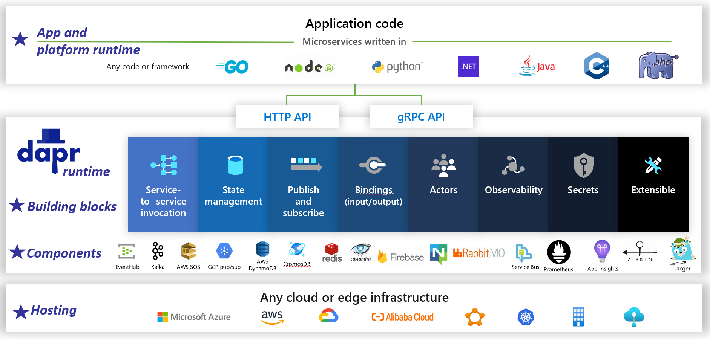

# What is Cloud Native?

Stop what you're doing and text several of your colleagues. Ask them to define the term "Cloud Native". There's a good chance you'll get several different answers.

Let's start with a simple definition:

> *Cloud-native architecture and technologies are an approach to designing, constructing, and operating workloads that are built in the cloud and take full advantage of the cloud computing model.*

The [Cloud Native Computing Foundation](https://www.cncf.io/) provides the [official definition](https://github.com/cncf/foundation/blob/master/charter.md):

> *Cloud-native technologies empower organizations to build and run scalable applications in modern, dynamic environments such as public, private, and hybrid clouds. Containers, service meshes, microservices, immutable infrastructure, and declarative APIs exemplify this approach.*

> *These techniques enable loosely coupled systems that are resilient, manageable, and observable. Combined with robust automation, they allow engineers to make high-impact changes frequently and predictably with minimal toil.*

Cloud native is about *speed* and *agility*. Business systems are evolving from enabling business capabilities to weapons of strategic transformation that accelerate business velocity and growth. It's imperative to get new ideas to market immediately.

At the same time, business systems have also become increasingly complex with users demanding more. They expect rapid responsiveness, innovative features, and zero downtime. Performance problems, recurring errors, and the inability to move fast are no longer acceptable. Your users will visit your competitor. Cloud-native systems are designed to embrace rapid change, large scale, and resilience

Here are some companies who have implemented cloud-native techniques. Think about the speed, agility, and scalability they've achieved.

| Company | Experience |
| :-------- | :-------- |
| [Netflix](https://www.infoq.com/news/2013/06/netflix/) | Has 600+ services in production. Deploys 100 times per day. |
| [Uber](https://eng.uber.com/micro-deploy/) | Has 1,000+ services in production. Deploys several thousand times each week. |
| [WeChat](https://www.cs.columbia.edu/~ruigu/papers/socc18-final100.pdf) | Has 3,000+ services in production. Deploys 1,000 times a day. |

As you can see, Netflix, Uber, and, WeChat expose cloud-native systems that consist of many independent services. This architectural style enables them to rapidly respond to market conditions. They instantaneously update small areas of a live, complex application, without a full redeployment. They individually scale services as needed.

## The pillars of cloud native

The speed and agility of cloud native derive from many factors. Foremost is *cloud infrastructure*. But there's more: Five other foundational pillars shown in Figure 1-3 also provide the bedrock for cloud-native systems.

**Figure 1-3**. Cloud-native foundational pillars

Let's take some time to better understand the significance of each pillar.

## The cloud

Cloud-native systems take full advantage of the cloud service model.

Designed to thrive in a dynamic, virtualized cloud environment, these systems make extensive use of [Platform as a Service (PaaS)](https://azure.microsoft.com/overview/what-is-paas/) compute infrastructure and managed services. They treat the underlying infrastructure as *disposable* - provisioned in minutes and resized, scaled, or destroyed on demand – via automation.

Consider the widely accepted DevOps concept of [Pets vs. Cattle](https://medium.com/@Joachim8675309/devops-concepts-pets-vs-cattle-2380b5aab313). In a traditional data center, servers are treated as *Pets*: a physical machine, given a meaningful name, and *cared* for. You scale by adding more resources to the same machine (scaling up). If the server becomes sick, you nurse it back to health. Should the server become unavailable, everyone notices.

The *Cattle* service model is different. You provision each instance as a virtual machine or container. They're identical and assigned a system identifier such as Service-01, Service-02, and so on. You scale by creating more of them (scaling out). When one becomes unavailable, nobody notices.

The cattle model embraces *immutable infrastructure*. Servers aren't repaired or modified. If one fails or requires updating, it's destroyed and a new one is provisioned – all done via automation.

Cloud-native systems embrace the Cattle service model. They continue to run as the infrastructure scales in or out with no regard to the machines upon which they're running.

The Azure cloud platform supports this type of highly elastic infrastructure with automatic scaling, self-healing, and monitoring capabilities.

## Modern design

How would you design a cloud-native app? What would your architecture look like? To what principles, patterns, and best practices would you adhere? What infrastructure and operational concerns would be important?

### The Twelve-Factor Application

A widely accepted methodology for constructing cloud-based applications is the [Twelve-Factor Application](https://12factor.net/). It describes a set of principles and practices that developers follow to construct applications optimized for modern cloud environments. Special attention is given to portability across environments and declarative automation.

While applicable to any web-based application, many practitioners consider Twelve-Factor a solid foundation for building cloud-native apps. Systems built upon these principles can deploy and scale rapidly and add features to react quickly to market changes.

The following table highlights the Twelve-Factor methodology:

|  Factor | Explanation  |
| :-------- | :-------- |
| 1 - Code Base | A single code base for each microservice, stored in its own repository. Tracked with version control, it can deploy to multiple environments (QA, Staging, Production). |
| 2 - Dependencies | Each microservice isolates and packages its own dependencies, embracing changes without impacting the entire system. |
| 3 - Configurations  | Configuration information is moved out of the microservice and externalized through a configuration management tool outside of the code. The same deployment can propagate across environments with the correct configuration applied.  |
| 4 - Backing Services | Ancillary resources (data stores, caches, message brokers) should be exposed via an addressable URL. Doing so decouples the resource from the application, enabling it to be interchangeable.  |
| 5 - Build, Release, Run | Each release must enforce a strict separation across the build, release, and run stages. Each should be tagged with a unique ID and support the ability to roll back. Modern CI/CD systems help fulfill this principle. |
| 6 - Processes | Each microservice should execute in its own process, isolated from other running services. Externalize required state to a backing service such as a distributed cache or data store. |
| 7 - Port Binding | Each microservice should be self-contained with its interfaces and functionality exposed on its own port. Doing so provides isolation from other microservices. |
| 8 - Concurrency | When capacity needs to increase, scale out services horizontally across multiple identical processes (copies) as opposed to scaling-up a single large instance on the most powerful machine available. Develop the application to be concurrent making scaling out in cloud environments seamless. |
| 9 - Disposability | Service instances should be disposable. Favor fast startup to increase scalability opportunities and graceful shutdowns to leave the system in a correct state. Docker containers along with an orchestrator inherently satisfy this requirement. |
| 10 - Dev/Prod Parity | Keep environments across the application lifecycle as similar as possible, avoiding costly shortcuts. Here, the adoption of containers can greatly contribute by promoting the same execution environment. |
| 11 - Logging | Treat logs generated by microservices as event streams. Process them with an event aggregator. Propagate log data to data-mining/log management tools like Azure Monitor or Splunk and eventually to long-term archival. |
| 12 - Admin Processes | Run administrative/management tasks, such as data cleanup or computing analytics, as one-off processes. Use independent tools to invoke these tasks from the production environment, but separately from the application. |

In the book, [Beyond the Twelve-Factor App](https://content.pivotal.io/blog/beyond-the-twelve-factor-app), author Kevin Hoffman details each of the original 12 factors (written in 2011). Additionally, he discusses three extra factors that reflect today's modern cloud application design.

|  New Factor | Explanation  |
| :-------- | :-------- |
| 13 - API First | Make everything a service. Assume your code will be consumed by a front-end client, gateway, or another service. |
| 14 - Telemetry | On a workstation, you have deep visibility into your application and its behavior. In the cloud, you don't. Make sure your design includes the collection of monitoring, domain-specific, and health/system data. |
| 15 - Authentication/ Authorization  | Implement identity from the start. Consider [RBAC (role-based access control)](/azure/role-based-access-control/overview) features available in public clouds.  |

We'll refer to many of the 12+ factors in this chapter and throughout the book.

### Azure Well-Architected Framework

Designing and deploying cloud-based workloads can be challenging, especially when implementing cloud-native architecture. Microsoft provides industry standard best practices to help you and your team deliver robust cloud solutions.

The [Microsoft Well-Architected Framework](/azure/architecture/framework/) provides a set of guiding tenets that can be used to improve the quality of a cloud-native workload. The framework consists of five pillars of architecture excellence:

|    Tenant | Description  |
| :-------- | :-------- |
| [Cost management](/azure/architecture/framework/#cost-optimization) | Focus on generating incremental value early. Apply *Build-Measure-Learn* principles to accelerate time to market while avoiding capital-intensive solutions. Using a pay-as-you-go strategy, invest as you scale out, rather than delivering a large investment up front. |
| [Operational excellence](/azure/architecture/framework/#operational-excellence) | Automate the environment and operations to increase speed and reduce human error. Roll problem updates back or forward quickly. Implement monitoring and diagnostics from the start. |
| [Performance efficiency](/azure/architecture/framework/#performance-efficiency) | Efficiently meet demands placed on your workloads. Favor horizontal scaling (scaling out) and design it into your systems. Continually conduct performance and load testing to identify potential bottlenecks. |
| [Reliability](/azure/architecture/framework/#reliability)  | Build workloads that are both resilient and available. Resiliency enables workloads to recover from failures and continue functioning. Availability ensures users access to your workload at all times. Design applications to expect failures and recover from them. |
| [Security](/azure/architecture/framework/#security) | Implement security across the entire lifecycle of an application, from design and implementation to deployment and operations. Pay close attention to identity management, infrastructure access, application security, and data sovereignty and encryption. |

To get started, Microsoft provides a set of [online assessments](/assessments/?mode=pre-assessment&session=local) to help you assess your current cloud workloads against the five well-architected pillars.

## Microservices

Cloud-native systems embrace microservices, a popular architectural style for constructing modern applications.

Built as a distributed set of small, independent services that interact through a shared fabric, microservices share the following characteristics:

- Each implements a specific business capability within a larger domain context.

- Each is developed autonomously and can be deployed independently.

- Each is self-contained encapsulating its own data storage technology, dependencies, and programming platform.

- Each runs in its own process and communicates with others using standard communication protocols such as HTTP/HTTPS, gRPC, WebSockets, or [AMQP](https://en.wikipedia.org/wiki/Advanced_Message_Queuing_Protocol).

- They compose together to form an application.

Figure 1-4 contrasts a monolithic application approach with a microservices approach. Note how the monolith is composed of a layered architecture, which executes in a single process. It typically consumes a relational database. The microservice approach, however, segregates functionality into independent services, each with its own logic, state, and data. Each microservice hosts its own datastore.

**Figure 1-4.** Monolithic versus microservices architecture

Note how microservices promote the **Processes** principle from the [Twelve-Factor Application](https://12factor.net/), discussed earlier in the chapter.

> *Factor \#6  specifies "Each microservice should execute in its own process, isolated from other running services."*

### Why microservices?

Microservices provide agility.

Earlier in the chapter, we compared an eCommerce application built as a monolith to that with microservices. In the example, we saw some clear benefits:

- Each microservice has an autonomous lifecycle and can evolve independently and deploy frequently. You don't have to wait for a quarterly release to deploy a new features or update. You can update a small area of a live application with less risk of disrupting the entire system. The update can be made without a full redeployment of the application.

- Each microservice can scale independently. Instead of scaling the entire application as a single unit, you scale out only those services that require more processing power to meet desired performance levels and service-level agreements. Fine-grained scaling provides for greater control of your system and helps reduce overall costs as you scale portions of your system, not everything.

An excellent reference guide for understanding microservices is [.NET Microservices: Architecture for Containerized .NET Applications](https://dotnet.microsoft.com/download/thank-you/microservices-architecture-ebook). The book deep dives into microservices design and architecture. It's a companion for a [full-stack microservice reference architecture](https://github.com/dotnet-architecture/eShopOnContainers) available as a free download from Microsoft.

### Developing microservices

Microservices can be created upon any modern development platform.

The Microsoft .NET platform is an excellent choice. Free and open source, it has many built-in features that simplify microservice development. .NET is cross-platform. Applications can be built and run on Windows, macOS, and most flavors of Linux.

.NET is highly performant and has scored well in comparison to Node.js and other competing platforms. Interestingly, [TechEmpower](https://www.techempower.com/) conducted an extensive set of [performance benchmarks](https://www.techempower.com/benchmarks/#section=data-r17&hw=ph&test=plaintext) across many web application platforms and frameworks. .NET scored in the top 10 - well above Node.js and other competing platforms.

[.NET](https://github.com/dotnet/core) is maintained by Microsoft and the .NET community on GitHub.

### Microservice challenges

While distributed cloud-native microservices can provide immense agility and speed, they present many challenges:

#### *Communication*

How will front-end client applications communicate with backed-end core microservices? Will you allow direct communication? Or, might you abstract the back-end microservices with a gateway facade that provides flexibility, control, and security?

How will back-end core microservices communicate with each other? Will you allow direct HTTP calls that can increase coupling and impact performance and agility? Or might you consider decoupled messaging with queue and topic technologies?

Communication is covered in the [Cloud-native communication patterns](./communication-patterns.md) chapter.

#### *Resiliency*

A microservices architecture moves your system from in-process to out-of-process network communication. In a distributed architecture, what happens when Service B isn't responding to a network call from Service A? Or, what happens when Service C becomes temporarily unavailable and other services calling it become blocked?

Resiliency is covered in the [Cloud-native resiliency](./resiliency.md) chapter.

#### *Distributed Data*

By design, each microservice encapsulates its own data, exposing operations via its public interface. If so, how do you query data or implement a transaction across multiple services?

Distributed data is covered in the [Cloud-native data patterns](./distributed-data.md) chapter.

#### *Secrets*

How will your microservices securely store and manage secrets and sensitive configuration data?

Secrets are covered in detail [Cloud-native security](./security.md).

### Manage Complexity with Dapr

[Dapr](https://dapr.io/) is a distributed, open-source application runtime. Through an architecture of pluggable components, it dramatically simplifies the *plumbing* behind distributed applications. It provides a **dynamic glue** that binds your application with pre-built infrastructure capabilities and components from the Dapr runtime.  Figure 1-5 shows Dapr from 20,000 feet.

**Figure 1-5**. Dapr at 20,000 feet.

In the top row of the figure, note how Dapr provides [language-specific SDKs](https://docs.dapr.io/developing-applications/sdks/) for popular development platforms. Dapr v1 includes support for .NET, Go, Node.js, Python, PHP, Java, and JavaScript.

While language-specific SDKs enhance the developer experience, Dapr is platform agnostic. Under the hood, Dapr's programming model exposes capabilities through standard HTTP/gRPC communication protocols. Any programming platform can call Dapr via its native HTTP and gRPC APIs.  

The blue boxes across the center of the figure represent the Dapr building blocks. Each exposes pre-built plumbing code for a distributed application capability that your application can consume.

The components row represents a large set of pre-defined infrastructure components that your application can consume. Think of components as infrastructure code you don't have to write.

The bottom row highlights the portability of Dapr and the diverse environments across which it can run.

Microsoft features a free ebook [Dapr for .NET Developers](../dapr-for-net-developers/index.md) for learning Dapr.

Looking ahead, Dapr has the potential to have a profound impact on cloud-native application development.

## Containers

It's natural to hear the term *container* mentioned in any *cloud native* conversation. In the book, [Cloud Native Patterns](https://www.manning.com/books/cloud-native-patterns), author Cornelia Davis observes that, "Containers are a great enabler of cloud-native software." The Cloud Native Computing Foundation places microservice containerization as the first step in their [Cloud-Native Trail Map](https://raw.githubusercontent.com/cncf/trailmap/master/CNCF_TrailMap_latest.png) - guidance for enterprises beginning their cloud-native journey.

Containerizing a microservice is simple and straightforward. The code, its dependencies, and runtime are packaged into a binary called a [container image](https://docs.docker.com/glossary/?term=image). Images are stored in a container registry, which acts as a repository or library for images. A registry can be located on your development computer, in your data center, or in a public cloud. Docker itself maintains a public registry via [Docker Hub](https://hub.docker.com/). The Azure cloud features a private [container registry](https://azure.microsoft.com/services/container-registry/) to store container images close to the cloud applications that will run them.

When an application starts or scales, you transform the container image into a running container instance. The instance runs on any computer that has a [container runtime](https://kubernetes.io/docs/setup/production-environment/container-runtimes/) engine installed. You can have as many instances of the containerized service as needed.

Figure 1-6 shows three different microservices, each in its own container, all running on a single host.

**Figure 1-6**. Multiple containers running on a container host

Note how each container maintains its own set of dependencies and runtime, which can be different from one another. Here, we see different versions of the Product microservice running on the same host. Each container shares a slice of the underlying host operating system, memory, and processor, but is isolated from one another.

Note how well the container model embraces the **Dependencies** principle from the [Twelve-Factor Application](https://12factor.net/).

> *Factor \#2  specifies that "Each microservice isolates and packages its own dependencies, embracing changes without impacting the entire system."*

Containers support both Linux and Windows workloads. The Azure cloud openly embraces both. Interestingly, it's Linux, not Windows Server, that has become the more popular operating system in Azure.

While several container vendors exist, [Docker](https://www.docker.com/) has captured the lion's share of the market. The company has been driving the software container movement. It has become the de facto standard for packaging, deploying, and running cloud-native applications.

### Why containers?

Containers provide portability and guarantee consistency across environments. By encapsulating everything into a single package, you *isolate* the microservice and its dependencies from the underlying infrastructure.

You can deploy the container in any environment that hosts the Docker runtime engine. Containerized workloads also eliminate the expense of pre-configuring each environment with frameworks, software libraries, and runtime engines.

By sharing the underlying operating system and host resources, a container has a much smaller footprint than a full virtual machine. The smaller size increases the *density*, or number of microservices, that a given host can run at one time.

### Container orchestration

While tools such as Docker create images and run containers, you also need tools to manage them. Container management is done with a special software program called a **container orchestrator**. When operating at scale with many independent running containers, orchestration is essential.

Figure 1-7 shows management tasks that container orchestrators automate.

**Figure 1-7**. What container orchestrators do

The following table describes common orchestration tasks.

|  Tasks | Explanation  |
| :-------- | :-------- |
| Scheduling | Automatically provision container instances.|
| Affinity/anti-affinity | Provision containers nearby or far apart from each other, helping  availability and performance. |
| Health monitoring | Automatically detect and correct failures.|
| Failover | Automatically reprovision a failed instance to a healthy machine.|
| Scaling | Automatically add or remove a container instance to meet demand.|
| Networking | Manage a networking overlay for container communication.|
| Service Discovery | Enable containers to locate each other.|
| Rolling Upgrades | Coordinate incremental upgrades with zero downtime deployment. Automatically roll back problematic changes.|

Note how container orchestrators embrace the **Disposability** and **Concurrency** principles from the [Twelve-Factor Application](https://12factor.net/).

> *Factor \#9  specifies that "Service instances should be disposable, favoring fast startups to increase scalability opportunities and graceful shutdowns to leave the system in a correct state."* Docker containers along with an orchestrator inherently satisfy this requirement."

> *Factor \#8  specifies that "Services scale out across a large number of small identical processes (copies) as opposed to scaling-up a single large instance on the most powerful machine available."*

While several container orchestrators exist, [Kubernetes](https://kubernetes.io/docs/concepts/overview/what-is-kubernetes/) has become the de facto standard for the cloud-native world. It's a portable, extensible, open-source platform for managing containerized workloads.

You could host your own instance of Kubernetes, but then you'd be responsible for provisioning and managing its resources - which can be complex. The Azure cloud features Kubernetes as a managed service. Both  [Azure Kubernetes Service (AKS)](https://azure.microsoft.com/services/kubernetes-service/) and [Azure Red Hat OpenShift (ARO)](https://azure.microsoft.com/services/openshift/) enable you to fully leverage the features and power of Kubernetes as a managed service, without having to install and maintain it.

Container orchestration is covered in detail in [Scaling Cloud-Native Applications](./scale-applications.md).

## Backing services

Cloud-native systems depend upon many different ancillary resources, such as data stores, message brokers, monitoring, and identity services. These services are known as [backing services](https://12factor.net/backing-services).

 Figure 1-8 shows many common backing services that cloud-native systems consume.

**Figure 1-8**. Common backing services

You could host your own backing services, but then you'd be responsible for licensing, provisioning, and managing those resources.

Cloud providers offer a rich assortment of *managed backing services.* Instead of owning the service, you simply consume it. The cloud provider operates the resource at scale and bears the responsibility for performance, security, and maintenance. Monitoring, redundancy, and availability are built into the service. Providers guarantee service level performance and fully support their managed services - open a ticket and they fix your issue.

Cloud-native systems favor managed backing services from cloud vendors. The savings in time and labor can be significant. The operational risk of hosting your own and experiencing trouble can get expensive fast.

A best practice is to treat a backing service as an **attached resource**, dynamically bound to a microservice with configuration information (a URL and credentials) stored in an external configuration. This guidance is spelled out in the [Twelve-Factor Application](https://12factor.net/), discussed earlier in the chapter.

>*Factor \#4* specifies that backing services "should be exposed via an addressable URL. Doing so decouples the resource from the application, enabling it to be interchangeable."

>*Factor \#3* specifies that "Configuration information is moved out of the microservice and externalized through a configuration management tool outside of the code."

With this pattern, a backing service can be attached and detached without code changes. You might promote a microservice from QA to a staging environment. You update the microservice configuration to point to the backing services in staging and inject the settings into your container through an environment variable.

Cloud vendors provide APIs for you to communicate with their proprietary backing services. These libraries encapsulate the proprietary plumbing and complexity. However, communicating directly with these APIs will tightly couple your code to that specific backing service. It's a widely accepted practice to insulate the implementation details of the vendor API. Introduce an intermediation layer, or intermediate API, exposing generic operations to your service code and wrap the vendor code inside it. This loose coupling enables you to swap out one backing service for another or move your code to a different cloud environment without having to make changes to the mainline service code. Dapr, discussed earlier, follows this model with its set of [prebuilt building blocks](https://docs.dapr.io/developing-applications/building-blocks/).

On a final thought, backing services also promote the **Statelessness** principle from the [Twelve-Factor Application](https://12factor.net/), discussed earlier in the chapter.

>*Factor \#6* specifies that, "Each microservice should execute in its own process, isolated from other running services. Externalize required state to a backing service such as a distributed cache or data store."

Backing services are discussed in [Cloud-native data patterns](./distributed-data.md) and [Cloud-native communication patterns](./communication-patterns.md).

## Automation

As you've seen, cloud-native systems embrace microservices, containers, and modern system design to achieve speed and agility. But, that's only part of the story. How do you provision the cloud environments upon which these systems run? How do you rapidly deploy app features and updates? How do you round out the full picture?

Enter the widely accepted practice of [Infrastructure as Code](/devops/deliver/what-is-infrastructure-as-code), or IaC.

With IaC, you automate platform provisioning and application deployment. You essentially apply software engineering practices such as testing and versioning to your DevOps practices. Your infrastructure and deployments are automated, consistent, and repeatable.

### Automating infrastructure

Tools like [Azure Resource Manager](/azure/azure-resource-manager/management/overview), [Azure Bicep](/azure/azure-resource-manager/bicep/overview), [Terraform](https://www.terraform.io/) from HashiCorp, and the [Azure CLI](/cli/azure/), enable you to declaratively script the cloud infrastructure you require. Resource names, locations, capacities, and secrets are parameterized and dynamic. The script is versioned and checked into source control as an artifact of your project. You invoke the script to provision a consistent and repeatable infrastructure across system environments, such as QA, staging, and production.

Under the hood, IaC is idempotent, meaning that you can run the same script over and over without side effects. If the team needs to make a change, they edit and rerun the script. Only the updated resources are affected.

In the article, [What is Infrastructure as Code](/devops/deliver/what-is-infrastructure-as-code), Author Sam Guckenheimer describes how, "Teams who implement IaC can deliver stable environments rapidly and at scale. They avoid manual configuration of environments and enforce consistency by representing the desired state of their environments via code. Infrastructure deployments with IaC are repeatable and prevent runtime issues caused by configuration drift or missing dependencies. DevOps teams can work together with a unified set of practices and tools to deliver applications and their supporting infrastructure rapidly, reliably, and at scale."

### Automating deployments

The [Twelve-Factor Application](https://12factor.net/), discussed earlier, calls for separate steps when transforming completed code into a running application.

> *Factor \#5* specifies that "Each release must enforce a strict separation across the build, release and run stages. Each should be tagged with a unique ID and support the ability to roll back."

Modern CI/CD systems help fulfill this principle. They provide separate build and delivery steps that help ensure consistent and quality code that's readily available to users.

Figure 1-9 shows the separation across the deployment process.

**Figure 1-9**. Deployment steps in a CI/CD Pipeline

In the previous figure, pay special attention to separation of tasks:

1. The developer constructs a feature in their development environment, iterating through what is called the "inner loop" of code, run, and debug.
2. When complete, that code is *pushed* into a code repository, such as GitHub, Azure DevOps, or BitBucket.
3. The push triggers a build stage that transforms the code into a binary artifact. The work is implemented with a [Continuous Integration (CI)](https://martinfowler.com/articles/continuousIntegration.html) pipeline. It automatically builds, tests, and packages the application.
4. The release stage picks up the binary artifact, applies external application and environment configuration information, and produces an immutable release. The release is deployed to a specified environment. The work is implemented with a [Continuous Delivery (CD)](https://martinfowler.com/bliki/ContinuousDelivery.html) pipeline. Each release should be identifiable. You can say, "This deployment is running Release 2.1.1 of the application."
5. Finally, the released feature is run in the target execution environment. Releases are immutable meaning that any change must create a new release.

Applying these practices, organizations have radically evolved how they ship software. Many have moved from quarterly releases to on-demand updates. The goal is to catch problems early in the development cycle when they're less expensive to fix. The longer the duration between integrations, the more expensive problems become to resolve.  With consistency in the integration process, teams can commit code changes more frequently, leading to better collaboration and software quality.

Infrastructure as code and deployment automation, along with GitHub and Azure DevOps are discussed in detail in [DevOps](./devops.md)

>[!div class="step-by-step"]
>[Previous](introduction.md)
>[Next](candidate-apps.md)
