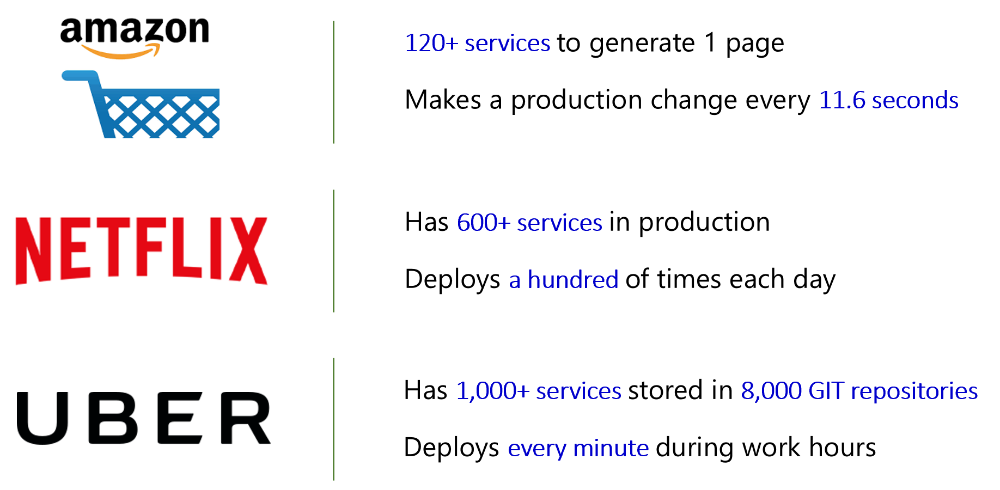
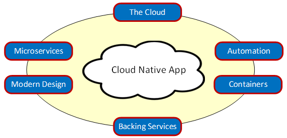
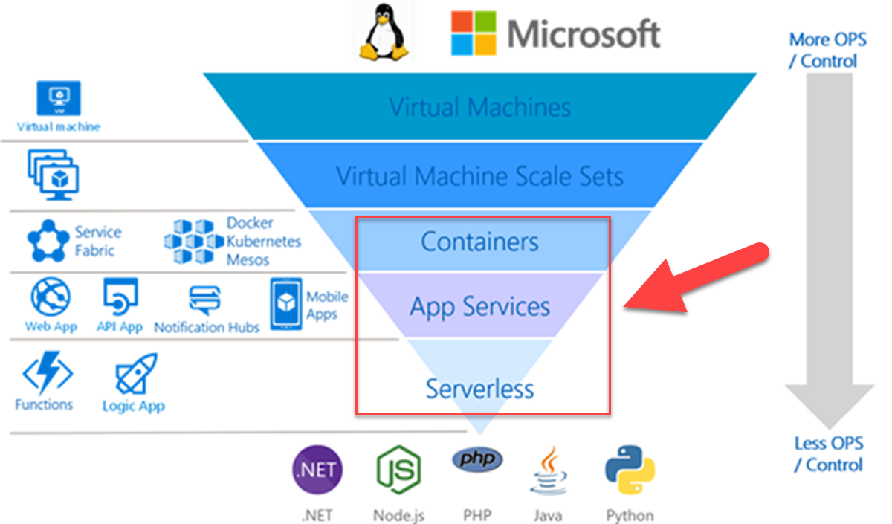
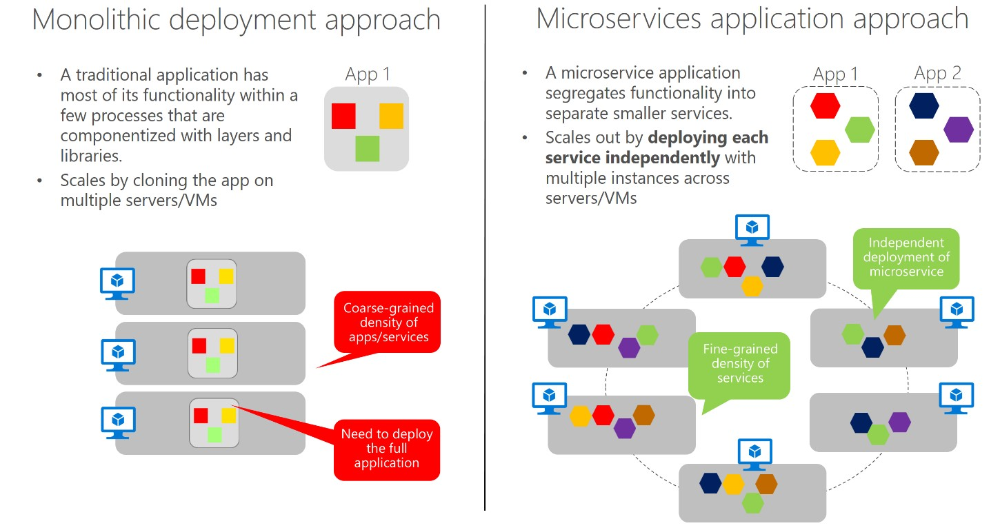
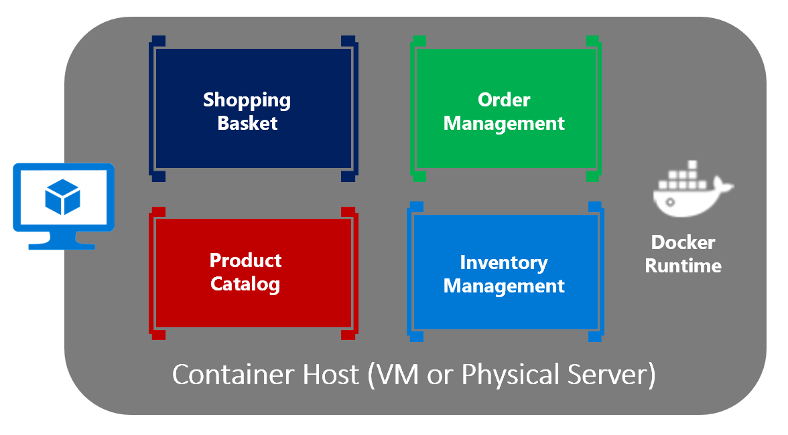
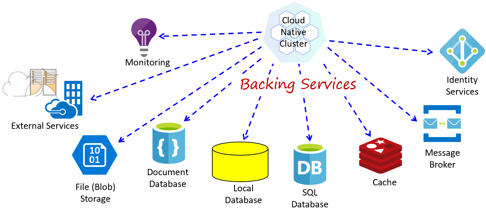
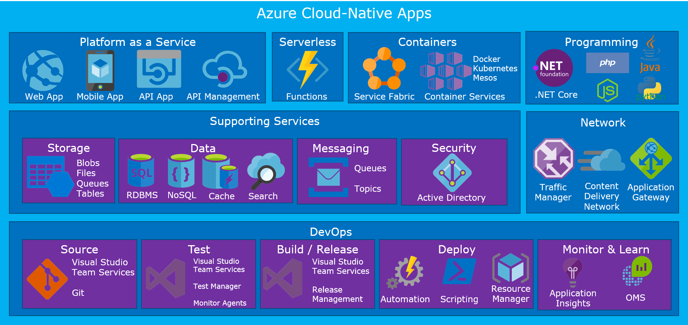
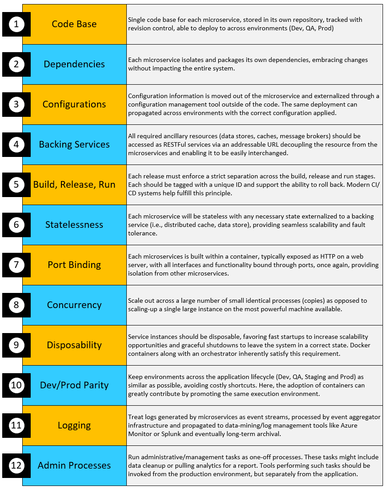

# Defining Cloud Native

Stop what you’re doing and ping 10 of your colleagues. Ask them to define the term “Cloud Native.” Good chance you’ll get eight different answers. Interestingly, six months from now, as cloud-native technologies and practices evolve, so will their definition.

Cloud native is all about changing the way we think about constructing critical business systems.

But, what exactly is cloud native?

The Cloud Native Computing Foundation provides an [official definition](https://github.com/cncf/foundation/blob/master/charter.md) of Cloud Native:

*Cloud-native technologies empower organizations to build and run scalable applications in modern, dynamic environments such as public, private, and hybrid clouds. Containers, service meshes, microservices, immutable infrastructure, and declarative APIs exemplify this approach.*

*These techniques enable loosely coupled systems that are resilient, manageable, and observable. Combined with robust automation, they allow engineers to make high-impact changes frequently and predictably with minimal toil.*

Applications have become increasingly complex with users demanding more and more. Users expect rapid responsiveness, innovative features, and zero downtime. Performance problems, recurring errors, and the inability to move fast are no longer acceptable. They'll easily move to your competitor.

Cloud native is much about *speed* and *agility*. Business systems are evolving from enabling business capabilities to weapons of strategic transformation, accelerating business velocity and growth. It’s imperative to get ideas to market immediately. Figure 1-1 presents three pioneers who have implemented these techniques. Think about the speed, agility, and scalability they've achieved.

**Figure 1-1**. Companies using cloud native to embrace agility

As you can see, Amazon retail, Netflix, and Uber expose systems that consist of hundreds of independent microservices. The architecture enables them to rapidly respond to market conditions. They can instantaneously update live applications without redeploying the entire system.

The agility of cloud native derives from its architecture and infrastructure, coupled with the six capabilities highlighted in blue in Figure 1-2.

**Figure 1-2**. Capabilities of cloud-native apps

The six capabilities shown in the previous figure are the key drivers for cloud-native applications. Let’s take some time to better understand the importance of each.

## Born in the cloud…

Cloud-native systems are *all about the cloud*. Designed and developed to thrive in a dynamic, virtualized cloud environment, these systems make extensive use of Platform as a Service (PaaS) compute infrastructure and managed services. They're built to exploit the cloud delivery model: elasticity, resilience, redundancy, orchestration, and on-demand features.  

Figure 1-3 shows a spectrum of compute services available in the Azure cloud. As you progress down the hierarchy, your attention shifts from managing infrastructure to creating business functionality. Cloud-native systems typically operate at these lower levels, using containers, PaaS, and serverless environments.

**Figure 1-3**. Azure compute stack

Cloud-native systems treat the underlying infrastructure as *disposable* - provisioned in minutes and resized, scaled, moved, or destroyed whenever necessary – all through automation.

Consider the argument of [Pets vs. Cattle](https://medium.com/@Joachim8675309/devops-concepts-pets-vs-cattle-2380b5aab313). In a traditional data center, servers are treated as *Pets*. They're typically a physical machine, given a meaningful name, and cared for. You scale by adding more resources to the same machine (scaling up). If the server becomes sick, you nurse it back to health. Should the server become unavailable, everyone notices.

The *Cattle* service model is different. You provision each instance as a virtual machine or container. Each instance is identical and assigned an identifier such as Service-01, Service-02, and so on. You *scale out* by creating more of them. When one becomes unavailable, nobody notices.

This cattle model embraces *immutable infrastructure*. Servers aren't repaired or modified. If one fails or requires updating, it's destroyed and a new one is provisioned – all done via automation.

Cloud-native systems embrace the Cattle model. They continue to run as the infrastructure scales up, down, in, or out with no regard to the machines upon which they're running.

As a result, many companies consider the cloud and associated cloud-native systems a competitive advantage – move fast, pivot quickly, and fail fast - while reducing operational and hardware costs.

The Azure cloud platform supports this type of highly elastic infrastructure with automatic scaling, self-healing, and monitoring capabilities.

## Built with microservices…
Cloud-native systems embrace microservices, a popular architectural style for constructing modern applications. Microservices are a distributed set of small, independent services that interact through a shared fabric and compose together to form applications. They share the following characteristics: 

- Each microservice implements a specific business capability within a larger domain context.

- Each is self-contained. The domain logic, data, and state are encapsulated in the service. You select the data storage technology (SQL, NoSQL) and programming platform of choice.

- Each is developed autonomously and can be deployed independently.

- Each runs in its own process and communicates with others using standard communication protocols such as HTTP/HTTPS, WebSockets, or [AMQP](https://en.wikipedia.org/wiki/Advanced_Message_Queuing_Protocol).

With microservices, you move away from a traditional monolithic design, where an entire application executes in a single-tiered environment. Figure 1-4 contrasts a monolithic and microservices approach. 

**Figure 1-4.** Monolithic deployment versus microservices

### Why microservices?

Microservices provide agility.

Each microservice is independent with an autonomous lifecycle. It can evolve independently and deploy frequently. You don’t have to wait for a quarterly release to deploy new features or updates. You can update small areas of a complex application with less risk of disrupting the entire system.

Each microservice can scale independently. Instead of scaling the entire application as a single unit, you scale out only those services that require more processing power or network bandwidth. This  fine-grained approach to scaling provides for greater control of your system and helps to reduce overall costs as you scale portions of your system, not everything.

Each microservice can scale independently. Instead of scaling the entire application as a single unit, you scale out specific microservices that require more processing power or network bandwidth. Such fine-grained scaling provides greater control of your system and helps to reduce overall costs as you scale portions of your system, not everything.

An excellent reference guide for microservices is [.NET Microservices: Architecture for Containerized .NET Applications](https://docs.microsoft.com/dotnet/standard/microservices-architecture/).

## Deployed in containers…

Microservices go hand in hand with software containerization. Developers package the code, dependencies, and runtime for a service as a single unit, called a container [image](https://docs.docker.com/glossary/?term=image). Images are stored in a [container registry](https://azure.microsoft.com/services/container-registry/). Registries can be located on your laptop, in your data center, or in the public cloud. When needed, you *pull* the image and transform it into a running container instance. The instance runs on any computer (development laptop, QA, or production) that has the Docker software engine.

### Benefits of containers

Containers provide portability and guarantee consistency across environments. By encapsulating everything into a single package, you *isolate* the application and its dependencies from the underlying environment. If the container runs on a development laptop, it will run in test and in production as well. Containerized workloads reduce the expense (and risk) of pre-configuring each environment and troubleshooting  issues across them.

Each [container](https://docs.docker.com/glossary/?term=container) runs on a container host, most often [Docker](https://opensource.com/resources/what-docker). By sharing the underlying operating system, containers have a much smaller footprint than a full virtual machine. The smaller size increases the number of services that can run on a given host.

In a cloud-native application, each microservice runs in its own container. 

In Figure 1-5, you see four containerized microservices running on a single virtual machine.

  
**Figure 1-5**. Multiple containers running on a container host

While they share the OS from the underlying VM, each container consumes its own slice of CPU and memory. Containers on the same host are isolated from one another. Both Linux and Windows containers provide a high-degree of process isolation. Windows containers offer an even higher degree of isolation with its [Hyper-V Container](https://docs.microsoft.com/virtualization/windowscontainers/manage-containers/hyperv-container) option.

Another benefit of containers is scalability. A single container image can rapidly scale out to handle spikes in traffic and scale in when no longer needed. When running in a cluster, containers from the same image are deployed across the nodes in the cluster. This way, if a node were to become unavailable, requests can be routed to a container instance on an operational one. We’ll cover availability later in this book. 

### Developing in containers

Most developers build code on their local computers. They install the required frameworks, libraries, and runtimes. When complete, the code is unit tested and checked into a team repository for future use.

Microservice systems, however, consist of large numbers of interrelated services. Running the entire applicaiton on a local computer can be difficult, if not impossible. A common alternative involves maintaining a set of mock dependencies to enable end-to-end testing on the local machine. However, their creation can be time-consuming and lead to subtle bugs if not kept current.

Many development teams are containerizing their cloud-native development cycle. They write code in Docker containers and run the application in a shared development cluster in the cloud. New tooling innovations in Visual Studio and [Azure Kubernetes Service](https://azure.microsoft.com/services/kubernetes-service/) help facitliate this fast-growing approach.

Containers offer immense benefits for packaging, deploying, and managing cloud-native applications.

## Adopt cloud-hosted backing services…

Cloud-native systems depend upon many different ancillary resources such as data stores, message brokers, monitoring, and identity services. The services are known as [backing services](https://12factor.net/backing-services). Figure 1-7 shows many common backing services required by cloud-native systems.

**Figure 1-7**. Cloud-native backing services

Cloud-native applications are best built using *cloud hosted backing services* managed by a cloud provider. The provider operates these resources at scale and bears the responsibility for security and maintenance. Your services consume each backing service from a RESTFul endpoint.

Built on cloud technologies, managed backing services are more agile and flexible than traditional offerings. They offer inherent scalability and resiliency and are continually optimized for speed, security, and performance.

Importantly, cloud providers fully support their managed backing services. Open a ticket and they fix your issue.

Figure 1-8 shows managed services available on the Azure platform.

**Figure 1-8**. Managed services in Azure

Understandably, you may have a concern with vendor lock-in. A smart approach might be to wrap each managed backing service in an abstraction shim with a strategy pattern and externalized configuration. This way your code is decoupled from the infrastructure. You can dynamically swap-out one backing service for another without a full redeployment of the system.

Throughout this book, we'll explore various types of cloud-managed backing services.

## Embrace modern design…

How would you design a cloud-native app? What would your architecture look like? To what principles, patterns, and best practices would you adhere? So far we’ve talked about cloud compute, microservices, containers, and managed backing services. But, what about the application design process itself?

We start with a widely accepted foundation for service design and then highlight some important design concerns.

### The 12-Factor Foundation

A widely accepted methodology for constructing cloud-native systems is the [Twelve-Factor Application](https://12factor.net/). It describes guidelines for building distributed cloud-based applications. Many practitioners consider it a foundation for building cloud-native apps.

Figure 1-9 shows the 12-Factor methodology.

**Figure 1-9.** The 12-Factor app

We'll refer to these 12 factors throughout the book.

### Critical Design Considerations

Beyond the guidance provided from the 12-factor manifesto, there are several critical design principles you must consider.

*Communication*

How will front-end client applications communicate with your backed-end core services? Will you allow direct communication? Or, might you abstract the backend services with a gateway façade that provides  flexibility, control, and security?

Then, how will back-end core services communicate with each other? Will you allow direct HTTP calls that lead to coupling and impact performance and agility? Or, might you consider decoupled messaging with queue and topic technologies?

*Resiliency*

A microservices architecture moves your system from in-process to network communication. In a distributed environment, what will you do when Service B isn't responding to a call from Service A? What happens when Service C becomes temporarily unavailable and other services calling it, stack up, and degrade system performance?

*Distributed Data*

By design, each microservice encapsulates its own data, exposing operations via its public interface. If so, how do you query data or implement a transaction across multiple services?

*Identity*

How will your service identify who is accessing it and what permissions they have?

These topics are covered in detail throughout the chapters of this book.

## Mandate automation

*Cloud-native thinking* goes beyond microservices, containers, and modern system design. DevOps engagement is crucial. Large distributed systems require rapid provisioning, decentralized deployment, and close adherence to widely accepted DevOps processes. A mandatory requirement for cloud native is *automation* – automation of the underlying infrastructure, code deployment, and environment.

### Automating Infrastructure

Cloud-native apps favor [Infrastructure as Code (IaC)](https://docs.microsoft.com/azure/devops/learn/what-is-infrastructure-as-code).

You use tooling such as [Azure Resource Manager](https://azure.microsoft.com/documentation/articles/resource-group-overview/) or [Terraform](https://www.terraform.io/) to declaratively script the infrastructure you require. Resource names, locations, capacities, and secrets are parameterized and dynamic. The script is versioned and checked into source control as an artifact of your project. You can invoke the script at any time to provision the same infrastructure across different system environments.

We cover infrastructure automation in detail in the Cloud-Native DevOps chapter of this book.

### Automating deployment

Cloud-native systems consist of many microservices. Manually integrating, testing, and deploying each would be labor intensive.

Instead, put each service in its own continuous integration/continuous delivery (CI/CD) pipeline to automate the deployments.

We cover DevOps and CI/CD later in this chapter and in the book.

### Orchestration

If you had a small handful of containerized microservices, your DevOps team might have a chance at managing it manually. They would need to pay close attention to system performance and traffic patterns to operate and scale the services correctly. At best, this effort would be labor-intensive and error prone.

When operating at scale, [container orchestration](https://blog.newrelic.com/engineering/container-orchestration-explained/) is mandatory. Figure 1-10 shows management tasks that container orchestrators perform, including deployment, health monitoring, scaling, and networking. Pay close attention to app upgrade feature which supports rolling, or incremental application upgrades with zero downtime.

**Figure 1-10**. What container orchestrators do

Container orchestration is done with a special software program called (you guessed it) a container orchestrator. While several exist, [Kubernetes](https://kubernetes.io/) has become the de facto standard for the cloud-native world. The Azure cloud features Kubernetes as a managed service, [Azure Kubernetes Service](https://azure.microsoft.com/services/kubernetes-service/). You use Kubernetes from the Azure portal; Microsoft is responsible for provisioning and managing the underlying infrastructure – a tremendously complex undertaking!

We'll dig deep into containers orchestrators and Azure Kubernetes Services throughout this book.

>[!div class="step-by-step"]
>[Previous](introduction.md)
>[Next](candidate-apps.md)
