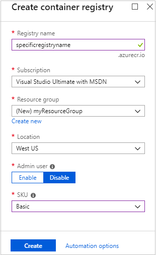
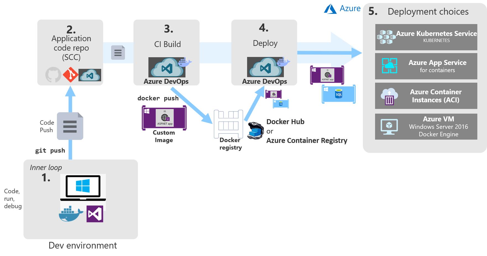
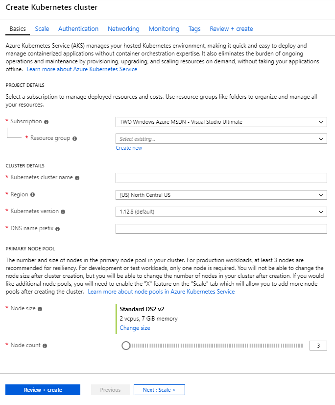
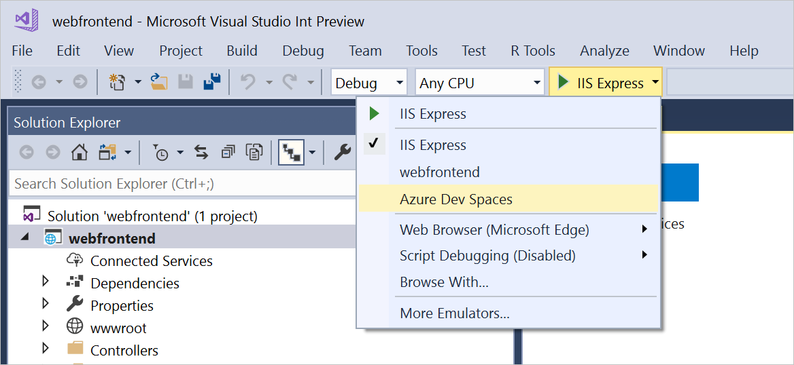

# Deploying containers in Azure

Containers provide many benefits, one of which is portability. You can easily take the same container you've developed and tested locally and deploy it to Azure where it can run your app in staging and production environments. Azure provides a number of options for container-based app hosting and likewise supports several different means of deployment. The most common and most flexible approach is to deploy your containers to Azure Container Registry (ACR), where they are accessible by whatever services you wish to use to host them. Azure Web App for Containers, Azure Kubernetes Services (AKS), and Azure Container Instance (ACI) all can access container images that have been pushed to ACR.

## Azure Container Registry

Azure Container Registry lets you build, store, and manage images for all of your container deployments. You can [create a container registry using the Azure Portal](https://docs.microsoft.com/azure/container-registry/container-registry-get-started-portal) or [using the Azure CLI](https://docs.microsoft.com/azure/container-registry/container-registry-get-started-azure-cli) or [PowerShell tools](https://docs.microsoft.com/azure/container-registry/container-registry-get-started-powershell). Creating a new container registry just requires an Azure subscription, a resource group, and a unique name. Figure 3-13 shows the basic options for creating a registry, which will be hosted at *registryname*.azurecr.io.

 \
**Figure 3-13**. Create container registry

Once you've created a registry, you'll need to authenticate with it before you can use it. Typically, you'll log into the registry using the Azure CLI command:

```cli
az acr login --name *registryname*
```

Once you've created a registry in Azure Container Registry, you can use docker commands to push container images to it. Before you can do so, however, you must first tag your image with the fully qualified name (URL) of your ACR login server. This will have the format *registryname*.azurecr.io.

```cli
docker tag mycontainer myregistry.azurecr.io/mycontainer:v1
```

After you've tagged the image, you use the `docker push` command to push the image to your ACR instance.

```cli
docker push myregistry.azurecr.io/mycontainer:v1
```

After you push an image to the registry, it's a good idea to remove the image from your local Docker environment, using this command:

```cli
docker rmi myregistry.azurecr.io/mycontainer:v1
```

### Integrating Azure DevOps

Ideally, developers will rarely push directly from their machines to a container registry. Instead, developers should build and test locally, and then commit their code into a source control repository like GitHub or Azure DevOps. From there, a continuous integration process will run a build to ensure the code compiles and passes a suite of automated tests. Assuming these conditions are met, a release pipeline will create a new container instance, tag it, and deploy it automatically to a container registry. Figure 3-14 demonstrates a development process that takes advantage of Azure DevOps for Continuous Integration (CI) and Continuous Deployment (CD) to a variety of Azure container hosting options.


**Figure 3-14**. Azure DevOps Container Deployment

## Azure Kubernetes Service

If your container-based application involves multiple containers, you'll most likely want to define and manage the interactions between the containers using an *orchestrator* like Kubernetes. Once you've deployed your container images to ACR, you can easily configure Azure Kubernetes Services to automatically deploy updated images from ACR. With a full CI/CD pipeline in place, you can configure a [canary release](https://martinfowler.com/bliki/CanaryRelease.html) strategy to minimize the risk involved when rapidly deploying updates. The new version of the app is initially configured in production with no traffic routed to it, and then a small number of users are routed to the newly-deployed version of the app. As the team gains confidence in the new version of the software, more instances of the new version are rolled out and the previous version's instances are retired. AKS easily supports this style of deployment.

As with most resources in Azure, you can create Azure Kubernetes clusters using the portal or using command line tools or infrastructure automation tools like Helm or Terraform. To get started with a new cluster, you need to provide the following information:

- Azure subscription
- Resource group
- Kubernetes cluster name
- Region
- Kubernetes version
- DNS name prefix
- Node size
- Node count

This information is sufficient to get started. As part of the creation process in the Azure Portal, you can also configure options for the following features of your cluster:

- Scale
- Authentication
- Networking
- Monitoring
- Tags

Figure 3-15 shows the basic form requirements in the Azure Portal to create a new Kubernetes cluster.

 \
**Figure 3-15**. Create Kubernetes cluster

## Azure Dev Spaces

Complex Kubernetes clusters can require significant resources to host, which can make it difficult for developers to run the entire application on a single machine (especially a laptop). Azure Dev Spaces offers a solution to this by allowing developers to work with their own versions of Azure Kubernetes clusters hosted in Azure. Azure Dev Spaces is designed to ease development of microservice-based applications using AKS.

To understand the value of Azure Dev Spaces, let me share this quotation from Gabe Monroy, PM Lead of Containers at Microsoft Azure:

"Imagine you are a new employee trying to fix a bug in a complex microservices application consisting of dozens of components, each with their own configuration and backing services. To get started, you must configure your local development environment so that it can mimic production including setting up your IDE, building tool chain, containerized service dependencies, a local Kubernetes environment, mocks for backing services, and more. With all the time involved setting up your development environment, fixing that first bug could take days.

> Or you could use Dev Spaces and AKS."

The process for working with Azure Dev Spaces involves the following steps:

1. Create the dev space.
2. Configure the root dev space.
3. Configure a child dev space (for your own version of the system).
4. Connect to the dev space.

All of these steps can be performed using the Azure CLI and new  `azds` command line tools. For example, to create a new Azure Dev Space for a given Kubernetes cluster, you would use a command like this one:

```cli
az aks use-dev-spaces -g my-aks-resource-group -n MyAKSCluster
```

Next, you can use the `azds prep` command to generate the necessary Docker and Helm chart assets for running the application. Then you run your code in AKS using `azds up`. The first time you run this command, the Helm chart will be installed, and the container(s) will be built and deployed according to your instructions. This may take a few minutes the first time it's run. However, after you make changes, you can connect to your own child dev space using `azds space select` and then deploy and debug your updates in your isolated child dev space. Once you have your dev space up and running, you can send updates to it by re-issuing the `azds up` command or you can use built-in tooling in Visual Studio or Visual Studio Code. With VS Code, you use the command palette to connect to your dev space. Figure 3-16 shows how to launch your web application using Azure Dev Spaces in Visual Studio.


**Figure 3-16**. Connect to Azure Dev Spaces in Visual Studio

## References

- [Canary Release](https://martinfowler.com/bliki/CanaryRelease.html)
- [Azure Dev Spaces with VS Code](https://docs.microsoft.com/azure/dev-spaces/quickstart-netcore)
- [Azure Dev Spaces with Visual Studio](https://docs.microsoft.com/azure/dev-spaces/quickstart-netcore-visualstudio)

>[!div class="step-by-step"]
>[Previous](combine-containers-serverless-approaches.md)
>[Next](other-deployment-options.md)
