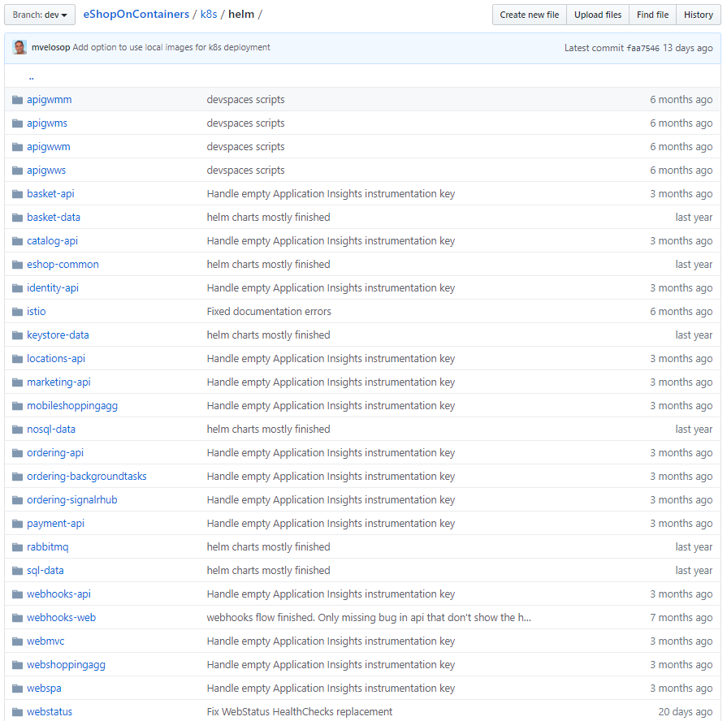

# Deploying eShopOnContainers to Azure

The eShopOnContainers application can be deployed to various Azure platforms. The recommended approach is to deploy the application to Azure Kubernetes Services (AKS). Helm, a Kubernetes deployment tool, is available to reduce deployment complexity. Optionally, developers may implement Azure Dev Spaces for Kubernetes to streamline their development process.

## Azure Kubernetes Service

To host eShop in AKS, the first step is to create an AKS cluster. To do so, you might use the Azure portal, which will walk you through the required steps. You could also create a cluster from the Azure CLI, taking care to enable Role-Based Access Control (RBAC) and application routing. The eShopOnContainers' documentation details the steps for creating your own AKS cluster. Once created, you can access and manage the cluster from the Kubernetes dashboard.

You can now deploy the eShop application to the cluster using Helm.

## Deploying to Azure Kubernetes Service using Helm

Helm is an application package manager tool that works directly with Kubernetes. It helps you define, install, and upgrade Kubernetes applications. While simple apps can be deployed to AKS with custom CLI scripts or simple deployment files, complex apps can contain many Kubernetes objects and benefit from Helm.

Using Helm, applications include text-based configuration files, called Helm charts, which declaratively describe the application and configuration in Helm packages. Charts use standard YAML-formatted files to describe a related set of Kubernetes resources. They're versioned alongside the application code they describe. Helm Charts range from simple to complex depending on the requirements of the installation they describe.

Helm is composed of a command-line client tool, which consumes helm charts and launches commands to a server component named, Tiller. Tiller communicates with the Kubernetes API to ensure the correct provisioning of your containerized workloads. Helm is maintained by the Cloud-native Computing Foundation.

The following yaml file presents a Helm template:

```yaml
apiVersion: v1
kind: Service
metadata:
  name: {{ .Values.app.svc.marketing }}
  labels:
    app: {{ template "marketing-api.name" . }}
    chart: {{ template "marketing-api.chart" . }}
    release: {{ .Release.Name }}
    heritage: {{ .Release.Service }}
spec:
  type: {{ .Values.service.type }}
  ports:
    - port: {{ .Values.service.port }}
      targetPort: http
      protocol: TCP
      name: http
  selector:
    app: {{ template "marketing-api.name" . }}
    release: {{ .Release.Name }}
```

Note how the template describes a dynamic set of key/value pairs. When the template is invoked, values that enclosed in curly braces are pulled in from other yaml-based configuration files.

You'll find the eShopOnContainers helm charts in the /k8s/helm folder. Figure 2-6 shows how the different components of the application are organized into a folder structure used by helm to define and managed deployments.


**Figure 2-6**. The eShopOnContainers helm folder.

Each individual component is installed using a `helm install` command. eShop includes a "deploy all" script that loops through and installs the components using their respective helm charts. The result is a repeatable process, versioned with the application in source control, that anyone on the team can deploy to an AKS cluster with a one-line script command.

> Note that version 3 of Helm officially removes the need for the Tiller server component. More information on this enhancement can be found [here](https://medium.com/better-programming/why-is-tiller-missing-in-helm-3-2347c446714).

## Azure Functions and Logic Apps (Serverless)

The eShopOnContainers sample includes support for tracking online marketing campaigns. An Azure Function is used to track marketing campaign details for a given campaign ID. Rather than creating a full microservice, a single Azure Function is simpler and sufficient. Azure Functions have a simple build and deployment model, especially when configured to run in Kubernetes. Deploying the function is scripted using Azure Resource Manager (ARM) templates and the Azure CLI. This campaign service isn't customer-facing and invokes a single operation, making it a great candidate for Azure Functions. The function requires minimal configuration, including a database connection string data and image base URI settings. You configure Azure Functions in the Azure portal.

>[!div class="step-by-step"]
>[Previous](map-eshoponcontainers-azure-services.md)
>[Next](centralized-configuration.md)
