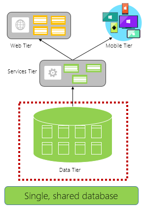
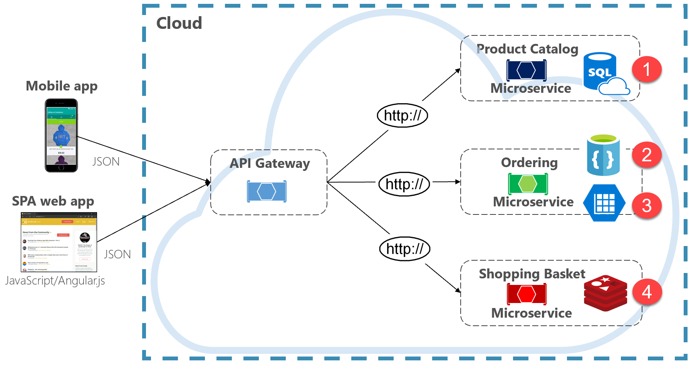

# Cloud-native data

When constructing a cloud native system, the way you think about data storage changes.

Traditional monolithic applications favor a straightforward data structure, typically a centralized data store, shown in Figure 5-1. 

**Figure 5-1**. Data storage in monolithic applications

In the figure above, all of the components from the monolithic application consume a single, relational database.

There are many benefits to this approach. It's straightforward to query data as all data is in the same store. It's also straightforward to update data with [ACID transactions](https://docs.microsoft.com/windows/desktop/cossdk/acid-properties) that guarantee data consistency. You end up with *immediate consistency*: All your data updates, or none of it does.

Cloud native systems, however, favor a distributed data architecture shown in Figure 5-2.

**Figure 5-2**. Distributed data storage across microservices

 In the figure above, each microservice owns and encapsulates its own data store. The service only exposes data to the outside world through its public API.
 
This approach, the distributed data model, also provides many benefits. It enables each microservice to evolve independently without having to coordinate data schema changes with other microservices. Each microservice is free to implement the data store (relational database, document database, key-value store) type that best matches its needs. At runtime, each microservice can scale its data accordingly. Figure 5-3 presents the principle of polyglot persistence. 

**Figure 5-3**. Polyglot data persistence

In the above figure, the product catalog microservice implements a relational database, the ordering microservice, a NoSql document database, and the shopping cart microservice, an external key-value store. While relational databases remain relevant for microservices with complex data, NoSQL databases have gained considerable popularity. They provide adaptability, fast lookup, and high availability. Their schemaless nature allows developers to move away from an architecture of typed data classes and ORMs that make change expensive and time-consuming.

>[!div class="step-by-step"]
>[Previous](service-mesh-communication-infrastructure.md)
>[Next](cloud-native-data-patterns.md)
