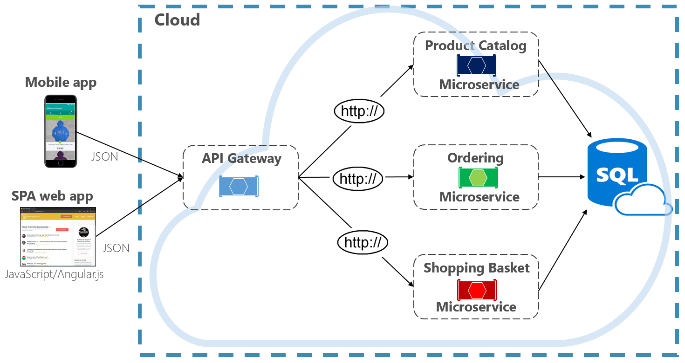

# Cloud-native data

When architecting cloud native systems, the way you think about data and data storage dramatically changes.

Traditional monolithic applications favor a centralized data structure, typically a large relational databse, shown in Figure 5-1. 

**Figure 5-1**. Data storage in monolithic applications

Note in the figure above how all of the components from the monolithic application share the relational database.

There are many benefits to this approach. It's straightforward to query data as all data is in the same store. It's also straightforward to update data with [ACID transactions](https://docs.microsoft.com/windows/desktop/cossdk/acid-properties) that guarantee data consistency. You end up with *immediate consistency*: All your data updates, or none of it does.

However, distrubted cloud-native system take on a whole new approach to data 

n recent years, there has been tremendous innovation in the data space: Managed cloud database services, NoSQL, NewSQL and a variety of cloud-native databases that support specific read and write scenairos.

But, what happens to data when you decompose your monolithic application into small, independent microservices?

Figure 5-2 shows the scenario.

**Figure 5-2**. Microservices and a shared database

In the previous figure, we see a system with three core microservices that all share a centralized data store. straightforward to implement, what could go wrong?

- Performance - The load is on one datastore and results in high contention - microservices compete for the database's limited resources
- No isolation (called a bulkhead) - a datbase failure will bring the entire system down 
- Limited scalability - typically vertically scale, but limited by the capAacity of the underlying hardware
- Limited connections - Contention increases due to limited connections
- Expensive - must have redundant replicas within and across regions

Cloud native systems, however, favor a distributed data architecture shown in Figure 5-2.

**Figure 5-2**. Distributed data storage across microservices

 In the figure above, each microservice owns and encapsulates its own data store. The service only exposes data to the outside world through its public API.
 
I

This approach, the distributed data model, also provides many benefits. It enables each microservice to evolve independently without having to coordinate data schema changes with other microservices. Each microservice is free to implement the data store (relational database, document database, key-value store) type that best matches its needs. At runtime, each microservice can scale its data accordingly. Figure 5-3 presents the principle of polyglot persistence. 

**Figure 5-3**. Polyglot data persistence

In the above figure, the product catalog microservice implements a relational database, the ordering microservice, a NoSql document database, and the shopping cart microservice, an external key-value store. While relational databases remain relevant for microservices with complex data, NoSQL databases have gained considerable popularity. They provide adaptability, fast lookup, and high availability. Their schemaless nature allows developers to move away from an architecture of typed data classes and ORMs that make change expensive and time-consuming.

>[!div class="step-by-step"]
>[Previous](service-mesh-communication-infrastructure.md)
>[Next](cloud-native-data-patterns.md)
