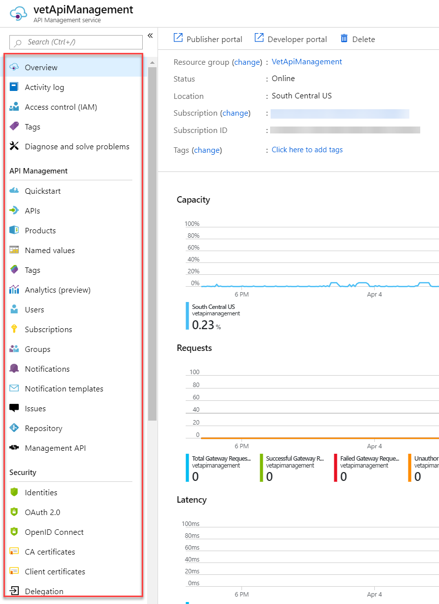
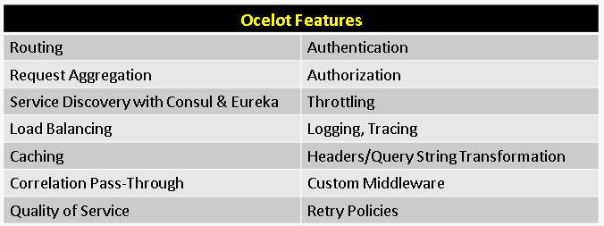
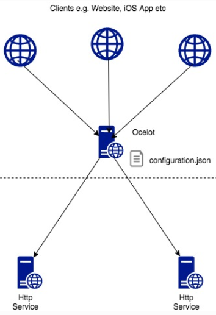

# Front-end client communication

Cloud native applications expose channels to enable communication with front-end client applications, including mobile, web, or desktop applications.

To keep things simple, a front-end client could directly communicate with back-end microservices, shown in Figure 4-2:

**Figure 4-2**. Direct client to service communication

While relatively simple to implement, direct front-end communication is rarely an acceptable practice. Doing so tightly couples the front end to core back-end services and opens the door for a number of potential issues, including:

- Client susceptibility to backend core service refactoring.

- A widening attack surface as core backend services are directly exposed.

- Duplication of cross-cutting concerns.

- Overly complex client code.

Instead, a widely accepted cloud design pattern is to implement an [API Gateway Service](https://docs.microsoft.com/dotnet/standard/microservices-architecture/architect-microservice-container-applications/direct-client-to-microservice-communication-versus-the-api-gateway-pattern) between the frontend applications and backend services, shown in Figure 4-3:

**Figure 4-3.** API gateway pattern

This pattern exposes a single point of entry (the API gateway) to enable front-end clients to communicate with backend services, insulating the front end from internal service partitioning and refactoring. Not only does the gateway act as a reverse proxy appropriately rerouting inbound traffic but also allows many of the cross-cutting concerns, such as identity, caching, resiliency, metering, and throttling, to be offloaded from the backend core services to the gateway.

Care must be taken to keep the API Gateway simple and fast. A single gateway risks becoming a bottleneck and eventually a monolith itself. In larger systems, it's considered a good practice to expose multiple API Gateways segmented on either client type (that is, mobile, web, desktop) or backend service categories. A popular pattern that provides guidance for multiple gateways is called the [Backend for Frontends](https://docs.microsoft.com/azure/architecture/patterns/backends-for-frontends) pattern.

Without much effort, you could build your own API Gateway service. In fact, a quick search of GitHub will present you with many examples. However, there are several off-the-shelf options available.

## Azure API Management

Azure hosts a cloud-based, fully managed and full-featured API Gateway solution that is a great candidate for many medium to large-scale cloud native systems. The service provides built-in gateway management functionality along with a developer and publisher portal, shown in Figure 4-4.

**Figure 4-4**. Azure API Management

[Azure API Management](https://azure.microsoft.com/services/api-management/) enables you to access backend services hosted anywhere – in the cloud or on-premises in your data center. It supports both REST and SOAP APIs across any development platform (.NET, Java, Golang, and so on). Even other Azure services can be exposed through API Management, letting you put a managed API on top of Azure backing services like [Azure Service Bus](https://azure.microsoft.com/services/service-bus/) or [Azure Logic Apps](https://azure.microsoft.com/services/logic-apps/).

As shown above in Figure 4-4, the API Gateway feature creates a façade over the backend microservices. Clients (that is, front end, other cloud services) invoke the façade with HTTP requests. Each call is eventually routed to a backend service, allowing API Management to add configurable services to the call.

Azure API Management supports many features, including:

- Throttle calls from a single source, if necessary.

- Enforce authentication.

- Block calls from specific IP addresses.

- Enable caching.

- Convert requests from SOAP to REST.

- Convert between different data formats, such as from XML to JSON.

API Management provides an extension, the Publisher Portal, where administrators can create APIs and configure how they behave. Here, API Policies can be applied to each call. Policies are a collection of pre-built statements that execute sequentially for the request and response of each call, enabling you to change the behavior of the API through configuration (that is, not code). The product ships with a large number of prebuilt [policies](https://docs.microsoft.com/azure/api-management/api-management-policies) that can be executed on the inbound call, backend processing, outbound call, and upon an error.

Additionally, API Management also provides a Developer Portal, as previously shown in Figure x, which enables access to the API, its documentation, and sample code to invoke the API across a number of different programming languages.

The Azure API Management service provides a tremendous amount of functionality, shown in Figure 4-5.

**Figure 4-5**. Azure API Management functionality

Azure API Management is available across [four different pricing tiers](https://azure.microsoft.com/pricing/details/api-management/):

- Developer

- Basic

- Standard

- Premium

The Developer tier is meant for non-production workloads and evaluation. The other tiers offer progressively more power, features, and service level agreements (SLAs) with the Premium tier providing Azure Virtual Network and multi-region support. All tiers have a fixed price per hour. 

Recently, Microsoft announced a [consumption pricing tier that is currently in preview. Unlike the “pre-allocated” pricing tiers previously shown, the consumption tier provides “serverless” functionality with instant provisioning and pay-per-Action pricing.

## SignalR Services

What was once a popular ASP.NET library to start two-way communication has now become a fully fledged Azure service. Azure SignalR Service makes real-time, two-way communication for HTTP-based applications easier. Once enabled, a cloud-based HTTP application or service can push content updates directly to connected clients, including browser, mobile and desktop applications. As a result, clients are updated without the need to poll the server. Applications that require high frequency updates such as chat, gaming, and financial apps are great candidates for this service.

Manually implementing real-time connectivity can quickly become complex, requiring non-trivial infrastructure to ensure scalability and reliable messaging to connected clients. You could easily find yourself managing your own instance of Azure Redis Cache along with a set of load balancers configured with sticky sessions for client affinity. Instead, these concerns are pre-configured and fully managed by Azure SignalR Service, freeing you up to focus on application features, not infrastructure plumbing.

Under the hood, SignalR abstracts the transport technologies that create real-time connectivity, including WebSockets, Server-Side Events, and Long Polling, depending on the capabilities of the client. Developers focus on sending messages to all or specific subsets of connected clients.

Figure 4-6 shows a set of HTTP Clients connecting to a Cloud App with Azure SignalR enabled.

**Figure 4-6**. Azure SignalR

Azure SignalR Service can be integrated with other Azure services opening up many possibilities.

## Ocelot Gateway

For less complex cloud native applications, you might consider the open-source [Ocelot Gateway](https://github.com/ThreeMammals/Ocelot). Implemented as a set of configurable middleware, Ocelot is lightweight and scalable, and it exposes many gateway features. It's a good solution for simple microservice applications that don’t require the rich feature set of the Azure API Management gateway.

Available as a NuGet package, it targets NET Standard 2.0, making it compatible with both .NET Core 2.0+ and the .NET Framework 4.6.1+ runtimes. However, Ocelot integrates with anything that speaks HTTP and runs on the platforms which .NET Core supports: Linux, macOS, and Windows. It can be hosted in Azure and other public clouds.

Its primary functionality is to forward incoming HTTP requests to downstream services. But, it also supports a variety of configurable gateway capabilities, shown in Figure 4-7.

**Figure 4-7**. Ocelot Features

Each Ocelot gateway instance includes a simple JSON configuration file that specifies the upstream and downstream addresses and configurable features, shown in Figure 4-8.

**Figure 4-8**. Basic Ocelot implementation

In Figure 4-8, the client sends an HTTP request to the Ocelot gateway. Once received, Ocelot manipulates the HttpRequest object into a state specified by its configuration. At the end of pipeline, Ocelot creates a new HttpRequestMessage that is passed to the downstream service. In reverse, Ocelot receives the HTTP response and sends it back to the client.

Ocelot is extensible and can support many modern platforms, including Azure Kubernetes Services and Service Fabric, as well as integration with open-source packages like Consul, GraphQL, Netflix’s Eureka, web sockets, and SignalR.

>[!div class="step-by-step"]
>[Previous](communication-patterns.md)
>[Next](cross-service-communication.md)
