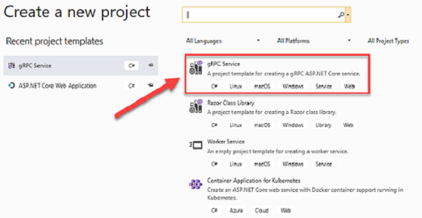
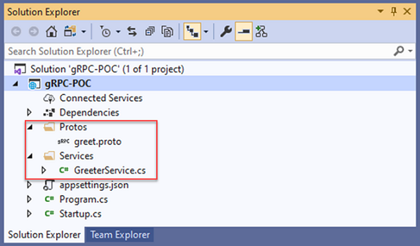
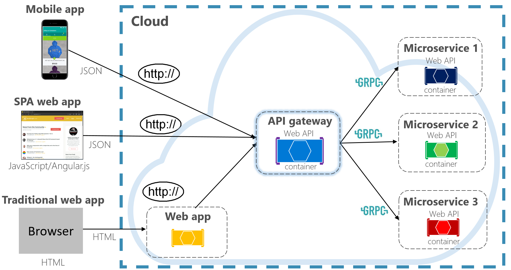

# REST and gRPC

So far in this book, we’ve focused on [REST-based](https://docs.microsoft.com/azure/architecture/best-practices/api-design) communication. REST is an architectural style that promotes interoperability between distributed computer systems. It uses a request/response model where every response from the server is to a request from the client. While widely popular, REST isn't a perfect fit for every problem. A newer communication technology, entitled gRPC, is rapidly gaining popularity and making its way into the cloud-native world.

## gRPC

gRPC, or “Google Remote Procedure Call," is an open-source communication that originates from Google. It's built upon the [remote procedure call (RPC)](https://en.wikipedia.org/wiki/Remote_procedure_call) model, popular in distributed computing. Following this model, a local client program exposes an in-process method to execute an operation. Behind the scenes, that call is invoked on an out-of-process microservice across a distributed network. The developer codes the operation as a local procedure call. The underlying platform abstracts the point-to-point networking communication, serialization, and execution.

gRPC is a modern RPC framework that is lightweight and highly performant. It uses HTTP/2 for its transport protocol. While compatible with HTTP 1.1, HTTP/2 features many advanced capabilities:

- While HTTP 1.1 sends data as clear text, HTTP/2 is a binary protocol. It parses data faster using less memory, reduces network latency with the related improvements to speed, and manages network resources more efficiently.
- While HTTP 1.1 is limited to processing one round-trip request/response at a time, HTTP /2 supports multiplexing, or multiple parallel requests over the same connection.
- HTTP/2 supports full-duplex, or bidirectional communication, where both client and server and can communicate at the same time. The client can be uploading request data at the same time the server is sending back response data.
- Streaming is built into HTTP/2 meaning that both requests and responses can asynchronously stream large data sets.
- Combining gRPC and HTTP/2, performance dramatically increases. In [Windows Communication Foundation (WCF)](https://docs.microsoft.com/dotnet/framework/wcf/whats-wcf) parlance, gPRC performance meets and exceeds the speed and efficiency of [NetTCP bindings](https://docs.microsoft.com/en-us/dotnet/api/system.servicemodel.nettcpbinding?view=netframework-4.8). However, unlike NetTCP, gRPC isn't constrained to Microsoft languages such as C# or VB.NET.

gRPC is supported across most popular platforms, including Java, C#, Golang and NodeJS. 

## Protocol Buffers

gRPC embraces another open-source technology called [Protocol Buffers](https://developers.google.com/protocol-buffers/docs/overview) or Protobuf messages to send and receive data. Similar to a [WCF Data Contract](https://docs.microsoft.com/en-us/dotnet/framework/wcf/feature-details/using-data-contracts), Protobuf serializes structured data for systems to read and write. It reduces the overhead that human-readable formats like XML or JSON incur.

Many object serialization techniques reflect across the structure of data objects at run-time. Protobuf requires you to define the structure up front with a platform-agnostic language (Protocol Buffer Language). Each definition is stored in a ".proto" file. Then using Protobuf compiler, "Proton," you generate client and server code for any of the supported platforms. The generated code is optimized for fast serialization/deserialization of data. At runtime, each message is wrapped in the strongly-typed service contract and serialized in a standard Protobuf representation.

## gRPC support in .NET

The Microsoft .NET Core framework 3.0 includes tooling and native support for gRPC. Figure x.x shows the Visual Studio 2019 template that scaffolds a gRPC skeleton project for a gRPC service. Note how .NET Core supports the Windows, Linux, macOS platforms.

**Figure 4-19**. gRPC support in Visual Studio 2019

.NET Core 3.0 seamlessly integrates gRPC into its framework, including endpoint routing, built-in IoC support, and logging. The open-source Kestrel web server fully supports HTTP/2 connections. 

Figure 4.20 shows structure of a gRPC service in Visual Studio 2019. Note how the folder structure includes folders for the proto files and service code.

**Figure 4-20**. gRPC project in Visual Studio 2019

## gPRC Usage

gRPC is well suited for the following scenarios:

- Low latency and high throughput communication. gRPC is great for lightweight microservices where efficiency is critical.
- Point-to-point real-time communication. gRPC has excellent support for bi-directional streaming. gRPC services can push messages in real time without polling.
- Polyglot environments – gRPC tooling supports most popular development languages, making it a good choice for multi-language environments.
- Network constrained environments – gRPC messages are serialized with Protobuf, a lightweight message format. A gRPC message is always smaller than an equivalent JSON message.

At of the writing of this book, most browsers have limited support for gRPC. gRPC heavily uses HTTP/2 features and no browser provides the level of control required over web requests to support a gRPC client. gRPC is typically used for internal microservice to microservice communication. Figure 4.21 shows a simple, but common usage pattern.

**Figure 4-21**. gRPC usage patterns

Note in the previous figure how front-end traffic is invoked with HTTP while back-end microservice to microservice uses gRPC.

Looking ahead, gRPC could play a major role in dethroning the dominance of REST for cloud-native systems. The performance benefits and ease of development are too good to pass up. However, make no mistake, REST will still be around for a long time. It still excels for publicly exposed APIs and for backward compatibility reasons. 

>[!div class="step-by-step"]
>[Previous](cross-service-communication.md)
>[Next](resilient-communications.md)

