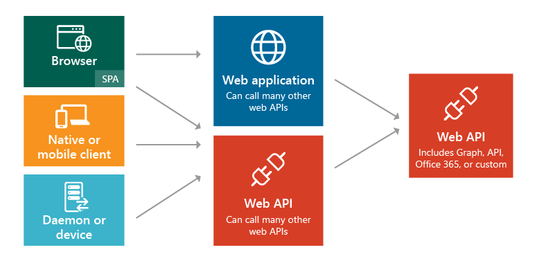

# IdentityServer for cloud-native applications

[!INCLUDE [book-preview](../../../includes/book-preview.md)]

IdentityServer is an open-source authentication server that implements OpenID Connect (OIDC) and OAuth 2.0 standards for ASP.NET Core. It's designed to provide a common way to authenticate requests to all of your applications, whether they're web, native, mobile, or API endpoints. IdentityServer can be used to implement Single Sign-On (SSO) for multiple applications and application types. It can be used to authenticate actual users via sign-in forms and similar user interfaces as well as service-based authentication that typically involves token issuance, verification, and renewal without any user interface. IdentityServer is designed to be a customizable solution. Each instance is typically customized to suit an individual organization and/or set of applications' needs.

## Common web app scenarios

Typically, applications need to support some or all of the following scenarios:

- Human users accessing web applications with a browser.
- Human users accessing back-end Web APIs from browser-based apps.
- Human users on mobile/native clients accessing back-end Web APIs.
- Other applications accessing back-end Web APIs (without an active user or user interface).
- Any application may need to interact with other Web APIs, using its own identity or delegating to the user's identity.


**Figure 8-1**. Application types and scenarios.

In each of these scenarios, the exposed functionality needs to be secured against unauthorized use. At a minimum, this typically requires authenticating the user or principal making a request for a resource. This authentication may use one of several common protocols such as SAML2p, WS-Fed, or OpenID Connect. Communicating with APIs typically uses the OAuth2 protocol and its support for security tokens. Separating these critical cross-cutting security concerns and their implementation details from the applications themselves ensures consistency and improves security and maintainability. Outsourcing these concerns to a dedicated product like IdentityServer helps the requirement for every application to solve these problems itself.

IdentityServer provides middleware that runs within an ASP.NET Core application and adds support for OpenID Connect and OAuth2 (see [supported specifications](http://docs.identityserver.io/en/latest/intro/specs.html)). Organizations would create their own ASP.NET Core app using IdentityServer middleware to act as the STS for all of their token-based security protocols. The IdentityServer middleware exposes endpoints to support standard functionality, including:

- Authorize (authenticate the end user)
- Token (request a token programmatically)
- Discovery (metadata about the server)
- User Info (get user information with a valid access token)
- Device Authorization (used to start device flow authorization)
- Introspection (token validation)
- Revocation (token revocation)
- End Session (trigger single sign-out across all apps)

## Getting started

IdentityServer4 is open-source and free to use. You can add it to your applications using its NuGet packages. The main package is [IdentityServer4](https://www.nuget.org/packages/IdentityServer4/) that has been downloaded over four million times. The base package doesn't include any user interface code and only supports in memory configuration. To use it with a database, you'll also want a data provider like [IdentityServer4.EntityFramework](https://www.nuget.org/packages/IdentityServer4.EntityFramework) that uses Entity Framework Core to store configuration and operational data for IdentityServer. For user interface, you can copy files from the [Quickstart UI repository](https://github.com/IdentityServer/IdentityServer4.Quickstart.UI) into your ASP.NET Core MVC application to add support for sign in and sign out using IdentityServer middleware.

## Configuration

IdentityServer supports different kinds of protocols and social authentication providers that can be configured as part of each custom installation. This is typically done in the ASP.NET Core application's `Startup` class in the `ConfigureServices` method. The configuration involves specifying the supported protocols and the paths to the servers and endpoints that will be used. Figure 8-2 shows an example configuration taken from the IdentityServer4 Quickstart UI project:

```csharp
public class Startup
{
    public void ConfigureServices(IServiceCollection services)
    {
        services.AddMvc();
        
        // some details omitted
        services.AddIdentityServer();
        
          services.AddAuthentication()
            .AddGoogle("Google", options =>
            {
                options.SignInScheme = IdentityServerConstants.ExternalCookieAuthenticationScheme;

                options.ClientId = "<insert here>";
                options.ClientSecret = "<inser here>";
            })
            .AddOpenIdConnect("demoidsrv", "IdentityServer", options =>
            {
                options.SignInScheme = IdentityServerConstants.ExternalCookieAuthenticationScheme;
                options.SignOutScheme = IdentityServerConstants.SignoutScheme;

                options.Authority = "https://demo.identityserver.io/";
                options.ClientId = "implicit";
                options.ResponseType = "id_token";
                options.SaveTokens = true;
                options.CallbackPath = new PathString("/signin-idsrv");
                options.SignedOutCallbackPath = new PathString("/signout-callback-idsrv");
                options.RemoteSignOutPath = new PathString("/signout-idsrv");

                options.TokenValidationParameters = new TokenValidationParameters
                {
                    NameClaimType = "name",
                    RoleClaimType = "role"
                };
            });
    }
}
```

**Figure 8-X**. Configuring IdentityServer.

IdentityServer also hosts a public demo site that can be used to test various protocols and configurations. It's located at [https://demo.identityserver.io/](https://demo.identityserver.io/) and includes information on how to configure its behavior based on the `client_id` provided to it.

## JavaScript clients

Many cloud-native applications leverage server-side APIs and rich client single page applications (SPAs) on the front end. IdentityServer ships a [JavaScript client](http://docs.identityserver.io/en/latest/quickstarts/6_javascript_client.html) (`oidc-client.js`) via NPM that can be added to SPAs to enable them to use IdentityServer for sign in, sign out, and token-based authentication of web APIs.

## References

- [IdentityServer documentation](http://docs.identityserver.io/)
- [Application types](https://docs.microsoft.com/azure/active-directory/develop/app-types)
- [JavaScript OIDC client](http://docs.identityserver.io/en/latest/quickstarts/6_javascript_client.html)

>[!div class="step-by-step"]
>[Previous](azure-active-directory.md)
>[Next](security.md)
