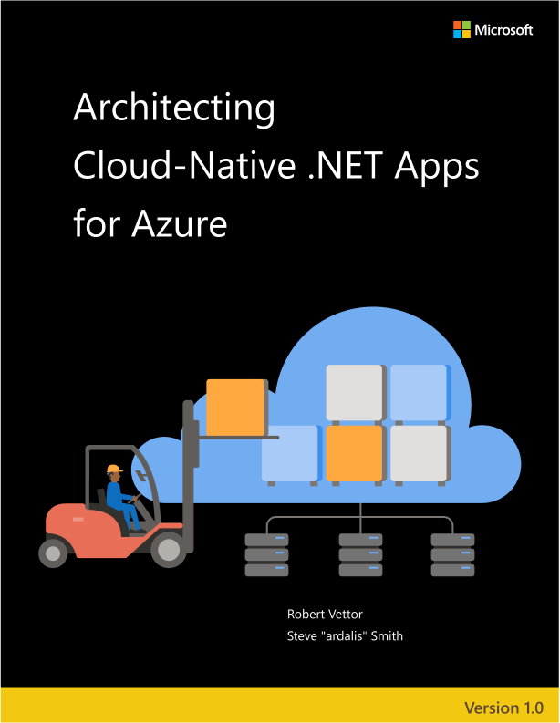

# Architecting Cloud Native .NET Applications for Azure

**EDITION v1.0.2**

Refer [changelog](https://aka.ms/cn-ebook-changelog) for the book updates and community contributions.

PUBLISHED BY

Microsoft Developer Division, .NET, and Visual Studio product teams

A division of Microsoft Corporation

One Microsoft Way

Redmond, Washington 98052-6399

Copyright &copy; 2021 by Microsoft Corporation

All rights reserved. No part of the contents of this book may be reproduced or transmitted in any form or by any means without the written permission of the publisher.

This book is provided "as-is" and expresses the author's views and opinions. The views, opinions, and information expressed in this book, including URL and other Internet website references, may change without notice.

Some examples depicted herein are provided for illustration only and are fictitious. No real association or connection is intended or should be inferred.

Microsoft and the trademarks listed at <https://www.microsoft.com> on the "Trademarks" webpage are trademarks of the Microsoft group of companies.

Mac and macOS are trademarks of Apple Inc.

The Docker whale logo is a registered trademark of Docker, Inc. Used by permission.

All other marks and logos are property of their respective owners.

Authors:

> **Rob Vettor**, Principal MTC (Microsoft Technology Center) Architect for Cloud App Innovation - [thinkingincloudnative.com](https://thinkingincloudnative.com/about/), Microsoft
>
> **Steve "ardalis" Smith**, Software Architect and Trainer - [Ardalis.com](https://ardalis.com)

Participants and Reviewers:

> **Cesar De la Torre**, Principal Program Manager, .NET team, Microsoft
>
> **Nish Anil**, Senior Program Manager, .NET team, Microsoft
>
> **Jeremy Likness**, Senior Program Manager, .NET team, Microsoft
>
> **Cecil Phillip**, Senior Cloud Advocate, Microsoft
>
> **Sumit Ghosh**, Principal Consultant at Neudesic

Editors:

> **Maira Wenzel**, Program Manager, .NET team, Microsoft

> **David Pine**, Senior Content Developer, .NET docs, Microsoft

## Version

This guide has been written to cover **.NET 6** version along with many additional updates related to the same “wave” of technologies (that is, Azure and additional third-party technologies) coinciding in time with the .NET 6 release.

## Who should use this guide

The audience for this guide is mainly developers, development leads, and architects who are interested in learning how to build applications designed for the cloud.

A secondary audience is technical decision-makers who plan to choose whether to build their applications using a cloud-native approach.

## How you can use this guide

This guide begins by defining cloud native and introducing a reference application built using cloud-native principles and technologies. Beyond these first two chapters, the rest of the book is broken up into specific chapters focused on topics common to most cloud-native applications. You can jump to any of these chapters to learn about cloud-native approaches to:

- Data and data access
- Communication patterns
- Scaling and scalability
- Application resiliency
- Monitoring and health
- Identity and security
- DevOps

This guide is available both in [PDF](https://dotnet.microsoft.com/download/e-book/cloud-native-azure/pdf) form and online. Feel free to forward this document or links to its online version to your team to help ensure common understanding of these topics. Most of these topics benefit from a consistent understanding of the underlying principles and patterns, as well as the trade-offs involved in decisions related to these topics. Our goal with this document is to equip teams and their leaders with the information they need to make well-informed decisions for their applications' architecture, development, and hosting.

## Send your feedback

This book and related samples are constantly evolving, so your feedback is welcomed! If you have comments about how this book can be improved, use the feedback section at the bottom of any page built on [GitHub issues](https://github.com/dotnet/docs/issues).

>[!div class="step-by-step"]
>[Next](introduction.md)
