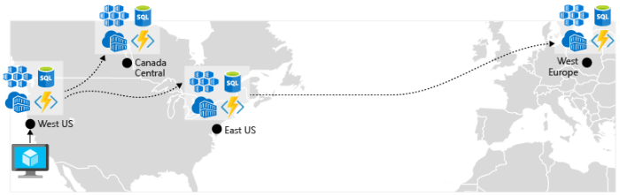
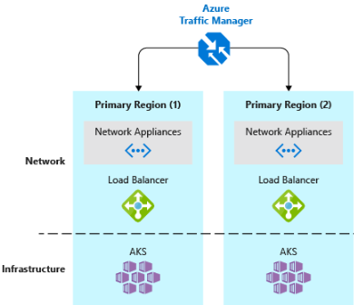
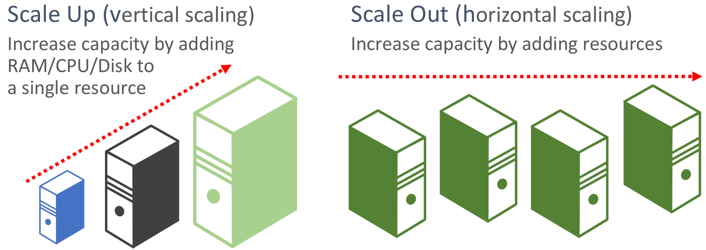

# Azure platform resiliency

Building a reliable application in the cloud is different from traditional on-premises application development. While historically you purchased higher-end hardware to scale up, in a cloud environment you scale out. Instead of trying to prevent failures, the goal is to minimize their effects and keep the system stable.

That said, reliable cloud applications display distinct characteristics:

- They're resilient, recover gracefully from problems and continue to function.
- They're highly available (HA) and run as designed in a healthy state with no significant downtime.

Understanding how these characteristics work together - and how they affect cost - is essential to building a reliable cloud native application. We'll next look at ways that you can build resiliency and availability into your cloud native applications leveraging features from the Azure cloud.

## Design with redundancy

Failures vary in scope of impact. A hardware failure, such as a failed disk, can affect a single node in a cluster. A failed network switch could affect an entire server rack. Less common failures, such as loss of power, could disrupt a whole datacenter. Rarely, an entire region becomes unavailable.

[Redundancy](https://docs.microsoft.com/azure/architecture/guide/design-principles/redundancy) is one way to provide application resilience. The exact level of redundancy needed depends on your business requirements and will affect both cost and complexity of your system. For example, a multi-region deployment is more expensive and more complex to manage than a single-region deployment. You'll need operational procedures to manage failover and failback. The additional cost and complexity might be justified for some business scenarios and not others.

To architect redundancy, you need to identify the critical paths in your application, and then determine if there's redundancy at each point in the path? If a subsystem should fail, will the application fail over to something else? Finally, you need a clear understanding of those features built into the Azure cloud platform that you can leverage to meet your redundancy requirements. Here are recommendations for architecting redundancy:

- *Deploy multiple instances of services.* If your application depends on a single instance of a service, it creates a single point of failure. Provisioning multiple instances improves both resiliency and scalability. When hosting in Azure Kubernetes Service, you can declaratively configure redundant instances (replica sets) in the Kubernetes manifest file. The replica count value can be managed programmatically, in the portal or through autoscaling features, which will be discussed later on.

- *Leveraging a load balancer.* Load-balancing distributes your application's requests to healthy service instances and automatically removes unhealthy instances from rotation. When deploying to Kubernetes, load balancing can be specified in the Kubernetes manifest file in the Services section.

- *Plan for multiregion deployment.* If your application is deployed to a single region, and the region becomes unavailable, your application will also become unavailable. This may be unacceptable under the terms of your application's service level agreements. Instead, consider deploying your application and its services across multiple regions. For example, an Azure Kubernetes Service (AKS) cluster is deployed to a single region. To protect your system from a regional failure, you might deploy your application to multiple AKS clusters across different regions and use the [Paired Regions](https://buildazure.com/2017/01/06/azure-region-pairs-explained/) feature to coordinate platform updates and prioritize recovery efforts.

- *Enable [geo-replication](https://docs.microsoft.com/azure/sql-database/sql-database-active-geo-replication).* Geo-replication for services such as Azure SQL Database and Cosmos DB will create secondary replicas of your data across multiple regions. While both services will automatically replicate data within the same region, geo-replication protects you against a regional outage by enabling you to fail over to a secondary region. Another best practice for geo-replication centers around storing container images. To deploy a service in AKS, you need to store and pull the image from a repository. Azure Container Registry integrates with AKS and can securely store container images. To improve performance and availability, consider geo-replicating your images to a registry in each region where you have an AKS cluster. Each AKS cluster then pulls container images from the local container registry in its region as shown in Figure 6-6:

**Figure 6-6**. Replicated resources across regions

- *Implement a DNS traffic load balancer.* [Azure Traffic Manager](https://docs.microsoft.com/azure/traffic-manager/traffic-manager-overview) provides high-availability for critical applications by load-balancing at the DNS level. It can route traffic to different regions based on geography, cluster response time and even application endpoint health. For example, Azure Traffic Manager can direct customers to the closest AKS cluster and application instance. If you have multiple AKS clusters in different regions, use Traffic Manager to control how traffic flows to the applications that run in each cluster. Figure 6-7 shows this scenario.

**Figure 6-7**. AKS and Azure Traffic Manager

## Design for scalability

The cloud thrives on scaling. The ability to increase/decrease system resources to address increasing/decreasing system load is a key tenet of the Azure cloud. But, to effectively scale an application, you need an understanding of the scaling features of each Azure service that you include in your application.  Here are recommendations for effectively implementing scaling in your system.

- *Design for scaling.* An application must be designed for scaling. To start, services should be stateless so that requests can be routed to any instance. Having stateless services also means that adding or removing an instance doesn't adversely impact current users.

- *Partition workloads*. Decomposing domains into independent, self-contained microservices enable each service to scale independently of others. Typically, services will have different scalability needs and requirements. Partitioning enables you to scale only what needs to be scaled without the unnecessary cost of scaling an entire application.

- *Favor scale-out.* Cloud-based applications favor scaling out resources as opposed to scaling up. Scaling out (also known as horizontal scaling) involves adding more service resources to an existing system to meet and share a desired level of performance. Scaling up (also known as vertical scaling) involves replacing existing resources with more powerful hardware (more disk, memory, and processing cores). Scaling out can be invoked automatically with the autoscaling features available in some Azure cloud resources. Scaling out across multiple resources also adds redundancy to the overall system. Finally scaling up a single resource is typically more expensive than scaling out across many smaller resources. Figure 6-8 shows the two approaches:

**Figure 6-8.** Scale up vs. scale out

- *Scale proportionally.* When scaling a service, think in terms of *resource sets*. If you were to dramatically scale out a specific service, what impact would that have on back-end data stores, caches and dependent services? Some resources such as Cosmos DB can scale out proportionally, while many others can't. You want to ensure that you don't scale out a resource to a point where it will exhaust other associated resources.

- *Avoid affinity.* A best practice is to ensure a node doesn't require local affinity, often referred to as a *sticky session*. A request should be able to route to any instance. If you need to persist state, it should be saved to a distributed cache, such as [Azure Redis cache](https://azure.microsoft.com/services/cache/).

- *Take advantage of platform autoscaling features.* Use built-in autoscaling features whenever possible, rather than custom or third-party mechanisms. Where possible, use scheduled scaling rules to ensure that resources are available without a startup delay, but add reactive autoscaling to the rules as appropriate, to cope with unexpected changes in demand. For more information, see [Autoscaling guidance](https://docs.microsoft.com/azure/architecture/best-practices/auto-scaling).

 - *Scale-up aggressively.* A final practice would be to scale up aggressively so that you can quickly meet immediate spikes in traffic without losing business. And, then scale down (that is, remove unneeded resources) conservatively to keep the system stable. A simple way to implement this is to set the cool down period, which is the time to wait between scaling operations, to five minutes for adding resources and up to fifteen minutes for removing instances.

## Built-in retry in services

We encouraged the best practice of implementing programmatic retry operations in an earlier section. Keep in mind that many Azure services and their corresponding client SDKs also include retry mechanisms. The following list summarizes retry features in the many of the Azure services that are discussed in this book:

- *Azure Cosmos DB.* The <xref:Microsoft.Azure.Documents.Client.DocumentClient> class from the client API automatically retires failed attempts. The number of retries and maximum wait time are configurable. Exceptions thrown by the client API are either requests that exceed the retry policy or non-transient errors.

- *Azure Redis Cache.* The Redis StackExchange client uses a connection manager class that includes retries on failed attempts. The number of retries, specific retry policy and wait time are all configurable.

- *Azure Service Bus.* The Service Bus client exposes a [RetryPolicy class](xref:Microsoft.ServiceBus.RetryPolicy) that can be configured with a back-off interval, retry count, and <xref:Microsoft.ServiceBus.RetryExponential.TerminationTimeBuffer>, which specifies the maximum time an operation can take. The default policy is nine maximum retry attempts with a 30-second backoff period between attempts.

- *Azure SQL Database.* Retry support is provided when using the [Entity Framework Core](https://docs.microsoft.com/ef/core/miscellaneous/connection-resiliency) library.

- *Azure Storage.* The storage client library support retry operations. The strategies vary across Azure storage tables, blobs, and queues. As well, alternate retries switch between primary and secondary storage services locations when the geo-redundancy feature is enabled.

- *Azure Event Hubs.* The Event Hub client library features a RetryPolicy property, which includes a configurable exponential backoff feature.

>[!div class="step-by-step"]
>[Previous](application-resiliency-patterns.md)
>[Next](resilient-communications.md)
