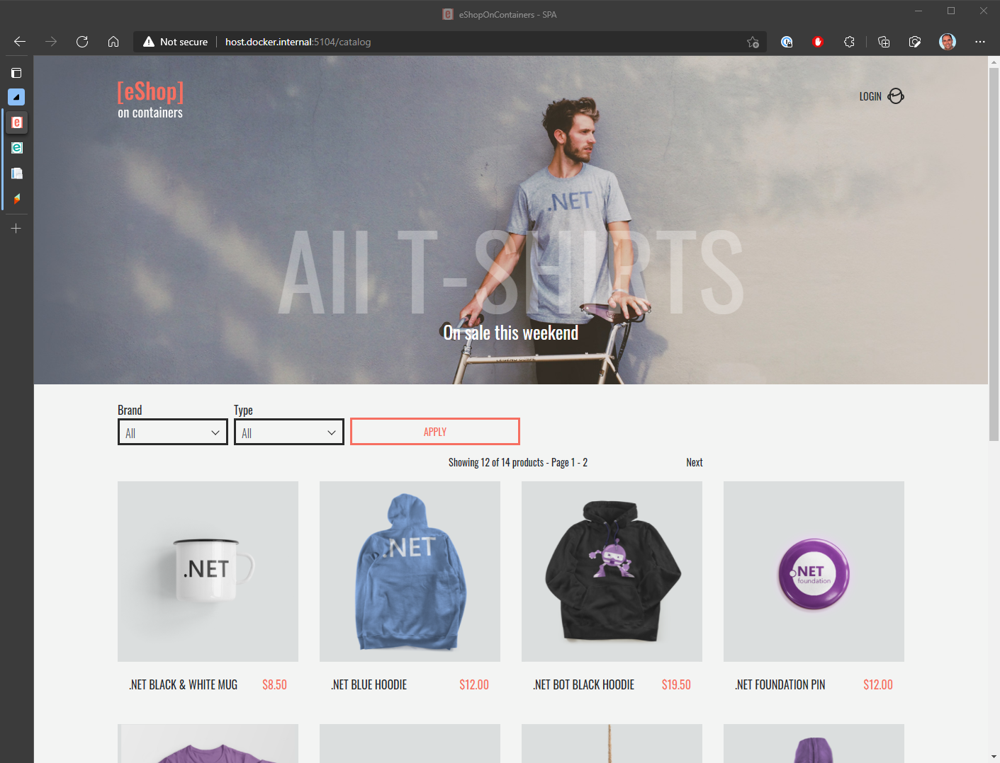
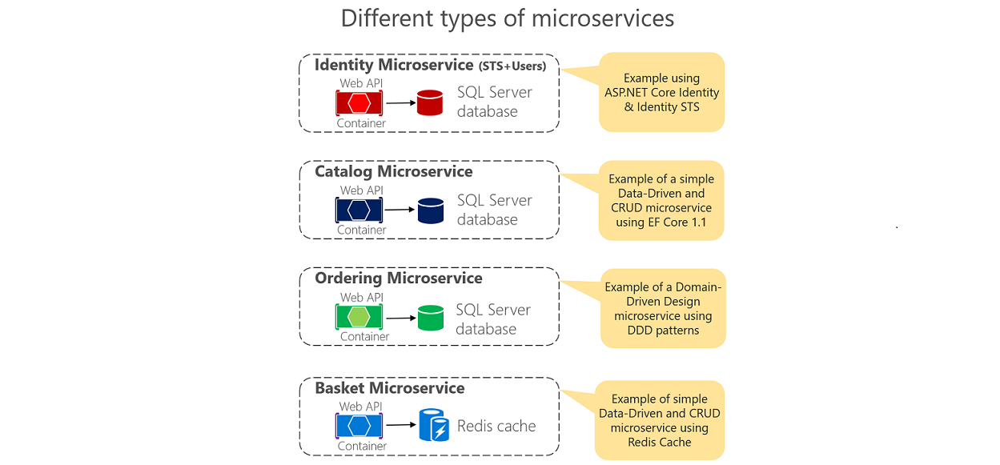
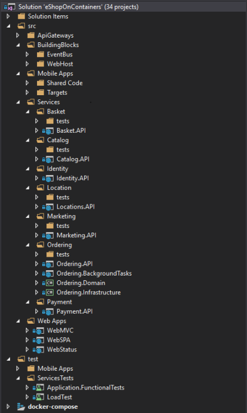

# Introducing eShopOnContainers reference app

Microsoft, in partnership with leading community experts, has produced a full-featured cloud-native microservices reference application, eShopOnContainers. This application is built to showcase using .NET Core and Docker, and optionally Azure, Kubernetes, and Visual Studio, to build an online storefront.

**Figure 3-1**. eShopOnContainers Sample App Screenshot.

Before starting this chapter, we recommend that you download the [eShopOnContainers reference application](https://github.com/dotnet-architecture/eShopOnContainers). If you do so, it should be easier for you to follow along with the information presented.

## Features and requirements

Let's start with a review of the application's features and requirements. The eShopOnContainers application represents an online store that sells various physical products like t-shirts and coffee mugs. If you've bought anything online before, the experience of using the store should be relatively familiar. Here are some of the basic features the store implements:

- List catalog items
- Filter items by type
- Filter items by brand
- Add items to the shopping basket
- Edit or remove items from the basket
- Checkout
- Register an account
- Sign in
- Sign out
- Review orders

The application also has the following non-functional requirements:

- It needs to be highly available and it must scale automatically to meet increased traffic (and scale back down once traffic subsides). 
- It should provide easy-to-use monitoring of its health and diagnostic logs to help troubleshoot any issues it encounters. 
- It should support an agile development process, including support for continuous integration and deployment (CI/CD). 
- In addition to the two web front ends (traditional and Single Page Application), the application must also support mobile client apps running different kinds of operating systems. 
- It should support cross-platform hosting and cross-platform development.

**Figure 3-2**. eShopOnContainers reference application development architecture.

The eShopOnContainers application is accessible from web or mobile clients that access the application over HTTPS targeting either the ASP.NET Core MVC server application or an appropriate API Gateway. API Gateways offer several advantages, such as decoupling backend services from individual front-end clients and providing better security. The application also makes use of a related pattern known as Backends-for-Frontends (BFF), which recommends creating separate API gateways for each front-end client. The reference architecture demonstrates breaking up the API gateways based on whether the request is coming from a web or mobile client.

The application's functionality is broken up into a number of distinct microservices. There are services responsible for authentication and identity, listing items from the product catalog, managing users' shopping baskets, and  placing orders. Each of these separate services has its own persistent storage. Note that there is no single master data store with which all services interact. Instead, coordination and communication between the services is done on an as-needed basis and through the use of a message bus.

Each of the different microservices are designed differently, based on their individual requirements. This means their technology stack may differ, although they're all built using .NET Core and designed for the cloud. Simpler services provide basic Create-Read-Update-Delete (CRUD) access to the underlying data stores, while more advanced services use Domain-Driven Design approaches and patterns to manage business complexity.

**Figure 3-3**. Different kinds of microservices.

## Overview of the code

Because it leverages microservices, the eShopOnContainers app includes quite a few separate projects and solutions in its GitHub repository. In addition to separate solutions and executable files, the various services are designed to run inside their own containers, both during local development and at runtime in production. Figure 3-4 shows the full Visual Studio solution, in which the various different projects are organized.

**Figure 3-4**. Projects in Visual Studio solution.

The code is organized to support the different microservices, and within each microservice, the code is broken up into domain logic, infrastructure concerns, and user interface or service endpoint. In many cases, each service's dependencies can be fulfilled by Azure services in production, as well as alternative options for local development. Let's examine how the application's requirements map to Azure services.

## Understanding microservices

This book focuses on cloud native applications built using Azure technology. To learn more about microservices best practices and how to architect microservice-based applications, please read the companion book, [.NET Micrososervices: Architecture for Containerized .NET Applications](https://dotnet.microsoft.com/learn/aspnet/microservices-architecture). The book is available online or in PDF or eReader formats.

>[!div class="step-by-step"]
>[Previous](other-deployment-options.md)
>[Next](map-eshoponcontainers-azure-services.md)
