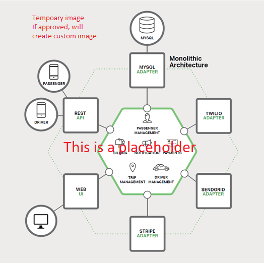
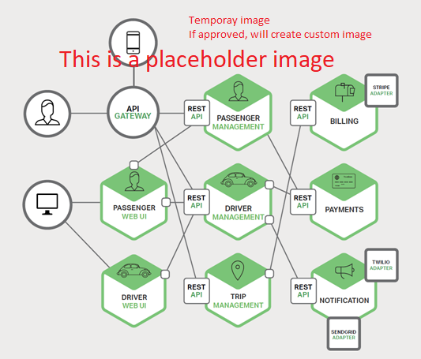

# Introduction to Cloud-Native Applications

Another day, at your table, building the next big thing.

Your cellphone ring, and you take the call, It's your friendly recruiter - the one who calls your twice a day with non-stop job opportunities.

But this time it's different: Start-up, equity and plenty of funding.

The mention of the cloud and cutting-edge technology pushes you over the edge.

Fast forward a few weeks and you're now a new employee in a design session architecting the next taxi-haling application. You're going to complete with Uber and Lyft.

How will you build it?

If you follow the guidance from past 15 years, you'll most likely build the system shown in Figure 1.1.

**Figure 1-1**. Traditional monolithic design

You construct a large core containing all of your business and domian logic. It include many modules, Billing, Payments, Passenger Management and more. The core app communicates with a large relational database and exposes functionality via REST API and, perhaps, HTML interfaces.

Congratulations!  You just created a monolithic application.

Not all is bad. Monoliths offers some distinct advantages. For example, they are straightforward to...

- build 
- test
- deploy
- troubleshoot
- scale

Many successful apps which exist today were created as monoliths. The app is a hit and continues to grow and evolve, iteration after iteration, adding more and more functionality.

At some point, however, you being to feel uncomfortable. You find yourself losing control of the application and eventually enter a state known as the **Fear Cycle**.

- The app has become so overwhelmingly complicated that no single person understands it.
- You fear making changes - each change has unintended and costly side effects.
- New features/fixes become tricky, time-consuming and expensive to implement.
- Each requires a full deployment of the entire application.
- One unstable component can crash the entire system.
- Implementing new technologies and frameworks is not an option
- It's difficult to implement agile delivery methodologies.
- Architectural erosion sets in as the code base deteriorates with never-ending "special cases"
- The consultants come in tell you to rewrite it

Many organizations address the monolithic fear cycle by adopting a cloud-native approach. Figure 1-2 shows the same system built with cloud-native apporach.

**Figure 1-2**. Microservice based architecture

Note in the previous image how the application is decomposed across a set of small isolated microservices. Each service is self-contained and includes its own code, data and dependencies. Each is deployed in a software container and managed buy a container orchestrator. Most importantly, the application takes full advanatage of the scalility and resiliencey features found in modern cloud platforms.

### Cloud-native computing

We just used the term, **Cloud Native**. You first thought might be, “What exactly does that mean?” Another industry buzzword concocted by software vendors to market more stuff?”

Fortunately it’s far different than that, and hopefully this book will help convince you.

Within a short time, cloud native has become a driving trend in the software industry. It’s a new way to think about building large, complex systems, an approach that takes full advantage of modern software development practices, technologies, and cloud infrastructure. It changes the way you design, implement, deploy, and operationalize systems.

Unlike the constant hype that drives our industry, cloud native is “*for-real.”* Consider the [Cloud Native Computing Foundation](https://www.cncf.io/) (CNCF), a consortium of over 300 major corporations with a charter to make cloud-native computing ubiquitous across technology and cloud stacks. Arguably, one of the most influential open source groups, it serves as the home for many of the fastest-growing open source projects in GitHub, including [Kubernetes](https://kubernetes.io/), [Prometheus](https://prometheus.io/), [Helm](https://helm.sh/), [Envoy](https://www.envoyproxy.io/), and [gRPC](https://grpc.io/).

The CNCF fosters an ecosystem of open source and vendor-neutrality. Following that lead, we present cloud-native principles, patterns, and best practices that are technology agnostic. At the same time, we want to raise your awareness of the services and infrastructure available in the Microsoft Azure cloud for constructing cloud-native systems. 

So, what exactly *is* Cloud Native? Sit back, relax, and let us help you explore this new world and how it ties to the Azure cloud.

>[!div class="step-by-step"]
>[Previous](index.md)
>[Next](definition.md)
