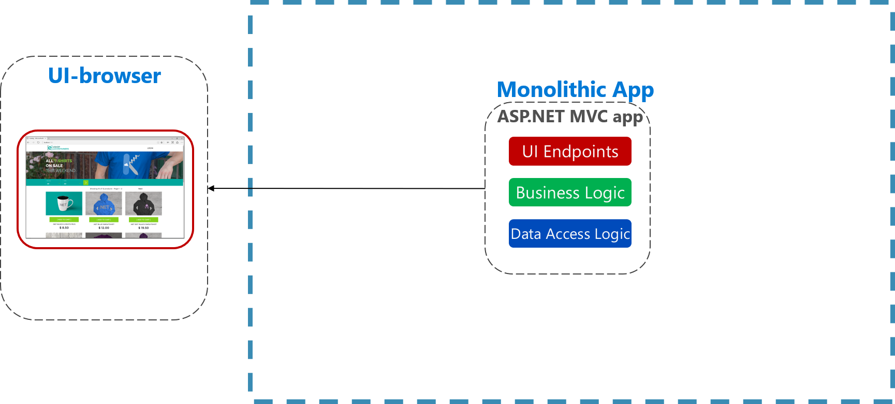
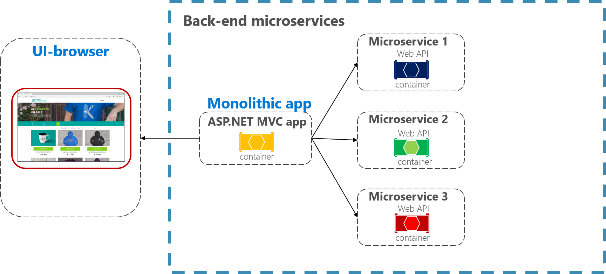
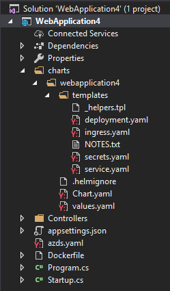

# Leveraging containers and orchestrators

Docker is the most popular container management and imaging platform and allows you to quickly work with containers on Linux and Windows. Containers provide separate but reproducible application environments that run the same way on any system. This makes them perfect for hosting and scaling applications and app components in cloud native applications. Containers are isolated from one another, so two containers on the same host hardware can have completely different versions of software and even operating system installed, without the dependencies causing conflicts.

What’s more, containers are completely defined by simple files that can be checked into source control. Unlike full servers, even virtual machines, which frequently require manual work to apply updates or install additional services, container infrastructure can easily be version-controlled. Thus, apps built to run in containers can be developed, tested, and deployed using automated tools as part of a build pipeline.

Containers are immutable. Once you have the definition of a container, you can recreate that container and it will run exactly the same way. This immutability lends itself to component-based design. If some parts of an application don’t change as often as others, why redeploy the entire app when you can just deploy the parts that change most frequently? A typical monolithic application is deployed as a single unit, despite typically being composed of several modules or assemblies, as shown in Figure 2-4.


**Figure 2-4**. Monolithic architecture.

Multi-tier architectures are nothing new, but with container-based applications it may make sense at a minimum to separate different tiers into separate containers, or to split an app into different containers based on features or cross-cutting concerns. Figure 2-5 shows how a monolithic app can take advantage of containers and microservices by delegating certain features or functionality. The remaining functionality in the app itself has also been containerized.


**Figure 2-5**. Breaking up a monolithic app to use microservices in the backend.

Once you start to have multiple containers that need to work together, it can be worthwhile to organize them at a higher level. By design containers only know about themselves. Organizing large numbers of containers and their shared dependencies, such as network configuration, is where orchestration tools come in to save the day! Kubernetes is a container orchestration platform designed to automate deployment, scaling, and management of containerized applications. It creates an abstraction layer on top of groups of containers and organizes them into *pods*. Pods run on worker machines referred to as *nodes*. The whole organized group is referred to as a *cluster*. Figure 2-6 shows the different components of a Kubernetes cluster.


**Figure 2-6**. Kubernetes cluster components.

## Local Kubernetes Development

Kubernetes deployments provide great value in production environments, but you can also run them locally. Although much of the time it's good to be able to work on individual apps or microservices independently, sometimes it's good to be able to run the whole system locally just as it will run when deployed to production. There are several ways to achieve this, two of which are Minikube and Docker Desktop. Visual Studio also provides tooling for Docker development.

### Minikube

What is Minikube? The Minikube project says "Minikube implements a local Kubernetes cluster on macOS, Linux, and Windows." Its primary goals are "to be the best tool for local Kubernetes application development and to support all Kubernetes features that fit." Installing Minikube is separate from Docker, but Minikube supports different hypervisors than Docker Desktop supports. The following Kubernetes features are currently supported by Minikube:

- DNS
- NodePorts
- ConfigMaps and secrets
- Dashboards
- Container runtimes: Docker, rkt, CRI-O, and containerd
- Enabling Container Network Interface (CNI)
- Ingress

After installing Minikube, you can quickly start using it by running the `minikube start` command, which downloads an image and start the local Kubernetes cluster. Once the cluster is started, you interact with it using the standard Kubernetes `kubectl` commands.

### Docker Desktop

You can also work with Kubernetes directly from Docker Desktop on Windows. This is your only option if you're using Windows Containers, and is a great choice for non-Windows containers as well. The standard Docker Desktop configuration app is used to configure Kubernetes running from Docker Desktop.


**Figure 2-7**. Configuring Kubernetes in Docker Desktop.

Docker Desktop is already the most popular tool for configuring and running containerized apps locally. When you work with Docker Desktop, you can develop locally against the exact same set of Docker container images that you'll deploy to production. Docker Desktop is designed to "build, test, and ship" containerized apps locally. Once the images have been shipped to an image registry like Azure Container Registry or Docker Hub, then services like Azure Kubernetes Service (AKS) manage the application in production.

## Visual Studio Docker Tooling

Visual Studio supports Docker development for web applications. When you create a new ASP.NET Core application, you're given the option to configure it with Docker support as part of the project creation process, as shown in Figure 2-8.


**Figure 2-8**. Visual Studio Enable Docker Support

When this option is selected, the project is created with a `Dockerfile` in its root, which can be used to build and host the app in a Docker container. An example `Dockerfile is shown in Figure 2-9.

```docker
FROM mcr.microsoft.com/dotnet/core/aspnet:3.0-stretch-slim AS base
WORKDIR /app
EXPOSE 80
EXPOSE 443

FROM mcr.microsoft.com/dotnet/core/sdk:3.0-stretch AS build
WORKDIR /src
COPY ["WebApplication3/WebApplication3.csproj", "WebApplication3/"]
RUN dotnet restore "WebApplication3/WebApplication3.csproj"
COPY . .
WORKDIR "/src/WebApplication3"
RUN dotnet build "WebApplication3.csproj" -c Release -o /app

FROM build AS publish
RUN dotnet publish "WebApplication3.csproj" -c Release -o /app

FROM base AS final
WORKDIR /app
COPY --from=publish /app .
ENTRYPOINT ["dotnet", "WebApplication3.dll"]
```

**Figure 2-9**. Visual Studio Generated Docker File

The default behavior when the app runs is configured to use Docker as well. Figure 2-10 shows the different run options available from a new ASP.NET Core project created with Docker support added.


**Figure 2-10**. Visual Studio Docker Run Options

In addition to local development, [Azure Dev Spaces](https://docs.microsoft.com/azure/dev-spaces/) provides a convenient way for multiple developers to work with their own Kubernetes configurations within Azure. As you can see in Figure 2-10, you can also run the application in Azure Dev Spaces.

If you don't add Docker support to your ASP.NET Core application when you create it, you can always add it later. From the Visual Studio Solution Explorer, right click on the project and select **Add** > **Docker Support**, as shown in Figure 2-11.


**Figure 2-11**. Visual Studio Add Docker Support

In addition to Docker support, you can also add Container Orchestration Support, also shown in Figure 2-11. By default, the orchestrator uses Kubernetes and Helm. Once you've chosen the orchestrator, a `azds.yaml` file is added to the project root and a `charts` folder is added containing the Helm charts used to configure and deploy the application to Kubernetes. Figure 2-12 shows the resulting files in a new project.


**Figure 2-12**. Visual Studio Add Orchestrator Support

## References

- [What is Kubernetes?](https://blog.newrelic.com/engineering/what-is-kubernetes/)
- [Installing Kubernetes with Minikube](https://kubernetes.io/docs/setup/learning-environment/minikube/)
- [MiniKube vs Docker Desktop](https://medium.com/containers-101/local-kubernetes-for-windows-minikube-vs-docker-desktop-25a1c6d3b766)
- [Visual Studio Tools for Docker](https://docs.microsoft.com/dotnet/standard/containerized-lifecycle-architecture/design-develop-containerized-apps/visual-studio-tools-for-docker)

>[!div class="step-by-step"]
>[Previous](scale-applications.md)
>[Next](leverage-serverless-functions.md)
