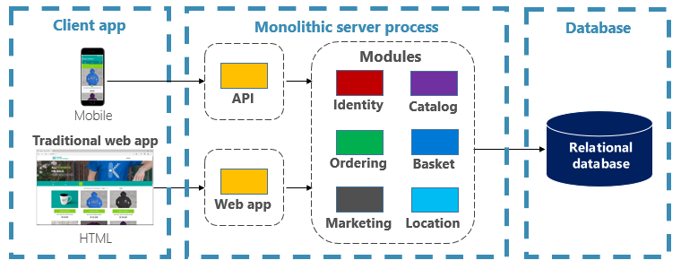
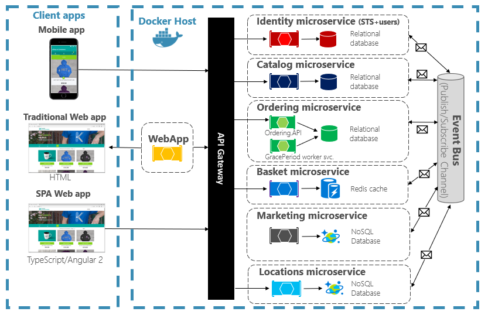
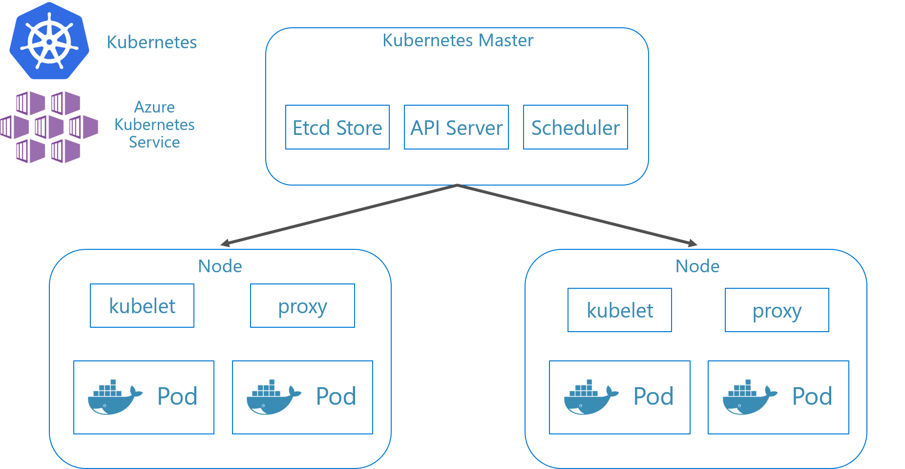
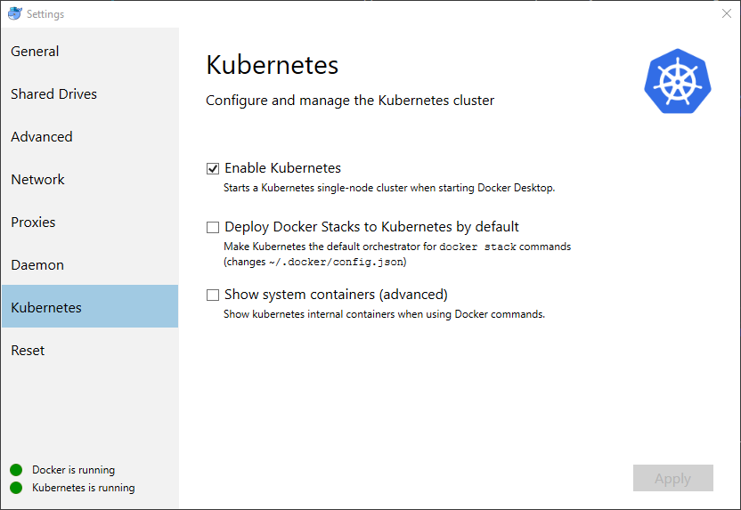
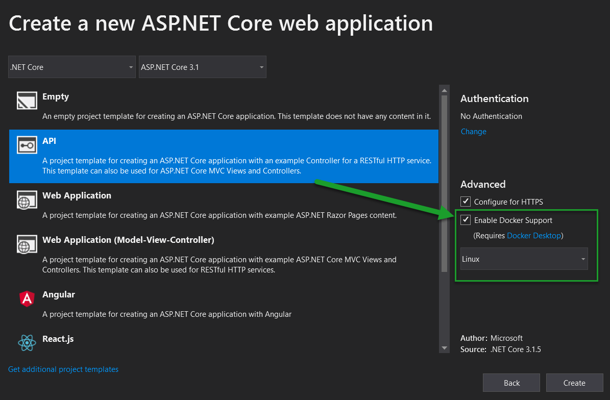
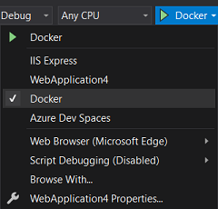
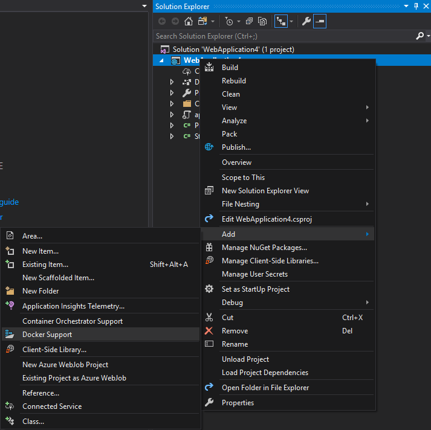

# Leveraging containers and orchestrators

Containers and orchestrators are designed to solve problems common to monolithic deployment approaches.

## Challenges with monolithic deployments

Traditionally, most applications have been deployed as a single unit. Such applications are referred to as a monolith. This general approach of deploying applications as single units even if they're composed of multiple modules or assemblies is known as monolithic architecture, as shown in Figure 3-1.



**Figure 3-1**. Monolithic architecture.

Although they have the benefit of simplicity, monolithic architectures face many challenges:

### Deployment

Additionally, they require a restart of the application, which may temporarily impact availability if zero-downtime techniques are not applied while deploying.

### Scaling

A monolithic application is hosted entirely on a single machine instance, often requiring high-capability hardware. If any part of the monolith requires scaling, another copy of the entire application must be deployed to another machine. With a monolith, you can't scale application components individually - it's all or nothing. Scaling components that don't require scaling results in inefficient and costly resource usage.

### Environment

Monolithic applications are typically deployed to a hosting environment with a pre-installed operating system, runtime, and library dependencies. This environment may not match that upon which the application was developed or tested. Inconsistencies across application environments are a common source of problems for monolithic deployments.

### Coupling

A monolithic application is likely to experience high coupling across its functional components. Without hard boundaries, system changes often result in unintended and costly side effects. New features/fixes become tricky, time-consuming, and expensive to implement. Updates require extensive testing. Coupling also makes it difficult to refactor components or swap in alternative implementations. Even when constructed with a strict separation of concerns, architectural erosion sets in as the monolithic code base deteriorates with never-ending "special cases."

### Platform lock-in

A monolithic application is constructed with a single technology stack. While offering uniformity, this commitment can become a barrier to innovation. New features and components will be built using the application's current stack - even when more modern technologies may be a better choice. A longer-term risk is your technology stack becoming outdated and obsolete. Rearchitecting an entire application to a new, more modern platform is at best expensive and risky.

## What are the benefits of containers and orchestrators?

We introduced containers in Chapter 1. We highlighted how the Cloud Native Computing Foundation (CNCF) ranks containerization as the first step in their [Cloud-Native Trail Map](https://raw.githubusercontent.com/cncf/trailmap/master/CNCF_TrailMap_latest.png) - guidance for enterprises beginning their cloud-native journey. In this section, we discuss the benefits of containers.

Docker is the most popular container management platform. It works with containers on both Linux or Windows. Containers provide separate but reproducible application environments that run the same way on any system. This aspect makes them perfect for developing and hosting cloud-native services. Containers are isolated from one another. Two containers on the same host hardware can have different versions of software, without causing conflicts.

Containers are defined by simple text-based files that become project artifacts and are checked into source control. While full servers and virtual machines require manual effort to update, containers are easily version-controlled. Apps built to run in containers can be developed, tested, and deployed using automated tools as part of a build pipeline.

Containers are immutable. Once you define a container, you can recreate and run it exactly the same way. This immutability lends itself to component-based design. If some parts of an application evolve differently than others, why redeploy the entire app when you can just deploy the parts that change most frequently? Different features and cross-cutting concerns of an app can be broken up into separate units. Figure 3-2 shows how a monolithic app can take advantage of containers and microservices by delegating certain features or functionality. The remaining functionality in the app itself has also been containerized.



**Figure 3-2**. Decomposing a monolithic app to embrace microservices.

Each cloud-native service is built and deployed in a separate container. Each can update as needed. Individual services can be hosted on nodes with resources appropriate to each service. The environment each service runs in is immutable, shared across dev, test, and production environments, and easily versioned. Coupling between different areas of the application occurs explicitly as calls or messages between services, not compile-time dependencies within the monolith. You can also choose the technology that best suites a given capability without requiring changes to the rest of the app.

Containerized services require automated management. It wouldn't be feasible to manually administer a large set of independently deployed containers. For example, consider the following tasks:

- How will container instances be provisioned across a cluster of many machines?
- Once deployed, how will containers discover and communicate with each other?
- How can containers scale in or out on-demand?
- How do you monitor the health of each container?
- How do you protect a container against hardware and software failures?
- How do upgrade containers for a live application with zero downtime?

Container orchestrators address and automate these and other concerns.

In the cloud-native eco-system, Kubernetes has become the de facto container orchestrator. It's an open-source platform managed by the Cloud Native Computing Foundation (CNCF). Kubernetes automates the deployment, scaling, and operational concerns of containerized workloads across a machine cluster. However, installing and managing Kubernetes is notoriously complex.

A much better approach is to leverage Kubernetes as a managed service from a cloud vendor. The Azure cloud features a fully managed Kubernetes platform entitled [Azure Kubernetes Service (AKS)](https://azure.microsoft.com/services/kubernetes-service/). AKS abstracts the complexity and operational overhead of managing Kubernetes. You consume Kubernetes as a cloud service; Microsoft takes responsibility for managing and supporting it. AKS also tightly integrates with other Azure services and dev tools.

AKS is a cluster-based technology. A pool of federated virtual machines, or nodes, is deployed to the Azure cloud. Together they form a highly available environment, or cluster. The cluster appears as a seamless, single entity to your cloud-native application. Under the hood, AKS deploys your containerized services across these nodes following a predefined strategy that evenly distributes the load.

## What are the scaling benefits?

Services built on containers can leverage scaling benefits provided by orchestration tools like Kubernetes. By design containers only know about themselves. Once you have multiple containers that need to work together, you should organize them at a higher level. Organizing large numbers of containers and their shared dependencies, such as network configuration, is where orchestration tools come in to save the day! Kubernetes creates an abstraction layer over groups of containers and organizes them into *pods*. Pods run on worker machines referred to as *nodes*. This organized structure is referred to as a *cluster*. Figure 3-3 shows the different components of a Kubernetes cluster.


**Figure 3-3**. Kubernetes cluster components.

Scaling containerized workloads is a key feature of container orchestrators. AKS supports automatic scaling across two dimensions: Container instances and compute nodes. Together they give AKS the ability to quickly and efficiently respond to spikes in demand and add additional resources. We discuss scaling in AKS later in this chapter.

### Declarative versus imperative

Kubernetes supports both declarative and imperative configuration. The imperative approach involves running various commands that tell Kubernetes what to do each step of the way. Run this image. Delete this pod. Expose this port. With the declarative approach, you create a configuration file, called a manifest, to describe what you want instead of what to do. Kubernetes reads the manifest and transforms your desired end state into actual end state.

Imperative commands are great for learning and interactive experimentation. However, you'll want to declaratively create Kubernetes manifest files to embrace an infrastructure as code approach, providing for reliable and repeatable deployments. The manifest file becomes a project artifact and is used in your CI/CD pipeline for automating Kubernetes deployments.

If you've already configured your cluster using imperative commands, you can export a declarative manifest by using `kubectl get svc SERVICENAME -o yaml > service.yaml`. This command produces a manifest similar to one shown below:

```yaml
apiVersion: v1
kind: Service
metadata:
  creationTimestamp: "2019-09-13T13:58:47Z"
  labels:
    component: apiserver
    provider: kubernetes
  name: kubernetes
  namespace: default
  resourceVersion: "153"
  selfLink: /api/v1/namespaces/default/services/kubernetes
  uid: 9b1fac62-d62e-11e9-8968-00155d38010d
spec:
  clusterIP: 10.96.0.1
  ports:
  - name: https
    port: 443
    protocol: TCP
    targetPort: 6443
  sessionAffinity: None
  type: ClusterIP
status:
  loadBalancer: {}
```

When using declarative configuration, you can preview the changes that will be made before committing them by using `kubectl diff -f FOLDERNAME` against the folder where your configuration files are located. Once you're sure you want to apply the changes, run `kubectl apply -f FOLDERNAME`. Add `-R` to recursively process a folder hierarchy.

You can also use declarative configuration with other Kubernetes features, one of which being deployments. Declarative deployments help manage releases, updates, and scaling. They instruct the Kubernetes deployment controller on how to deploy new changes, scale out load, or roll back to a previous revision. If a cluster is unstable, a declarative deployment will automatically return the cluster back to a desired state. For example, if a node should crash, the deployment mechanism will redeploy a replacement to achieve your desired state

Using declarative configuration allows infrastructure to be represented as code that can be checked in and versioned alongside the application code. It provides improved change control and better support for continuous deployment using a build and deploy pipeline.

## What scenarios are ideal for containers and orchestrators?

The following scenarios are ideal for using containers and orchestrators.

### Applications requiring high uptime and scalability

Individual applications that have high uptime and scalability requirements are ideal candidates for cloud-native architectures using microservices, containers, and orchestrators. They can be developed in containers, tested across versioned environments, and deployed into production with zero downtime. The use of Kubernetes clusters ensures such apps can also scale on demand and recover automatically from node failures.

### Large numbers of applications

Organizations that deploy and maintain large numbers of applications benefit from containers and orchestrators. The up front effort of setting up containerized environments and Kubernetes clusters is primarily a fixed cost. Deploying, maintaining, and updating individual applications has a cost that varies with the number of applications. Beyond a few applications, the complexity of maintaining custom applications manually exceeds the cost of implementing a solution using containers and orchestrators.

## When should you avoid using containers and orchestrators?

If you're unable to build your application following the Twelve-Factor App principles, you should consider avoiding containers and orchestrators. In these cases, consider a VM-based hosting platform, or possibly some hybrid system. With it, you can always spin off certain pieces of functionality into separate containers or even serverless functions.

## Development resources

This section shows a short list of development resources that may help you get started using containers and orchestrators for your next application. If you're looking for guidance on how to design your cloud-native microservices architecture app, read this book's companion, [.NET Microservices: Architecture for Containerized .NET Applications](https://dotnet.microsoft.com/download/thank-you/microservices-architecture-ebook).

### Local Kubernetes Development

Kubernetes deployments provide great value in production environments, but can also run locally on your development machine. While you may work on individual microservices independently, there may be times when you'll need to run the entire system locally - just as it will run when deployed to production. There are several tools that can help: Minikube and Docker Desktop. Visual Studio also provides tooling for Docker development.

### Minikube

What is Minikube? The Minikube project says "Minikube implements a local Kubernetes cluster on macOS, Linux, and Windows." Its primary goals are "to be the best tool for local Kubernetes application development and to support all Kubernetes features that fit." Installing Minikube is separate from Docker, but Minikube supports different hypervisors than Docker Desktop supports. The following Kubernetes features are currently supported by Minikube:

- DNS
- NodePorts
- ConfigMaps and secrets
- Dashboards
- Container runtimes: Docker, rkt, CRI-O, and containerd
- Enabling Container Network Interface (CNI)
- Ingress

After installing Minikube, you can quickly start using it by running the `minikube start` command, which downloads an image and start the local Kubernetes cluster. Once the cluster is started, you interact with it using the standard Kubernetes `kubectl` commands.

### Docker Desktop

You can also work with Kubernetes directly from Docker Desktop on Windows. It is your only option if you're using Windows Containers, and is a great choice for non-Windows containers as well. Figure 3-4 shows how to enable local Kubernetes support when running Docker Desktop.



**Figure 3-4**. Configuring Kubernetes in Docker Desktop.

Docker Desktop is the most popular tool for configuring and running containerized apps locally. When you work with Docker Desktop, you can develop locally against the exact same set of Docker container images that you'll deploy to production. Docker Desktop is designed to "build, test, and ship" containerized apps locally. It supports both Linux and Windows containers. Once you push your images to an image registry, like Azure Container Registry or Docker Hub, AKS can pull and deploy them to production.

### Visual Studio Docker Tooling

Visual Studio supports Docker development for web-based applications. When you create a new ASP.NET Core application, you have an option to configure it with Docker support, as shown in Figure 3-5.



**Figure 3-5**. Visual Studio Enable Docker Support

When this option is selected, the project is created with a `Dockerfile` in its root, which can be used to build and host the app in a Docker container. An example Dockerfile is shown in Figure 3-6.

```dockerfile
FROM mcr.microsoft.com/dotnet/aspnet:6.0 AS base
WORKDIR /app
EXPOSE 80
EXPOSE 443

FROM mcr.microsoft.com/dotnet/sdk:6.0 AS build
WORKDIR /src
COPY ["eShopWeb/eShopWeb.csproj", "eShopWeb/"]
RUN dotnet restore "eShopWeb/eShopWeb.csproj"
COPY . .
WORKDIR "/src/eShopWeb"
RUN dotnet build "eShopWeb.csproj" -c Release -o /app/build

FROM build AS publish
RUN dotnet publish "eShopWeb.csproj" -c Release -o /app/publish

FROM base AS final
WORKDIR /app
COPY --from=publish /app/publish .
ENTRYPOINT ["dotnet", "eShopWeb.dll"]
```

**Figure 3-6**. Visual Studio generated Dockerfile

Once support is added, you can run your application in a Docker container in Visual Studio. Figure 3-7 shows the different run options available from a new ASP.NET Core project created with Docker support added.



**Figure 3-7**. Visual Studio Docker Run Options

Also, at any time you can add Docker support to an existing ASP.NET Core application. From the Visual Studio Solution Explorer, right-click on the project and select **Add** > **Docker Support**, as shown in Figure 3-8.



**Figure 3-8**. Adding Docker support to Visual Studio

### Visual Studio Code Docker Tooling

There are many extensions available for Visual Studio Code that support Docker development.

Microsoft provides the [Docker for Visual Studio Code extension](https://marketplace.visualstudio.com/items?itemName=ms-azuretools.vscode-docker). This extension simplifies the process of adding container support to applications. It scaffolds required files, builds Docker images, and enables you to debug your app inside a container. The extension features a visual explorer that makes it easy to take actions on containers and images such as start, stop, inspect, remove, and more. The extension also supports Docker Compose enabling you to manage multiple running containers as a single unit.

>[!div class="step-by-step"]
>[Previous](scale-applications.md)
>[Next](leverage-serverless-functions.md)
