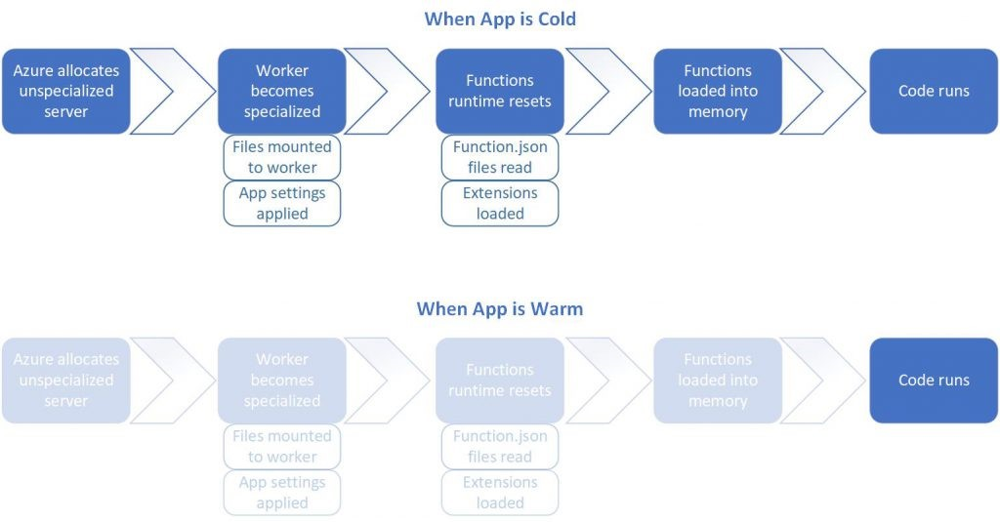

# Leveraging serverless functions

In the spectrum from managing physical machines to leveraging cloud capabilities, serverless lives at the extreme end. Your only responsibility is your code, and you only pay when your code runs. Azure Functions provides a way to build serverless capabilities into your cloud-native applications.

## What is serverless?

Serverless is a relatively new service model of cloud computing. It doesn't mean that servers are optional - your code still runs on a server somewhere. The distinction is that the application team no longer concerns itself with managing server infrastructure. Instead, the cloud vendor own this responsibility. The development team increases its productivity by delivering business solutions to customers, not plumbing.

Serverless computing uses event-triggered stateless containers to host your services. They can scale out and in to meet demand as-needed. Serverless platforms like Azure Functions have tight integration with other Azure services like queues, events, and storage.

## What challenges are solved by serverless?

Serverless platforms address many time-consuming and expensive concerns:

- Purchasing machines and software licenses
- Housing, securing, configuring, and maintaining the machines and their networking, power, and A/C requirements
- Patching and upgrading operating systems and software
- Configuring web servers or machine services to host application software
- Configuring application software within its platform

Many companies allocate large budgets to support hardware infrastructure concerns. Moving to the cloud can help reduce these costs; shifting applications to serverless can help eliminate them.

## What is the difference between a microservice and a serverless function?

Typically, a microservice encapsulates a business capability, such as a shopping cart for an online eCommerce site. It exposes multiple operations that enable a user to manage their shopping experience. A function, however, is a small, lightweight block of code that executes a single-purpose operation in response to an event.
Microservices are typically constructed to respond to requests, often from an interface. Requests can be HTTP Rest- or gRPC-based. Serverless services respond to events. Its event-driven architecture is ideal for processing short-running, background tasks.

## What scenarios are appropriate for serverless?

Serverless exposes individual short-running functions that are invoked in response to a trigger. This makes them ideal for processing background tasks.

An application might need to send an email as a step in a workflow. Instead of sending the notification as part of a microservice request, place the message details onto a queue. An Azure Function can dequeue the message and asynchronously send the email. Doing so could improve the performance and scalability of the microservice. [Queue-based load leveling](/azure/architecture/patterns/queue-based-load-leveling) can be implemented to avoid bottlenecks related to sending the emails. Additionally, this stand-alone service could be reused as a utility across many different applications.

Asynchronous messaging from queues and topics is a common pattern to trigger serverless functions. However, Azure Functions can be triggered by other events, such as changes to Azure Blob Storage. A service that supports image uploads could have an Azure Function responsible for optimizing the image size. The function could be triggered directly by inserts into Azure Blob Storage, keeping complexity out of the microservice operations.

Many services have long-running processes as part of their workflows. Often these tasks are done as part of the user's interaction with the application. These tasks can force the user to wait, negatively impacting their experience. Serverless computing provides a great way to move slower tasks outside of the user interaction loop. These tasks can scale with demand without requiring the entire application to scale.

## When should you avoid serverless?

Serverless solutions provision and scale on demand. When a new instance is invoked, cold starts are a common issue. A cold start is the period of time it takes to provision this instance. Normally, this delay might be a few seconds, but can be longer depending on various factors. Once provisioned, a single instance is kept alive as long as it receives periodic requests. But, if a service is called less frequently, Azure may remove it from memory and require a cold start when reinvoked. Cold starts are also required when a function scales out to a new instance.

Figure 3-9 shows a cold-start pattern. Note the extra steps required when the app is cold.

**Figure 3-9**. Cold start versus warm start.

To avoid cold starts entirely, you might switch from a [consumption plan to a dedicated plan](https://azure.microsoft.com/blog/understanding-serverless-cold-start/). You can also configure one or more [pre-warmed instances](/azure/azure-functions/functions-premium-plan#pre-warmed-instances) with the premium plan upgrade. In these cases, when you need to add another instance, it's already up and ready to go. These options can help mitigate the cold start issue associated with serverless computing.

Cloud providers bill for serverless based on compute execution time and consumed memory. Long running operations or high memory consumption workloads aren't always the best candidates for serverless. Serverless functions favor small chunks of work that can complete quickly. Most serverless platforms require individual functions to complete within a few minutes. Azure Functions defaults to a 5-minute time-out duration, which can be configured up to 10 minutes. The Azure Functions premium plan can mitigate this issue as well, defaulting time-outs to 30 minutes with an unbounded higher limit that can be configured. Compute time isn't calendar time. More advanced functions using the [Azure Durable Functions framework](/azure/azure-functions/durable/durable-functions-overview?tabs=csharp) may pause execution over a course of several days. The billing is based on actual execution time - when the function wakes up and resumes processing.

Finally, leveraging Azure Functions for application tasks adds complexity. It's wise to first architect your application with a modular, loosely coupled design. Then, identify if there are benefits serverless would offer that justify the additional complexity.

>[!div class="step-by-step"]
>[Previous](leverage-containers-orchestrators.md)
>[Next](combine-containers-serverless-approaches.md)
