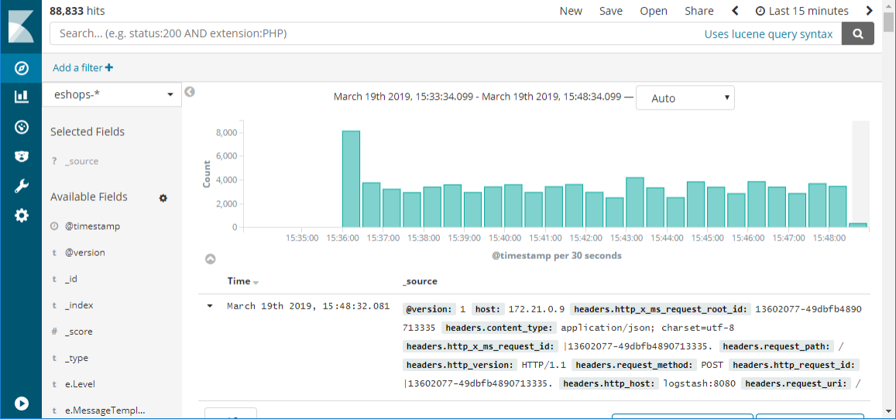

# Logging with Elastic Stack

There are many good centralized logging tools and they vary in cost from being free, open-source tools, to more expensive options. In many cases, the free tools are as good as or better than the paid offerings. One such tool is a combination of three open-source components: Elasticsearch, Logstash, and Kibana.

Collectively these tools are known as the Elastic Stack or ELK stack.

## Elastic Stack

The Elastic Stack is a powerful option for gathering information from a Kubernetes cluster. Kubernetes supports sending logs to an Elasticsearch endpoint, and for the [most part](https://v1-19.docs.kubernetes.io/docs/tasks/debug-application-cluster/logging-elasticsearch-kibana/), all you need to get started is to set the environment variables as shown in Figure 7-5:

```kubernetes
KUBE_LOGGING_DESTINATION=elasticsearch
KUBE_ENABLE_NODE_LOGGING=true
```

**Figure 7-5**. Configuration variables for Kubernetes

This step will install Elasticsearch on the cluster and target sending all the cluster logs to it.


**Figure 7-6**. An example of a Kibana dashboard showing the results of a query against logs that are ingested from Kubernetes

## What are the advantages of Elastic Stack?

Elastic Stack provides centralized logging in a low-cost, scalable, cloud-friendly manner. Its user interface streamlines data analysis so you can spend your time gleaning insights from your data instead of fighting with a clunky interface. It supports a wide variety of inputs so as your distributed application spans more and different kinds of services, you can expect to continue to be able to feed log and metric data into the system. The Elastic Stack also supports fast searches even across large data sets, making it possible even for large applications to log detailed data and still be able to have visibility into it in a performant fashion.

## Logstash

The first component is [Logstash](https://www.elastic.co/products/logstash). This tool is used to gather log information from a large variety of different sources. For instance, Logstash can read logs from disk and also receive messages from logging libraries like [Serilog](https://serilog.net/). Logstash can do some basic filtering and expansion on the logs as they arrive. For instance, if your logs contain IP addresses then Logstash may be configured to do a geographical lookup and obtain a country or even city of origin for that message.

Serilog is a logging library for .NET languages, which allows for parameterized logging. Instead of generating a textual log message that embeds fields, parameters are kept separate. This library allows for more intelligent filtering and searching. A sample Serilog configuration for writing to Logstash appears in Figure 7-7.

```csharp
var log = new LoggerConfiguration()
         .WriteTo.Http("http://localhost:8080")
         .CreateLogger();
```

**Figure 7-7**. Serilog config for writing log information directly to logstash over HTTP

Logstash would use a configuration like the one shown in Figure 7-8.

```
input {
    http {
        #default host 0.0.0.0:8080
        codec => json
    }
}

output {
    elasticsearch {
        hosts => "elasticsearch:9200"
        index=>"sales-%{+xxxx.ww}"
    }
}
```

**Figure 7-8**. A Logstash configuration for consuming logs from Serilog

For scenarios where extensive log manipulation isn't needed there's an alternative to Logstash known as [Beats](https://www.elastic.co/products/beats). Beats is a family of tools that can gather a wide variety of data from logs to network data and uptime information. Many applications will use both Logstash and Beats.

Once the logs have been gathered by Logstash, it needs somewhere to put them. While Logstash supports many different outputs, one of the more exciting ones is Elasticsearch.

## Elasticsearch

Elasticsearch is a powerful search engine that can index logs as they arrive. It makes running queries against the logs quick. Elasticsearch can handle huge quantities of logs and, in extreme cases, can be scaled out across many nodes.

Log messages that have been crafted to contain parameters or that have had parameters split from them through Logstash processing, can be queried directly as Elasticsearch preserves this information.

A query that searches for the top 10 pages visited by `jill@example.com`, appears in Figure 7-9.

```json
"query": {
    "match": {
      "user": "jill@example.com"
    }
  },
  "aggregations": {
    "top_10_pages": {
      "terms": {
        "field": "page",
        "size": 10
      }
    }
  }
```

**Figure 7-9**. An Elasticsearch query for finding top 10 pages visited by a user

## Visualizing information with Kibana web dashboards

The final component of the stack is Kibana. This tool is used to provide interactive visualizations in a web dashboard. Dashboards may be crafted even by users who are non-technical. Most data that is resident in the Elasticsearch index, can be included in the Kibana dashboards. Individual users may have different dashboard desires and Kibana enables this customization through allowing user-specific dashboards.

## Installing Elastic Stack on Azure

The Elastic stack can be installed on Azure in many ways. As always, it's possible to [provision virtual machines and install Elastic Stack on them directly](/azure/virtual-machines/linux/tutorial-elasticsearch). This option is preferred by some experienced users as it offers the highest degree of customizability. Deploying on infrastructure as a service introduces significant management overhead forcing those who take that path to take ownership of all the tasks associated with infrastructure as a service such as securing the machines and keeping up-to-date with patches.

An option with less overhead is to make use of one of the many Docker containers on which the Elastic Stack has already been configured. These containers can be dropped into an existing Kubernetes cluster and run alongside application code. The [sebp/elk](https://elk-docker.readthedocs.io/) container is a well-documented and tested Elastic Stack container.

Another option is a [recently announced ELK-as-a-service offering](https://devops.com/logz-io-unveils-azure-open-source-elk-monitoring-solution/).

## References

- [Install Elastic Stack on Azure](/azure/virtual-machines/linux/tutorial-elasticsearch)

>[!div class="step-by-step"]
>[Previous](observability-patterns.md)
>[Next](monitoring-azure-kubernetes.md)
