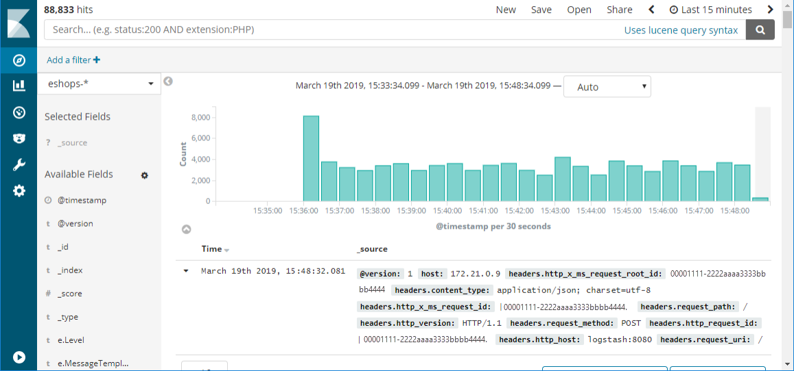

# Monitoring in Azure Kubernetes Services

Kubernetes is an orchestration engine for running Docker images on both Linux and [Windows](https://kubernetes.io/docs/setup/windows/). It is immensely popular and is likely to remain an excellent candidate for hosting a wide variety of applications. The learning curve can be steep but the advantages are too.

The logging in Kubernetes is somewhat primitive. However there are some great options for getting the logs out of Kubernetes and into a place where they can be properly analyzed.

## Elastic Stack

The Elastic Stack is a powerful option for gathering information from a Kubernetes cluster. Kubernetes supports sending logs to an Elasticsearch endpoint, and for the [most part](https://kubernetes.io/docs/tasks/debug-application-cluster/logging-elasticsearch-kibana/), all that is needed to get started is to set the environmental variables as shown in Figure 8-4.

```kubernetes
KUBE_LOGGING_DESTINATION=elasticsearch
KUBE_ENABLE_NODE_LOGGING=true
```
**Figure 8-4** - Configuration variables for Kubernetes

This will install Elasticsearch on the cluster and target sending all the cluster logs to it.



## Azure Container Monitoring

Azure Container Monitoring supports consuming logs from not just Kubernetes but also from other orchestration engines such as DC/OS, Docker Swarm, and Red Hat OpenShift.


Log and metric information is gathered not just from the containers running in the cluster but also from the cluster hosts themselves. This allows correlating log information from the two making it much easier to track down an error.

Installing the log collectors differs on [Windows](https://docs.microsoft.com/azure/azure-monitor/insights/containers#configure-a-log-analytics-windows-agent-for-kubernetes) and [Linux](https://docs.microsoft.com/azure/azure-monitor/insights/containers#configure-a-log-analytics-linux-agent-for-kubernetes)
 clusters. But in both cases the log collection is implemented as a Kubernetes [DaemonSet](https://kubernetes.io/docs/concepts/workloads/controllers/daemonset/), meaning that the log collector is run as a container on each of the nodes.

No matter which orchestrator or operating system running the Azure Monitor daemon the log information is forwarded to the same Azure Monitor tools with which users are familiar. This ensures a parallel experience in environments that mix different log sources such as a hybrid Kubernetes/Azure Functions environment.


## Log.Finalize()

Logging is one of the most overlooked and yet most important parts of deploying any application at scale. As the size and complexity of applications increase, then so does the difficulty of debugging them. Having top quality logs available makes debugging much easier and moves it from the realm of "nearly impossible" to "a pleasant experience".

>[!div class="step-by-step"]
>[Previous](azure-monitor.md)
>[Next](identity.md) <!-- Next Chapter -->
