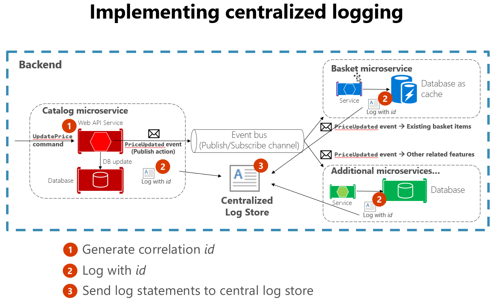

# Observability patterns

Just as patterns have been developed to aid in the layout of code in applications, there are patterns for operating applications in a reliable way. Three useful patterns in maintaining applications have emerged: logging, monitoring, and alerts.

## When to use logging

No matter how careful we are, applications almost always behave in unexpected ways in production. When users report problems with an application, it's extremely useful to be able to see what was going on with the app when the problem occurred. One of the most tried and true ways of capturing information about what an application is doing while it's running is to have the application write down what it's doing. This process is known as logging. Anytime failures or problems occur in production, the goal should be to reproduce the conditions under which the failures occurred, in a non-production environment. Having good logging in place provides a roadmap for developers to follow in order to duplicate problems in an environment that can be tested and experimented with.

### Logging in cloud-native applications

Every programming language has tooling that permits writing logs, and typically the overhead for writing these logs is low. Many of the logging libraries provide logging different kinds of criticalities, which can be tuned at run time. For instance, the Serilog library is a popular structured logging library for .NET that provides the following logging levels

* Verbose
* Debug
* Information
* Warning
* Error
* Fatal

These different log levels provide granularity in logging. When the application is functioning properly in production, it may be configured to only log important messages. When the application is misbehaving, then the log level can be increased so more verbose logs are gathered. This balances performance against ease of debugging.

The high performance of logging tools and the tunability of verbosity should encourage developers to log frequently. Many favor a pattern of logging the entry and exit of each method. This approach may sound like overkill, but it's infrequent that developers will wish for less logging. In fact, it's not uncommon to perform deployments for the sole purpose of adding logging around a problematic method. Err on the side of too much logging and not on too little. Note that some tools can be used to automatically provide this kind of logging.

In traditional applications, log files were typically stored on the local machine. In fact, on Unix-like operating systems, there's a folder structure defined to hold any logs, typically under `/var/log`. The usefulness of logging to a flat file on a single machine is vastly reduced in a cloud environment. Applications producing logs may not have access to the local disk or the local disk may be highly transient as containers are shuffled around physical machines.

Cloud-native applications developed using a microservices architecture also pose some challenges for file-based loggers. User requests may now span multiple services that are run on different machines, and may include serverless functions with no access to a local file system at all. It would be very challenging to correlate the logs from a user or a session across these many services and machines.

Finally, the number of users in some cloud-native applications is high. Imagine that each user generates a hundred lines of log messages when they log into an application. In isolation, that is manageable, but multiply that over 100,000 users and the volume of logs becomes large.

Fortunately, there are some fantastic alternatives to using file system-based logging. A centralized log server to which all logs are sent, fixes all these problems. Logs are collected by the applications and shipped to a central logging application which indexes and stores the logs. This class of system can ingest tens of gigabytes of logs every day.

It's also helpful to follow some standard practices when building logging that spans many services. For instance, generating a [correlation ID](https://blog.rapid7.com/2016/12/23/the-value-of-correlation-ids/) at the start of a lengthy interaction, and then logging it in each message that is related to that interaction, makes it easier to search for all related messages. One need only find a single message and extract the correlation ID to find all the related messages. Another example is ensuring that the log format is the same for every service, whatever the language or logging library it uses. This standardization makes reading logs much easier. Figure 7-1 demonstrates how a microservices architecture can leverage centralized logging as part of its workflow.

**Figure 7-1**. Logs from various sources are ingested into a centralized log store.

## When to use monitoring

Some applications are not mission-critical. Maybe they're only used internally, and when a problem occurs, the user can contact the team responsible and the application can be restarted. However, customers often have higher expectations for the applications they consume. If you need to know when problems occur with your application *before* users do, or before users notify you, you need to monitor its current state. Implemented properly, monitoring can let you know about conditions that will lead to problems, letting you address underlying conditions before they result in any user impact.

## Monitoring considerations

Some centralized logging systems take on an additional role of collecting telemetry outside of pure logs. They can collect metrics, such as time to run a database query, average response time from a web server, and even CPU load averages and memory pressure as reported by the operating system. In conjunction with the logs, these systems can provide a holistic view of the health of nodes in the system and the application as a whole.

The metric gathering capabilities of the monitoring tools can also be fed manually from within the application. Business flows that are of particular interest such as new users signing up or orders being placed, may be instrumented such that they increment a counter in the central monitoring system. This unlocks the monitoring tools to not only monitor the health of the application but the health of the business.

Queries can be constructed in the log aggregation tools to look for certain statistics or patterns, which can then be displayed in graphical form, on custom dashboards. Frequently, teams will invest in large, wall-mounted displays that rotate through the statistics related to an application. This way, it's simple to see the problems as they occur.

## When to use alerts

If you need to react to problems with your application, you need some way to alert the right personnel. This is the third cloud-native application observability pattern, and depends on logging and monitoring. Your application needs to have logging in place to allow problems to be diagnosed, and in some cases to feed into monitoring tools. It needs monitoring to aggregate application metrics and health data in one place. Once this has been established, rules can be created that will trigger alerts when certain metrics fall outside of acceptable levels.

## Alerts

You can craft queries against the monitoring tools to look for known failure conditions. For instance, queries could search through the incoming logs for indications of HTTP status code 500, which indicates a problem on a web server. As soon as one of these is detected, then an e-mail or an SMS could be sent to the owner of the originating service who can begin to investigate.

Typically though, a single 500 error is not sufficient to determine that a problem has occurred. It could mean that a user mistyped their password or entered some malformed data. The alert queries can be crafted to only fire when a larger than average number of 500 errors are detected.

One of the most damaging patterns in alerting is to fire too many alerts for humans to investigate. Service owners will rapidly become desensitized to errors that they've previously investigated and found to be benign. When true errors occur then they will be lost in the noise of hundreds of false positives. The parable of the [Boy Who Cried Wolf](https://en.wikipedia.org/wiki/The_Boy_Who_Cried_Wolf) is frequently told to children to warn them of this very danger. It's important to ensure that the alerts that do fire are indicative of a real problem.

>[!div class="step-by-step"]
>[Previous](monitoring-health.md)
>[Next](logging.md)
