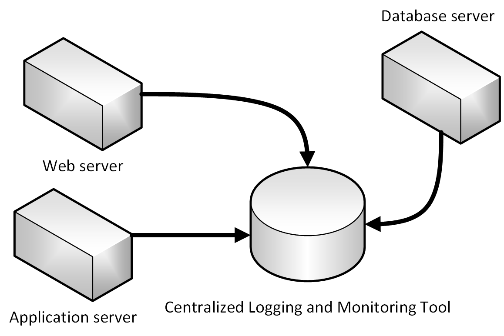

# Observability Patterns 
Just as patterns have been developed which aid in the layout of code in applications there are patterns for operating applications in a reliable way. Three very useful patterns in maintaining applications have emerged: logging, monitoring and alerts. 

## Logging
The first pattern is logging. This is simply having applications write down what it is they are doing. Any time failures or problems occur in production the goal should be to reproduce the conditions under which the failures occurred in a non-production environment, typically called Dev. Having good logs in place provides a road map for developers to follow in order to duplicate problems in an environment which can be tested and experimented with.

Every programming language has tooling which permits writing logs out and typically the overhead for writing these logs is quite low. Many of the logging libraries provide for logging with a variety of different criticalities which can be tuned at run time. For instance the Serilog library, a popular structured logging library for .NET, provides logging levels

* Verbose
* Debug
* Information
* Warning
* Error
* Fatal

These many log levels provide granularity in logging. When the application is functioning properly in production it may be configured to only log important messages. When the application is misbehaving then the log level can be increased so more verbose logs are gathered.  This balances performance and debuggability. 

The high performance of logging tools and the tunability of verbosity should encourage developers to log as frequently as possible. Many favor a pattern of logging entry and exit from each method. This may sound like overkill but it is very infrequent that developers will wish for less logging. In fact it is not uncommon to perform deployments for the sole purpose of adding logging around a particularly problematic method. Err on the side of too much logging and not too little. 

In traditional applications the log files were typically stored on the local machine. in fact, on Unix-like operating systems there is a folder structure defined, typically under `/var/log`, to hold any logs. Of course, the utility of logging to a flat file on a single machine is vastly reduced in a cloud environment. Applications producing logs may not have access to the local disk or the local disk may be highly transient as containers are shuffled around physical machines.

Cloud applications developed with an eye to microservices also pose some challenges for the file system based loggers of yesteryear. A user interaction may now span multiple services which run on different machines. It would be very challenging to correlate the logs from a user or a session across these many services and machines. 

Finally, the number of users in some cloud applications is quite high. Imagine that each user generates a hundred lines of log messages when the login to an application. In isolation that is quite manageable but multiply that over a hundred thousand users and the volume of logs becomes challenging. 

 
Fortunately, there are some fantastic alternatives to using file system logs. A centralized log server to which all logs are sent fixes all the problems. Logs are collected by the applications and shipped to a central logging application which indexes and stores the logs. This class of system is capable of ingesting tens of gigabytes of logs every day. 

It is also helpful to follow some standard practices when building logging which runs across many services. For instance, generating a [correlation Id](https://blog.rapid7.com/2016/12/23/the-value-of-correlation-ids/) at the start of a lengthy interaction and then logging it in each message related to that interaction makes it easier to search for all related messages. One need only find a single message and extract the correlation Id to find all the related messages. Another example is ensuring that the log format is the same for every service, regardless of the language or logging library it uses. This standardization will make reading logs much easier.

## Monitoring

Having centralized logging for searching for issues is helpful in the event that a problem is discovered in the application. In an ideal world, however, end users should not be the ones reporting errors. By taking a proactive approach to failure detection problems can be detected and corrected before the end users are even aware that there has been an issue.

Some centralized logging systems take on an additional role of being able to collect telemetry outside of pure logs. They can collect metrics such as time to run an SQL query, average response time from a web server, even CPU load averages and memory pressure as reported by the operating system. In conjunction with the logs these systems can provide a holistic view of the health of nodes in the system and the application as a whole. 

The metric gathering capabilities of the monitoring tools can also be fed manually from within the application. Business flows which are of particular interest such as new users signing up or orders being placed, may be instrumented such that they increment a counter in the central monitoring system. This unlocks the monitoring tools to not only monitor the health of the application but the health of the business.

Queries can be constructed in the log aggregation tools to look for certain statistics or patterns which can then be displayed, in graphical form, on bespoke dashboards. Frequently teams will invest in large, wall mounted, displays which rotate through the statistics related to an application. In this way it is very simple to see problems as they are occurring. 

## Alerts

The logical next step is to improve reactions to live site incidents is to craft queries against the monitoring tools to look for known failure conditions. For instance, queries could search through the incoming logs for indications of status code 500, which indicates a problem on a web server, being returned. As soon as one of these is detected then an e-mail or an SMS could be sent to the owner of the originating service who can begin to investigate. 

Typically, though, a single 500 error is not sufficient to determine that a problem has occurred. It could simply be that a user mistyped their password or entered some malformed data. The alert queries can be crafted to only fire when a larger than average number of 500 errors are detected. 

One of the most damaging patterns in alerting is to fire too many alerts for humans to investigate. Service owners will rapidly become desensitized to errors which they’ve previously investigated and found to be benign. When true errors occur then they will be lost in the noise of hundreds of false positives. The parable of the [Boy Who Cried Wolf](https://en.wikipedia.org/wiki/The_Boy_Who_Cried_Wolf) is frequently told to children to warn them of this very danger. It is important to ensure that the alerts which do fire are indicative of a real problem.

>[!div class="step-by-step"]
>[Previous](index.md)
>[Next](logging.md)
