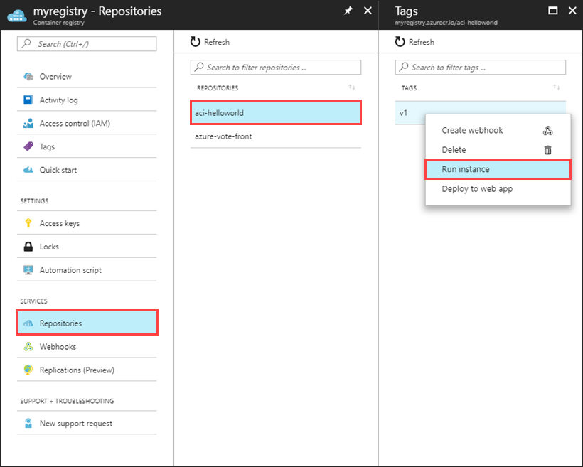

# Other Container Deployment Options

In addition to deploying to AKS, you can also deploy containers to Azure App Service for Containers and Azure Container Instances.

## When does it make sense to deploy to App Service for Containers?

Simple production applications that don't require orchestration are well-suited to Azure App Service for Containers.

## How to deploy to App Service for Containers

To deploy to [Azure App Service for Containers](https://azure.microsoft.com/services/app-service/containers/), you need to have configured an Azure Container Registry (ACR) and credentials for accessing it. Push the container you intend to host to the registry so it's available to pull into your Azure App Service. Once created, you can configure the app for Continuous Deployment, which will automatically deploy updates to the app whenever you update its corresponding image in ACR.

## When does it make sense to deploy to Azure Container Instances?

Azure Container Instances are best used for testing scenarios. They provide a fast, simple way to deploy an application to a cloud-hosted container instance. Use them to test or demo applications when you don't require scaling and orchestration features offered by Azure Kubernetes Service.

## How to deploy an app to Azure Container Instances

To deploy to [Azure Container Instances (ACI)](https://docs.microsoft.com/azure/container-instances/), you need to have configured an Azure Container Registry (ACR) and credentials for accessing it. You must also have previously pushed your container image to the registry, so it's available to pull into ACI. You can work with ACI using the Azure CLI or through the portal. Azure Container Registries make it easy to deploy individual container instances to ACI directly from within the registry, as shown in Figure 3-14.

**Figure 3-14**. Azure Container Registry Run Instance

Creating a container instance from the registry just requires specifying the usual Azure settings (name, subscription, resource group, and location) as well as how much memory to allocate to the container and which port it should listen on. This [quickstart shows how to deploy a container instance to ACI using the Azure portal](https://docs.microsoft.com/azure/container-instances/container-instances-quickstart-portal).

Once the deployment completes, find the newly deployed container's IP address and communicate with it over the port you specified.

Azure Container Instances offers the fastest, simplest way to run a container in Azure. There's no need to configure an app service or an orchestrator or to deal with virtual machines. However, because of its simplicity, ACI should primarily be used for testing purposes. If your application requires automatic scalability, multiple containers configured to work together, or any additional complex features, there are other better-suited Azure services available to host your app.

## References

- [Azure Container Instances Docs](https://docs.microsoft.com/azure/container-instances/)
- [Deploy Container Instance from ACR](https://docs.microsoft.com/azure/container-instances/container-instances-using-azure-container-registry#deploy-with-azure-portal)

>[!div class="step-by-step"]
>[Previous](scale-containers-serverless.md)
>[Next](communication-patterns.md) <!-- Next Chapter -->
