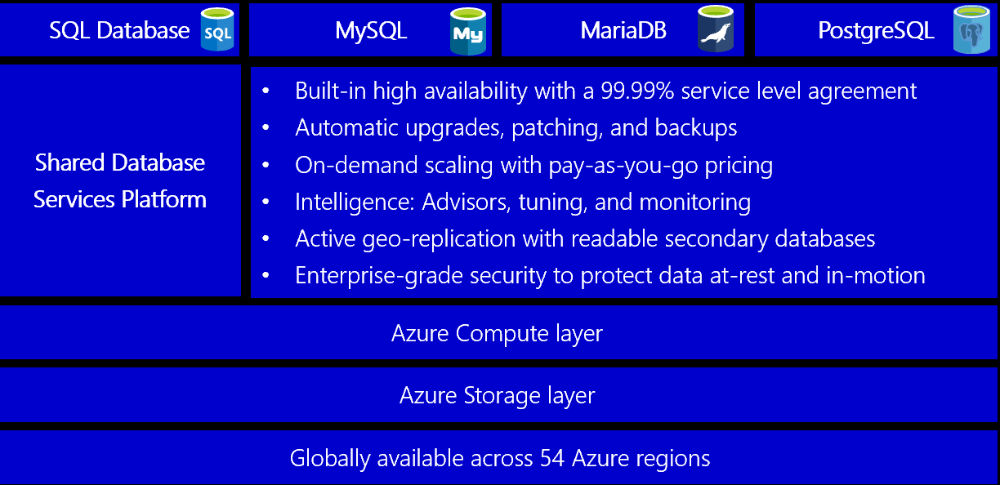

# Relational vs. NoSQL data

Relational and NoSQL are two types of database systems commonly implemented in cloud-native apps. They're built differently, store data differently, and accessed differently. In this section, we'll look at both. Later in this chapter, we'll look at an emerging database technology called *NewSQL*.

*Relational databases* have been a prevalent technology for decades. They're mature, proven, and widely implemented. Competing database products, tooling, and expertise abound. Relational databases provide a store of related data tables. These tables have a fixed schema, use SQL (Structured Query Language) to manage data, and support ACID guarantees.

*No-SQL databases* refer to high-performance, non-relational data stores. They excel in their ease-of-use, scalability, resilience, and availability characteristics. Instead of joining tables of normalized data, NoSQL stores unstructured or semi-structured data, often in key-value pairs or JSON documents. No-SQL databases typically don't provide ACID guarantees beyond the scope of a single database partition. High volume services that require sub second response time favor NoSQL datastores.

The impact of [NoSQL](https://www.geeksforgeeks.org/introduction-to-nosql/) technologies for distributed cloud-native systems can't be overstated. The proliferation of new data technologies in this space has disrupted solutions that once exclusively relied on relational databases.

NoSQL databases include several different models for accessing and managing data, each suited to specific use cases. Figure 5-9 presents four common models.

**Figure 5-9**: Data models for NoSQL databases

| Model | Characteristics |
| :-------- | :-------- |
| Document Store | Data and metadata are stored hierarchically in JSON-based documents inside the database. |
| Key Value Store | The simplest of the NoSQL databases, data is represented as a collection of key-value pairs. |
| Wide-Column Store | Related data is stored as a set of nested-key/value pairs within a single column. |
| Graph Store | Data is stored in a graph structure as node, edge, and data properties. |

## The CAP theorem

As a way to understand the differences between these types of databases, consider the CAP theorem, a set of principles applied to distributed systems that store state. Figure 5-10 shows the three properties of the CAP theorem.

**Figure 5-10**. The CAP theorem

The theorem states that distributed data systems will offer a trade-off between consistency, availability, and partition tolerance. And, that any database can only guarantee *two* of the three properties:

- *Consistency.* Every node in the cluster responds with the most recent data, even if the system must block the request until all replicas update. If you query a "consistent system" for an item that is currently updating, you'll wait for that response until all replicas successfully update. However, you'll receive the most current data.

- *Availability.* Every node returns an immediate response, even if that response isn't the most recent data. If you query an "available system" for an item that is updating, you'll get the best possible answer the service can provide at that moment.

- *Partition Tolerance.* Guarantees the system continues to operate even if a replicated data node fails or loses connectivity with other replicated data nodes.

CAP theorem explains the tradeoffs associated with managing consistency and availability during a network partition; however tradeoffs with respect to consistency and performance also exist with the absence of a network partition. CAP theorem is often further extended to [PACELC](http://www.cs.umd.edu/~abadi/papers/abadi-pacelc.pdf) to explain the tradeoffs more comprehensively.

Relational databases typically provide consistency and availability, but not partition tolerance. They're typically provisioned to a single server and scale vertically by adding more resources to the machine.

Many relational database systems support built-in replication features where copies of the primary database can be made to other secondary server instances. Write operations are made to the primary instance and replicated to each of the secondaries. Upon a failure, the primary instance can fail over to a secondary to provide high availability. Secondaries can also be used to distribute read operations. While writes operations always go against the primary replica, read operations can be routed to any of the secondaries to reduce system load.

Data can also be horizontally partitioned across multiple nodes, such as with [sharding](/azure/sql-database/sql-database-elastic-scale-introduction). But, sharding dramatically increases operational overhead by spitting data across many pieces that cannot easily communicate. It can be costly and time consuming to manage. Relational features that include table joins, transactions, and referential integrity require steep performance penalties in sharded deployments.

Replication consistency and recovery point objectives can be tuned by configuring whether replication occurs synchronously or asynchronously. If data replicas were to lose network connectivity in a "highly consistent" or synchronous relational database cluster, you wouldn't be able to write to the database. The system would reject the write operation as it can't replicate that change to the other data replica. Every data replica has to update before the transaction can complete.

NoSQL databases typically support high availability and partition tolerance. They scale out horizontally, often across commodity servers. This approach provides tremendous availability, both within and across geographical regions at a reduced cost. You partition and replicate data across these machines, or nodes, providing redundancy and fault tolerance. Consistency is typically tuned through consensus protocols or quorum mechanisms. They provide more control when navigating tradeoffs between tuning synchronous versus asynchronous replication in relational systems.

If data replicas were to lose connectivity in a "highly available" NoSQL database cluster, you could still complete a write operation to the database. The database cluster would allow the write operation and update each data replica as it becomes available. NoSQL databases that support multiple writable replicas can further strengthen high availability by avoiding the need for failover when optimizing recovery time objective.

Modern NoSQL databases typically implement partitioning capabilities as a feature of their system design. Partition management is often built-in to the database, and routing is achieved through placement hints - often called partition keys. A flexible data models enables the NoSQL databases to lower the burden of schema management and improve availablity when deploying application updates that require data model changes.

High availability and massive scalability are often more critical to the business than relational table joins and referential integrity. Developers can implement techniques and patterns such as Sagas, CQRS, and asynchronous messaging to embrace eventual consistency.

> Nowadays, care must be taken when considering the CAP theorem constraints. A new type of database, called NewSQL, has emerged which extends the relational database engine to support both horizontal scalability and the scalable performance of NoSQL systems.

## Considerations for relational vs. NoSQL systems

Based upon specific data requirements, a cloud-native-based microservice can implement a relational, NoSQL datastore or both.

|  Consider a NoSQL datastore when: | Consider a relational database when: |
| :-------- | :-------- |
| You have high volume workloads that require predictable latency at large scale (e.g. latency measured in milliseconds while performing millions of transactions per second) | Your workload volume generally fits within thousands of transactions per second |
| Your data is dynamic and frequently changes | Your data is highly structured and requires referential integrity |
| Relationships can be de-normalized data models | Relationships are expressed through table joins on normalized data models |  
| Data retrieval is simple and expressed without table joins | You work with complex queries and reports|
| Data is typically replicated across geographies and requires finer control over consistency, availablity, and performance | Data is typically centralized, or can be replicated regions asynchronously |
| Your application will be deployed to commodity hardware, such as with public clouds | Your application will be deployed to large, high-end hardware |

In the next sections, we'll explore the options available in the Azure cloud for storing and managing your cloud-native data.

## Database as a Service

To start, you could provision an Azure virtual machine and install your database of choice for each service. While you'd have full control over the environment, you'd forgo many built-in features of the cloud platform. You'd also be responsible for managing the virtual machine and database for each service. This approach could quickly become time-consuming and expensive.

Instead, cloud-native applications favor data services exposed as a [Database as a Service (DBaaS)](https://www.stratoscale.com/blog/dbaas/what-is-database-as-a-service/). Fully managed by a cloud vendor, these services provide built-in security, scalability, and monitoring. Instead of owning the service, you simply consume it as a [backing service](./definition.md#backing-services). The provider operates the resource at scale and bears the responsibility for performance and maintenance.

They can be configured across cloud availability zones and regions to achieve high availability. They all support just-in-time capacity and a pay-as-you-go model. Azure features different kinds of managed data service options, each with specific benefits.

We'll first look at relational DBaaS services available in Azure. You'll see that Microsoft's flagship SQL Server database is available along with several open-source options. Then, we'll talk about the NoSQL data services in Azure.

## Azure relational databases

For cloud-native microservices that require relational data, Azure offers four managed relational databases as a service (DBaaS) offerings, shown in Figure 5-11.

**Figure 5-11**. Managed relational databases available in Azure

In the previous figure, note how each sits upon a common DBaaS infrastructure which features key capabilities at no additional cost.

These features are especially important to organizations who provision large numbers of databases, but have limited resources to administer them.
You can provision an Azure database in minutes by selecting the amount of processing cores, memory, and underlying storage. You can scale the database on-the-fly and dynamically adjust resources with little to no downtime.

## Azure SQL Database

Development teams with expertise in Microsoft SQL Server should consider
[Azure SQL Database](/azure/sql-database/). It's a fully managed relational database-as-a-service (DBaaS) based on the Microsoft SQL Server Database Engine. The service shares many features found in the on-premises version of SQL Server and runs the latest stable version of the SQL Server Database Engine.

For use with a cloud-native microservice, Azure SQL Database is available with three deployment options:

- A Single Database represents a fully managed SQL Database running on an [Azure SQL Database server](/azure/sql-database/sql-database-servers) in the Azure cloud. The database is considered [*contained*](/sql/relational-databases/databases/contained-databases) as it has no configuration dependencies on the underlying database server.
  
- A [Managed Instance](/azure/sql-database/sql-database-managed-instance) is a fully managed instance of the Microsoft SQL Server Database Engine that provides near-100% compatibility with an on-premises SQL Server. This option supports larger databases, up to 35 TB and is placed in an [Azure Virtual Network](/azure/virtual-network/virtual-networks-overview) for better isolation.

- [Azure SQL Database serverless](/azure/sql-database/sql-database-serverless) is a compute tier for a single database that automatically scales based on workload demand. It bills only for the amount of compute used per second. The service is well suited for workloads with intermittent, unpredictable usage patterns, interspersed with periods of inactivity. The serverless compute tier also automatically pauses databases during inactive periods so that only storage charges are billed. It automatically resumes when activity returns.

Beyond the traditional Microsoft SQL Server stack, Azure also features managed versions of three popular open-source databases.

## Open-source databases in Azure

Open-source relational databases have become a popular choice for cloud-native applications. Many enterprises favor them over commercial database products, especially for cost savings. Many development teams enjoy their flexibility, community-backed development, and ecosystem of tools and extensions. Open-source databases can be deployed across multiple cloud providers, helping minimize the concern of "vendor lock-in."

Developers can easily self-host any open-source database on an Azure VM. While providing full control, this approach puts you on the hook for the management, monitoring, and maintenance of the database and VM.

However, Microsoft continues its commitment to keeping Azure an “open platform” by offering several popular open-source databases as *fully managed* DBaaS services.

### Azure Database for MySQL

[MySQL](https://en.wikipedia.org/wiki/MySQL) is an open-source relational database and a pillar for applications built on the [LAMP software stack](https://en.wikipedia.org/wiki/LAMP_(software_bundle)). Widely chosen for *read heavy* workloads, it's used by many large organizations, including Facebook, Twitter, and YouTube. The community edition is available for free, while the enterprise edition requires a license purchase. Originally created in 1995, the product was purchased by Sun Microsystems in 2008. Oracle acquired Sun and MySQL in 2010.

[Azure Database for MySQL](https://azure.microsoft.com/services/mysql/) is a managed relational database service based on the open-source MySQL Server engine. It uses the MySQL Community edition. The Azure MySQL server is the administrative point for the service. It's the same MySQL server engine used for on-premises deployments. The engine can create a single database per server or multiple databases per server that share resources. You can continue to manage data using the same open-source tools without having to learn new skills or manage virtual machines.

### Azure Database for MariaDB

[MariaDB](https://mariadb.com/) Server is another popular open-source database server. It was created as a *fork* of MySQL when Oracle purchased Sun Microsystems, who owned MySQL. The intent was to ensure that MariaDB remained open-source. As MariaDB is a fork of MySQL, the data and table definitions are compatible, and the client protocols, structures, and APIs, are close-knit.

MariaDB has a strong community and is used by many large enterprises. While Oracle continues to maintain, enhance, and support MySQL, the MariaDB foundation manages MariaDB, allowing public contributions to the product and documentation.

[Azure Database for MariaDB](https://azure.microsoft.com/services/mariadb/) is a fully managed relational database as a service in the Azure cloud. The service is based on the MariaDB community edition server engine. It can handle mission-critical workloads with predictable performance and dynamic scalability.

### Azure Database for PostgreSQL

[PostgreSQL](https://www.postgresql.org/) is an open-source relational database with over 30 years of active development. PostgresSQL has a strong reputation for reliability and data integrity. It’s feature rich, SQL compliant, and considered more performant than MySQL - especially for workloads with complex queries and heavy writes. Many large enterprises including Apple, Red Hat, and Fujitsu have built products using PostgreSQL.

[Azure Database for PostgreSQL](https://azure.microsoft.com/services/postgresql/) is a fully managed relational database service, based on the open-source Postgres database engine. The service supports many development platforms, including C++, Java, Python, Node, C\#, and PHP. You can migrate PostgreSQL databases to it using the [command-line interface](https://datamigration.microsoft.com/scenario/postgresql-to-azurepostgresql?step=1) tool or Azure Data Migration Service.

Azure Database for PostgreSQL is available with two deployment options:

- The [Single Server](/azure/postgresql/concepts-servers) deployment option is a central administrative point for multiple databases to which you can deploy many databases. The pricing is structured per-server based upon cores and storage.

- The [Hyperscale (Citus) option](https://azure.microsoft.com/blog/get-high-performance-scaling-for-your-azure-database-workloads-with-hyperscale/) is powered by Citus Data technology. It enables high performance by *horizontally scaling* a single database across hundreds of nodes to deliver fast performance and scale. This option allows the engine to fit more data in memory, parallelize queries across hundreds of nodes, and index data faster.

## NoSQL data in Azure

Cosmos DB is a fully managed, globally distributed NoSQL database service in the Azure cloud. It has been adopted by many large companies across the world,  including Coca-Cola, Skype, ExxonMobil, and Liberty Mutual.

If your services require fast response from anywhere in the world, high availability, or elastic scalability, Cosmos DB is a great choice. Figure 5-12 shows Cosmos DB.

**Figure 5-12**: Overview of Azure Cosmos DB

The previous figure presents many of the built-in cloud-native capabilities available in Cosmos DB. In this section, we’ll take a closer look at them.

### Global support

Cloud-native applications often have a global audience and require global scale.

You can distribute Cosmos databases across regions or around the world, placing data close to your users, improving response time, and reducing latency. You can add or remove a database from a region without pausing or redeploying your services. In the background, Cosmos DB transparently replicates the data to each of the configured regions.

Cosmos DB supports [active/active](https://kemptechnologies.com/white-papers/unfog-confusion-active-passive-activeactive-load-balancing/) clustering at the global level, enabling you to configure any of your database regions to support *both writes and reads*.

The [Multi-region write](/azure/cosmos-db/conflict-resolution-policies) protocol is an important feature in Cosmos DB that enables the following functionality:

- Unlimited elastic write and read scalability.

- 99.999% read and write availability all around the world.

- Guaranteed reads and writes served in less than 10 milliseconds at the 99th percentile.

With the Cosmos DB [Multi-Homing APIs](/azure/cosmos-db/distribute-data-globally), your microservice is automatically aware of the nearest Azure region and sends requests to it. The nearest region is identified by Cosmos DB without any configuration changes. Should a region become unavailable, the Multi-Homing feature will automatically route requests to the next nearest available region.

### Multi-model support

When replatforming monolithic applications to a cloud-native architecture, development teams sometimes have to migrate open-source, NoSQL data stores. Cosmos DB can help you preserve your investment in these NoSQL datastores with its *multi-model* data platform. The following table shows the supported NoSQL [compatibility APIs](https://www.wikiwand.com/en/Cosmos_DB).

| Provider | Description  |
| :-------- | :-------- |
| SQL API | Proprietary API that supports JSON documents and SQL-based queries |
| Mongo DB API | Supports Mongo DB APIs and JSON documents|
| Gremlin API | Supports Gremlin API with graph-based nodes and edge data representations |
| Cassandra API | Supports Casandra API for wide-column data representations |  
| Table API  | Supports Azure Table Storage with premium enhancements |  
| etcd API | Enables Cosmos DB as a backing store for Azure Kubernetes Service clusters |

Development teams can migrate existing Mongo, Gremlin, or Cassandra databases into Cosmos DB with minimal changes to data or code. For new apps, development teams can choose among open-source options or the built-in SQL API model.

> Internally, Cosmos stores the data in a simple struct format made up of primitive data types. For each request, the database engine translates the primitive data into the model representation you've selected.

In the previous table, note the [Table API](/azure/cosmos-db/table-introduction) option. This API is an evolution of Azure Table Storage. Both share the same underlying table model, but the Cosmos DB Table API adds premium enhancements not available in the Azure Storage API. The following table contrasts the features.

| Feature             | Azure Table Storage                                           | Azure Cosmos DB                                                             |
|:--------------------|:--------------------------------------------------------------|:----------------------------------------------------------------------------|
| Latency             | Fast                                                          | Single-digit millisecond latency for reads and writes anywhere in the world |
| Throughput          | Limit of 20,000 operations per table                          | Unlimited operations per table                                              |
| Global Distribution | Single region with optional single secondary read region      | Turnkey distributions to all regions with automatic failover                |
| Indexing            | Available for partition and row key properties only           | Automatic indexing of all properties                                        |
| Pricing             | Optimized for cold workloads (low throughput : storage ratio) | Optimizied for hot workloads (high throughput : storage ratio)              |

Microservices that consume Azure Table storage can easily migrate to the Cosmos DB Table API. No code changes are required.

### Tunable consistency

Earlier in the *Relational vs. NoSQL* section, we discussed the subject of *data consistency*. Data consistency refers to the *integrity* of your data. Cloud-native services with distributed data rely on replication and must make a fundamental tradeoff between read consistency, availability, and latency.

Most distributed databases allow developers to choose between two consistency models: strong consistency and eventual consistency. *Strong consistency* is the gold standard of data programmability. It guarantees that a query will always return the most current data - even if the system must incur latency waiting for an update to replicate across all database copies. While a database configured for *eventual consistency* will return data immediately, even if that data isn't the most current copy. The latter option enables higher availability, greater scale, and increased performance.

Azure Cosmos DB offers five well-defined [consistency models](/azure/cosmos-db/consistency-levels) shown in Figure 5-13.

**Figure 5-13**: Cosmos DB Consistency Levels

 These options enable you to make precise choices and granular tradeoffs for consistency, availability, and the performance for your data. The levels are presented in the following table.

| Consistency Level | Description  |
| :-------- | :-------- |
| Eventual | No ordering guarantee for reads. Replicas will eventually converge. |
| Constant Prefix | Reads are still eventual, but data is returned in the ordering in which it is written. |
| Session | Guarantees you can read any data written during the current session. It is the default consistency level. |
| Bounded Staleness | Reads trail writes by interval that you specify. |  
| Strong  | Reads are guaranteed to return most recent committed version of an item. A client never sees an uncommitted or partial read. |  

In the article [Getting Behind the 9-Ball: Cosmos DB Consistency Levels Explained](https://blog.jeremylikness.com/blog/2018-03-23_getting-behind-the-9ball-cosmosdb-consistency-levels/), Microsoft Program Manager Jeremy Likness provides an excellent explanation of the five models.

### Partitioning

Azure Cosmos DB embraces automatic [partitioning](/azure/cosmos-db/partitioning-overview) to scale a database to meet the performance needs of your cloud-native services.

You manage data in Cosmos DB data by creating databases, containers, and items.

Containers live in a Cosmos DB database and represent a schema-agnostic grouping of items. Items are the data that you add to the container. They're represented as documents, rows, nodes, or edges. All items added to a container are automatically indexed.

To partition the container, items are divided into distinct subsets called logical partitions. Logical partitions are populated based on the value of a partition key that is associated with each item in a container. Figure 5-14 shows two containers each with a logical partition based on a partition key value.

**Figure 5-14**: Cosmos DB partitioning mechanics

Note in the  previous figure how each item includes a partition key of either ‘city’ or ‘airport’. The key determines the item’s logical partition. Items with a city code are assigned to the container on the left, and items with an airport code, to the container on the right. Combining the partition key value with the ID value creates an item's index, which uniquely identifies the item.

Internally, Cosmos DB automatically manages the placement of [logical partitions](/azure/cosmos-db/partition-data) on physical partitions to satisfy the scalability and performance needs of the container. As application throughput and storage requirements  increase, Azure Cosmos DB redistributes logical partitions across a greater number of servers. Redistribution operations are managed by Cosmos DB and invoked without interruption or downtime.

## NewSQL databases

*NewSQL* is an emerging database technology that combines the distributed scalability of NoSQL with the ACID guarantees of a relational database. NewSQL databases are important for business systems that must process high-volumes of data, across distributed environments, with full transactional support and ACID compliance. While a NoSQL database can provide massive scalability, it does not guarantee data consistency. Intermittent problems from inconsistent data can place a burden on the development team. Developers must construct safeguards into their microservice code to manage problems caused by inconsistent data.

The Cloud Native Computing Foundation (CNCF) features several NewSQL database projects.

| Project | Characteristics |
| :-------- | :-------- |
| Cockroach DB |An ACID-compliant, relational database that scales globally. Add a new node to a cluster and CockroachDB takes care of balancing the data across instances and geographies. It creates, manages, and distributes replicas to ensure reliability. It’s open source and freely available.  |
| TiDB | An open-source database that supports Hybrid Transactional and Analytical Processing (HTAP) workloads. It is MySQL-compatible and features horizontal scalability, strong consistency, and high availability.  TiDB acts like a MySQL server. You can continue to use existing MySQL client libraries, without requiring extensive code changes to your application. |
| YugabyteDB | An open source, high-performance, distributed SQL database. It supports low query latency, resilience against failures, and global data distribution. YugabyteDB is PostgressSQL-compatible and handles scale-out RDBMS and internet-scale OLTP workloads. The product also supports NoSQL and is compatible with Cassandra. |
|Vitess | Vitess is a database solution for deploying, scaling, and managing large clusters of MySQL instances. It can run in a public or private cloud architecture. Vitess combines and extends many important MySQL features and features both vertical and horizontal sharding support. Originated by YouTube, Vitess has been serving all YouTube database traffic since 2011. |

The open-source projects in the previous figure are available from the Cloud Native Computing Foundation. Three of the offerings are full database products, which include .NET support. The other, Vitess, is a database clustering system that horizontally scales large clusters of MySQL instances.

A key design goal for NewSQL databases is to work natively in Kubernetes, taking advantage of the platform's resiliency and scalability.

NewSQL databases are designed to thrive in ephemeral cloud environments where underlying virtual machines can be restarted or rescheduled at a moment’s notice. The databases are designed to survive node failures without data loss nor downtime. CockroachDB, for example, is able to survive a machine loss by maintaining three consistent replicas of any data across the nodes in a cluster.

Kubernetes uses a *Services construct* to allow a client to address a group of identical NewSQL databases processes from a single DNS entry. By decoupling the database instances from the address of the service with which it's associated, we can scale without disrupting existing application instances. Sending a request to any service at a given time will always yield the same result.

In this scenario, all database instances are equal. There are no primary or secondary relationships. Techniques like *consensus replication* found in CockroachDB allow any database node to handle any request. If the node that receives a load-balanced request has the data it needs locally, it responds immediately. If not, the node becomes a gateway and forwards the request to the appropriate nodes to get the correct answer. From the client's perspective, every database node is the same: They appear as a single *logical* database with the consistency guarantees of a single-machine system, despite having dozens or even hundreds of nodes that are working behind the scenes.

For a detailed look at the mechanics behind NewSQL databases, see the [DASH: Four Properties of Kubernetes-Native Databases](https://thenewstack.io/dash-four-properties-of-kubernetes-native-databases/) article.

## Data migration to the cloud

One of the more time-consuming tasks is migrating data from one data platform to another. The [Azure Data Migration Service](https://azure.microsoft.com/services/database-migration/) can help expedite such efforts. It can migrate data from several external database sources into Azure Data platforms with minimal downtime. Target platforms include the following services:

- Azure SQL Database
- Azure Database for MySQL
- Azure Database for MariaDB
- Azure Database for PostgreSQL
- Azure Cosmos DB
  
The service provides recommendations to guide you through the changes required to execute a migration, both small or large.

>[!div class="step-by-step"]
>[Previous](distributed-data.md)
>[Next](azure-caching.md)
