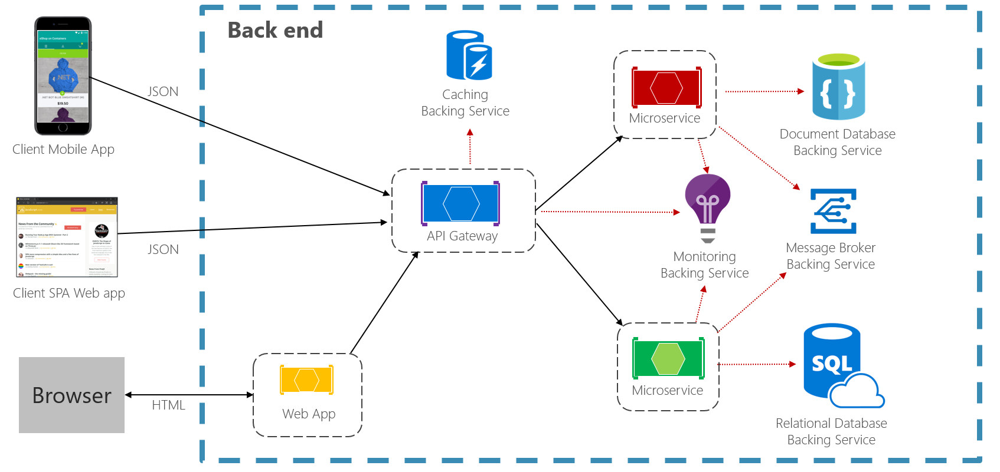

# Cloud native resiliency

Resiliency is the ability of your system to react to failure and still remain functional. It isn't about avoiding failure. But it's about accepting that failure is inevitable in cloud-based systems and building your application to respond to it. The end-goal of resiliency is to return the application to a fully functioning state after a failure.

Unlike traditional monolithic applications, where everything runs together in a single process, cloud native systems embrace distributed architecture as shown in Figure 6-1:

**Figure 6-1.** Distributed cloud native environment

In the previous figure, note how each client, microservice, and cloud-based [backing service](https://12factor.net/backing-services) executes as a separate process, running across different servers, all communicating via network-based calls.

So, what could go wrong?

- Unexpected [network latency](https://www.techopedia.com/definition/8553/network-latency).
- [Transient faults](https://docs.microsoft.com/azure/architecture/best-practices/transient-faults)
    (temporary network connectivity errors).
- Blocking by a long-running synchronous operation.
- A host process that has crashed and is being restarted or moved.
- An overloaded microservice that can't respond for a short time.
- An in-flight DevOps operation such as an update or scaling operation.
- An Orchestrator operation such as moving a service from one node to another.
- Hardware failures from commodity hardware.

When deploying distributed services into cloud-based infrastructure, the factors from the previous list become very real and you must architect and develop defensively to deal with them.

In a small-scale distributed system, failure will be less frequent, but as a system scales up and out, you can expect to experience more of these issues to a point where partial failure becomes normal operation.

Therefore, your application and infrastructure must be resilient. In the following sections, we'll explore defensive techniques that you can add to your application and built-in cloud features that you can leverage to help bullet-proof your user's experience.

>[!div class="step-by-step"]
>[Previous](azure-data-storage.md)
>[Next](application-resiliency-patterns.md)
