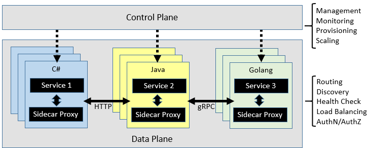

# Resilient communications

[!INCLUDE [book-preview](../../../includes/book-preview.md)]

Throughout this book, we've evangelized the merits of moving beyond traditional monolithic application design and embracing a microservice-based architecture where a set of distributed, self-contained services run independently and communicate with each other using standard communication protocols such as HTTP and HTTPS. While such an architecture buys you many important benefits, it also presents many challenges. Consider, for example, the following concerns:

- *Out-of-process network communication.* Each service communicates over a network protocol that introduces network congestion, latency, and transient faults.
- *Service discovery.* With each service running across a cluster of machines with its own IP address and port, how do services discover and communicate with each other?
- *Resiliency.* How do you manage short-lived failures and keep the system stable?
- *Load balancing.* How does inbound traffic get distributed across multiple instances of a service?
- *Security.* How are security concerns such as transport-level encryption and certificate management enforced?
- *Distributed Monitoring. - How do you correlate and capture traceability and monitoring for a single request across multiple consuming services?

While these concerns can be addressed with various libraries and frameworks, implementing them inside your codebase can be expensive, complex, and time-consuming. Moreover, you end up with a solution where infrastructure concerns are coupled to business logic.

## Service mesh

A better approach is to consider a new and rapidly evolving technology entitled *Service Mesh*. A [service mesh](https://www.nginx.com/blog/what-is-a-service-mesh/) is a configurable infrastructure layer with built-in capabilities to handle service communication and many of the challenges mentioned above. It decouples these concerns from your business code and moves them into a service proxy, an instance of which accompanies each of your services. Often referred to as the [Sidecar pattern](https://docs.microsoft.com/azure/architecture/patterns/sidecar), the service mesh proxy is deployed into a separate process to provide isolation and encapsulation from your business code. However, the proxy is closely linked to the service being created along with it and sharing its lifecycle. Figure 6-9 shows this scenario.

**Figure 6-9**. Service mesh with a side car

In the previous figure, note how the proxy intercepts and manages communication among the microservices and the cluster.

A service mesh is logically split into two disparate components: A [data plane](https://blog.envoyproxy.io/service-mesh-data-plane-vs-control-plane-2774e720f7fc) and [control plane](https://blog.envoyproxy.io/service-mesh-data-plane-vs-control-plane-2774e720f7fc). Figure 6-10 shows these components and their responsibilities.

**Figure 6-10.** Service mesh control and data plane

Once configured, a service mesh is highly functional. It can retrieve a corresponding pool of instances from a service discovery endpoint. It can then send a request to a specific instance, recording the latency and response type of the result. A mesh can choose the instance most likely to return a fast response based on many factors, including its observed latency for recent requests.

If an instance is unresponsive or fails, the mesh can retry the request on another instance. If a pool consistently returns errors, a mesh can evict it from the load-balancing pool to be retried periodically later after it heals. If a request times out, a mesh can fail and then retry the request. A mesh captures behavior in the form of metrics and distributed tracing, which then can be emitted to a centralized metrics system.

## Istio and Envoy

While a few service mesh options currently exist, [Istio](https://istio.io/docs/concepts/what-is-istio/) is the most popular as of the time of this writing. A joint venture from IBM, Google, and Lyft, it's an open-source offering that can be integrated into a new or existing distributed application. It provides a consistent and complete solution to secure, connect, and monitor microservices. Its features include:

- Secure service-to-service communication in a cluster with strong identity-based authentication and authorization.
- Automatic load balancing for HTTP, [gRPC](https://grpc.io/), WebSocket, and TCP traffic.
- Fine-grained control of traffic behavior with rich routing rules, retries, failovers, and fault injection.
- A pluggable policy layer and configuration API supporting access controls, rate limits, and quotas.
- Automatic metrics, logs, and traces for all traffic within a cluster, including cluster ingress and egress.

A key component for an Istio implementation is a proxy service entitled the [Envoy proxy](https://www.envoyproxy.io/docs/envoy/latest/intro/what_is_envoy). Originating from Lyft and subsequently contributed to the [Cloud Native Computing Foundation](https://www.cncf.io/) (discussed in chapter 1), the Envoy proxy runs alongside each service and provides a platform-agnostic foundation for the following features:

- Dynamic service discovery.
- Load balancing.
- TLS termination.
- HTTP and gRPC proxies.
- Circuit breaker resiliency.
- Health checks.
- Rolling updates with [canary](https://martinfowler.com/bliki/CanaryRelease.html) deployments.

As previously discussed, Envoy is deployed as a sidecar to each microservice in the cluster.

## Integration with Azure Kubernetes Services

The Azure cloud embraces Istio and provides direct support for it within Azure Kubernetes Services. The following links can help you get started:

- [Installing Istio in AKS](https://docs.microsoft.com/azure/aks/istio-install)
- [Using AKS and Istio](https://docs.microsoft.com/azure/aks/istio-scenario-routing)

>[!div class="step-by-step"]
>[Previous](infrastructure-resiliency-azure.md)
>[Next](monitoring-health.md) <!-- Next Chapter -->
