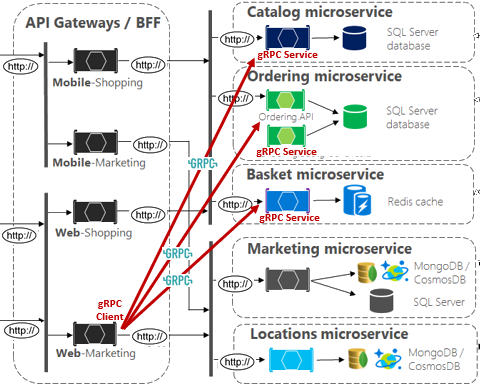

# gRPC

[!INCLUDE [book-preview](../../../includes/book-preview.md)]

So far in this book, we've focused on [REST-based](https://docs.microsoft.com/azure/architecture/best-practices/api-design) communication. We've seen that REST is a flexible architectural style that defines CRUD-based operations against entity resources. Clients interact with resources across HTTP with a request/response communication model. While REST is widely implemented, a newer communication technology, gRPC, has gained tremendous momentum across the cloud-native community.

## Introduction

gRPC is a modern, high-performance framework that evolves the age-old [remote procedure call (RPC)](https://en.wikipedia.org/wiki/Remote_procedure_call) protocol, traditionally used in distributed applications. As an application level tool, gRPC streamlines messaging between clients and back-end services across platforms. Originating from Google, gRPC is now open source and part of the  [Cloud Native Computing Foundation (CNCF)](https://www.cncf.io/) ecosystem. CNCF considers gRPC an [incubating project](https://github.com/cncf/toc/blob/master/process/graduation_criteria.adoc). Incubated means that end users have deployed into production and has a healthy number of contributors.

In cloud-native applications, developers often work across programming languages, frameworks, and technologies. This interoperability can complicate message contracts and the plumbing required for cross-platform communication.  gRPC provides a "uniform horizontal layer" that abstracts these concerns. It enables developers to code in their native language and keep focus on business functionality - not communication plumbing.  

A gRPC client app exposes a local, in-process function that implements an operation. Under the covers, that local function invokes another function from a service on remote machine. What appears to be a local call essentially becomes a transparent out-of-process call to a remote service. The RPC plumbing simplifies developer effort by abstracting the point-to-point networking communication, serialization, and execution between computers.

gRPC offers comprehensive support across most popular development stacks, including Java, JavaScript, C#, Go, Swift, and NodeJS.

## Performance

gRPC uses HTTP/2 for its transport protocol. While compatible with HTTP 1.1, HTTP/2 features many advanced capabilities:

- A binary protocol for data transport - unlike HTTP 1.1, which sends data as clear text.
- Multiplexing support for sending multiple parallel requests over the same connection - HTTP 1.1 limits processing to one request/response message at a time.
- Bidirectional full-duplex communication for sending both client requests and server responses simultaneously.
- Built-in streaming enabling requests and responses to asynchronously stream large data sets.

gRPC is lightweight and highly performant. It can be up to 8x faster than JSON serialization with messages 60-80% smaller. In Microsoft [Windows Communication Foundation (WCF)](https://docs.microsoft.com/dotnet/framework/wcf/whats-wcf) parlance, gRPC performance exceeds the speed and efficiency of the highly optimized [NetTCP bindings](https://docs.microsoft.com/dotnet/api/system.servicemodel.nettcpbinding?view=netframework-4.8). Unlike NetTCP, which favors the Microsoft stack, gRPC is cross-platform.

## Protocol Buffers

gRPC embraces an open-source technology called [Protocol Buffers](https://developers.google.com/protocol-buffers/docs/overview). They provide a highly efficient and platform-neutral serialization format for serializing structured messages that services send to each other. Using a cross-platform Interface Definition Language (IDL), developers define a service contract for each microservice. The contract, implemented as a text-based '.proto' file, describes the methods, inputs, and outputs for each service. The same contract file can be used for gRPC clients and services built on different development platforms.

Using the proto file, the Protobuf compiler, "Protoc," generates both client and service code for your target platform. The code includes the following components:

- A strongly-typed DTO (Data Transfer Object) shared by the client and service.
- A strongly-typed base class with the required network plumbing that the remote gRPC service can inherit and extend.
- A client stub that contains the required plumbing to invoke the remote gRPC service.

At runtime, each message is serialized as a standard Protobuf representation and exchanged between the client and remote service. Unlike JSON or XML, Protobuf messages are serialized as compiled binary bytes.

The book, [gRPC for WCF Developers](https://docs.microsoft.com/dotnet/architecture/grpc-for-wcf-developers/), available from the Microsoft Architecture Site, provides in-depth coverage of gRPC and Protocol Buffers.

## gRPC support in .NET

gRPC is integrated into .NET Core 3.0 SDK or later. The following tools support it:

- Visual Studio 2019, version 16.3 or later, and the web development workload installed.
- Visual Studio Code
- the dotnet CLI

It includes tooling for endpoint routing, built-in IoC, and logging. The open-source Kestrel web server supports HTTP/2 connections. Figure 4-20 shows a Visual Studio 2019 template that scaffolds a skeleton project for a gRPC service. Note how .NET Core fully supports Windows, Linux, and macOS.

**Figure 4-20**. gRPC support in Visual Studio 2019
  
Figure 4-21 shows the skeleton gRPC service generated from the built-in scaffolding included in Visual Studio 2019.  

**Figure 4-21**. gRPC project in Visual Studio 2019

In the previous figure, note the proto description file and service code. As you'll see shortly, Visual Studio generates additional configuration in both the Startup class and underlying project file.

## gRPC usage

Favor gRPC for the following scenarios:

- Synchronous backend microservice-to-microservice communication where an immediate response is required to continue processing.
- Polyglot environments that need to support mixed programming platforms.
- Low latency and high throughput communication where performance is critical.
- Point-to-point real-time communication - gRPC can push messages in real time without polling and has excellent support for bi-directional streaming.
- Network constrained environments – binary gRPC messages are always smaller than an equivalent text-based JSON message.

At the time of this writing, gRPC is primarily used in backend services. Most modern browsers can't provide the level of HTTP/2 control required to support a front-end gRPC client.

## gRPC implementation

The microservice reference architecture, [eShop on Containers](https://github.com/dotnet-architecture/eShopOnContainers), from Microsoft, shows how to implement gRPC services in .NET Core applications. Figure 4-22 presents the high-level architecture.

**Figure 4-22**. gRPC in eShop on Containers

In the previous figure, note how eShop embraces the [Backend for Frontends pattern](https://docs.microsoft.com/azure/architecture/patterns/backends-for-frontends) (BFF) by exposing multiple API gateways. The bottom-most API gateway, *Web-Marketing* launches both RESTful HTTP and gRPC services. Figure 4-23 shows a close-up view of the Web-Marketing functionality.

**Figure 4-22**. gRPC in eShop on Containers - Close Up

In the previous figure, note the Web-Marketing API Gateway. It implements RESTful HTTP services that route simple CRUD requests *directly* to the backend Ordering, Basket, and Catalog microservices. The gateway also includes calls to an Aggregator microservice that implements a gRPC client. The gRPC client makes synchronous gRPC-based calls (in red) to backend gRPC services to orchestrate more complex operations.

 Note how gRPC communication requires both client and server components. The Aggregator service implements a gRPC client, and each backend microservice, a gRPC server. Both take advantage of the built-in gRPC client plumbing from the .NET Core 3.0 SDK. Client-side *stubs* provide the plumbing to invoke remote gRPC calls. Server-side plumbing includes a base class that your custom gRPC service classes can inherit and consume.

 Microservices that expose both a RESTful API and gRPC require different endpoints to manage this traffic. Typically, you would open two endpoints. One listens for HTTP traffic for the RESTful endpoints and the other for gRPC calls. Importantly, the gRPC endpoint specifies the HTTP/2 protocol which is required for gRPC communication.

## Looking ahead

Looking ahead, gRPC could will continue to gain traction for cloud-native systems. The performance benefits and ease of development are compelling. However, REST will still most likely be around for a long time. It excels for publicly exposed APIs and for backward compatibility reasons.

>[!div class="step-by-step"]
>[Previous](service-to-service-communication.md)
>[Next](service-mesh-communication-infrastructure.md)
