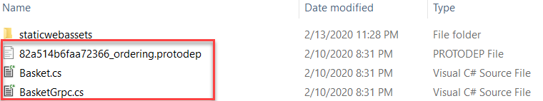

# gRPC

[!INCLUDE [book-preview](../../../includes/book-preview.md)]

So far in this book, we’ve focused on [REST-based](https://docs.microsoft.com/azure/architecture/best-practices/api-design) communication. We've seen that REST is a flexible architectural style that defines CRUD-based operations against data resources. Clients interact with these resources across HTTP using a request/response communication model. While REST is widely implemented, a newer communication technology, gRPC, has gained tremendous momentum across the cloud-native community.

## Introduction

gRPC is a modern, high-performance framework that evolves the age-old [remote procedure call (RPC)](https://en.wikipedia.org/wiki/Remote_procedure_call) protocol, traditionally used in distributed applications. As an application level tool, gRPC streamlines messaging between clients and back-end services across platforms. Originating from Google, gRPC is now open source and part of the  [Cloud Native Computing Foundation (CNCF)](https://www.cncf.io/) ecosystem. CNCF considers gRPC an [incubating project](https://github.com/cncf/toc/blob/master/process/graduation_criteria.adoc). Incubated means that end users have deployed into production and has a healthy number of contributors.

In cloud-native applications, developers often work across programming languages, frameworks, and technologies. This interoperability can complicate message contracts and the plumbing required for cross-platform communication.  gRPC provides a "uniform horizontal layer" that abstracts these concerns. It enables developers to code in their native language and keep focus on business functionality - not communication plumbing.  

A gRPC client app exposes a local, in-process function that implements an operation. Under the covers, that local function invokes another function from a service on remote machine. What appears to be a local call essentially becomes a transparent out-of-process call to a remote service. The RPC plumbing simplifies developer effort by abstracting the point-to-point networking communication, serialization, and execution between computers.

gRPC offers comprehensive support across most popular development stacks, including Java, JavaScript, C#, Go, Swift, and NodeJS.

## Performance

gRPC uses HTTP/2 for its transport protocol. While compatible with HTTP 1.1, HTTP/2 features many advanced capabilities:

- A binary protocol for data transport - unlike HTTP 1.1, which sends data as clear text.
- Multiplexing support for sending multiple parallel requests over the same connection - HTTP 1.1 limits processing to one request/response message at a time.
- Bidirectional full-duplex communication for sending both client requests and server responses simultaneously.
- Built-in streaming enabling requests and responses to asynchronously stream large data sets.

gRPC is lightweight and highly performant. It can be up to 8x faster than JSON serialization with messages 60-80% smaller. In Microsoft [Windows Communication Foundation (WCF)](https://docs.microsoft.com/dotnet/framework/wcf/whats-wcf) parlance, gRPC performance exceeds the speed and efficiency of the highly optimized [NetTCP bindings](https://docs.microsoft.com/dotnet/api/system.servicemodel.nettcpbinding?view=netframework-4.8). Unlike NetTCP, which favors the Microsoft stack, gRPC is cross-platform.

## Protocol Buffers

gRPC embraces an open-source technology called [Protocol Buffers](https://developers.google.com/protocol-buffers/docs/overview). They provide a highly efficient and platform-neutral serialization format for serializing structured messages that services send to each other. Using a cross-platform Interface Definition Language (IDL), developers define a service contract for each microservice. The contract, implemented as a text-based '.proto' file, describes the methods, inputs, and outputs for each service. The same contract file can be used for gRPC clients and services built on different development platforms.

Using the proto file," the Protobuf compiler, "Protoc," generates both client and service code for your target platform. The code includes the following components:

- A strongly-typed DTO (Data Transfer Object) shared by the client and service.
- A strongly-typed base class with the required network plumbing that the remote gRPC service can inherit and extend.
- A client stub that contains the required plumbing to invoke the remote gRPC service.

At runtime, each message is serialized as a standard Protobuf representation and exchanged between the client and remote service. Unlike JSON or XML, Protobuf messages are serialized as compiled binary bytes.

The book, [gRPC for WCF Developers](https://docs.microsoft.com/dotnet/architecture/grpc-for-wcf-developers/), available from the Microsoft Architecture Site, provides in-depth coverage of gRPC and Protocol Buffers. 

## gRPC support in .NET

Microsoft .NET Core 3.0 includes tooling and native support for gRPC. gRPC has been seamlessly integrated into the 3.0 framework with support for endpoint routing, built-in IoC, and logging. The open-source Kestrel web server supports HTTP/2 connections. Figure 4-20 shows a Visual Studio 2019 template that scaffolds a skeleton project for a gRPC service. Note how .NET Core fully supports the Windows, Linux, and macOS platforms.


**Figure 4-20**. gRPC support in Visual Studio 2019
  
Figure 4-21 shows the skeleton gRPC service generated from the built-in scaffolding included in Visual Studio 2019.  


**Figure 4-21**. gRPC project in Visual Studio 2019

In the previous figure, note the proto description file and service code. As you'll see shortly, Visual Studio generates additional configuration in both the Startup class and underlying project file.

An excellent introduction to building a gRPC service is [gRPC with ASP.NET Core 3.0](https://www.dotnetcurry.com/aspnet-core/1514/grpc-asp-net-core-3) from the .NET Curry magazine series.

## gRPC usage

Favor gRPC for the following scenarios:

- Synchronous backend microservice-to-microservice communication where an immediate response is required to continue processing.
- Polyglot environments that need to support mixed programming platforms.
- Low latency and high throughput communication where performance is critical.
- Point-to-point real-time communication - gRPC can push messages in real time without polling and has excellent support for bi-directional streaming.
- Network constrained environments – binary gRPC messages are always smaller than an equivalent text-based JSON message.

At the time of this writing, gRPC is primarily used in backend services. Most modern browsers can't provide the level of HTTP/2 control required to support a front-end gRPC client.

## gRPC implementation

The microservice reference architecture for [eShop on Containers](https://github.com/dotnet-architecture/eShopOnContainers) demonstrates how to implement gRPC into microservices on the .NET Core platform. Figure 4-22 shows the implementation.


**Figure 4-22**. gRPC in eShop on Containers

In the previous figure, note how eShop exposes multiple API gateways (on the left) embracing the [Backend for Frontends pattern](https://docs.microsoft.com/azure/architecture/patterns/backends-for-frontends). The *Web-Marketing gateway* (on the bottom) implements RESTful HTTP services for simple CRUD operations. It also includes an Aggregator microservice that implements a gRPC client. The gRPC client makes synchronous gRPC-based calls (in red) to backend gRPC services for more complex operations. Keep in mind that gRPC communication requires both client and server components.

### gRPC client implementation

The *Web-Marketing gateway* service takes advantage of the built-in gRPC client plumbing from the .NET Core 3.0 framework.

You start by creating a ".proto" file that defines the methods, inputs, and outputs for each service operation. Figure 4-23 presents the proto definition file for the Shopping Basket service.  

```csharp
syntax = "proto3";

option csharp_namespace = "GrpcBasket";

package BasketApi;

service Basket {
    rpc GetBasketById(BasketRequest) returns (CustomerBasketResponse) {}
    rpc UpdateBasket(CustomerBasketRequest) returns (CustomerBasketResponse) {}
}

message BasketRequest {
    string id = 1;
}

message CustomerBasketRequest {
    string buyerid = 1;
    repeated BasketItemResponse items = 2;
}

message CustomerBasketResponse {
    string buyerid = 1;
    repeated BasketItemResponse items = 2;
}

message BasketItemResponse {
    string id = 1;
    int32 productid = 2;
    string productname = 3;
    double unitprice = 4;
    double oldunitprice = 5;
    int32 quantity = 6;
    string pictureurl = 7;
}
```

**Figure 4-23** Proto file for the Shopping Basket service

The previous figure shows the contents of the proto file. It contains both service and message definitions. You can see that two services are defined, *GetBasketById* and *UpdateBasket*. Beneath the service definitions, you'll find message definitions with input and output types for each message.

Once defined, you register the proto file with the .NET project by referencing it in the '.csproj' file, shown in Figure 4-24.

```csharp
 <ItemGroup>
    <Protobuf Include="..\..\..\Services\Basket\Basket.API\Proto\basket.proto" GrpcServices="Client" />
  </ItemGroup>
```

**Figure 4-24** Registering the client proto file

Note in the previous figure how an *ItemGroup* tag is added to the .NET Core project file. The *Include* attribute specifies the physical location of the proto file. The  *GrpcServices* are set to *client* so that client-side gRPC code is generated.

Building the project generates client code, called *stubs*. Stubs provides the plumbing to invoke remote gRPC calls. Figure 4-25 shows the stubs added to the *obj folder* in the underlying .NET Core project.



**Figure 4-25** gRPC client plumbing code in Visual Studio 2019

Opening *BasketGrpc.cs* shows the system-generated communication plumbing code. You use this code to invoke calls to the backend Shopping Basket gRPC service. A snippet is shown in Figure 4-26.

```csharp
// <auto-generated>
//     Generated by the protocol buffer compiler.  DO NOT EDIT!
//     source: basket.proto
// </auto-generated>
#pragma warning disable 0414, 1591
#region Designer generated code

using grpc = global::Grpc.Core;

namespace GrpcBasket {
  public static partial class Basket
  {
    static readonly string __ServiceName = "BasketApi.Basket";

    static readonly grpc::Marshaller<global::GrpcBasket.BasketRequest> __Marshaller_BasketApi_BasketRequest = grpc::Marshallers.Create((arg) => global::Google.Protobuf.MessageExtensions.ToByteArray(arg), global::GrpcBasket.BasketRequest.Parser.ParseFrom);
    static readonly grpc::Marshaller<global::GrpcBasket.CustomerBasketResponse> __Marshaller_BasketApi_CustomerBasketResponse = grpc::Marshallers.Create((arg) => global::Google.Protobuf.MessageExtensions.ToByteArray(arg), global::GrpcBasket.CustomerBasketResponse.Parser.ParseFrom);

   /// <summary>Client for Basket</summary>
    public partial class BasketClient : grpc::ClientBase<BasketClient>
    {
      /// <summary>Creates a new client for Basket</summary>
      /// <param name="channel">The channel to use to make remote calls.</param>
      public BasketClient(grpc::ChannelBase channel) : base(channel)
      {
      }
      /// <summary>Creates a new client for Basket that uses a custom <c>CallInvoker</c>.</summary>
      /// <param name="callInvoker">The callInvoker to use to make remote calls.</param>
      public BasketClient(grpc::CallInvoker callInvoker) : base(callInvoker)
      {
      }
      /// <summary>Protected parameterless constructor to allow creation of test doubles.</summary>
      protected BasketClient() : base()
      {
      }
      /// <summary>Protected constructor to allow creation of configured clients.</summary>
      /// <param name="configuration">The client configuration.</param>
      protected BasketClient(ClientBaseConfiguration configuration) : base(configuration)
      {
      }
      ...
    }
  }
```

**Figure 4-25** gRPC client plumbing code

Next, you create a custom client class that will invoke the remote gRPC service. Figure 4-26 shows a set of client classes from eShop for invoking gRPC services.

```csharp
public class BasketService : IBasketService
{
    private readonly UrlsConfig _urls;
    private readonly ILogger<BasketService> _logger;

    public BasketService(HttpClient httpClient, IOptions<UrlsConfig> config, ILogger<BasketService> logger)
    {
        _urls = config.Value;
        _logger = logger;
    }

    public async Task<BasketData> GetById(string id)
    {
        return await GrpcCallerService.CallService(_urls.GrpcBasket, async channel =>
        {
            var client = new Basket.BasketClient(channel);
            _logger.LogDebug("grpc client created, request = {@id}", id);
            var response = await client.GetBasketByIdAsync(new BasketRequest { Id = id });
            _logger.LogDebug("grpc response {@response}", response);
                return MapToBasketData(response);
            });
        }
    }
    ...
}

public static class GrpcCallerService
{
    public static async Task<TResponse> CallService<TResponse>(string urlGrpc, Func<GrpcChannel, Task<TResponse>> func)
    {
        var channel = GrpcChannel.ForAddress(urlGrpc);

        Log.Information("Creating grpc client base address urlGrpc ={@urlGrpc}, BaseAddress={@BaseAddress} ", urlGrpc, channel.Target);

        try
        {
            return await func(channel);
        }
        catch (RpcException e)
        {
            Log.Error("Error calling via grpc: {Status} - {Message}", e.Status, e.Message);
            return default;
        }
    }
    ...
}
```

**Figure 4-26** Custom gRPC client code

Note in the previous figure how *GetById* method in the *BasketService* class creates an anonymous method. The method is passed into the generic *CallService* method in the *GrpcCallerService*. Importantly, you can see how *CallService* consumes the system-generated *Basket.BasketClient* and *gRPChannel* gRPC plumbing code to invoke remote calls.

### gRPC server implementation

With the client API Gateway wired up for gRPC, we now prepare the Shopping Basket microservice to expose gRPC services for the client to consume.

You start by placing the same proto file from the client into the service. This file was presented in Figure 4-23.

Once again, you must register the proto file with the .NET project by referencing it in the '.csproj' file, shown in Figure 4-27.

```csharp
   <ItemGroup>
    <Protobuf Include="Proto\basket.proto" GrpcServices="Server" />
  </ItemGroup>
```

**Figure 4-27** Registering the server proto file

You follow the same steps as in the client, except the *GrpcServices* attribute is set to *Server*. Doing so instructs the framework to generate server-side plumbing code.

Building the project generates the server-side gRPC plumbing code. It includes a base class that your custom service class can inherit and consume. Figure 4-28 shows the custom service class.

```csharp
public class BasketService : Basket.BasketBase
{
    private readonly IBasketRepository _repository;
    private readonly ILogger<BasketService> _logger;

    public BasketService(IBasketRepository repository, ILogger<BasketService> logger)
    {
        _repository = repository;
        _logger = logger;
    }

    [AllowAnonymous]
    public override async Task<CustomerBasketResponse> GetBasketById(BasketRequest request, ServerCallContext context)
    {
        _logger.LogInformation("Begin grpc call from method {Method} for basket id {Id}", context.Method, request.Id);

        var data = await _repository.GetBasketAsync(request.Id);

        if (data != null)
        {
            context.Status = new Status(StatusCode.OK, $"Basket with id {request.Id} do exist");

             return MapToCustomerBasketResponse(data);
        }
        else
        {
            context.Status = new Status(StatusCode.NotFound, $"Basket with id {request.Id} do not exist");
        }
        return new CustomerBasketResponse();
    }
    ...
}
```

**Figure 4-28** Custom gRPC service class

In the previous figure, note how the *BasketService* class inherits from *Basket.BasketBase* class. This base class is generated by the framework and contains the plumbing to expose remote gRPC calls.

Because the Shopping Basket microservices exposes both a RESTful API and gRPC, we need to open two different endpoints to manage this traffic. Figure 4-29 shows the Program.cs file for the microservice.

```csharp
    private static IWebHost BuildWebHost(IConfiguration configuration, string[] args) =>
        WebHost.CreateDefaultBuilder(args)
            .CaptureStartupErrors(false)
            .ConfigureKestrel(options =>
            {
                var ports = GetDefinedPorts(configuration);
                // Endpoint for RESTful calls
                options.Listen(IPAddress.Any, ports.httpPort, listenOptions =>
                {
                    listenOptions.Protocols = HttpProtocols.Http1AndHttp2;
                });

                // Endpoint for gRPC calls
                options.Listen(IPAddress.Any, ports.grpcPort, listenOptions =>
                {
                    listenOptions.Protocols = HttpProtocols.Http2;
                });
            })
```

Note in the previous figure how two endpoints are opened. One listens for HTTP traffic for the RESTful endpoints and the other for gRPC calls. Importantly, the gRPC endpoint specifies the HTTP/2 protocol which is required for gRPC communication.

## Looking ahead

Looking ahead, gRPC could well play a major role in dethroning the dominance of REST for cloud-native systems. The performance benefits and ease of development are compelling. However, REST will still most likely be around for a long time. It excels for publicly exposed APIs and for backward compatibility reasons.

>[!div class="step-by-step"]
>[Previous](service-to-service-communication.md)
>[Next](service-mesh-communication-infrastructure.md)