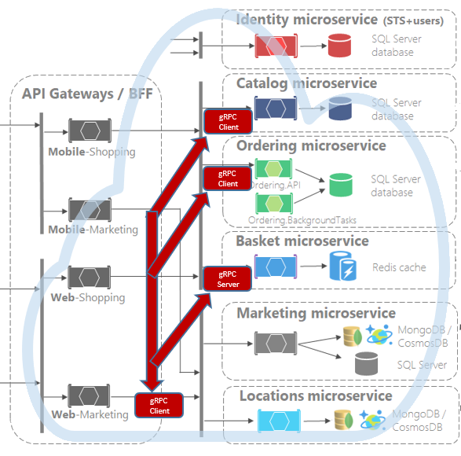

# gRPC

[!INCLUDE [book-preview](../../../includes/book-preview.md)]

So far in this book, we’ve focused on [REST-based](https://docs.microsoft.com/azure/architecture/best-practices/api-design) communication. REST is an architectural style applied to web-based services that enable interoperability across distributed computer systems. Expposing a request/response communication model, it's typically implemented with HTTP. Every response from the server is a reply to a request from a client. While widely used, a newer communication technology, gRPC, is rapidly gaining popularity for cloud-native applications.

## Introduction

Originating from Google, gRPC is a open-source communication protocol that evolves the RPC [remote procedure call (RPC)](https://en.wikipedia.org/wiki/Remote_procedure_call) protocol widely used in distributed applications. gRPC simplifies distributed applications. A gRPC client app exposes a local, in-process method that implements an operation. Under the covers, that local method invokes a method on a server application on remote machine. What appears to be local call essentially becomes an out-of-process call to a function on a remote computer. The RPC plumbing abstracts the point-to-point networking communication, serialization, and execution between computers.

https://grpc.io/docs/guides/

gRPC is lightweight and highly performant. It uses HTTP/2 for its transport protocol. While compatible with HTTP 1.1, HTTP/2 features many advanced capabilities:

- A binary protocol - unlike HTTP 1.1, which sends data as clear text.
- Multiplexing support enabling multiple parallel requests over the same connection - unlike HTTP 1.1 which is limited to processing one request/response round trip at a time.
- Full-duplex enabling bidirectional communication where both client requests and server responses are sent simultaneously.
- Built-in streaming enabling requests and responses to asynchronously stream large data sets indepedently.

gRPC with HTTP/2 dramatically increases performance. In Microsoft [Windows Communication Foundation (WCF)](https://docs.microsoft.com/dotnet/framework/wcf/whats-wcf) parlance, gRPC performance exceeds the speed and efficiency of [NetTCP bindings](https://docs.microsoft.com/dotnet/api/system.servicemodel.nettcpbinding?view=netframework-4.8). However, unlike NetTCP, which favors the Microsoft stack, gRPC is cross-platform.

gRPC is supported across most popular development stacks, including Java, JavaSript, C#, Golang, Swift, and NodeJS.

## Protocol Buffers

gRPC embraces another open-source technology called [Protocol Buffers](https://developers.google.com/protocol-buffers/docs/overview). Protocol Buffers provide a highly efficient, platform-neutral engine for serializing structured messages that services send to one another. Using a common, cross-platform Interface Definition Language (IDL), developers defines a service contract for each microservice. The contract, implemented as a ".proto" file, describes the methods, inputs, and outputs for each service. Then, the Protobuf compiler, "Proton," automatically genrates the required client and service code for your target platform.  The code includes the following components:

- A strongly-typed DTO (Data Transfer Object) shared by the client and service.
- A base class with the required network plumbing that the service can inherit and extend.
- A stub for the client that contains the required plumbing to invoke the remote service.

At runtime, an HTTP/2 connection is established. Each message is serialized as a standard Protobuf representation and exchanged across clients and remote services.

The book, [gRPC for WCF Developers](https://docs.microsoft.com/dotnet/architecture/grpc-for-wcf-developers/), available for free from Microsoft, provides detailed coverage of the mechanics of gRPC and Protocol Buffers. 

## gRPC support in .NET

The Microsoft .NET Core framework 3.0 includes tooling and native support for gRPC. Figure 4-20 shows the Visual Studio 2019 template that scaffolds a skeleton project for a gRPC service. Note how .NET Core supports the Windows, Linux, and macOS platforms.

**Figure 4-20**. gRPC support in Visual Studio 2019

.NET Core 3.0 seamlessly integrates gRPC into its framework, including endpoint routing, built-in IoC support, and logging. The open-source Kestrel web server fully supports HTTP/2 connections.  

Figure 4-21 shows the structure of a gRPC service in Visual Studio 2019. Note how the structure includes folders for the proto description files and the service code. 

**Figure 4-21**. gRPC project in Visual Studio 2019

An excellent introduction to building gRPC services is [gRPC with ASP.NET Core 3.0](https://www.dotnetcurry.com/aspnet-core/1514/grpc-asp-net-core-3) from the .NET Curry magazine series.

## gRPC Usage

gRPC is well suited for the following scenarios:

- Low latency and high throughput communication. gRPC is great for lightweight microservices where efficiency is critical.
- Point-to-point real-time communication. gRPC has excellent support for bi-directional streaming. gRPC services can push messages in real time without polling.
- Polyglot environments – gRPC tooling supports most modern development languages, making it a good choice for multi-language environments.
- Network constrained environments – gRPC messages are serialized with Protobuf, a lightweight message format. A gRPC message is always smaller than an equivalent JSON message.

As we disucssed, gRPC relies heavily on HTTP/2 features. At the time of this writing, most modern browsers cannot provide the level of control required to support a gRPC client. Instead, gRPC is commonly implemented for backend microservice communication.
 
 The [microservice reference architecture](https://github.com/dotnet-architecture/eShopOnContainers) for eShop on Containers provides excellent guidance for implementing gRPC on the .NET Core platform. Figure 4-22 shows the implementation.

**Figure 4-22**. gRPC implementation

In the eShop reference application, the Web-Marketing and Mobile-Shopping API Gateway services implement RESTful API calls for simple CRUD operations and gRPC calls for the more complex operations. Both of these services implement gRPC client functionality, known as stubs, which provide the plumbing to make remote calls.

The backend Basket and Catalog services expose gRPC services.

Note in the previous figure that front-end traffic (both browser and mobile) is implemented with HTTP when invoking the API gateway. However, traffic behind the gateway and across microservices implement gRPC. As discussed previously, ".proto" files define each of the microservices and are used to generate code stubs for both the client and the service. Consideration should be given to centralizing the gRPC service definitions in a single repo. This practice minimizes duplication, improves manageability, and provides consistent versioning.  

Looking ahead, gRPC could well play a major role in dethroning the dominance of REST for cloud-native systems. The performance benefits and ease of development are compelling. However, make no mistake, REST will still be around for a long time. It still excels for publicly exposed APIs and for backward compatibility reasons.

>[!div class="step-by-step"] 
>[Previous](service-to-service-communication.md)
>[Next](service-mesh-communication-infrastructure.md)

In ASP.NET Core world gRPC is new kid on the block and it’s too early to say if it’s here to replace REST and WebAPI that are easier to consume for client applications. Actually I don’t think so. Having thin and simple service interface that doesn’t require advanced tooling will remain the important benefit.

When it comes to SOAP and WCF it’s a different story. Overview of Protocol Buffers brings out the following advantages of protocol buffer messages over XML based messages:

3 to 10 times smaller,
20 to 100 times faster,
less ambiguous.
Those who have experiences with WCF and SOAP should find these numbers great.

AS WCF is not officially supported on .NET Core then gRPC is currently the only serious option for enterprice grade messaging between systems.

Wrapping up
gRPC is a little bit similar to WCF but still a totally different beast. It is using binary format for data exchange between systems and it leads to way smaller message payloads. Using HTTP/2 features it provides four different communication patterns to support also services under heavy load of communication requests. As there’s no WCF support on .NET Core officially, gRPC is currently the best option to take when it’s about enterprise grade web services.
